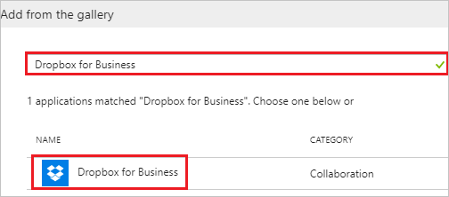
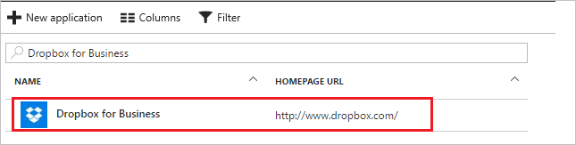

# Tutorial: Azure Active Directory integration with Dropbox for Business

In this tutorial, you learn how to integrate Dropbox for Business with Azure Active Directory (Azure AD).

Integrating Dropbox for Business with Azure AD provides you with the following benefits:

- You can control in Azure AD who has access to Dropbox for Business.
- You can enable your users to automatically get signed-on to Dropbox for Business (Single Sign-On) with their Azure AD accounts.
- You can manage your accounts in one central location - the Azure portal.

If you want to know more details about SaaS app integration with Azure AD, see [what is application access and single sign-on with Azure Active Directory](../manage-apps/what-is-single-sign-on.md).

## Prerequisites

To configure Azure AD integration with Dropbox for Business, you need the following items:

- An Azure AD subscription
- A Dropbox for Business single sign-on enabled subscription

> [!NOTE]
> To test the steps in this tutorial, we do not recommend using a production environment.

To test the steps in this tutorial, you should follow these recommendations:

- Do not use your production environment, unless it is necessary.
- If you don't have an Azure AD trial environment, you can [get a one-month trial](https://azure.microsoft.com/pricing/free-trial/).

## Scenario description

In this tutorial, you test Azure AD single sign-on in a test environment.
The scenario outlined in this tutorial consists of two main building blocks:

1. Adding Dropbox for Business from the gallery
2. Configuring and testing Azure AD single sign-on

## Adding Dropbox for Business from the gallery

To configure the integration of Dropbox for Business into Azure AD, you need to add Dropbox for Business from the gallery to your list of managed SaaS apps.

**To add Dropbox for Business from the gallery, perform the following steps:**

1. In the **[Azure portal](https://portal.azure.com)**, on the left navigation panel, click **Azure Active Directory** icon.

	![The Azure Active Directory button][1]

2. Navigate to **Enterprise applications**. Then go to **All applications**.

	![The Enterprise applications blade][2]

3. To add new application, click **New application** button on the top of dialog.

	![The New application button][3]

4. In the search box, type **Dropbox for Business**, select **Dropbox for Business** from result panel then click **Add** button to add the application.

	

## Configure and test Azure AD single sign-on

In this section, you configure and test Azure AD single sign-on with Dropbox for Business based on a test user called "Britta Simon".

For single sign-on to work, Azure AD needs to know what the counterpart user in Dropbox for Business is to a user in Azure AD. In other words, a link relationship between an Azure AD user and the related user in Dropbox for Business needs to be established.

In Dropbox for Business, assign the value of the **user name** in Azure AD as the value of the **Username** to establish the link relationship.

To configure and test Azure AD single sign-on with Dropbox for Business, you need to complete the following building blocks:

1. **[Configure Azure AD Single Sign-On](#configure-azure-ad-single-sign-on)** - to enable your users to use this feature.
2. **[Create an Azure AD test user](#create-an-azure-ad-test-user)** - to test Azure AD single sign-on with Britta Simon.
3. **[Create a Dropbox for Business test user](#create-a-dropbox-for-business-test-user)** - to have a counterpart of Britta Simon in Dropbox for Business that is linked to the Azure AD representation of user.
4. **[Assign the Azure AD test user](#assign-the-azure-ad-test-user)** - to enable Britta Simon to use Azure AD single sign-on.
5. **[Test single sign-on](#test-single-sign-on)** - to verify whether the configuration works.

### Configure Azure AD single sign-on

In this section, you enable Azure AD single sign-on in the Azure portal and configure single sign-on in your Dropbox for Business application.

**To configure Azure AD single sign-on with Dropbox for Business, perform the following steps:**

1. In the Azure portal, on the **Dropbox for Business** application integration page, click **Single sign-on**.

	![Configure single sign-on link][4]

2. On the **Single sign-on** dialog, select **Mode** as	**SAML-based Sign-on** to enable single sign-on.
 
	

3. On the **Dropbox for Business Domain and URLs** section, perform the following steps:

	

    a. In the **Sign-on URL** textbox, type a URL using the following pattern: `https://www.dropbox.com/sso/<id>`

	b. In the **Identifier** textbox, type a value: `Dropbox`

	> [!NOTE]
	> The preceding Sign-on URL value is not real value. You will update the value with the actual Sign-on URL, which is explained later in the tutorial.

4. On the **SAML Signing Certificate** section, click **Certificate (Base64)** and then save the certificate file on your computer.

	 

5. Click **Save** button.

	

6. On the **Dropbox for Business Configuration** section, click **Configure Dropbox for Business** to open **Configure sign-on** window. Copy the **SAML Single Sign-On Service URL** from the **Quick Reference section.**

	 

7. To configure single sign-on on **Dropbox for Business** side, Go on your Dropbox for Business tenant and sign on to your Dropbox for business tenant.

	

8. Click on the **User Icon** and select **Settings** tab.

	

9. In the navigation pane on the left side, click **Admin console**.

	

10. On the **Admin console**, click **Settings** in the left navigation pane.

	

11. Select **Single sign-on** option under the **Authentication** section.

	

12. In the **Single sign-on** section, perform the following steps:  

	

	a. Select **Required** as a option from the dropdown for the **Single sign-on**.

	b. Click on **Add sign-in URL** and in the **Identity provider sign-in URL** textbox, paste the **SAML Single Sign-On Service URL** value which you have copied from the Azure portal and then select **Done**.

	

	c. Click **Upload certificate**, and then browse to your **Base64 encoded certificate file** which you have downloaded from the Azure portal.

	d. Click on **Copy link** and paste the copied value into the **Sign-on URL** textbox of **Dropbox for Business Domain and URLs** section on Azure portal.

	e. Click **Save**.

### Create an Azure AD test user

The objective of this section is to create a test user in the Azure portal called Britta Simon.

   ![Create an Azure AD test user][100]

**To create a test user in Azure AD, perform the following steps:**

1. In the Azure portal, in the left pane, click the **Azure Active Directory** button.

    

1. To display the list of users, go to **Users and groups**, and then click **All users**.

    

1. To open the **User** dialog box, click **Add** at the top of the **All Users** dialog box.

    

1. In the **User** dialog box, perform the following steps:

    

    a. In the **Name** box, type **BrittaSimon**.

    b. In the **User name** box, type the email address of user Britta Simon.

    c. Select the **Show Password** check box, and then write down the value that's displayed in the **Password** box.

    d. Click **Create**.
 
### Create a Dropbox for Business test user

In this section, a user called Britta Simon is created in Dropbox for Business. Dropbox for Business supports just-in-time provisioning, which is enabled by default.

There is no action item for you in this section. If a user doesn't already exist in Dropbox for Business, a new one is created when you attempt to access Dropbox for Business.

>[!Note]
>If you need to create a user manually, Contact [Dropbox for Business Client support team](https://www.dropbox.com/business/contact) 

### Assign the Azure AD test user

In this section, you enable Britta Simon to use Azure single sign-on by granting access to Dropbox for Business.

![Assign the user role][200] 

**To assign Britta Simon to Dropbox for Business, perform the following steps:**

1. In the Azure portal, open the applications view, and then navigate to the directory view and go to **Enterprise applications** then click **All applications**.

	![Assign User][201] 

1. In the applications list, select **Dropbox for Business**.

	  

1. In the menu on the left, click **Users and groups**.

	![The "Users and groups" link][202]

1. Click **Add** button. Then select **Users and groups** on **Add Assignment** dialog.

	![The Add Assignment pane][203]

1. On **Users and groups** dialog, select **Britta Simon** in the Users list.

1. Click **Select** button on **Users and groups** dialog.

1. Click **Assign** button on **Add Assignment** dialog.
	
### Test single sign-on

In this section, you test your Azure AD single sign-on configuration using the Access Panel.

When you click the Dropbox for Business tile in the Access Panel, you should get login page of your Dropbox for Business application.
 

## Additional resources

* [List of Tutorials on How to Integrate SaaS Apps with Azure Active Directory](tutorial-list.md)
* [What is application access and single sign-on with Azure Active Directory?](../manage-apps/what-is-single-sign-on.md)

<!--Image references-->

[1]: ./media/dropboxforbusiness-tutorial/tutorial_general_01.png
[2]: ./media/dropboxforbusiness-tutorial/tutorial_general_02.png
[3]: ./media/dropboxforbusiness-tutorial/tutorial_general_03.png
[4]: ./media/dropboxforbusiness-tutorial/tutorial_general_04.png

[100]: ./media/dropboxforbusiness-tutorial/tutorial_general_100.png

[200]: ./media/dropboxforbusiness-tutorial/tutorial_general_200.png
[201]: ./media/dropboxforbusiness-tutorial/tutorial_general_201.png
[202]: ./media/dropboxforbusiness-tutorial/tutorial_general_202.png
[203]: ./media/dropboxforbusiness-tutorial/tutorial_general_203.png

