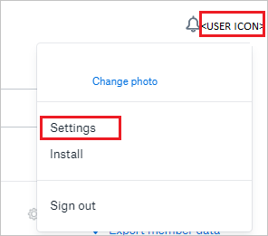
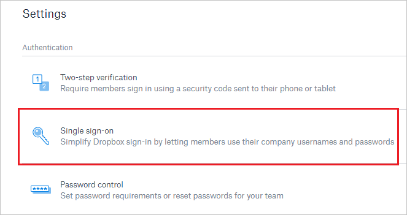
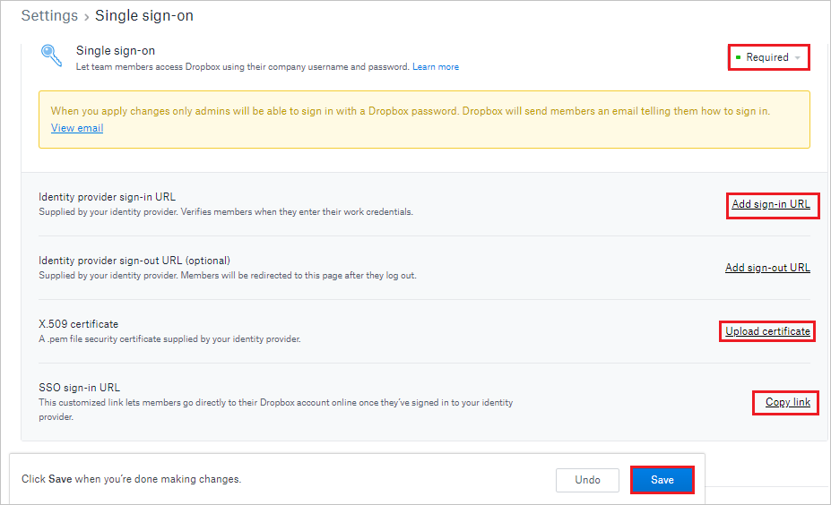
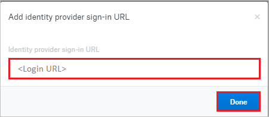
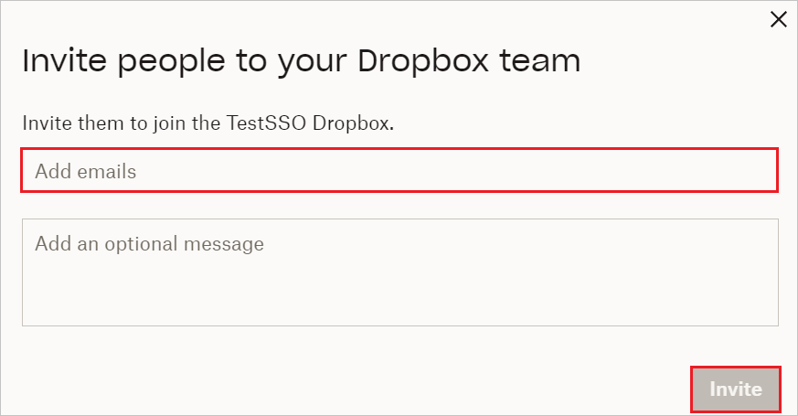

# Tutorial: Integrate Dropbox Business with Microsoft Entra ID

In this tutorial, you'll learn how to integrate Dropbox Business with Microsoft Entra ID. When you integrate Dropbox Business with Microsoft Entra ID, you can:

* Control in Microsoft Entra ID who has access to Dropbox Business.
* Enable your users to be automatically signed-in to Dropbox Business with their Microsoft Entra accounts.
* Manage your accounts in one central location.

## Prerequisites

To get started, you need the following items:

* A Microsoft Entra subscription. If you don't have a subscription, you can get a [free account](https://azure.microsoft.com/free/).
* Dropbox Business single sign-on (SSO) enabled subscription.

> [!NOTE]
> This integration is also available to use from Microsoft Entra US Government Cloud environment. You can find this application in the Microsoft Entra US Government Cloud Application Gallery and configure it in the same way as you do from public cloud.

## Scenario description

* In this tutorial, you configure and test Microsoft Entra SSO in a test environment. Dropbox Business supports **SP** initiated SSO.

* Dropbox Business supports [Automated user provisioning and deprovisioning](dropboxforbusiness-provisioning-tutorial.md).

> [!NOTE]
> Identifier of this application is a fixed string value so only one instance can be configured in one tenant.

## Add Dropbox Business from the gallery

To configure the integration of Dropbox Business into Microsoft Entra ID, you need to add Dropbox Business from the gallery to your list of managed SaaS apps.

1. Sign in to the [Microsoft Entra admin center](https://entra.microsoft.com) as at least a [Cloud Application Administrator](../roles/permissions-reference.md#cloud-application-administrator).
1. Browse to **Identity** > **Applications** > **Enterprise applications** > **New application**.
1. In the **Add from the gallery** section, type **Dropbox Business** in the search box.
1. Select **Dropbox Business** from results panel and then add the app. Wait a few seconds while the app is added to your tenant.

 Alternatively, you can also use the [Enterprise App Configuration Wizard](https://portal.office.com/AdminPortal/home?Q=Docs#/azureadappintegration). In this wizard, you can add an application to your tenant, add users/groups to the app, assign roles, as well as walk through the SSO configuration as well. [Learn more about Microsoft 365 wizards.](/microsoft-365/admin/misc/azure-ad-setup-guides)

## Configure and test Microsoft Entra SSO for Dropbox Business

Configure and test Microsoft Entra SSO with Dropbox Business using a test user called **Britta Simon**. For SSO to work, you need to establish a link relationship between a Microsoft Entra user and the related user in Dropbox Business.

To configure and test Microsoft Entra SSO with Dropbox Business, perform the following steps:

1. **[Configure Microsoft Entra SSO](#configure-azure-ad-sso)** - to enable your users to use this feature.    
    1. **[Create a Microsoft Entra test user](#create-an-azure-ad-test-user)** - to test Microsoft Entra single sign-on with Britta Simon.
    1. **[Assign the Microsoft Entra test user](#assign-the-azure-ad-test-user)** - to enable Britta Simon to use Microsoft Entra single sign-on.
1. **[Configure Dropbox Business SSO](#configure-dropbox-business-sso)** - to configure the Single Sign-On settings on application side.
    1. **[Create Dropbox Business test user](#create-dropbox-business-test-user)** - to have a counterpart of Britta Simon in Dropbox Business that is linked to the Microsoft Entra representation of user.
1. **[Test SSO](#test-sso)** - to verify whether the configuration works.

## Configure Microsoft Entra SSO

Follow these steps to enable Microsoft Entra SSO.

1. Sign in to the [Microsoft Entra admin center](https://entra.microsoft.com) as at least a [Cloud Application Administrator](../roles/permissions-reference.md#cloud-application-administrator).
1. Browse to **Identity** > **Applications** > **Enterprise applications** > **Dropbox Business** application integration page, find the **Manage** section and select **Single sign-on**.
1. On the **Select a Single sign-on method** page, select **SAML**.
1. On the **Set up Single Sign-On with SAML** page, click the pencil icon for **Basic SAML Configuration** to edit the settings.

   

1. On the **Basic SAML Configuration** page, enter the values for the following fields:

	a. In the **Sign on URL** text box, type a URL using the following pattern:
    `https://www.dropbox.com/sso/<id>`
	
	 b. In the **Identifier (Entity ID)** text box, type the value:
    `Dropbox`
	
	c. In the **Reply URL** field, enter `https://www.dropbox.com/saml_login`
	> [!NOTE]
	> The **Dropbox Sign SSO ID** can be found in the Dropbox site at Dropbox > Admin console > Settings > Single sign-on > SSO sign-in URL.

1. On the **Set up Single Sign-On with SAML** page, in the **SAML Signing Certificate** section, click **Download** to download the **Certificate (Base64)** from the given options as per your requirement and save it on your computer.

	

1. On the **Set up Dropbox Business** section, copy the appropriate URL(s) as per your requirement.

	

### Create a Microsoft Entra test user

In this section, you'll create a test user called Britta Simon.

1. Sign in to the [Microsoft Entra admin center](https://entra.microsoft.com) as at least a [User Administrator](../roles/permissions-reference.md#user-administrator).
1. Browse to **Identity** > **Users** > **All users**.
1. Select **New user** > **Create new user**, at the top of the screen.
1. In the **User** properties, follow these steps:
   1. In the **Display name** field, enter `B.Simon`.  
   1. In the **User principal name** field, enter the username@companydomain.extension. For example, `B.Simon@contoso.com`.
   1. Select the **Show password** check box, and then write down the value that's displayed in the **Password** box.
   1. Select **Review + create**.
1. Select **Create**.

### Assign the Microsoft Entra test user

In this section, you'll enable B.Simon to use single sign-on by granting access to Dropbox Business.

1. Sign in to the [Microsoft Entra admin center](https://entra.microsoft.com) as at least a [Cloud Application Administrator](../roles/permissions-reference.md#cloud-application-administrator).
1. Browse to **Identity** > **Applications** > **Enterprise applications** > **Dropbox Business**.
1. In the app's overview page, select **Users and groups**.
1. Select **Add user/group**, then select **Users and groups** in the **Add Assignment** dialog.
   1. In the **Users and groups** dialog, select **B.Simon** from the Users list, then click the **Select** button at the bottom of the screen.
   1. If you are expecting a role to be assigned to the users, you can select it from the **Select a role** dropdown. If no role has been set up for this app, you see "Default Access" role selected.
   1. In the **Add Assignment** dialog, click the **Assign** button.

## Configure Dropbox Business SSO

1. In a different web browser window, sign in to your Dropbox Business company site as an administrator

	

4. Click on the **User Icon** and select **Settings** tab.

	

5. In the navigation pane on the left side, click **Admin console**.

	

6. On the **Admin console**, click **Settings** in the left navigation pane.

	

7. Select **Single sign-on** option under the **Authentication** section.

	

8. In the **Single sign-on** section, perform the following steps:  

	

	a. Select **Required** as an option from the dropdown for the **Single sign-on**.

	b. Click on **Add sign-in URL** and in the **Identity provider sign-in URL** textbox, paste the **Login URL** value which you have copied and then select **Done**.

	

	c. Click **Upload certificate**, and then browse to your **Base64 encoded certificate file** which you have downloaded.

	d. Click on **Copy link** and paste the copied value into the **Sign-on URL** textbox of **Dropbox Business Domain and URLs** section on Azure portal.

	e. Click **Save**.

### Create Dropbox Business test user

1. Log in to the Dropbox Business website as an administrator.

1. Go to the **Admin Console** and click **Members** in the left menu.

	

1. Enter the valid user email to add the user and click **Invite**.

	

This application also supports automatic user provisioning. See how to enable auto provisioning for [Dropbox Business](dropboxforbusiness-provisioning-tutorial.md).

## Test SSO

In this section, you test your Microsoft Entra single sign-on configuration with following options. 

* Click on **Test this application**, this will redirect to Dropbox Business Sign-on URL where you can initiate the login flow. 

* Go to Dropbox Business Sign-on URL directly and initiate the login flow from there.

* You can use Microsoft My Apps. When you click the Dropbox Business tile in the My Apps, this will redirect to Dropbox Business Sign-on URL. For more information about the My Apps, see [Introduction to the My Apps](https://support.microsoft.com/account-billing/sign-in-and-start-apps-from-the-my-apps-portal-2f3b1bae-0e5a-4a86-a33e-876fbd2a4510).

## Next steps

Once you configure Dropbox Business you can enforce session control, which protects exfiltration and infiltration of your organization’s sensitive data in real time. Session control extends from Conditional Access. [Learn how to enforce session control with Microsoft Defender for Cloud Apps](/cloud-app-security/proxy-deployment-any-app).
