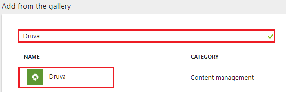
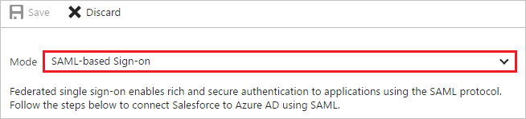
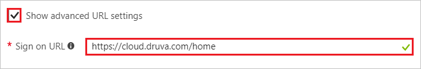
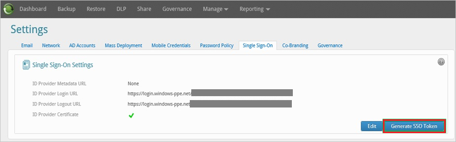
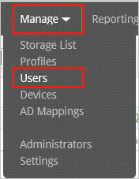
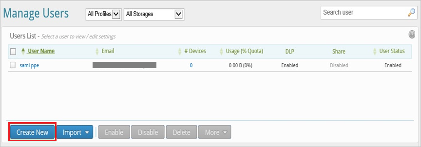
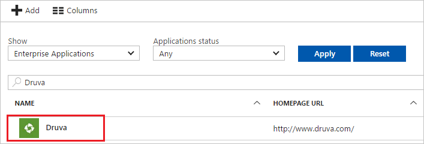

---
title: 'Tutorial: Azure Active Directory integration with Druva | Microsoft Docs'
description: Learn how to configure single sign-on between Azure Active Directory and Druva.
services: active-directory
documentationCenter: na
author: jeevansd
manager: mtillman
ms.reviewer: joflore

ms.assetid: ab92b600-1fea-4905-b1c7-ef8e4d8c495c
ms.service: active-directory
ms.component: saas-app-tutorial
ms.workload: identity
ms.tgt_pltfrm: na
ms.devlang: na
ms.topic: article
ms.date: 11/23/2017
ms.author: jeedes

---
# Tutorial: Azure Active Directory integration with Druva

In this tutorial, you learn how to integrate Druva with Azure Active Directory (Azure AD).

Integrating Druva with Azure AD provides you with the following benefits:

- You can control in Azure AD who has access to Druva.
- You can enable your users to automatically get signed-on to Druva (Single Sign-On) with their Azure AD accounts.
- You can manage your accounts in one central location - the Azure portal.

If you want to know more details about SaaS app integration with Azure AD, see [what is application access and single sign-on with Azure Active Directory](../manage-apps/what-is-single-sign-on.md).

## Prerequisites

To configure Azure AD integration with Druva, you need the following items:

- An Azure AD subscription
- A Druva single sign-on enabled subscription

> [!NOTE]
> To test the steps in this tutorial, we do not recommend using a production environment.

To test the steps in this tutorial, you should follow these recommendations:

- Do not use your production environment, unless it is necessary.
- If you don't have an Azure AD trial environment, you can [get a one-month trial](https://azure.microsoft.com/pricing/free-trial/).

## Scenario description
In this tutorial, you test Azure AD single sign-on in a test environment. 
The scenario outlined in this tutorial consists of two main building blocks:

1. Adding Druva from the gallery
1. Configuring and testing Azure AD single sign-on

## Adding Druva from the gallery
To configure the integration of Druva into Azure AD, you need to add Druva from the gallery to your list of managed SaaS apps.

**To add Druva from the gallery, perform the following steps:**

1. In the **[Azure portal](https://portal.azure.com)**, on the left navigation panel, click **Azure Active Directory** icon. 

	![The Azure Active Directory button][1]

1. Navigate to **Enterprise applications**. Then go to **All applications**.

	![The Enterprise applications blade][2]
	
1. To add new application, click **New application** button on the top of dialog.

	![The New application button][3]

1. In the search box, type **Druva**, select **Druva** from result panel then click **Add** button to add the application.

	

## Configure and test Azure AD single sign-on

In this section, you configure and test Azure AD single sign-on with Druva based on a test user called "Britta Simon".

For single sign-on to work, Azure AD needs to know what the counterpart user in Druva is to a user in Azure AD. In other words, a link relationship between an Azure AD user and the related user in Druva needs to be established.

In Druva, assign the value of the **user name** in Azure AD as the value of the **Username** to establish the link relationship.

To configure and test Azure AD single sign-on with Druva, you need to complete the following building blocks:

1. **[Configure Azure AD Single Sign-On](#configure-azure-ad-single-sign-on)** - to enable your users to use this feature.
1. **[Create an Azure AD test user](#create-an-azure-ad-test-user)** - to test Azure AD single sign-on with Britta Simon.
1. **[Create a Druva test user](#create-a-druva-test-user)** - to have a counterpart of Britta Simon in Druva that is linked to the Azure AD representation of user.
1. **[Assign the Azure AD test user](#assign-the-azure-ad-test-user)** - to enable Britta Simon to use Azure AD single sign-on.
1. **[Test single sign-on](#test-single-sign-on)** - to verify whether the configuration works.

### Configure Azure AD single sign-on

In this section, you enable Azure AD single sign-on in the Azure portal and configure single sign-on in your Druva application.

**To configure Azure AD single sign-on with Druva, perform the following steps:**

1. In the Azure portal, on the **Druva** application integration page, click **Single sign-on**.

	![Configure single sign-on link][4]

1. On the **Single sign-on** dialog, select **Mode** as	**SAML-based Sign-on** to enable single sign-on.
 
	

1. On the **Druva Domain and URLs** section, If you wish to configure the application in **IDP** initiated mode:

	

	In the **Identifier** textbox, type the string value: `druva-cloud`
	
1. Check **Show advanced URL settings**. If you wish to configure the application in **SP** initiated mode:

	
	
	In the **Sign-on URL** textbox, type the URL: `https://cloud.druva.com/home`

1. On the **SAML Signing Certificate** section, click **Certificate(Base64)** and then save the certificate file on your computer.

	 

1. Your Druva application expects the SAML assertions in a specific format, which requires you to add custom attribute mappings to your **SAML Token Attributes** configuration. 

	

1. In the **User Attributes** section on the **Single sign-on** dialog, configure SAML token attribute as shown in the preceding image and perform the following steps:

	| Attribute Name      | Attribute Value      |
	| ------------------- | -------------------- |
	| insync\_auth\_token |Enter the token generated value |
	
	a. Click **Add attribute** to open the **Add Attribute** dialog.
	
	
	
	
	
	b. In the **Name** textbox, type the attribute name shown for that row.

	c. From the **Value** list, type the attribute value shown for that row. The token generated value is explained later in tutorial.
	
	d. Click **Ok**.	

1. Click **Save** button.

	

1. On the **Druva Configuration** section, click **Configure Druva** to open **Configure sign-on** window. Copy the **Sign-Out URL and SAML Single Sign-On Service URL** from the **Quick Reference section.**

	 

1. In a different web browser window, log in to your Druva company site as an administrator.

1. Go to **Manage \> Settings**.

	

1. On the Single Sign-On Settings dialog, perform the following steps:

	
	
	a. In **ID Provider Login URL** textbox, paste the value of **Single Sign-On Service URL**, which you have copied from Azure portal.
		
	b. In **ID Provider Logout URL** textbox, paste the value of **Sign-Out URL**, which you have copied from Azure portal
		
	c. Open your base-64 encoded certificate in notepad, copy the content of it into your clipboard, and then paste it to the **ID Provider Certificate** textbox
	 
	d. To open the **Settings** page, click **Save**.

1. On the **Settings** page, click **Generate SSO Token**.

	

1. On the **Single Sign-on Authentication Token** dialog, perform the following steps:

	
	
	a. Click **Copy**, Paste copied value in the **Value** textbox in the **Add Attribute** section in the Azure portal.
	
	b. Click **Close**.

> [!TIP]
> You can now read a concise version of these instructions inside the [Azure portal](https://portal.azure.com), while you are setting up the app!  After adding this app from the **Active Directory > Enterprise Applications** section, simply click the **Single Sign-On** tab and access the embedded documentation through the **Configuration** section at the bottom. You can read more about the embedded documentation feature here: [Azure AD embedded documentation]( https://go.microsoft.com/fwlink/?linkid=845985)
 

### Create an Azure AD test user

The objective of this section is to create a test user in the Azure portal called Britta Simon.

   ![Create an Azure AD test user][100]

**To create a test user in Azure AD, perform the following steps:**

1. In the Azure portal, in the left pane, click the **Azure Active Directory** button.

    

1. To display the list of users, go to **Users and groups**, and then click **All users**.

    

1. To open the **User** dialog box, click **Add** at the top of the **All Users** dialog box.

    

1. In the **User** dialog box, perform the following steps:

    

    a. In the **Name** box, type **BrittaSimon**.

    b. In the **User name** box, type the email address of user Britta Simon.

    c. Select the **Show Password** check box, and then write down the value that's displayed in the **Password** box.

    d. Click **Create**.
 
### Create a Druva test user

In order to enable Azure AD users to log in to Druva, they must be provisioned into Druva. In the case of Druva, provisioning is a manual task.

**To configure user provisioning, perform the following steps:**

1. Log in to your **Druva** company site as administrator.

1. Go to **Manage \> Users**.
   
   

1. Click **Create New**.
   
   

1. On the Create New User dialog, perform the following steps:
   
   
   
   a. In the **Email address** textbox, enter the email of user like **brittasimon@contoso.com**.
   
   b. In the **Name** textbox, enter the name of user like **BrittaSimon**.
   
   c. Click **Create User**.

>[!NOTE]
>You can use any other Druva user account creation tools or APIs provided by Druva to provision Azure AD user accounts.

### Assign the Azure AD test user

In this section, you enable Britta Simon to use Azure single sign-on by granting access to Druva.

![Assign the user role][200] 

**To assign Britta Simon to Druva, perform the following steps:**

1. In the Azure portal, open the applications view, and then navigate to the directory view and go to **Enterprise applications** then click **All applications**.

	![Assign User][201] 

1. In the applications list, select **Druva**.

	  

1. In the menu on the left, click **Users and groups**.

	![The "Users and groups" link][202]

1. Click **Add** button. Then select **Users and groups** on **Add Assignment** dialog.

	![The Add Assignment pane][203]

1. On **Users and groups** dialog, select **Britta Simon** in the Users list.

1. Click **Select** button on **Users and groups** dialog.

1. Click **Assign** button on **Add Assignment** dialog.
	
### Test single sign-on

In this section, you test your Azure AD single sign-on configuration using the Access Panel.

When you click the Druva tile in the Access Panel, you should get automatically signed-on to your Druva application.
For more information about the Access Panel, see [Introduction to the Access Panel](../user-help/active-directory-saas-access-panel-introduction.md). 

## Additional resources

* [List of Tutorials on How to Integrate SaaS Apps with Azure Active Directory](tutorial-list.md)
* [What is application access and single sign-on with Azure Active Directory?](../manage-apps/what-is-single-sign-on.md)

<!--Image references-->

[1]: ./media/druva-tutorial/tutorial_general_01.png
[2]: ./media/druva-tutorial/tutorial_general_02.png
[3]: ./media/druva-tutorial/tutorial_general_03.png
[4]: ./media/druva-tutorial/tutorial_general_04.png

[100]: ./media/druva-tutorial/tutorial_general_100.png

[200]: ./media/druva-tutorial/tutorial_general_200.png
[201]: ./media/druva-tutorial/tutorial_general_201.png
[202]: ./media/druva-tutorial/tutorial_general_202.png
[203]: ./media/druva-tutorial/tutorial_general_203.png

