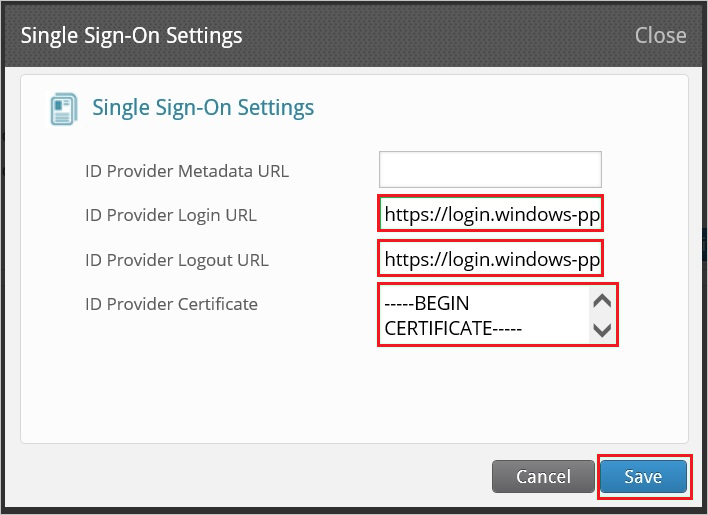
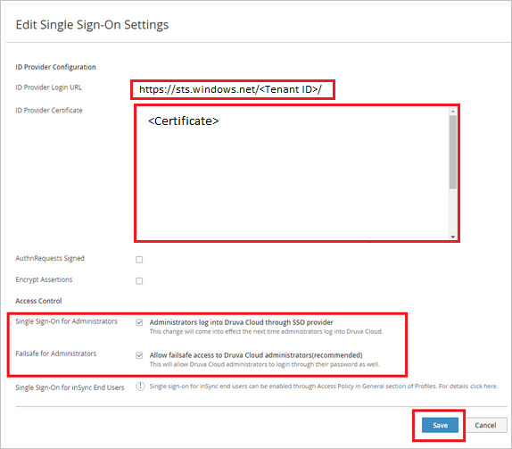

# Tutorial: Azure Active Directory single sign-on (SSO) integration with Druva

In this tutorial, you'll learn how to integrate Druva with Azure Active Directory (Azure AD). When you integrate Druva with Azure AD, you can:

* Control in Azure AD who has access to Druva.
* Enable your users to be automatically signed-in to Druva with their Azure AD accounts.
* Manage your accounts in one central location - the Azure portal.

To learn more about SaaS app integration with Azure AD, see [What is application access and single sign-on with Azure Active Directory](https://docs.microsoft.com/azure/active-directory/active-directory-appssoaccess-whatis).

## Prerequisites

To get started, you need the following items:

* An Azure AD subscription. If you don't have a subscription, you can get a [free account](https://azure.microsoft.com/free/).
* Druva single sign-on (SSO) enabled subscription.

## Scenario description

In this tutorial, you configure and test Azure AD SSO in a test environment.

* Druva supports **IDP** initiated SSO
* Once you configure Druva SSO you can enforce session control, which protects exfiltration and infiltration of your organization’s sensitive data in real time. Session control extends from Conditional Access. [Learn how to enforce session control with Microsoft Cloud App Security](https://docs.microsoft.com/cloud-app-security/proxy-deployment-any-app).

> [!NOTE]
> Identifier of this application is a fixed string value so only one instance can be configured in one tenant.

## Adding Druva from the gallery

To configure the integration of Druva into Azure AD, you need to add Druva from the gallery to your list of managed SaaS apps.

1. Sign in to the [Azure portal](https://portal.azure.com) using either a work or school account, or a personal Microsoft account.
1. On the left navigation pane, select the **Azure Active Directory** service.
1. Navigate to **Enterprise Applications** and then select **All Applications**.
1. To add new application, select **New application**.
1. In the **Add from the gallery** section, type **Druva** in the search box.
1. Select **Druva** from results panel and then add the app. Wait a few seconds while the app is added to your tenant.

## Configure and test Azure AD single sign-on for Druva

Configure and test Azure AD SSO with Druva using a test user called **B.Simon**. For SSO to work, you need to establish a link relationship between an Azure AD user and the related user in Druva.

To configure and test Azure AD SSO with Druva, complete the following building blocks:

1. **[Configure Azure AD SSO](#configure-azure-ad-sso)** - to enable your users to use this feature.
    * **[Create an Azure AD test user](#create-an-azure-ad-test-user)** - to test Azure AD single sign-on with B.Simon.
    * **[Assign the Azure AD test user](#assign-the-azure-ad-test-user)** - to enable B.Simon to use Azure AD single sign-on.
1. **[Configure Druva SSO](#configure-druva-sso)** - to configure the single sign-on settings on application side.
    * **[Create Druva test user](#create-druva-test-user)** - to have a counterpart of B.Simon in Druva that is linked to the Azure AD representation of user.
1. **[Test SSO](#test-sso)** - to verify whether the configuration works.

## Configure Azure AD SSO

Follow these steps to enable Azure AD SSO in the Azure portal.

1. In the [Azure portal](https://portal.azure.com/), on the **Druva** application integration page, find the **Manage** section and select **single sign-on**.
1. On the **Select a single sign-on method** page, select **SAML**.
1. On the **Set up single sign-on with SAML** page, click the edit/pen icon for **Basic SAML Configuration** to edit the settings.

   

1. On the **Basic SAML Configuration** section, perform the following steps:

	a. In the **Identifier (Entity ID)** text box, type the string value: `DCP-login`.
	
	b. In the **Reply URL (Assertion Consumer Service URL)** text box, type the URL: `https://cloud.druva.com/wrsaml/consume`.

1. Click **Save**.

1. Druva application expects the SAML assertions in a specific format, which requires you to add custom attribute mappings to your SAML token attributes configuration. The following screenshot shows the list of default attributes.

	

1. In addition to above, Druva application expects few more attributes to be passed back in SAML response which are shown below. These attributes are also pre populated but you can review them as per your requirements.

	| Name | Source Attribute|
	| ------------------- | -------------------- |
	| emailAddress | user.email |
	| druva_auth_token | SSO Token generated from DCP Admin Console, without quotation marks.  For example: X-XXXXX-XXXX-S-A-M-P-L-E+TXOXKXEXNX=. Azure automatically adds quotation marks around the auth token. |

1. On the **Set up single sign-on with SAML** page, in the **SAML Signing Certificate** section,  find **Certificate (Base64)** and select **Download** to download the certificate and save it on your computer.

	

1. On the **Set up Druva** section, copy the appropriate URL(s) based on your requirement.

	

### Create an Azure AD test user

In this section, you'll create a test user in the Azure portal called B.Simon.

1. From the left pane in the Azure portal, select **Azure Active Directory**, select **Users**, and then select **All users**.
1. Select **New user** at the top of the screen.
1. In the **User** properties, follow these steps:
   1. In the **Name** field, enter `B.Simon`.  
   1. In the **User name** field, enter the username@companydomain.extension. For example, `B.Simon@contoso.com`.
   1. Select the **Show password** check box, and then write down the value that's displayed in the **Password** box.
   1. Click **Create**.

### Assign the Azure AD test user

In this section, you'll enable B.Simon to use Azure single sign-on by granting access to Druva.

1. In the Azure portal, select **Enterprise Applications**, and then select **All applications**.
1. In the applications list, select **Druva**.
1. In the app's overview page, find the **Manage** section and select **Users and groups**.

   

1. Select **Add user**, then select **Users and groups** in the **Add Assignment** dialog.

	

1. In the **Users and groups** dialog, select **B.Simon** from the Users list, then click the **Select** button at the bottom of the screen.
1. If you're expecting any role value in the SAML assertion, in the **Select Role** dialog, select the appropriate role for the user from the list and then click the **Select** button at the bottom of the screen.
1. In the **Add Assignment** dialog, click the **Assign** button.

## Configure Druva SSO

1. In a different web browser window, sign in to your Druva company site as an administrator.

1. Click on the Druva logo on top left corner and then click **Druva Cloud Settings**.

	

1. On the **Single Sign-On** tab, click **Edit**.

	

1. On the **Edit Single Sign-On Settings** page, perform the following steps:

	

	1. In **ID Provider Login URL** textbox, paste the value of **Login URL**, which you have copied from Azure portal.

	1. Open your base-64 encoded certificate in notepad, copy the content of it into your clipboard, and then paste it to the **ID Provider Certificate** textbox

	   > [!NOTE]
	   > To Enable Single Sign-On for administrators, select **Administrators log into Druva Cloud through SSO provider** and **Allow failsafe access to Druva Cloud administrators(recommended)** checkboxes. Druva recommends to enable **Failsafe for Administrators** so that they have to access the DCP console in case of any failures in IdP. It also enables the administrators to use both SSO and DCP password to access the DCP console.

	1. Click **Save**. This enables the access to Druva Cloud Platform using SSO.

### Create Druva test user

In this section, a user called B.Simon is created in Druva. Druva supports just-in-time user provisioning, which is enabled by default. There is no action item for you in this section. If a user doesn't already exist in Druva, a new one is created after authentication.

## Test SSO

In this section, you test your Azure AD single sign-on configuration using the Access Panel.

When you click the Druva tile in the Access Panel, you should be automatically signed in to the Druva for which you set up SSO. For more information about the Access Panel, see [Introduction to the Access Panel](https://docs.microsoft.com/azure/active-directory/active-directory-saas-access-panel-introduction).

## Additional resources

- [ List of Tutorials on How to Integrate SaaS Apps with Azure Active Directory ](https://docs.microsoft.com/azure/active-directory/active-directory-saas-tutorial-list)

- [What is application access and single sign-on with Azure Active Directory? ](https://docs.microsoft.com/azure/active-directory/active-directory-appssoaccess-whatis)

- [What is conditional access in Azure Active Directory?](https://docs.microsoft.com/azure/active-directory/conditional-access/overview)

- [Try Druva with Azure AD](https://aad.portal.azure.com/)

- [What is session control in Microsoft Cloud App Security?](https://docs.microsoft.com/cloud-app-security/proxy-intro-aad)