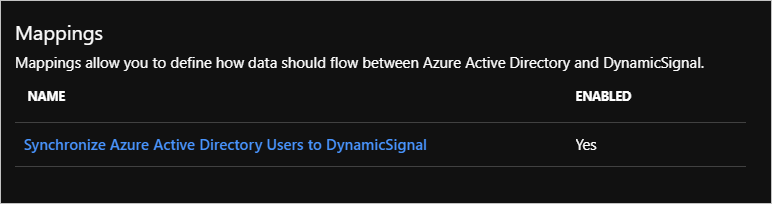
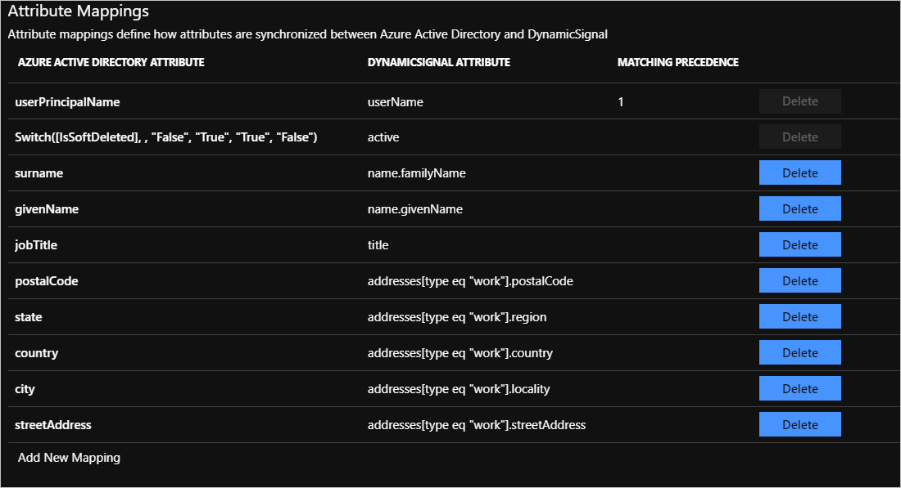

# Tutorial: Configure Dynamic Signal for automatic user provisioning

The objective of this tutorial is to demonstrate the steps to be performed in Dynamic Signal and Microsoft Entra ID to configure Microsoft Entra ID to automatically provision and de-provision users and/or groups to Dynamic Signal.

> [!NOTE]
> This tutorial describes a connector built on top of the Microsoft Entra user Provisioning Service. For important details on what this service does, how it works, and frequently asked questions, see [Automate user provisioning and deprovisioning to SaaS applications with Microsoft Entra ID](../app-provisioning/user-provisioning.md).
>

## Prerequisites

The scenario outlined in this tutorial assumes that you already have the following prerequisites:

* A Microsoft Entra tenant
* [A Dynamic Signal tenant](https://dynamicsignal.com/)
* A user account in Dynamic Signal with Admin permissions.

## Add Dynamic Signal from the gallery

Before configuring Dynamic Signal for automatic user provisioning with Microsoft Entra ID, you need to add Dynamic Signal from the Microsoft Entra application gallery to your list of managed SaaS applications.

**To add Dynamic Signal from the Microsoft Entra application gallery, perform the following steps:**

1. Sign in to the [Microsoft Entra admin center](https://entra.microsoft.com) as at least a [Cloud Application Administrator](../roles/permissions-reference.md#cloud-application-administrator).
1. Browse to **Identity** > **Applications** > **Enterprise applications** > **New application**.
1. In the **Add from the gallery** section, type **Dynamic Signal**, select **Dynamic Signal** in the search box.
1. Select **Dynamic Signal** from results panel and then add the app. Wait a few seconds while the app is added to your tenant.
	

## Assigning users to Dynamic Signal

Microsoft Entra ID uses a concept called *assignments* to determine which users should receive access to selected apps. In the context of automatic user provisioning, only the users and/or groups that have been assigned to an application in Microsoft Entra ID are synchronized.

Before configuring and enabling automatic user provisioning, you should decide which users and/or groups in Microsoft Entra ID need access to Dynamic Signal. Once decided, you can assign these users and/or groups to Dynamic Signal by following the instructions here:

* [Assign a user or group to an enterprise app](../manage-apps/assign-user-or-group-access-portal.md)

### Important tips for assigning users to Dynamic Signal

* It is recommended that a single Microsoft Entra user is assigned to Dynamic Signal to test the automatic user provisioning configuration. Additional users and/or groups may be assigned later.

* When assigning a user to Dynamic Signal, you must select any valid application-specific role (if available) in the assignment dialog. Users with the **Default Access** role are excluded from provisioning.

## Configuring automatic user provisioning to Dynamic Signal 

This section guides you through the steps to configure the Microsoft Entra provisioning service to create, update, and disable users and/or groups in Dynamic Signal based on user and/or group assignments in Microsoft Entra ID.

> [!TIP]
> You may also choose to enable SAML-based single sign-on for Dynamic Signal, following the instructions provided in the [Dynamic Signal single sign-on tutorial](dynamicsignal-tutorial.md). Single sign-on can be configured independently of automatic user provisioning, though these two features compliment each other.

### To configure automatic user provisioning for Dynamic Signal in Microsoft Entra ID:

1. Sign in to the [Microsoft Entra admin center](https://entra.microsoft.com) as at least a [Cloud Application Administrator](../roles/permissions-reference.md#cloud-application-administrator).
1. Browse to **Identity** > **Applications** > **Enterprise applications**

	

1. In the applications list, select **Dynamic Signal**.

	

3. Select the **Provisioning** tab.

	

4. Set the **Provisioning Mode** to **Automatic**.

	

5. Under the **Admin Credentials** section, input the **Tenant URL** and **Secret Token** of your Dynamic Signal's account as described in Step 6.

6. In the Dynamic Signal admin console, navigate to **Admin > Advanced > API**.

	:::image type="content" source="./media/dynamic-signal-provisioning-tutorial/secret-token-1.png" alt-text="Screenshot of the Dynamic Signal admin console. Advanced is highlighted in the Admin menu. The Advanced menu is also visible, with A P I highlighted." border="false":::

	Copy the **SCIM API URL** to **Tenant URL**. Click on **Generate New Token** to generate a **Bearer Token** and copy the value to **Secret Token**.

	:::image type="content" source="./media/dynamic-signal-provisioning-tutorial/secret-token-2.png" alt-text="Screenshot of the Tokens page, with S C I M A P I U R L, Generate new token, and Bearer token highlighted, and a placeholder in the Bearer token box." border="false":::

7. Upon populating the fields shown in Step 5, click **Test Connection** to ensure Microsoft Entra ID can connect to Dynamic Signal. If the connection fails, ensure your Dynamic Signal account has Admin permissions and try again.

	

8. In the **Notification Email** field, enter the email address of a person or group who should receive the provisioning error notifications and check the checkbox - **Send an email notification when a failure occurs**.

	

9. Click **Save**.

10. Under the **Mappings** section, select **Synchronize Microsoft Entra users to Dynamic Signal**.

	

11. Review the user attributes that are synchronized from Microsoft Entra ID to Dynamic Signal in the **Attribute Mapping** section. The attributes selected as **Matching** properties are used to match the user accounts in Dynamic Signal for update operations. Select the **Save** button to commit any changes.

	

12. To configure scoping filters, refer to the following instructions provided in the [Scoping filter tutorial](../app-provisioning/define-conditional-rules-for-provisioning-user-accounts.md).

13. To enable the Microsoft Entra provisioning service for Dynamic Signal, change the **Provisioning Status** to **On** in the **Settings** section.

	

14. Define the users and/or groups that you would like to provision to Dynamic Signal by choosing the desired values in **Scope** in the **Settings** section.

	

15. When you are ready to provision, click **Save**.

	

This operation starts the initial synchronization of all users and/or groups defined in **Scope** in the **Settings** section. The initial sync takes longer to perform than subsequent syncs, which occur approximately every 40 minutes as long as the Microsoft Entra provisioning service is running. You can use the **Synchronization Details** section to monitor progress and follow links to provisioning activity report, which describes all actions performed by the Microsoft Entra provisioning service on Dynamic Signal.

For more information on how to read the Microsoft Entra provisioning logs, see [Reporting on automatic user account provisioning](../app-provisioning/check-status-user-account-provisioning.md).

## Connector Limitations

* Dynamic Signal does not support permanent user deletes from Microsoft Entra ID. To delete a user permanently in Dynamic Signal, the operation has to be made through the Dynamic Signal admin console UI. 
* Dynamic Signal does not currently support groups.

## Additional resources

* [Managing user account provisioning for Enterprise Apps](../app-provisioning/configure-automatic-user-provisioning-portal.md)
* [What is application access and single sign-on with Microsoft Entra ID?](../manage-apps/what-is-single-sign-on.md)

## Next steps

* [Learn how to review logs and get reports on provisioning activity](../app-provisioning/check-status-user-account-provisioning.md)
