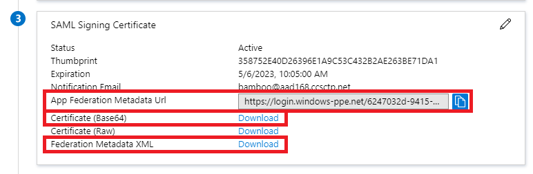
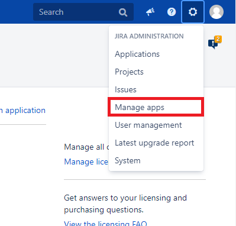
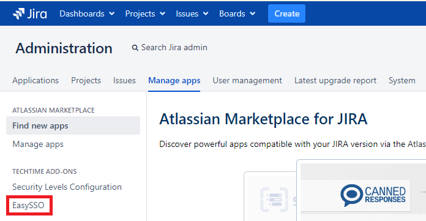
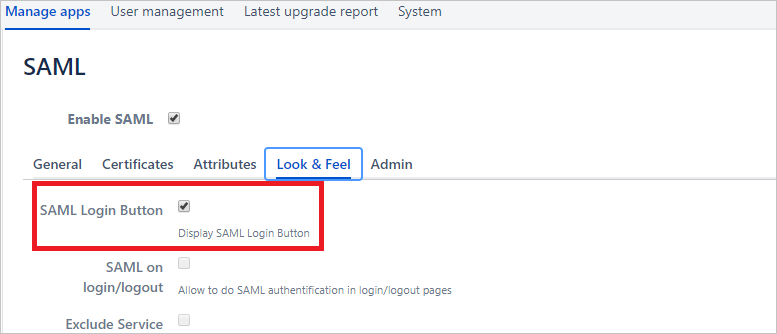
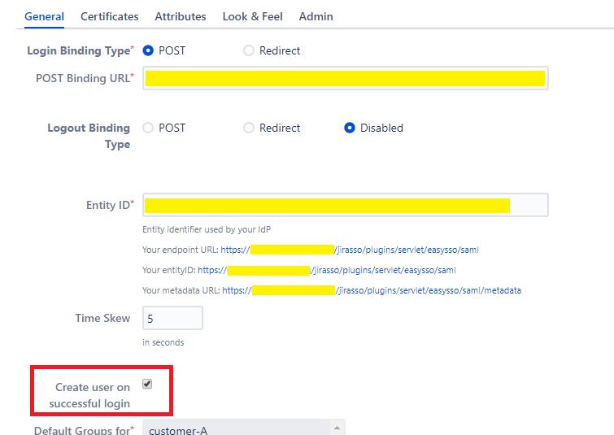
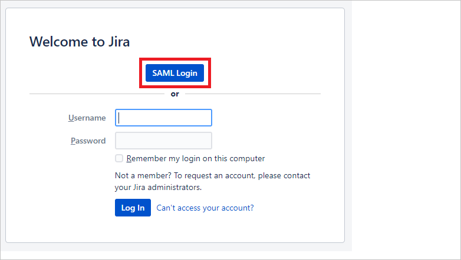

# Tutorial: Azure Active Directory single sign-on (SSO) integration with EasySSO for Jira

In this tutorial, you'll learn how to integrate EasySSO for Jira with Azure Active Directory (Azure AD). When you integrate EasySSO for Jira with Azure AD, you can:

* Control in Azure AD who has access to Jira.
* Enable your users to be automatically signed-in to Jira with their Azure AD accounts.
* Manage your accounts in one central location - the Azure portal.

To learn more about SaaS app integration with Azure AD, see [What is application access and single sign-on with Azure Active Directory](https://docs.microsoft.com/azure/active-directory/manage-apps/what-is-single-sign-on).

## Prerequisites

To get started, you need the following items:

* An Azure AD subscription. If you don't have a subscription, you can get a [free account](https://azure.microsoft.com/free/).
* EasySSO for Jira single sign-on (SSO) enabled subscription.

## Scenario description

In this tutorial, you configure and test Azure AD SSO in a test environment.

* EasySSO for Jira supports **SP and IDP** initiated SSO
* EasySSO for Jira supports **Just In Time** user provisioning
* Once you configure EasySSO for Jira you can enforce session control, which protect exfiltration and infiltration of your organization’s sensitive data in real-time. Session control extend from Conditional Access. [Learn how to enforce session control with Microsoft Cloud App Security](https://docs.microsoft.com/cloud-app-security/proxy-deployment-any-app).

## Adding EasySSO for Jira from the gallery

To configure the integration of EasySSO for Jira into Azure AD, you need to add EasySSO for Jira from the gallery to your list of managed SaaS apps.

1. Sign in to the [Azure portal](https://portal.azure.com) using either a work or school account, or a personal Microsoft account.
1. On the left navigation pane, select the **Azure Active Directory** service.
1. Navigate to **Enterprise Applications** and then select **All Applications**.
1. To add new application, select **New application**.
1. In the **Add from the gallery** section, type **EasySSO for Jira** in the search box.
1. Select **EasySSO for Jira** from results panel and then add the app. Wait a few seconds while the app is added to your tenant.

## Configure and test Azure AD single sign-on for EasySSO for Jira

Configure and test Azure AD SSO with EasySSO for Jira using a test user called **B.Simon**. For SSO to work, you need to establish a link relationship between an Azure AD user and the related user in EasySSO for Jira.

To configure and test Azure AD SSO with EasySSO for Jira, complete the following building blocks:

1. **[Configure Azure AD SSO](#configure-azure-ad-sso)** - to enable your users to use this feature.
    1. **[Create an Azure AD test user](#create-an-azure-ad-test-user)** - to test Azure AD single sign-on with B.Simon.
    1. **[Assign the Azure AD test user](#assign-the-azure-ad-test-user)** - to enable B.Simon to use Azure AD single sign-on.
1. **[Configure EasySSO for Jira SSO](#configure-easysso-for-jira-sso)** - to configure the single sign-on settings on application side.
    1. **[Create EasySSO for Jira test user](#create-easysso-for-jira-test-user)** - to have a counterpart of B.Simon in EasySSO for Jira that is linked to the Azure AD representation of user.
1. **[Test SSO](#test-sso)** - to verify whether the configuration works.

## Configure Azure AD SSO

Follow these steps to enable Azure AD SSO in the Azure portal.

1. In the [Azure portal](https://portal.azure.com/), on the **EasySSO for Jira** application integration page, find the **Manage** section and select **single sign-on**.
1. On the **Select a single sign-on method** page, select **SAML**.
1. On the **Set up single sign-on with SAML** page, click the edit/pen icon for **Basic SAML Configuration** to edit the settings.

   

1. On the **Basic SAML Configuration** section, if you wish to configure the application in **IDP** initiated mode, enter the values for the following fields:

    a. In the **Identifier** text box, type a URL using the following pattern:
    `https://<server-base-url>/plugins/servlet/easysso/saml`

    b. In the **Reply URL** text box, type a URL using the following pattern:
    `https://<server-base-url>/plugins/servlet/easysso/saml`

1. Click **Set additional URLs** and perform the following step if you wish to configure the application in **SP** initiated mode:

    In the **Sign-on URL** text box, type a URL using the following pattern:
    `https://<server-base-url>/login.jsp`

	> [!NOTE]
	> These values are not real. Update these values with the actual Identifier, Reply URL and Sign-on URL. Contact [EasySSO support team](mailto:support@techtime.co.nz) to get these values if in doubt. You can also refer to the patterns shown in the **Basic SAML Configuration** section in the Azure portal.

1. EasySSO for Jira application expects the SAML assertions in a specific format, which requires you to add custom attribute mappings to your SAML token attributes configuration. The following screenshot shows the list of default attributes.

	

1. In addition to above, EasySSO for Jira application expects few more attributes to be passed back in SAML response which are shown below. These attributes are also pre populated but you can review them as per your requirements.
	
	| Name | Source Attribute|
	| ---------------| --------- |
	| urn:oid:0.9.2342.19200300.100.1.1 | user.userprincipalname |
	| urn:oid:0.9.2342.19200300.100.1.3 | user.mail |
	| urn:oid:2.16.840.1.113730.3.1.241 | user.displayname |
	| urn:oid:2.5.4.4 | user.surname |
	| urn:oid:2.5.4.42 | user.givenname |
    
	In case your Azure AD users have **sAMAccountName** configured you would have to map **urn:oid:0.9.2342.19200300.100.1.1** onto **sAMAccountName** attribute.
    
1. On the **Set up single sign-on with SAML** page, In the **SAML Signing Certificate** section, click **Download** links for **Certificate (Base64)** or **Federation Metadata XML** options and save either or all to your computer. You will need it later to configure Jira EasySSO.

	
	
	If you plan to perform EasySSO for Jira configuration manually with certificate, you also need to copy **Login URL** and **Azure AD Identifier** from the section below and save those on your computer.

### Create an Azure AD test user
    
In this section, you'll create a test user in the Azure portal called B.Simon.

1. From the left pane in the Azure portal, select **Azure Active Directory**, select **Users**, and then select **All users**.
1. Select **New user** at the top of the screen.
1. In the **User** properties, follow these steps:
   1. In the **Name** field, enter `B.Simon`.  
   1. In the **User name** field, enter the username@companydomain.extension. For example, `B.Simon@contoso.com`.
   1. Select the **Show password** check box, and then write down the value that's displayed in the **Password** box.
   1. Click **Create**.

### Assign the Azure AD test user

In this section, you'll enable B.Simon to use Azure single sign-on by granting access to EasySSO for Jira.

1. In the Azure portal, select **Enterprise Applications**, and then select **All applications**.
1. In the applications list, select **EasySSO for Jira**.
1. In the app's overview page, find the **Manage** section and select **Users and groups**.

   

1. Select **Add user**, then select **Users and groups** in the **Add Assignment** dialog.

	

1. In the **Users and groups** dialog, select **B.Simon** from the Users list, then click the **Select** button at the bottom of the screen.
1. If you're expecting any role value in the SAML assertion, in the **Select Role** dialog, select the appropriate role for the user from the list and then click the **Select** button at the bottom of the screen.
1. In the **Add Assignment** dialog, click the **Assign** button.

## Configure EasySSO for Jira SSO

1. Sign into your Atlassian Jira instance with Administrator privileges and navigate to the **Manage Apps** section. 

    

2. On the left side locate **EasySSO** and click it.

    

3. Select **SAML** option. This will take you to SAML configuration section.

    

4. Select **Certificates** tab on the top and you will be presented with the following screen:

    

5. Now, locate **Certificate (Base64)** or **Metadata File** you have saved in the earlier steps of **Azure AD SSO** configuration. You have following options on how to proceed:

    a. Use the App Federation **Metadata File** you downloaded to local file on your computer. Select **Upload** radio button and follow the upload file dialog specific to your operating system.

    **OR**

    b. Open the App Federation **Metadata File** to see the content (in any plain text editor) of the file and copy it into the clipboard. Select **Input** option and paste clipboard content into the text field.

     **OR**

    c. Fully manual configuration. Open the App Federation **Certificate (Base64)** to see the content (in any plain text editor) of the file and copy it into the clipboard. Paste it into **IdP Token Signing Certificates** text field. Then navigate to **General** tab and fill **POST Binding URL** and **Entity ID** fields with respective values for **Login URL** and **Azure AD Identifier** you saved previously.
 
6. Click **Save** button on the bottom of the page. You will see the content of the Metadata or Certificate files is parsed into the configuration fields. EasySSO for Jira configuration is complete.

7. For the best testing experience, navigate to **Look & Feel** tab and check the **SAML Login Button** option on. This will enable separate button on the Jira login screen specifically to test your Azure AD SAML integration end to end. You can leave this button on and configure its placement, colour and translation for production mode, too.

    

    > [!NOTE]
    > Should you have any issues, please contact [EasySSO support team](mailto:support@techtime.co.nz).

### Create EasySSO for Jira test user

In this section, a user called Britta Simon is created in Jira. EasySSO for Jira supports just-in-time user provisioning, which is **disabled** by default. To enable user provisioning, you have to explicitly check **Create user on successful login** option on in the General section of EasySSO plugin configuration. If a user doesn't already exist in Jira, a new one is created after authentication.

However, if you do not wish to enable automatic user provisioning on the user first login, users must exist in backend User Directories the Jira instance make use of, such as LDAP or Atlassian Crowd.

## Test SSO 

### IdP-initiated workflow

In this section, you test your Azure AD single sign-on configuration using the Access Panel.

When you click the EasySSO for Jira tile in the Access Panel, you should be automatically signed in to the Jira instance for which you set up SSO. For more information about the Access Panel, see [Introduction to the Access Panel](https://docs.microsoft.com/azure/active-directory/active-directory-saas-access-panel-introduction).

### SP-initiated workflow

In this section, you test your Azure AD single sign-on configuration using Jira **SAML Login** button.

This scenario presumes you have enabled **SAML Login Button** in **Look & Feel** tab in your Jira EasySSO configuration page (see above). Open your Jira login URL in browser incognito mode to avoid any interference with your existing sessions. Click **SAML Login** button and you will get redirected to Azure AD user authentication flow. Once successfully completed you will be redirected back to your Jira instance as authenticated user via SAML.

There's a possibility you may encounter the following screen after getting redirected back from Azure AD

In this case you have to follow the [instructions on this page]( https://techtime.co.nz/display/TECHTIME/EasySSO+How+to+get+the+logs#EasySSOHowtogetthelogs-RETRIEVINGTHELOGS) to get access to **atlassian-jira.log** file. Details of the error will be available by the reference ID found on EasySSO error page.

Should you have any issues digesting the log messages, please contact [EasySSO support team](mailto:support@techtime.co.nz).

## Additional resources

- [ List of Tutorials on How to Integrate SaaS Apps with Azure Active Directory ](https://docs.microsoft.com/azure/active-directory/active-directory-saas-tutorial-list)

- [What is application access and single sign-on with Azure Active Directory? ](https://docs.microsoft.com/azure/active-directory/active-directory-appssoaccess-whatis)

- [What is conditional access in Azure Active Directory?](https://docs.microsoft.com/azure/active-directory/conditional-access/overview)

- [Try EasySSO for Jira with Azure AD](https://aad.portal.azure.com/)

- [What is session control in Microsoft Cloud App Security?](https://docs.microsoft.com/cloud-app-security/proxy-intro-aad)

- [How to protect EasySSO for Jira with advanced visibility and controls](https://docs.microsoft.com/cloud-app-security/proxy-intro-aad)
