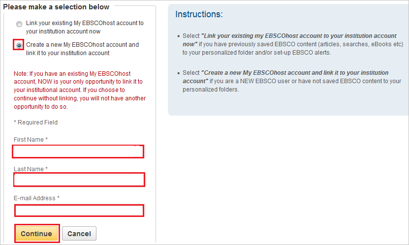

# Tutorial: Azure Active Directory single sign-on (SSO) integration with EBSCO

In this tutorial, you'll learn how to integrate EBSCO with Azure Active Directory (Azure AD). When you integrate EBSCO with Azure AD, you can:

* Control in Azure AD who has access to EBSCO.
* Enable your users to be automatically signed-in to EBSCO with their Azure AD accounts.
* Manage your accounts in one central location - the Azure portal.

## Prerequisites

To get started, you need the following items:

* An Azure AD subscription. If you don't have a subscription, you can get a [free account](https://azure.microsoft.com/free/).
* EBSCO single sign-on (SSO) enabled subscription.

## Scenario description

In this tutorial, you configure and test Azure AD SSO in a test environment.

* EBSCO supports **SP and IDP** initiated SSO.
* EBSCO supports **Just In Time** user provisioning.

> [!NOTE]
> Identifier of this application is a fixed string value so only one instance can be configured in one tenant.

## Add EBSCO from the gallery

To configure the integration of EBSCO into Azure AD, you need to add EBSCO from the gallery to your list of managed SaaS apps.

1. Sign in to the Azure portal using either a work or school account, or a personal Microsoft account.
1. On the left navigation pane, select the **Azure Active Directory** service.
1. Navigate to **Enterprise Applications** and then select **All Applications**.
1. To add new application, select **New application**.
1. In the **Add from the gallery** section, type **EBSCO** in the search box.
1. Select **EBSCO** from results panel and then add the app. Wait a few seconds while the app is added to your tenant.

 Alternatively, you can also use the [Enterprise App Configuration Wizard](https://portal.office.com/AdminPortal/home?Q=Docs#/azureadappintegration). In this wizard, you can add an application to your tenant, add users/groups to the app, assign roles, as well as walk through the SSO configuration as well. [Learn more about Microsoft 365 wizards.](/microsoft-365/admin/misc/azure-ad-setup-guides)

## Configure and test Azure AD SSO for EBSCO

Configure and test Azure AD SSO with EBSCO using a test user called **B.Simon**. For SSO to work, you need to establish a link relationship between an Azure AD user and the related user in EBSCO.

To configure and test Azure AD SSO with EBSCO, perform the following steps:

1. **[Configure Azure AD SSO](#configure-azure-ad-sso)** - to enable your users to use this feature.
    1. **[Create an Azure AD test user](#create-an-azure-ad-test-user)** - to test Azure AD single sign-on with B.Simon.
    1. **[Assign the Azure AD test user](#assign-the-azure-ad-test-user)** - to enable B.Simon to use Azure AD single sign-on.
1. **[Configure EBSCO SSO](#configure-ebsco-sso)** - to configure the single sign-on settings on application side.
    1. **[Create EBSCO test user](#create-ebsco-test-user)** - to have a counterpart of B.Simon in EBSCO that is linked to the Azure AD representation of user.
1. **[Test SSO](#test-sso)** - to verify whether the configuration works.

## Configure Azure AD SSO

Follow these steps to enable Azure AD SSO in the Azure portal.

1. In the Azure portal, on the **EBSCO** application integration page, find the **Manage** section and select **single sign-on**.
1. On the **Select a single sign-on method** page, select **SAML**.
1. On the **Set up single sign-on with SAML** page, click the pencil icon for **Basic SAML Configuration** to edit the settings.

   

1. On the **Basic SAML Configuration** section, if you wish to configure the application in **IDP** initiated mode, then perform the following step:

    In the **Identifier** text box, type the URL:
    `pingsso.ebscohost.com`

1. Click **Set additional URLs** and perform the following step if you wish to configure the application in **SP** initiated mode:

    In the **Sign-on URL** text box, type a URL using the following pattern:
    `http://search.ebscohost.com/login.aspx?authtype=sso&custid=<unique EBSCO customer ID>&profile=<profile ID>`

	> [!NOTE]
	> The Sign-on URL value is not real. Update the value with the actual Sign-on URL. Contact [EBSCO Client support team](mailto:support@ebsco.com) to get these values. You can also refer to the patterns shown in the **Basic SAML Configuration** section in the Azure portal.

	o	**Unique elements:**  

	o	**Custid** = Enter unique EBSCO customer ID 

	o	**Profile** = Clients can tailor the link to direct users to a specific profile (depending on what they purchase from EBSCO). They can enter a specific profile ID. The main IDs are eds (EBSCO Discovery Service) and ehost (EBSOCOhost databases). Instructions for the same are given [here](https://help.ebsco.com/interfaces/EBSCOhost/EBSCOhost_FAQs/How_do_I_set_up_direct_links_to_EBSCOhost_profiles_and_or_databases#profile).

1. EBSCO application expects the SAML assertions in a specific format, which requires you to add custom attribute mappings to your SAML token attributes configuration. The following screenshot shows the list of default attributes.

	

    > [!Note]
    > The **name** attribute is mandatory and it is mapped with **Name Identifier value** in EBSCO application. This is added by default so you don't need to add this manually.

1. In addition to above, EBSCO application expects few more attributes to be passed back in SAML response which are shown below. These attributes are also pre populated but you can review them as per your requirements.

    | Name | Source Attribute|
	| ---------------| --------------- |
	| FirstName   | user.givenname |
	| LastName   | user.surname |
	| Email   | user.mail |

1. On the **Set up single sign-on with SAML** page, in the **SAML Signing Certificate** section,  find **Federation Metadata XML** and select **Download** to download the certificate and save it on your computer.

	

1. On the **Set up EBSCO** section, copy the appropriate URL(s) based on your requirement.

	

### Create an Azure AD test user

In this section, you'll create a test user in the Azure portal called B.Simon.

1. From the left pane in the Azure portal, select **Azure Active Directory**, select **Users**, and then select **All users**.
1. Select **New user** at the top of the screen.
1. In the **User** properties, follow these steps:
   1. In the **Name** field, enter `B.Simon`.  
   1. In the **User name** field, enter the username@companydomain.extension. For example, `B.Simon@contoso.com`.
   1. Select the **Show password** check box, and then write down the value that's displayed in the **Password** box.
   1. Click **Create**.

### Assign the Azure AD test user

In this section, you'll enable B.Simon to use Azure single sign-on by granting access to EBSCO.

1. In the Azure portal, select **Enterprise Applications**, and then select **All applications**.
1. In the applications list, select **EBSCO**.
1. In the app's overview page, find the **Manage** section and select **Users and groups**.
1. Select **Add user**, then select **Users and groups** in the **Add Assignment** dialog.
1. In the **Users and groups** dialog, select **B.Simon** from the Users list, then click the **Select** button at the bottom of the screen.
1. If you are expecting a role to be assigned to the users, you can select it from the **Select a role** dropdown. If no role has been set up for this app, you see "Default Access" role selected.
1. In the **Add Assignment** dialog, click the **Assign** button.

## Configure EBSCO SSO

To configure single sign-on on **EBSCO** side, you need to send the downloaded **Federation Metadata XML** and appropriate copied URLs from Azure portal to [EBSCO support team](mailto:support@ebsco.com). They set this setting to have the SAML SSO connection set properly on both sides.

### Create EBSCO test user

In the case of EBSCO, user provisioning is automatic.

**To provision a user account, perform the following steps:**

Azure AD passes the required data to EBSCO application. EBSCO’s user provisioning can be automatic OR require a one-time form. It depends on whether the client has a lot of pre-existing EBSCOhost accounts with personal settings saved. The same can be discussed with the [EBSCO support team](mailto:support@ebsco.com) during the implementation. Either way, the client doesn’t have to create any EBSCOhost accounts prior to testing.

   > [!Note]
   > You can automate EBSCO host user provisioning/personalization. Contact [EBSCO support team](mailto:support@ebsco.com) about Just-In-Time user provisioning.

## Test SSO

In this section, you test your Azure AD single sign-on configuration using My Apps.

1. When you click the EBSCO tile in My Apps, you should get automatically signed-on to your EBSCO application.
For more information about My Apps, see [Introduction to My Apps](https://support.microsoft.com/account-billing/sign-in-and-start-apps-from-the-my-apps-portal-2f3b1bae-0e5a-4a86-a33e-876fbd2a4510).

1. Once you login to the application, click on the **sign in** button in the top right corner.

	

1. You will receive a one-time prompt to pair the institutional/SAML login with an **Link your existing MyEBSCOhost account to your institution account now** OR **Create a new MyEBSCOhost account and link it to your institution account**. The account is used for personalization on the EBSCOhost application. Select the option **Create a new account** and  you will see that the form for personalization is pre-completed with the values from the saml response as shown in the screenshot below. Click **‘Continue’** to save this selection.
	
	 

1. After completing the above setup, clear cookies/cache and login again. You won’t have to manually sign in again and the personalization settings are remembered.

## Next steps

Once you configure EBSCO you can enforce session control, which protects exfiltration and infiltration of your organization’s sensitive data in real time. Session control extends from Conditional Access. [Learn how to enforce session control with Microsoft Defender for Cloud Apps](/cloud-app-security/proxy-deployment-aad).
