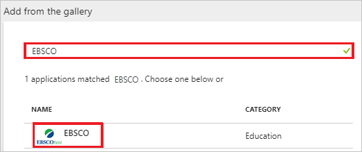
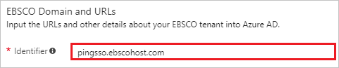
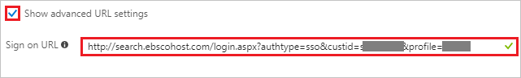
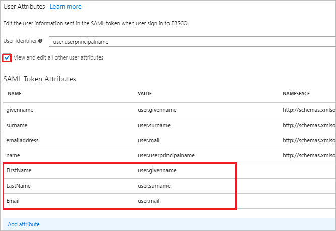
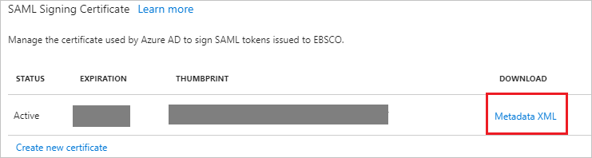

---
title: 'Tutorial: Azure Active Directory integration with EBSCO | Microsoft Docs'
description: Learn how to configure single sign-on between Azure Active Directory and EBSCO.
services: active-directory
documentationCenter: na
author: jeevansd
manager: femila
ms.reviewer: joflore

ms.assetid: 144f7f65-69e9-4016-a151-fe1104fd6ba8
ms.service: active-directory
ms.component: saas-app-tutorial
ms.workload: identity
ms.tgt_pltfrm: na
ms.devlang: na
ms.topic: article
ms.date: 01/31/2018
ms.author: jeedes

---
# Tutorial: Azure Active Directory integration with EBSCO

In this tutorial, you learn how to integrate EBSCO with Azure Active Directory (Azure AD).

Integrating EBSCO with Azure AD provides you with the following benefits:

- You can control in Azure AD who has access to EBSCO.
- You can enable your users to automatically get signed-on to EBSCO (Single Sign-On) with their Azure AD accounts.
- You can manage your accounts in one central location - the Azure portal.

If you want to know more details about SaaS app integration with Azure AD, see [what is application access and single sign-on with Azure Active Directory](../manage-apps/what-is-single-sign-on.md).

## Prerequisites

To configure Azure AD integration with EBSCO, you need the following items:

- An Azure AD subscription
- An EBSCO single-sign on enabled subscription

> [!NOTE]
> To test the steps in this tutorial, we do not recommend using a production environment.

To test the steps in this tutorial, you should follow these recommendations:

- Do not use your production environment, unless it is necessary.
- If you don't have an Azure AD trial environment, you can [get a one-month trial](https://azure.microsoft.com/pricing/free-trial/).

## Scenario description
In this tutorial, you test Azure AD single sign-on in a test environment. 
The scenario outlined in this tutorial consists of two main building blocks:

1. Adding EBSCO from the gallery
1. Configuring and testing Azure AD single sign-on

## Adding EBSCO from the gallery
To configure the integration of EBSCO into Azure AD, you need to add EBSCO from the gallery to your list of managed SaaS apps.

**To add EBSCO from the gallery, perform the following steps:**

1. In the **[Azure portal](https://portal.azure.com)**, on the left navigation panel, click **Azure Active Directory** icon. 

	![The Azure Active Directory button][1]

1. Navigate to **Enterprise applications**. Then go to **All applications**.

	![The Enterprise applications blade][2]
	
1. To add new application, click **New application** button on the top of dialog.

	![The New application button][3]

1. In the search box, type **EBSCO**, select **EBSCO** from result panel then click **Add** button to add the application.

	

## Configure and test Azure AD single sign-on

In this section, you configure and test Azure AD single sign-on with EBSCO based on a test user called "Britta Simon".

For single sign-on to work, Azure AD needs to know what the counterpart user in EBSCO is to a user in Azure AD. In other words, a link relationship between an Azure AD user and the related user in EBSCO needs to be established.

To configure and test Azure AD single sign-on with EBSCO, you need to complete the following building blocks:

1. **[Configure Azure AD Single Sign-On](#configure-azure-ad-single-sign-on)** - to enable your users to use this feature.
1. **[Create an Azure AD test user](#create-an-azure-ad-test-user)** - to test Azure AD single sign-on with Britta Simon.
1. **[Create an EBSCO test user](#create-an-ebsco-test-user)** - you can automate EBSCOhost user provisioning/personalization. EBSCO supports Just-In-Time user provisioning.
1. **[Assign the Azure AD test user](#assign-the-azure-ad-test-user)** - to enable Britta Simon to use Azure AD single sign-on.
1. **[Test single sign-on](#test-single-sign-on)** - to verify whether the configuration works.

### Configure Azure AD single sign-on

In this section, you enable Azure AD single sign-on in the Azure portal and configure single sign-on in your EBSCO application.

**To configure Azure AD single sign-on with EBSCO, perform the following steps:**

1. In the Azure portal, on the **EBSCO** application integration page, click **Single sign-on**.

	![Configure single sign-on link][4]

1. On the **Single sign-on** dialog, select **Mode** as	**SAML-based Sign-on** to enable single sign-on.
 
	

1. On the **EBSCO Domain and URLs** section, perform the following steps if you wish to configure the application in **IDP** initiated mode:

	

    In the **Identifier** textbox, type a URL: `pingsso.ebscohost.com`

1. Check **Show advanced URL settings** and perform the following step if you wish to configure the application in **SP** initiated mode:

	

    In the **Sign-on URL** textbox, type a URL using the following pattern: `http://search.ebscohost.com/login.aspx?authtype=sso&custid=<unique EBSCO customer ID>&profile=<profile ID>`
	 
	> [!NOTE] 
	> The Sign-on URL value is not real. Update the value with the actual Sign-on URL. Contact [EBSCO Client support team](mailto:sso@ebsco.com) to get the value. 

	o	**Unique elements:**  

	o	**Custid** = Enter unique EBSCO customer ID 

	o	**Profile** = Clients can tailor the link to direct users to a specific profile (depending on what they purchase from EBSCO). They can enter a specific profile ID. The main IDs are eds (EBSCO Discovery Service) and ehost (EBSOCOhost databases). Instructions for the same are given [here](https://help.ebsco.com/interfaces/EBSCOhost/EBSCOhost_FAQs/How_do_I_set_up_direct_links_to_EBSCOhost_profiles_and_or_databases#profile).

1. EBSCO application expects the SAML assertions in a specific format. Configure the following claims for this application. You can manage the values of these attributes from the "**User Attributes**" section on application integration page. The following screenshot shows an example for this.
	
	

    > [!Note]
    > The **name** attribute is mandatory and it is mapped with **User Identifier** in EBSCO application. This is added by default so you don't need to add this manually.
	
1. In the **User Attributes** section on the **Single sign-on** dialog, configure SAML token attribute as shown in the image above and perform the following steps:
    
	| Attribute Name | Attribute Value |
	| ---------------| --------------- |    
	| FirstName   | user.givenname |
	| LastName   | user.surname |
	| Email   | user.mail |

	a. Click **Add attribute** to open the **Add Attribute** dialog.

	

	
	
	b. In the **Name** textbox, type the attribute name shown for that row.
	
	c. From the **Value** list, type the attribute value shown for that row.
	
	d. Click **Ok**

1. On the **SAML Signing Certificate** section, click **Metadata XML** and then save the metadata file on your computer.

	 

1. Click **Save** button.

	
	
1. To configure single sign-on on **EBSCO** side, you need to send the downloaded **Metadata XML** to [EBSCO support team](mailto:sso@ebsco.com). They set this setting to have the SAML SSO connection set properly on both sides.

> [!TIP]
> You can now read a concise version of these instructions inside the [Azure portal](https://portal.azure.com), while you are setting up the app!  After adding this app from the **Active Directory > Enterprise Applications** section, simply click the **Single Sign-On** tab and access the embedded documentation through the **Configuration** section at the bottom. You can read more about the embedded documentation feature here: [Azure AD embedded documentation]( https://go.microsoft.com/fwlink/?linkid=845985)

### Create an Azure AD test user

The objective of this section is to create a test user in the Azure portal called Britta Simon.

   ![Create an Azure AD test user][100]

**To create a test user in Azure AD, perform the following steps:**

1. In the Azure portal, in the left pane, click the **Azure Active Directory** button.

    

1. To display the list of users, go to **Users and groups**, and then click **All users**.

    

1. To open the **User** dialog box, click **Add** at the top of the **All Users** dialog box.

    

1. In the **User** dialog box, perform the following steps:

    

    a. In the **Name** box, type **BrittaSimon**.

    b. In the **User name** box, type the email address of user Britta Simon.

    c. Select the **Show Password** check box, and then write down the value that's displayed in the **Password** box.

    d. Click **Create**.
 
### Create an EBSCO test user

In the case of EBSCO, user provisioning is automatic.

**To provision a user account, perform the following steps:**

Azure AD passes the required data to EBSCO application. EBSCO’s user provisioning can be automatic OR require a one-time form. It depends on whether the client has a lot of pre-existing EBSCOhost accounts with personal settings saved. The same can be discussed with the [EBSCO support team](mailto:sso@ebsco.com) during the implementation. Either way, the client doesn’t have to create any EBSCOhost accounts prior to testing.

   >[!Note]
   >You can automate EBSCOhost user provisioning/personalization. Contact [EBSCO support team](mailto:sso@ebsco.com) about Just-In-Time user provisioning. 
 
### Assign the Azure AD test user

In this section, you enable Britta Simon to use Azure single sign-on by granting access to EBSCO.

![Assign the user role][200] 

**To assign Britta Simon to EBSCO, perform the following steps:**

1. In the Azure portal, open the applications view, and then navigate to the directory view and go to **Enterprise applications** then click **All applications**.

	![Assign User][201] 

1. In the applications list, select **EBSCO**.

	  

1. In the menu on the left, click **Users and groups**.

	![The "Users and groups" link][202]

1. Click **Add** button. Then select **Users and groups** on **Add Assignment** dialog.

	![The Add Assignment pane][203]

1. On **Users and groups** dialog, select **Britta Simon** in the Users list.

1. Click **Select** button on **Users and groups** dialog.

1. Click **Assign** button on **Add Assignment** dialog.
	
### Test single sign-on

In this section, you test your Azure AD single sign-on configuration using the Access Panel.

1. When you click the EBSCO tile in the Access Panel, you should get automatically signed-on to your EBSCO application.
For more information about the Access Panel, see [Introduction to the Access Panel](../user-help/active-directory-saas-access-panel-introduction.md).

1. Once you login to the application, click on the **sign in** button in the top right corner.

	
 
1. You will receive a one-time prompt to pair the institutional/SAML login with an **Link your existing MyEBSCOhost account to your institution account now** OR **Create a new MyEBSCOhost account and link it to your institution account**. The account is used for personalization on the EBSCOhost application. Select the option **Create a new account** and  you will see that the form for personalization is pre-completed with the values from the saml response as shown in the screenshot below. Click **‘Continue’** to save this selection.
	
	 

1. After completing the above setup, clear cookies/cache and login again. You won’t have to manually signin again and the personalization settings are remembered

## Additional resources

* [List of Tutorials on How to Integrate SaaS Apps with Azure Active Directory](tutorial-list.md)
* [What is application access and single sign-on with Azure Active Directory?](../manage-apps/what-is-single-sign-on.md)

<!--Image references-->

[1]: ./media/ebsco-tutorial/tutorial_general_01.png
[2]: ./media/ebsco-tutorial/tutorial_general_02.png
[3]: ./media/ebsco-tutorial/tutorial_general_03.png
[4]: ./media/ebsco-tutorial/tutorial_general_04.png

[100]: ./media/ebsco-tutorial/tutorial_general_100.png

[200]: ./media/ebsco-tutorial/tutorial_general_200.png
[201]: ./media/ebsco-tutorial/tutorial_general_201.png
[202]: ./media/ebsco-tutorial/tutorial_general_202.png
[203]: ./media/ebsco-tutorial/tutorial_general_203.png

