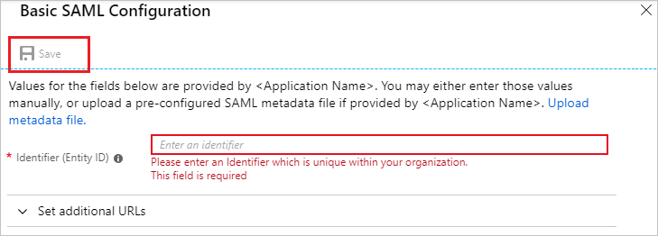
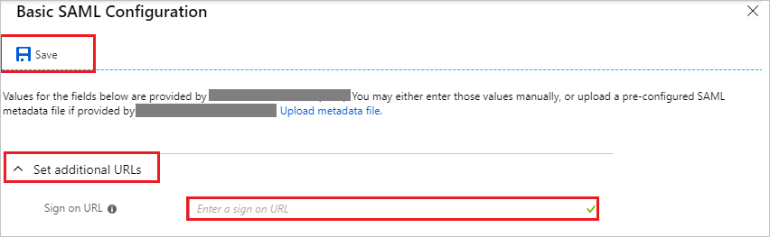
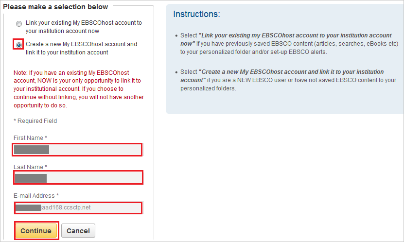

# Tutorial: Azure Active Directory integration with EBSCO

In this tutorial, you learn how to integrate EBSCO with Azure Active Directory (Azure AD).
Integrating EBSCO with Azure AD provides you with the following benefits:

* You can control in Azure AD who has access to EBSCO.
* You can enable your users to be automatically signed-in to EBSCO (Single Sign-On) with their Azure AD accounts.
* You can manage your accounts in one central location - the Azure portal.

If you want to know more details about SaaS app integration with Azure AD, see [What is application access and single sign-on with Azure Active Directory](https://docs.microsoft.com/azure/active-directory/active-directory-appssoaccess-whatis).
If you don't have an Azure subscription, [create a free account](https://azure.microsoft.com/free/) before you begin.

## Prerequisites

To configure Azure AD integration with EBSCO, you need the following items:

* An Azure AD subscription. If you don't have an Azure AD environment, you can get a [free account](https://azure.microsoft.com/free/)
* EBSCO single sign-on enabled subscription

## Scenario description

In this tutorial, you configure and test Azure AD single sign-on in a test environment.

* EBSCO supports **SP** and **IDP** initiated SSO

* EBSCO supports **Just In Time** user provisioning

## Adding EBSCO from the gallery

To configure the integration of EBSCO into Azure AD, you need to add EBSCO from the gallery to your list of managed SaaS apps.

**To add EBSCO from the gallery, perform the following steps:**

1. In the **[Azure portal](https://portal.azure.com)**, on the left navigation panel, click the **Azure Active Directory** icon.

	

2. Navigate to **Enterprise Applications** and then select the **All Applications** option.

	

3. To add a new application, click the **New application** button at the top of the dialog.

	

4. In the search box, type **EBSCO**, select **EBSCO** from the result panel then click the **Add** button to add the application.

	 

## Configure and test Azure AD single sign-on

In this section, you configure and test Azure AD single sign-on with EBSCO based on a test user called **Britta Simon**.
For single sign-on to work, a link relationship between an Azure AD user and the related user in EBSCO needs to be established.

To configure and test Azure AD single sign-on with EBSCO, you need to complete the following building blocks:

1. **[Configure Azure AD Single Sign-On](#configure-azure-ad-single-sign-on)** - to enable your users to use this feature.
2. **[Configure EBSCO Single Sign-On](#configure-ebsco-single-sign-on)** - to configure the Single Sign-On settings on application side.
3. **[Create an Azure AD test user](#create-an-azure-ad-test-user)** - to test Azure AD single sign-on with Britta Simon.
4. **[Assign the Azure AD test user](#assign-the-azure-ad-test-user)** - to enable Britta Simon to use Azure AD single sign-on.
5. **[Create EBSCO test user](#create-ebsco-test-user)** - to have a counterpart of Britta Simon in EBSCO that is linked to the Azure AD representation of user.
6. **[Test single sign-on](#test-single-sign-on)** - to verify whether the configuration works.

### Configure Azure AD single sign-on

In this section, you enable Azure AD single sign-on in the Azure portal.

To configure Azure AD single sign-on with EBSCO, perform the following steps:

1. In the [Azure portal](https://portal.azure.com/), on the **EBSCO** application integration page, select **Single sign-on**.

    

2. On the **Select a Single sign-on method** dialog, select **SAML/WS-Fed** mode to enable single sign-on.

    

3. On the **Set up Single Sign-On with SAML** page, click the **Edit** icon to open the **Basic SAML Configuration** dialog.

	

4. On the **Basic SAML Configuration** section, if you wish to configure the application in **IDP** initiated mode, perform the following step:

    

    In the **Identifier** text box, type a URL:
    `pingsso.ebscohost.com`

5. Click **Set additional URLs** and perform the following step if you wish to configure the application in **SP** initiated mode:

    

    In the **Sign-on URL** text box, type a URL using the following pattern:
    `https://search.ebscohost.com/login.aspx?authtype=sso&custid=<unique EBSCO customer ID>&profile=<profile ID>`

	> [!NOTE]
	> The Sign-on URL value is not real. Update the value with the actual Sign-on URL. Contact [EBSCO Client support team](mailto:sso@ebsco.com) to get these values. You can also refer to the patterns shown in the **Basic SAML Configuration** section in the Azure portal.

	o	**Unique elements:**  

	o	**Custid** = Enter unique EBSCO customer ID 

	o	**Profile** = Clients can tailor the link to direct users to a specific profile (depending on what they purchase from EBSCO). They can enter a specific profile ID. The main IDs are eds (EBSCO Discovery Service) and ehost (EBSOCOhost databases). Instructions for the same are given [here](https://help.ebsco.com/interfaces/EBSCOhost/EBSCOhost_FAQs/How_do_I_set_up_direct_links_to_EBSCOhost_profiles_and_or_databases#profile).

6. EBSCO application expects the SAML assertions in a specific format, which requires you to add custom attribute mappings to your SAML token attributes configuration. The following screenshot shows the list of default attributes. Click **Edit** icon to open **User Attributes** dialog.

	

	 > [!Note]
    > The **name** attribute is mandatory and it is mapped with **Name Identifier value** in EBSCO application. This is added by default so you don't need to add this manually.

7. In addition to above, EBSCO application expects few more attributes to be passed back in SAML response. In the **User Claims** section on the **User Attributes** dialog, perform the following steps to add SAML token attribute as shown in the below table: 

	| Name | Source Attribute|
	| ---------------| --------------- |    
	| FirstName   | user.givenname |
	| LastName   | user.surname |
	| Email   | user.mail |

	a. Click **Add new claim** to open the **Manage user claims** dialog.

	

	

	b. In the **Name** textbox, type the attribute name shown for that row.

	c. Leave the **Namespace** blank.

	d. Select Source as **Attribute**.

	e. From the **Source attribute** list, type the attribute value shown for that row.

	f. Click **Save**.

8. On the **Set up Single Sign-On with SAML** page, in the **SAML Signing Certificate** section, click **Download** to download the **Federation Metadata XML** from the given options as per your requirement and save it on your computer.

	

9. On the **Set up EBSCO** section, copy the appropriate URL(s) as per your requirement.

	

	a. Login URL

	b. Azure AD Identifier

	c. Logout URL

### Configure EBSCO Single Sign-On

To configure single sign-on on **EBSCO** side, you need to send the downloaded **Metadata XML** and appropriate copied URLs from Azure portal to [EBSCO support team](mailto:sso@ebsco.com). They set this setting to have the SAML SSO connection set properly on both sides.

### Create an Azure AD test user 

The objective of this section is to create a test user in the Azure portal called Britta Simon.

1. In the Azure portal, in the left pane, select **Azure Active Directory**, select **Users**, and then select **All users**.

    

2. Select **New user** at the top of the screen.

    

3. In the User properties, perform the following steps.

    

    a. In the **Name** field enter **BrittaSimon**.
  
    b. In the **User name** field type brittasimon@yourcompanydomain.extension. For example, BrittaSimon@contoso.com

    c. Select **Show password** check box, and then write down the value that's displayed in the Password box.

    d. Click **Create**.

### Assign the Azure AD test user

In this section, you enable Britta Simon to use Azure single sign-on by granting access to EBSCO.

1. In the Azure portal, select **Enterprise Applications**, select **All applications**, then select **EBSCO**.

	

2. In the applications list, select **EBSCO**.

	

3. In the menu on the left, select **Users and groups**.

    

4. Click the **Add user** button, then select **Users and groups** in the **Add Assignment** dialog.

    

5. In the **Users and groups** dialog select **Britta Simon** in the Users list, then click the **Select** button at the bottom of the screen.

6. If you are expecting any role value in the SAML assertion then in the **Select Role** dialog select the appropriate role for the user from the list, then click the **Select** button at the bottom of the screen.

7. In the **Add Assignment** dialog click the **Assign** button.

### Create EBSCO test user

In the case of EBSCO, user provisioning is automatic.

**To provision a user account, perform the following steps:**

Azure AD passes the required data to EBSCO application. EBSCO’s user provisioning can be automatic OR require a one-time form. It depends on whether the client has a lot of pre-existing EBSCOhost accounts with personal settings saved. The same can be discussed with the [EBSCO support team](mailto:sso@ebsco.com) during the implementation. Either way, the client doesn’t have to create any EBSCOhost accounts prior to testing.

   >[!Note]
   >You can automate EBSCOhost user provisioning/personalization. Contact [EBSCO support team](mailto:sso@ebsco.com) about Just-In-Time user provisioning. 

### Test single sign-on 

In this section, you test your Azure AD single sign-on configuration using the Access Panel.

1. When you click the EBSCO tile in the Access Panel, you should get automatically signed-on to your EBSCO application.
For more information about the Access Panel, see [Introduction to the Access Panel](../user-help/active-directory-saas-access-panel-introduction.md).

2. Once you login to the application, click on the **sign in** button in the top right corner.

	
 
3. You will receive a one-time prompt to pair the institutional/SAML login with an **Link your existing MyEBSCOhost account to your institution account now** OR **Create a new MyEBSCOhost account and link it to your institution account**. The account is used for personalization on the EBSCOhost application. Select the option **Create a new account** and  you will see that the form for personalization is pre-completed with the values from the saml response as shown in the screenshot below. Click **‘Continue’** to save this selection.
	
	 

1. After completing the above setup, clear cookies/cache and login again. You won’t have to manually sign in again and the personalization settings are remembered

## Additional sesources

- [List of Tutorials on How to Integrate SaaS Apps with Azure Active Directory](https://docs.microsoft.com/azure/active-directory/active-directory-saas-tutorial-list)

- [What is application access and single sign-on with Azure Active Directory?](https://docs.microsoft.com/azure/active-directory/active-directory-appssoaccess-whatis)

- [What is Conditional Access in Azure Active Directory?](https://docs.microsoft.com/azure/active-directory/conditional-access/overview)

