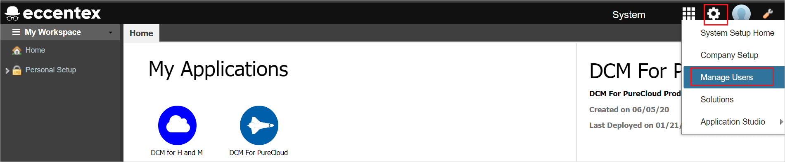
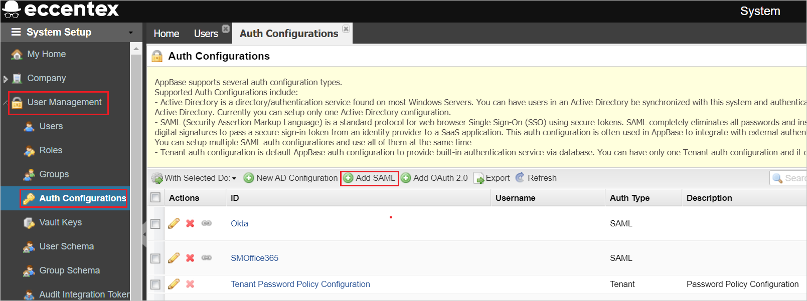
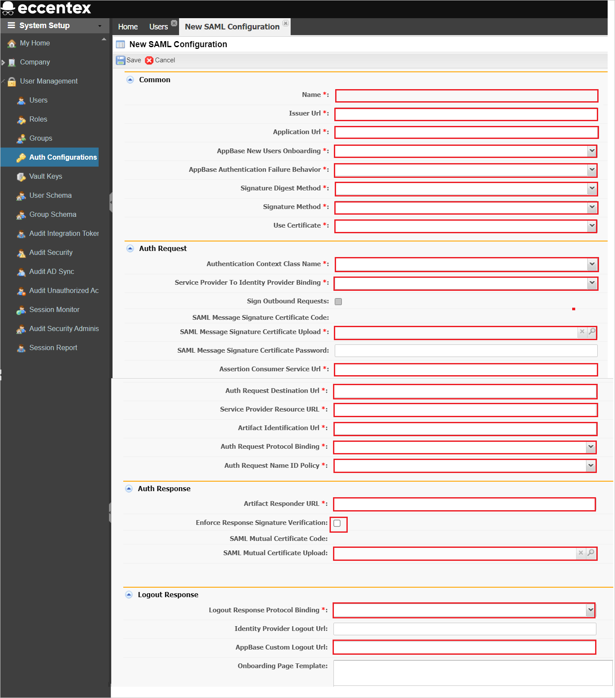

# Tutorial: Azure Active Directory single sign-on (SSO) integration with Eccentex AppBase for Azure

In this tutorial, you'll learn how to integrate Eccentex AppBase for Azure with Azure Active Directory (Azure AD). When you integrate Eccentex AppBase for Azure with Azure AD, you can:

* Control in Azure AD who has access to Eccentex AppBase for Azure.
* Enable your users to be automatically signed-in to Eccentex AppBase for Azure with their Azure AD accounts.
* Manage your accounts in one central location - the Azure portal.

## Prerequisites

To get started, you need the following items:

* An Azure AD subscription. If you don't have a subscription, you can get a [free account](https://azure.microsoft.com/free/).
* Eccentex AppBase for Azure single sign-on (SSO) enabled subscription.

## Scenario description

In this tutorial, you configure and test Azure AD SSO in a test environment.

* Eccentex AppBase for Azure supports **SP** initiated SSO.

* Eccentex AppBase for Azure supports **Just In Time** user provisioning.

## Add Eccentex AppBase for Azure from the gallery

To configure the integration of Eccentex AppBase for Azure into Azure AD, you need to add Eccentex AppBase for Azure from the gallery to your list of managed SaaS apps.

1. Sign in to the Azure portal using either a work or school account, or a personal Microsoft account.
1. On the left navigation pane, select the **Azure Active Directory** service.
1. Navigate to **Enterprise Applications** and then select **All Applications**.
1. To add new application, select **New application**.
1. In the **Add from the gallery** section, type **Eccentex AppBase for Azure** in the search box.
1. Select **Eccentex AppBase for Azure** from results panel and then add the app. Wait a few seconds while the app is added to your tenant.

## Configure and test Azure AD SSO for Eccentex AppBase for Azure

Configure and test Azure AD SSO with Eccentex AppBase for Azure using a test user called **B.Simon**. For SSO to work, you need to establish a link relationship between an Azure AD user and the related user in Eccentex AppBase for Azure.

To configure and test Azure AD SSO with Eccentex AppBase for Azure, perform the following steps:

1. **[Configure Azure AD SSO](#configure-azure-ad-sso)** - to enable your users to use this feature.
    1. **[Create an Azure AD test user](#create-an-azure-ad-test-user)** - to test Azure AD single sign-on with B.Simon.
    1. **[Assign the Azure AD test user](#assign-the-azure-ad-test-user)** - to enable B.Simon to use Azure AD single sign-on.
1. **[Configure Eccentex AppBase for Azure SSO](#configure-eccentex-appbase-for-azure-sso)** - to configure the single sign-on settings on application side.
    1. **[Create Eccentex AppBase for Azure test user](#create-eccentex-appbase-for-azure-test-user)** - to have a counterpart of B.Simon in Eccentex AppBase for Azure that is linked to the Azure AD representation of user.
1. **[Test SSO](#test-sso)** - to verify whether the configuration works.

## Configure Azure AD SSO

Follow these steps to enable Azure AD SSO in the Azure portal.

1. In the Azure portal, on the **Eccentex AppBase for Azure** application integration page, find the **Manage** section and select **single sign-on**.
1. On the **Select a single sign-on method** page, select **SAML**.
1. On the **Set up single sign-on with SAML** page, click the pencil icon for **Basic SAML Configuration** to edit the settings.

   

1. On the **Basic SAML Configuration** section, perform the following steps:

    a. In the **Identifier (Entity ID)** text box, type a URL using one of the following patterns:

    | **Identifier** |
    |--------|
    | `https://<CustomerName>.appbase.com/Ecx.Web` |
    | `https://<CustomerName>.eccentex.com:<PortNumber>/Ecx.Web` |

	b. In the **Sign on URL** text box, type a URL using one of the following patterns:

    | **Sign on URL** |
    |---------|
    | `https://<CustomerName>.appbase.com/Ecx.Web/Account/sso?tenantCode=<TenantCode>&authCode=<AuthConfigurationCode>`|
    | `https://<CustomerName>.eccentex.com:<PortNumber>/Ecx.Web/Account/sso?tenantCode=<TenantCode>&authCode=<AuthConfigurationCode>` |

	> [!NOTE]
	> These values are not real. Update these values with the actual Identifier and Sign on URL. Contact [Eccentex AppBase for Azure Client support team](mailto:eccentex.support@eccentex.com) to get these values. You can also refer to the patterns shown in the **Basic SAML Configuration** section in the Azure portal.

1. On the **Set up single sign-on with SAML** page, in the **SAML Signing Certificate** section,  find **Certificate (Raw)** and select **Download** to download the certificate and save it on your computer.

	

1. On the **Set up Eccentex AppBase for Azure** section, copy the appropriate URL(s) based on your requirement.

	

### Create an Azure AD test user

In this section, you'll create a test user in the Azure portal called B.Simon.

1. From the left pane in the Azure portal, select **Azure Active Directory**, select **Users**, and then select **All users**.
1. Select **New user** at the top of the screen.
1. In the **User** properties, follow these steps:
   1. In the **Name** field, enter `B.Simon`.  
   1. In the **User name** field, enter the username@companydomain.extension. For example, `B.Simon@contoso.com`.
   1. Select the **Show password** check box, and then write down the value that's displayed in the **Password** box.
   1. Click **Create**.

### Assign the Azure AD test user

In this section, you'll enable B.Simon to use Azure single sign-on by granting access to Eccentex AppBase for Azure.

1. In the Azure portal, select **Enterprise Applications**, and then select **All applications**.
1. In the applications list, select **Eccentex AppBase for Azure**.
1. In the app's overview page, find the **Manage** section and select **Users and groups**.
1. Select **Add user**, then select **Users and groups** in the **Add Assignment** dialog.
1. In the **Users and groups** dialog, select **B.Simon** from the Users list, then click the **Select** button at the bottom of the screen.
1. If you are expecting a role to be assigned to the users, you can select it from the **Select a role** dropdown. If no role has been set up for this app, you see "Default Access" role selected.
1. In the **Add Assignment** dialog, click the **Assign** button.

## Configure Eccentex AppBase for Azure SSO

1. Log in to your Eccentex AppBase for Azure company site as an administrator.

1. Go to **Gear** icon and click **Manage Users**.

    

1. Navigate to **User Management** > **Auth Configurations** and click **Add SAML** button.

    

1. In the **New SAML Configuration** page, perform the following steps.

    

    1. In the **Name** textbox, type a short configuration name. 

    1. In the **Issuer Url** textbox, enter the Azure **Application ID** which you have copied from the Azure portal.

    1. Copy **Application Url** value, paste this value into the **Identifier(Entity ID)** text box in the **Basic SAML Configuration** section in the Azure portal.

    1. In the **AppBase New Users Onboarding**, select **Invitation Only** from the dropdown.

    1. In the **AppBase Authentication Failure Behavior**, select **Display Error Page** from the dropdown.

    1. Select **Signature Digest Method** and **Signature Method** according to your certificate encryption.

    1. In the **Use Certificate**, select **Manual Uploading** from the dropdown.

    1. In the **Authentication Context Class Name**, select **Password** from the dropdown.

    1. In the **Service Provider to Identity Provider Binding**, select **HTTP-Redirect** from the dropdown.

        > [!NOTE]
        > Make sure the **Sign Outbound Requests** is not checked.

    1. Copy **Assertion Consumer Service Url** value, paste this value into the **Reply URL** text box in the **Basic SAML Configuration** section in the Azure portal.

    1. In the **Auth Request Destination Url** textbox, paste the **Login URL** value which you have copied from the Azure portal.

    1. In the **Service Provider Resource URL** textbox, paste the **Login URL** value which you have copied from the Azure portal.

    1. In the **Artifact Identification Url** textbox, paste the **Login URL** value which you have copied from the Azure portal.

    1. In the **Auth Request Protocol Binding**, select **HTTP-POST** from the dropdown.

    1. In the **Auth Request Name ID Policy**, select **Persistent** from the dropdown.

    1. In the **Artifact Responder URL** textbox, paste the **Login URL** value which you have copied from the Azure portal.

    1. Enable **Enforce Response Signature Verification** checkbox.

    1. Open the downloaded **Certificate(Raw)** from the Azure portal into Notepad and paste the content into the **SAML Mutual Certificate Upload** textbox.

    1. In the **Logout Response Protocol Binding**, select **HTTP-POST** from the dropdown.

    1. In the **AppBase Custom Logout URL** textbox, paste the **Logout URL** value which you have copied from the Azure portal.
    
    1. Click **Save**.

### Create Eccentex AppBase for Azure test user

In this section, a user called Britta Simon is created in Eccentex AppBase for Azure. Eccentex AppBase for Azure supports just-in-time user provisioning, which is enabled by default. There is no action item for you in this section. If a user doesn't already exist in Eccentex AppBase for Azure, a new one is created after authentication.

## Test SSO 

In this section, you test your Azure AD single sign-on configuration with following options. 

* Click on **Test this application** in Azure portal. This will redirect to Eccentex AppBase for Azure Sign-on URL where you can initiate the login flow. 

* Go to Eccentex AppBase for Azure Sign-on URL directly and initiate the login flow from there.

* You can use Microsoft My Apps. When you click the Eccentex AppBase for Azure tile in the My Apps, this will redirect to Eccentex AppBase for Azure Sign-on URL. For more information about the My Apps, see [Introduction to the My Apps](../user-help/my-apps-portal-end-user-access.md).

## Next steps

Once you configure Eccentex AppBase for Azure you can enforce session control, which protects exfiltration and infiltration of your organization’s sensitive data in real time. Session control extends from Conditional Access. [Learn how to enforce session control with Microsoft Cloud App Security](/cloud-app-security/proxy-deployment-aad).