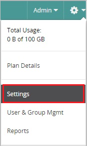
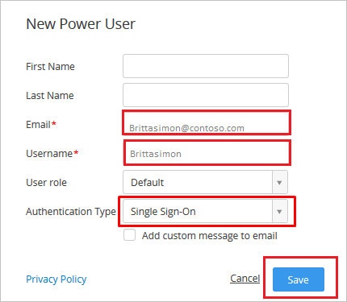

# Tutorial: Azure Active Directory single sign-on (SSO) integration with Egnyte

In this tutorial, you'll learn how to integrate Egnyte with Azure Active Directory (Azure AD). When you integrate Egnyte with Azure AD, you can:

* Control in Azure AD who has access to Egnyte.
* Enable your users to be automatically signed-in to Egnyte with their Azure AD accounts.
* Manage your accounts in one central location - the Azure portal.

To learn more about SaaS app integration with Azure AD, see [What is application access and single sign-on with Azure Active Directory](https://docs.microsoft.com/azure/active-directory/active-directory-appssoaccess-whatis).

## Prerequisites

To get started, you need the following items:

* An Azure AD subscription. If you don't have a subscription, you can get a [free account](https://azure.microsoft.com/free/).
* Egnyte single sign-on (SSO) enabled subscription.

## Scenario description

In this tutorial, you configure and test Azure AD single sign-on in a test environment.

* Egnyte supports **SP** initiated SSO
* Once you configure Egnyte you can enforce Session control, which protect exfiltration and infiltration of your organization’s sensitive data in real-time. Session control extend from Conditional Access. [Learn how to enforce session control with Microsoft Cloud App Security](https://docs.microsoft.com/cloud-app-security/proxy-deployment-aad)

## Adding Egnyte from the gallery

To configure the integration of Egnyte into Azure AD, you need to add Egnyte from the gallery to your list of managed SaaS apps.

1. Sign in to the [Azure portal](https://portal.azure.com) using either a work or school account, or a personal Microsoft account.
1. On the left navigation pane, select the **Azure Active Directory** service.
1. Navigate to **Enterprise Applications** and then select **All Applications**.
1. To add new application, select **New application**.
1. In the **Add from the gallery** section, type **Egnyte** in the search box.
1. Select **Egnyte** from results panel and then add the app. Wait a few seconds while the app is added to your tenant.

## Configure and test Azure AD single sign-on

In this section, you configure and test Azure AD single sign-on with Egnyte based on a test user called **Britta Simon**.
For single sign-on to work, a link relationship between an Azure AD user and the related user in Egnyte needs to be established.

To configure and test Azure AD single sign-on with Egnyte, you need to complete the following building blocks:

To configure and test Azure AD SSO with Egnyte, complete the following building blocks:

1. **[Configure Azure AD SSO](#configure-azure-ad-sso)** - to enable your users to use this feature.
    1. **[Create an Azure AD test user](#create-an-azure-ad-test-user)** - to test Azure AD single sign-on with B.Simon.
    1. **[Assign the Azure AD test user](#assign-the-azure-ad-test-user)** - to enable B.Simon to use Azure AD single sign-on.
1. **[Configure Egnyte SSO](#configure-egnyte-sso)** - to configure the single sign-on settings on application side.
    1. **[Create Egnyte test user](#create-egnyte-test-user)** - to have a counterpart of B.Simon in Egnyte that is linked to the Azure AD representation of user.
1. **[Test SSO](#test-sso)** - to verify whether the configuration works.

### Configure Azure AD SSO

In this section, you enable Azure AD single sign-on in the Azure portal.

To configure Azure AD single sign-on with Egnyte, perform the following steps:

1. In the [Azure portal](https://portal.azure.com/), on the **Egnyte** application integration page, select **Single sign-on**.

    

2. On the **Select a Single sign-on method** dialog, select **SAML/WS-Fed** mode to enable single sign-on.

    

3. On the **Set up Single Sign-On with SAML** page, click **Edit** icon to open **Basic SAML Configuration** dialog.

	

4. On the **Basic SAML Configuration** section, perform the following steps:

    

    In the **Sign-on URL** text box, type a URL using the following pattern:
    `https://<companyname>.egnyte.com`

	> [!NOTE]
	> The value is not real. Update the value with the actual Sign-On URL. Contact [Egnyte Client support team](https://www.egnyte.com/corp/contact_egnyte.html) to get the value. You can also refer to the patterns shown in the **Basic SAML Configuration** section in the Azure portal.

4. On the **Set up Single Sign-On with SAML** page, in the **SAML Signing Certificate** section, click **Download** to download the **Certificate (Base64)** from the given options as per your requirement and save it on your computer.

	

5. On the **Set up Egnyte** section, copy the appropriate URL(s) as per your requirement.

	

	a. Login URL

	b. Azure Ad Identifier

	c. Logout URL

### Create an Azure AD test user 

The objective of this section is to create a test user in the Azure portal called Britta Simon.

1. In the Azure portal, in the left pane, select **Azure Active Directory**, select **Users**, and then select **All users**.

    

2. Select **New user** at the top of the screen.

    

3. In the User properties, perform the following steps.

    

    a. In the **Name** field enter **BrittaSimon**.
  
    b. In the **User name** field type **brittasimon\@yourcompanydomain.extension**  
    For example, BrittaSimon@contoso.com

    c. Select **Show password** check box, and then write down the value that's displayed in the Password box.

    d. Click **Create**.

### Assign the Azure AD test user

In this section, you enable Britta Simon to use Azure single sign-on by granting access to Egnyte.

1. In the Azure portal, select **Enterprise Applications**, select **All applications**, then select **Egnyte**.

	

2. In the applications list, select **Egnyte**.

	

3. In the menu on the left, select **Users and groups**.

    

4. Click the **Add user** button, then select **Users and groups** in the **Add Assignment** dialog.

    

5. In the **Users and groups** dialog select **Britta Simon** in the Users list, then click the **Select** button at the bottom of the screen.

6. If you are expecting any role value in the SAML assertion then in the **Select Role** dialog select the appropriate role for the user from the list, then click the **Select** button at the bottom of the screen.

7. In the **Add Assignment** dialog click the **Assign** button.

## Configure Egnyte SSO

1. In a different web browser window, sign in to your Egnyte company site as an administrator.

2. Click **Settings**.
   
    

3. In the menu, click **Settings**.

    

4. Click the **Configuration** tab, and then click **Security**.

	

5. In the **Single Sign-On Authentication** section, perform the following steps:

	   
	
	a. As **Single sign-on authentication**, select **SAML 2.0**.
   
    b. As **Identity provider**, select **AzureAD**.
   
    c. Paste **Login URL** copied from Azure portal into the **Identity provider login URL** textbox.
   
    d. Paste **Azure AD Identifier** which you have copied from Azure portal into the **Identity provider entity ID** textbox.
      
	e. Open your base-64 encoded certificate in notepad downloaded from Azure portal, copy the content of it into your clipboard, and then paste it to the **Identity provider certificate** textbox.
   
    f. As **Default user mapping**, select **Email address**.
   
    g. As **Use domain-specific issuer value**, select **disabled**.
   
    h. Click **Save**.

### Create Egnyte test user

To enable Azure AD users to sign in to Egnyte, they must be provisioned into Egnyte. In the case of Egnyte, provisioning is a manual task.

**To provision a user accounts, perform the following steps:**

1. Sign in to your **Egnyte** company site as administrator.

2. Go to **Settings \> Users & Groups**.

3. Click **Add New User**, and then select the type of user you want to add.
   
    

4. In the **New Power User** section, perform the following steps:
    
       

	a. In **Email** text box, enter the email of user like **Brittasimon\@contoso.com**.

	b. In **Username** text box, enter the username of user like **Brittasimon**.

	c. Select **Single Sign-On** as **Authentication Type**.
   
	d. Click **Save**.
    
	>[!NOTE]
    >The Azure Active Directory account holder will receive a notification email.
    >

>[!NOTE]
>You can use any other Egnyte user account creation tools or APIs provided by Egnyte to provision Azure AD user accounts.
>

### Test SSO

In this section, you test your Azure AD single sign-on configuration using the Access Panel.

When you click the Egnyte tile in the Access Panel, you should be automatically signed in to the Egnyte for which you set up SSO. For more information about the Access Panel, see [Introduction to the Access Panel](https://docs.microsoft.com/azure/active-directory/active-directory-saas-access-panel-introduction).

## Additional Resources

- [List of Tutorials on How to Integrate SaaS Apps with Azure Active Directory](https://docs.microsoft.com/azure/active-directory/active-directory-saas-tutorial-list)

- [What is application access and single sign-on with Azure Active Directory?](https://docs.microsoft.com/azure/active-directory/active-directory-appssoaccess-whatis)

- [What is Conditional Access in Azure Active Directory?](https://docs.microsoft.com/azure/active-directory/conditional-access/overview)

- [What is session control in Microsoft Cloud App Security?](https://docs.microsoft.com/cloud-app-security/proxy-intro-aad)
