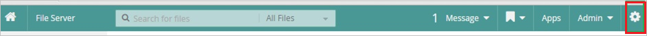
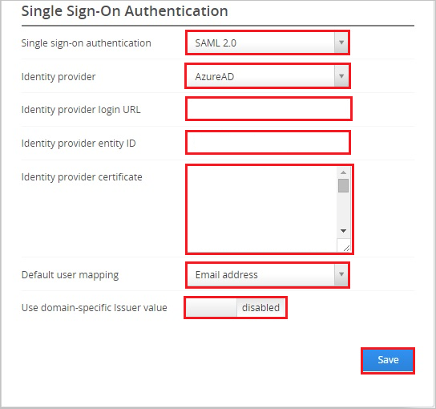
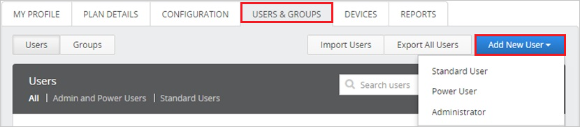

# Tutorial: Azure Active Directory single sign-on (SSO) integration with Egnyte

In this tutorial, you'll learn how to integrate Egnyte with Azure Active Directory (Azure AD). When you integrate Egnyte with Azure AD, you can:

* Control in Azure AD who has access to Egnyte.
* Enable your users to be automatically signed-in to Egnyte with their Azure AD accounts.
* Manage your accounts in one central location - the Azure portal.

## Prerequisites

To get started, you need the following items:

* An Azure AD subscription. If you don't have a subscription, you can get a [free account](https://azure.microsoft.com/free/).
* Egnyte single sign-on (SSO) enabled subscription.

## Scenario description

In this tutorial, you configure and test Azure AD single sign-on in a test environment.

* Egnyte supports **SP** initiated SSO.

> [!NOTE]
> Identifier of this application is a fixed string value so only one instance can be configured in one tenant.

## Add Egnyte from the gallery

To configure the integration of Egnyte into Azure AD, you need to add Egnyte from the gallery to your list of managed SaaS apps.

1. Sign in to the Azure portal using either a work or school account, or a personal Microsoft account.
1. On the left navigation pane, select the **Azure Active Directory** service.
1. Navigate to **Enterprise Applications** and then select **All Applications**.
1. To add new application, select **New application**.
1. In the **Add from the gallery** section, type **Egnyte** in the search box.
1. Select **Egnyte** from results panel and then add the app. Wait a few seconds while the app is added to your tenant.

## Configure and test Azure AD SSO for Egnyte

Configure and test Azure AD SSO with Form.com using a test user called **B.Simon**. For SSO to work, you need to establish a link relationship between an Azure AD user and the related user in Form.com.

To configure and test Azure AD SSO with Form.com, perform the following steps:

1. **[Configure Azure AD SSO](#configure-azure-ad-sso)** - to enable your users to use this feature.
    1. **[Create an Azure AD test user](#create-an-azure-ad-test-user)** - to test Azure AD single sign-on with B.Simon.
    1. **[Assign the Azure AD test user](#assign-the-azure-ad-test-user)** - to enable B.Simon to use Azure AD single sign-on.
1. **[Configure Egnyte SSO](#configure-egnyte-sso)** - to configure the single sign-on settings on application side.
    1. **[Create Egnyte test user](#create-egnyte-test-user)** - to have a counterpart of B.Simon in Egnyte that is linked to the Azure AD representation of user.
1. **[Test SSO](#test-sso)** - to verify whether the configuration works.

## Configure Azure AD SSO

Follow these steps to enable Azure AD SSO in the Azure portal.

1. In the Azure portal, on the **Egnyte** application integration page, find the **Manage** section and select **single sign-on**.
1. On the **Select a single sign-on method** page, select **SAML**.
1. On the **Set up single sign-on with SAML** page, click the pencil icon for **Basic SAML Configuration** to edit the settings.

   

4. On the **Basic SAML Configuration** section, perform the following steps:

    a. In the **Sign-on URL** text box, type a URL using the following pattern:
    `https://<companyname>.egnyte.com`

    b. In the **Reply URL** text box, type a URL using the following pattern:
    `https://<companyname>.egnyte.com/samlconsumer/AzureAD`
	
	> [!NOTE]
	> These values aren't real. Update the value with the actual Sign-On URL and Reply URL. Contact [Egnyte Client support team](https://www.egnyte.com/corp/contact_egnyte.html) to get the value. You can also refer to the patterns shown in the **Basic SAML Configuration** section in the Azure portal.

4. On the **Set up Single Sign-On with SAML** page, in the **SAML Signing Certificate** section, click **Download** to download the **Certificate (Base64)** from the given options as per your requirement and save it on your computer.

	

5. On the **Set up Egnyte** section, copy the appropriate URL(s) as per your requirement.

	

### Create an Azure AD test user 

In this section, you'll create a test user in the Azure portal called B.Simon.

1. From the left pane in the Azure portal, select **Azure Active Directory**, select **Users**, and then select **All users**.
1. Select **New user** at the top of the screen.
1. In the **User** properties, follow these steps:
   1. In the **Name** field, enter `B.Simon`.  
   1. In the **User name** field, enter the username@companydomain.extension. For example, `B.Simon@contoso.com`.
   1. Select the **Show password** check box, and then write down the value that's displayed in the **Password** box.
   1. Click **Create**.

### Assign the Azure AD test user

In this section, you'll enable B.Simon to use Azure single sign-on by granting access to Egnyte.

1. In the Azure portal, select **Enterprise Applications**, and then select **All applications**.
1. In the applications list, select **Egnyte**.
1. In the app's overview page, find the **Manage** section and select **Users and groups**.
1. Select **Add user**, then select **Users and groups** in the **Add Assignment** dialog.
1. In the **Users and groups** dialog, select **B.Simon** from the Users list, then click the **Select** button at the bottom of the screen.
1. If you are expecting a role to be assigned to the users, you can select it from the **Select a role** dropdown. If no role has been set up for this app, you see "Default Access" role selected.
1. In the **Add Assignment** dialog, click the **Assign** button.

## Configure Egnyte SSO

1. In a different web browser window, sign in to your Egnyte company site as an administrator.

2. Click **Settings**.
   
    

3. In the menu, click **Settings**.

    

4. Click the **Configuration** tab, and then click **Security**.

	

5. In the **Single Sign-On Authentication** section, perform the following steps:

	   
	
	a. As **Single sign-on authentication**, select **SAML 2.0**.
   
    b. As **Identity provider**, select **AzureAD**.
   
    c. Paste **Login URL** copied from Azure portal into the **Identity provider login URL** textbox.
   
    d. Paste **Azure AD Identifier** which you have copied from Azure portal into the **Identity provider entity ID** textbox.
      
	e. Open your base-64 encoded certificate in notepad downloaded from Azure portal, copy the content of it into your clipboard, and then paste it to the **Identity provider certificate** textbox.
   
    f. As **Default user mapping**, select **Email address**.
   
    g. As **Use domain-specific issuer value**, select **disabled**.
   
    h. Click **Save**.

### Create Egnyte test user

To enable Azure AD users to sign in to Egnyte, they must be provisioned into Egnyte. In the case of Egnyte, provisioning is a manual task.

**To provision a user accounts, perform the following steps:**

1. Sign in to your **Egnyte** company site as administrator.

2. Go to **Settings \> Users & Groups**.

3. Click **Add New User**, and then select the type of user you want to add.
   
    

4. In the **New Power User** section, perform the following steps:
    
       

	a. In **Email** text box, enter the email of user like **Brittasimon\@contoso.com**.

	b. In **Username** text box, enter the username of user like **Brittasimon**.

	c. Select **Single Sign-On** as **Authentication Type**.
   
	d. Click **Save**.
    
	>[!NOTE]
    >The Azure Active Directory account holder will receive a notification email.
    >

>[!NOTE]
>You can use any other Egnyte user account creation tools or APIs provided by Egnyte to provision Azure AD user accounts.
>

## Test SSO

In this section, you test your Azure AD single sign-on configuration with following options. 

* Click on **Test this application** in Azure portal. This will redirect to Egnyte Sign-on URL where you can initiate the login flow. 

* Go to Egnyte Sign-on URL directly and initiate the login flow from there.

* You can use Microsoft My Apps. When you click the Egnyte tile in the My Apps, this will redirect to Egnyte Sign-on URL. For more information about the My Apps, see [Introduction to the My Apps](https://docs.microsoft.com/azure/active-directory/active-directory-saas-access-panel-introduction).

## Next steps

Once you configure Egnyte you can enforce session control, which protects exfiltration and infiltration of your organization’s sensitive data in real time. Session control extends from Conditional Access. [Learn how to enforce session control with Microsoft Cloud App Security](https://docs.microsoft.com/cloud-app-security/proxy-deployment-any-app).
