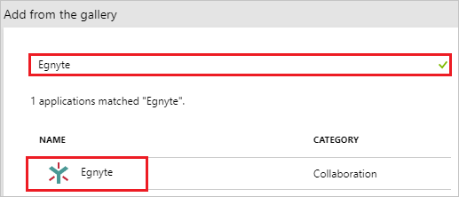
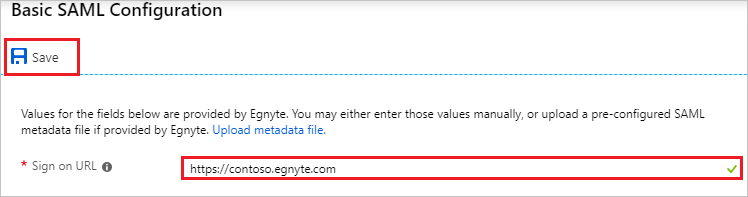
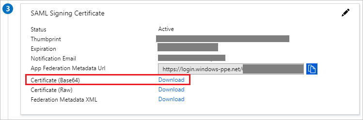
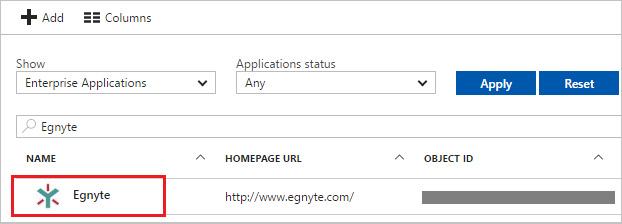

# Tutorial: Azure Active Directory integration with Egnyte

In this tutorial, you learn how to integrate Egnyte with Azure Active Directory (Azure AD).

Integrating Egnyte with Azure AD provides you with the following benefits:

- You can control in Azure AD who has access to Egnyte.
- You can enable your users to automatically get signed-on to Egnyte (Single Sign-On) with their Azure AD accounts.
- You can manage your accounts in one central location - the Azure portal.

If you want to know more details about SaaS app integration with Azure AD, see [what is application access and single sign-on with Azure Active Directory](../manage-apps/what-is-single-sign-on.md)

## Prerequisites

To configure Azure AD integration with Egnyte, you need the following items:

- An Azure AD subscription
- An Egnyte single sign-on enabled subscription

> [!NOTE]
> To test the steps in this tutorial, we do not recommend using a production environment.

To test the steps in this tutorial, you should follow these recommendations:

- Do not use your production environment, unless it is necessary.
- If you don't have an Azure AD trial environment, you can [get a one-month trial](https://azure.microsoft.com/pricing/free-trial/).

## Scenario description

In this tutorial, you test Azure AD single sign-on in a test environment. 
The scenario outlined in this tutorial consists of two main building blocks:

1. Adding Egnyte from the gallery
2. Configuring and testing Azure AD single sign-on

## Adding Egnyte from the gallery

To configure the integration of Egnyte into Azure AD, you need to add Egnyte from the gallery to your list of managed SaaS apps.

**To add Egnyte from the gallery, perform the following steps:**

1. In the **[Azure portal](https://portal.azure.com)**, on the left navigation panel, click **Azure Active Directory** icon. 

	![The Azure Active Directory button][1]

2. Navigate to **Enterprise applications**. Then go to **All applications**.

	![The Enterprise applications blade][2]

3. To add new application, click **New application** button on the top of dialog.

	![The New application button][3]

4. In the search box, type **Egnyte**, select **Egnyte** from result panel then click **Add** button to add the application.

	

## Configure and test Azure AD single sign-on

In this section, you configure and test Azure AD single sign-on with Egnyte based on a test user called "Britta Simon".

For single sign-on to work, Azure AD needs to know what the counterpart user in Egnyte is to a user in Azure AD. In other words, a link relationship between an Azure AD user and the related user in Egnyte needs to be established.

To configure and test Azure AD single sign-on with Egnyte, you need to complete the following building blocks:

1. **[Configuring Azure AD Single Sign-On](#configuring-azure-ad-single-sign-on)** - to enable your users to use this feature.
2. **[Creating an Azure AD test user](#creating-an-azure-ad-test-user)** - to test Azure AD single sign-on with Britta Simon.
3. **[Creating an Egnyte test user](#creating-an-egnyte-test-user)** - to have a counterpart of Britta Simon in Egnyte that is linked to the Azure AD representation of user.
4. **[Assigning the Azure AD test user](#assigning-the-azure-ad-test-user)** - to enable Britta Simon to use Azure AD single sign-on.
5. **[Testing single sign-on](#testing-single-sign-on)** - to verify whether the configuration works.

### Configuring Azure AD single sign-on

In this section, you enable Azure AD single sign-on in the Azure portal and configure single sign-on in your Egnyte application.

**To configure Azure AD single sign-on with Egnyte, perform the following steps:**

1. In the Azure portal, on the **Egnyte** application integration page, click **Single sign-on**.

	![Configure single sign-on link][4]

2. On the **Select a Single sign-on method** dialog, Click **Select** for **SAML** mode to enable single sign-on.

    

3. On the **Set up Single Sign-On with SAML** page, click **Edit** icon to open **Basic SAML Configuration** dialog.

	

4. On the **Basic SAML Configuration** section, perform the following steps:

	

    In the **Sign-on URL** textbox, type a URL using the following pattern: `https://<companyname>.egnyte.com`

	> [!NOTE] 
	> This value is not real. Update this value with the actual Sign-On URL. Contact [Egnyte Client support team](https://www.egnyte.com/corp/contact_egnyte.html) to get this value. 

5. On the **SAML Signing Certificate** page, in the **SAML Signing Certificate** section, click **Download** to download **Certificate (Base64)** and then save certificate file on your computer.

	 

6. On the **Set up Egnyte** section, copy the appropriate URL as per your requirement.

	a. Login URL

	b. Azure AD Identifier

	c. Logout URL

	

7. In a different web browser window, log in to your Egnyte company site as an administrator.

8. Click **Settings**.
   
    

9. In the menu, click **Settings**.

    

10. Click the **Configuration** tab, and then click **Security**.

	

11. In the **Single Sign-On Authentication** section, perform the following steps:

	   
	
	a. As **Single sign-on authentication**, select **SAML 2.0**.
   
    b. As **Identity provider**, select **AzureAD**.
   
    c. Paste **Login URL** copied from Azure portal into the **Identity provider login URL** textbox.
   
    d. Paste **Azure AD Identifier** which you have copied from Azure portal into the **Identity provider entity ID** textbox.
      
	e. Open your base-64 encoded certificate in notepad downloaded from Azure portal, copy the content of it into your clipboard, and then paste it to the **Identity provider certificate** textbox.
   
    f. As **Default user mapping**, select **Email address**.
   
    g. As **Use domain-specific issuer value**, select **disabled**.
   
    h. Click **Save**.

### Creating an Azure AD test user

The objective of this section is to create a test user in the Azure portal called Britta Simon.

1. In the Azure portal, in the left pane, select **Azure Active Directory**, select **Users**, and then select **All users**.

	![Create Azure AD User][100]

2. Select **New user** at the top of the screen.

	 

3. In the User properties, perform the following steps.

	

    a. In the **Name** field, enter **BrittaSimon**.
  
    b. In the **User name** field, type **brittasimon@yourcompanydomain.extension**  
    For example, BrittaSimon@contoso.com

    c. Select **Properties**, select the **Show password** check box, and then write down the value that's displayed in the Password box.

    d. Select **Create**.

### Creating an Egnyte test user

To enable Azure AD users to log in to Egnyte, they must be provisioned into Egnyte. In the case of Egnyte, provisioning is a manual task.

**To provision a user accounts, perform the following steps:**

1. Log in to your **Egnyte** company site as administrator.

2. Go to **Settings \> Users & Groups**.

3. Click **Add New User**, and then select the type of user you want to add.
   
    

4. In the **New Power User** section, perform the following steps:
    
       

	a. In **Email** text box, enter the email of user like **Brittasimon@contoso.com**.

	b. In **Username** text box, enter the username of user like **Brittasimon**.

	c. Select **Single Sign-On** as **Authentication Type**.
   
	d. Click **Save**.
    
	>[!NOTE]
    >The Azure Active Directory account holder will receive a notification email.
    >

>[!NOTE]
>You can use any other Egnyte user account creation tools or APIs provided by Egnyte to provision AAD user accounts.
> 

### Assigning the Azure AD test user

In this section, you enable Britta Simon to use Azure single sign-on by granting access to Egnyte.

1. In the Azure portal, select **Enterprise Applications**, select **All applications**.

	![Assign User][201]

2. In the applications list, select **Egnyte**.

	

3. In the menu on the left, click **Users and groups**.

	![Assign User][202]

4. Click **Add** button. Then select **Users and groups** on **Add Assignment** dialog.

	![Assign User][203]

5. In the **Users and groups** dialog select **Britta Simon** in the Users list, then click the **Select** button at the bottom of the screen.

6. In the **Add Assignment** dialog select the **Assign** button.

### Testing single sign-on

In this section, you test your Azure AD single sign-on configuration using the Access Panel.

When you click the Egnyte tile in the Access Panel, you should get automatically signed-on to your Egnyte application.
For more information about the Access Panel, see [Introduction to the Access Panel](../user-help/active-directory-saas-access-panel-introduction.md).

## Additional resources

* [List of Tutorials on How to Integrate SaaS Apps with Azure Active Directory](tutorial-list.md)
* [What is application access and single sign-on with Azure Active Directory?](../manage-apps/what-is-single-sign-on.md)

<!--Image references-->

[1]: common/tutorial_general_01.png
[2]: common/tutorial_general_02.png
[3]: common/tutorial_general_03.png
[4]: common/tutorial_general_04.png

[100]: common/tutorial_general_100.png

[201]: common/tutorial_general_201.png
[202]: common/tutorial_general_202.png
[203]: common/tutorial_general_203.png
