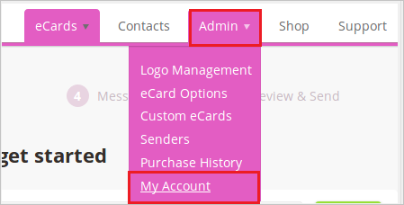
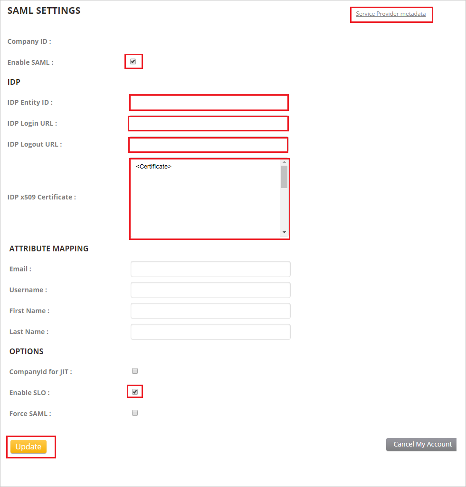

# Tutorial: Microsoft Entra single sign-on (SSO) integration with ekarda

In this tutorial, you'll learn how to integrate ekarda with Microsoft Entra ID. When you integrate ekarda with Microsoft Entra ID, you can:

* Control in Microsoft Entra ID who has access to ekarda.
* Enable your users to be automatically signed in to ekarda by using their Microsoft Entra accounts.
* Manage your accounts in one central location: the Azure portal.

## Prerequisites

To get started, you need the following items:

* A Microsoft Entra subscription. If you don't have a subscription, you can get a [free account](https://azure.microsoft.com/free/).
* An ekarda subscription enabled for single sign-on (SSO).

## Scenario description

In this tutorial, you configure and test Microsoft Entra SSO in a test environment.

* ekarda supports SP-initiated and IDP-initiated SSO.
* ekarda supports just-in-time user provisioning.

## Add ekarda from the gallery

To configure the integration of ekarda into Microsoft Entra ID, add ekarda from the gallery to your list of managed SaaS apps:

1. Sign in to the [Microsoft Entra admin center](https://entra.microsoft.com) as at least a [Cloud Application Administrator](../roles/permissions-reference.md#cloud-application-administrator).
1. Browse to **Identity** > **Applications** > **Enterprise applications** > **New application**.
1. In the **Add from the gallery** section, type **ekarda** in the search box.
1. Select **ekarda** from results panel, and then add the app. Wait a few seconds while the app is added to your tenant.

 Alternatively, you can also use the [Enterprise App Configuration Wizard](https://portal.office.com/AdminPortal/home?Q=Docs#/azureadappintegration). In this wizard, you can add an application to your tenant, add users/groups to the app, assign roles, as well as walk through the SSO configuration as well. [Learn more about Microsoft 365 wizards.](/microsoft-365/admin/misc/azure-ad-setup-guides)

## Configure and test Microsoft Entra SSO for ekarda

Configure and test Microsoft Entra SSO with ekarda by using a test user called **B.Simon**. For SSO to work, you need to establish a linked relationship between a Microsoft Entra user and the related user in ekarda.

To configure and test Microsoft Entra SSO with ekarda, perform the following steps:

1. [Configure Microsoft Entra SSO](#configure-azure-ad-sso) to enable your users to use this feature.

    1. [Create a Microsoft Entra test user](#create-an-azure-ad-test-user) to test Microsoft Entra single sign-on with B.Simon.
    1. [Assign the Microsoft Entra test user](#assign-the-azure-ad-test-user) to enable B.Simon to use Microsoft Entra single sign-on.
1. [Configure ekarda SSO](#configure-ekarda-sso) to configure the single sign-on settings on application side.
    * [Create an ekarda test user](#create-an-ekarda-test-user) to have a counterpart of B.Simon in ekarda that's linked to the Microsoft Entra representation of the user.
1. [Test SSO](#test-sso) to verify whether the configuration works.

## Configure Microsoft Entra SSO

Follow these steps in the Azure portal to enable Microsoft Entra SSO:

1. Sign in to the [Microsoft Entra admin center](https://entra.microsoft.com) as at least a [Cloud Application Administrator](../roles/permissions-reference.md#cloud-application-administrator).
1. Browse to **Identity** > **Applications** > **Enterprise applications** >  **ekarda** > **Single sign-on**.
1. On the **Select a single sign-on method** page, select **SAML**.
1. On the **Set up Single Sign-On with SAML** page, select the pencil icon to edit the **Basic SAML Configuration** settings.

   

1. In the **Basic SAML Configuration** section, if you see **Service Provider metadata file**, follow these steps:
    1. Select **Upload metadata file**.
    1. Select the folder icon to select the metadata file, and then select **Upload**.
    1. When the metadata file is successfully uploaded, the values for **Identifier** and **Reply URL** appear automatically in the ekarda section text box.

    > [!Note]
    > If the **Identifier** and **Reply URL** values don't appear automatically, fill in the values manually according to your requirements.

1. If you don't see **Service Provider metadata file** in the **Basic SAML Configuration** section and you want to configure the application in IDP-initiated mode, enter values for the following fields:

    1. In the **Identifier** text box, type a URL that follows this pattern:
    `https://my.ekarda.com/users/saml_metadata/<COMPANY_ID>`
    1. In the **Reply URL** text box, type a URL that follows this pattern:
    `https://my.ekarda.com/users/saml_acs/<COMPANY_ID>`

1. If you want to configure the application in SP-initiated mode, select **Set additional URLs** and do this:

    In the **Sign-on URL** text box, type a URL that follows this pattern:
    `https://my.ekarda.com/users/saml_sso/<COMPANY_ID>`

    > [!NOTE]
    > The values in the two preceding steps aren't real. Update them with the actual identifier, reply URL, and sign-on URL values. Contact the [ekarda Client support team](mailto:contact@ekarda.com) to get these values. You can also refer to the patterns shown in the **Basic SAML Configuration** section.

1. On the **Set up Single Sign-On with SAML** page, in the **SAML Signing Certificate** section, select **Download** to save **Certificate (Base64)** on your computer.

    

1. In the **Set up ekarda** section, copy the appropriate URLs based on your requirements.

    

### Create a Microsoft Entra test user

In this section, you'll use the Azure portal to create a test user called B.Simon.

1. Sign in to the [Microsoft Entra admin center](https://entra.microsoft.com) as at least a [User Administrator](../roles/permissions-reference.md#user-administrator).
1. Browse to **Identity** > **Users** > **All users**.
1. Select **New user** > **Create new user**, at the top of the screen.
1. In the **User** properties, follow these steps:
   1. In the **Display name** field, enter `B.Simon`.  
   1. In the **User principal name** field, enter the username@companydomain.extension. For example, `B.Simon@contoso.com`.
   1. Select the **Show password** check box, and then write down the value that's displayed in the **Password** box.
   1. Select **Review + create**.
1. Select **Create**.

### Assign the Microsoft Entra test user

In this section, you'll enable B.Simon to use single sign-on by granting access to ekarda.

1. Browse to **Identity** > **Applications** > **Enterprise applications**.
1. In the applications list, select **ekarda**.
1. In the app's overview page, find the **Manage** section and select **Users and groups**.

1. Select **Add user**, and then select **Users and groups** in the **Add Assignment** dialog box.

1. In the **Users and groups** dialog box, select **B.Simon** from the list of users. Then, choose **Select** at the bottom of the screen.
1. If you are expecting a role to be assigned to the users, you can select it from the **Select a role** dropdown. If no role has been set up for this app, you see "Default Access" role selected.
1. In the **Add Assignment** dialog box, select **Assign**.

## Configure ekarda SSO

1. In a different web browser window, sign in to your ekarda company site as an administrator

1. Select **Admin** > **My Account**.

    

1. At the bottom of the page, locate the **SAML SETTINGS** section. This section is where you configure the SAML integration.
1. In the **SAML SETTINGS** section, follow these steps:

    

    1. Select the **Service Provider metadata** link and save it as file in your computer.
    1. Select the **Enable SAML** check box.
    1. In the **IDP Entity ID** text box, paste the **Microsoft Entra Identifier** value that you copied earlier.
    1. In the **IDP Login URL** text box, paste the **Login URL** value that you copied earlier.
    1. In the **IDP Logout URL** text box, paste the **Logout URL** value that you copied earlier.
    1. Use Notepad to open the **Certificate (Base64)** file that you downloaded. Paste that content into the **IDP x509 Certificate** text box.
    1. Select the **Enable SLO** check box in the **OPTIONS** section.
    1. Select **Update**.

### Create an ekarda test user

In this section, a user called B.Simon is created in ekarda. ekarda supports just-in-time user provisioning, which is enabled by default. You have no action to take in this section. If a user named B.Simon doesn't already exist in ekarda, a new one is created after authentication.

## Test SSO

In this section, you test your Microsoft Entra single sign-on configuration with following options.

#### SP initiated:

* Click on **Test this application**, this will redirect to ekarda Sign on URL where you can initiate the login flow.

* Go to ekarda Sign-on URL directly and initiate the login flow from there.

#### IDP initiated:

* Click on **Test this application**, and you should be automatically signed in to the ekarda for which you set up the SSO

You can also use Microsoft My Apps to test the application in any mode. When you click the ekarda tile in the My Apps, if configured in SP mode you would be redirected to the application sign on page for initiating the login flow and if configured in IDP mode, you should be automatically signed in to the ekarda for which you set up the SSO. For more information about the My Apps, see [Introduction to the My Apps](https://support.microsoft.com/account-billing/sign-in-and-start-apps-from-the-my-apps-portal-2f3b1bae-0e5a-4a86-a33e-876fbd2a4510).

## Next steps

After you configure ekarda, you can enforce session control. This precaution protects against exfiltration and infiltration of your organization’s sensitive data in real time. Session control extends from Conditional Access App Control. [Learn how to enforce session control with Microsoft Defender for Cloud Apps](/cloud-app-security/proxy-deployment-any-app).
