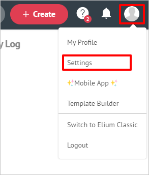

# Tutorial: Azure Active Directory single sign-on (SSO) integration with Elium

In this tutorial, you'll learn how to integrate Elium with Azure Active Directory (Azure AD). When you integrate Elium with Azure AD, you can:

* Control in Azure AD who has access to Elium.
* Enable your users to be automatically signed-in to Elium with their Azure AD accounts.
* Manage your accounts in one central location - the Azure portal.

## Prerequisites

To get started, you need the following items:

* An Azure AD subscription. If you don't have a subscription, you can get a [free account](https://azure.microsoft.com/free/).
* Elium single sign-on (SSO) enabled subscription.

> [!NOTE]
> This integration is also available to use from Azure AD US Government Cloud environment. You can find this application in the Azure AD US Government Cloud Application Gallery and configure it in the same way as you do from public cloud.

## Scenario description

In this tutorial, you configure and test Azure AD SSO in a test environment.

* Elium supports **SP and IDP** initiated SSO
* Elium supports **Just In Time** user provisioning

## Adding Elium from the gallery

To configure the integration of Elium into Azure AD, you need to add Elium from the gallery to your list of managed SaaS apps.

1. Sign in to the Azure portal using either a work or school account, or a personal Microsoft account.
1. On the left navigation pane, select the **Azure Active Directory** service.
1. Navigate to **Enterprise Applications** and then select **All Applications**.
1. To add new application, select **New application**.
1. In the **Add from the gallery** section, type **Elium** in the search box.
1. Select **Elium** from results panel and then add the app. Wait a few seconds while the app is added to your tenant.

## Configure and test Azure AD SSO for Elium

Configure and test Azure AD SSO with Elium using a test user called **B.Simon**. For SSO to work, you need to establish a link relationship between an Azure AD user and the related user in Elium.

To configure and test Azure AD SSO with Elium, complete the following building blocks:

1. **[Configure Azure AD SSO](#configure-azure-ad-sso)** - to enable your users to use this feature.
    * **[Create an Azure AD test user](#create-an-azure-ad-test-user)** - to test Azure AD single sign-on with B.Simon.
    * **[Assign the Azure AD test user](#assign-the-azure-ad-test-user)** - to enable B.Simon to use Azure AD single sign-on.
1. **[Configure Elium SSO](#configure-elium-sso)** - to configure the single sign-on settings on application side.
    * **[Create Elium test user](#create-elium-test-user)** - to have a counterpart of B.Simon in Elium that is linked to the Azure AD representation of user.
1. **[Test SSO](#test-sso)** - to verify whether the configuration works.

## Configure Azure AD SSO

Follow these steps to enable Azure AD SSO in the Azure portal.

1. In the Azure portal, on the **Elium** application integration page, find the **Manage** section and select **single sign-on**.
1. On the **Select a single sign-on method** page, select **SAML**.
1. On the **Set up single sign-on with SAML** page, click the edit/pen icon for **Basic SAML Configuration** to edit the settings.

   

1. On the **Basic SAML Configuration** section, if you wish to configure the application in **IDP** initiated mode, enter the values for the following fields:

    a. In the **Identifier** text box, type a URL using the following pattern:
    `https://<platform-domain>.elium.com/login/saml2/metadata`

    b. In the **Reply URL** text box, type a URL using the following pattern:
    `https://<platform-domain>.elium.com/login/saml2/acs`

1. Click **Set additional URLs** and perform the following step if you wish to configure the application in **SP** initiated mode:

    In the **Sign-on URL** text box, type a URL using the following pattern:
    `https://<platform-domain>.elium.com/login/saml2/login`

	> [!NOTE]
	> These values are not real. You will get these values from the **SP metadata file** downloadable at `https://<platform-domain>.elium.com/login/saml2/metadata`, which is explained later in this tutorial.

1. Elium application expects the SAML assertions in a specific format, which requires you to add custom attribute mappings to your SAML token attributes configuration. The following screenshot shows the list of default attributes.

	

1. In addition to above, Elium application expects few more attributes to be passed back in SAML response which are shown below. These attributes are also pre populated but you can review them as per your requirements.

	| Name | Source Attribute|
	| ---------------| ----------------|
	| email   |user.mail |
	| first_name| user.givenname |
	| last_name| user.surname|
	| job_title| user.jobtitle|
	| company| user.companyname|

	> [!NOTE]
	> These are the default claims. **Only email claim is required**. For JIT provisioning also only email claim is mandatory. Other custom claims can vary from one customer platform to another customer platform.

1. On the **Set up single sign-on with SAML** page, in the **SAML Signing Certificate** section,  find **Federation Metadata XML** and select **Download** to download the certificate and save it on your computer.

	

1. On the **Set up Elium** section, copy the appropriate URL(s) based on your requirement.

	

### Create an Azure AD test user

In this section, you'll create a test user in the Azure portal called B.Simon.

1. From the left pane in the Azure portal, select **Azure Active Directory**, select **Users**, and then select **All users**.
1. Select **New user** at the top of the screen.
1. In the **User** properties, follow these steps:
   1. In the **Name** field, enter `B.Simon`.  
   1. In the **User name** field, enter the username@companydomain.extension. For example, `B.Simon@contoso.com`.
   1. Select the **Show password** check box, and then write down the value that's displayed in the **Password** box.
   1. Click **Create**.

### Assign the Azure AD test user

In this section, you'll enable B.Simon to use Azure single sign-on by granting access to Elium.

1. In the Azure portal, select **Enterprise Applications**, and then select **All applications**.
1. In the applications list, select **Elium**.
1. In the app's overview page, find the **Manage** section and select **Users and groups**.
1. Select **Add user**, then select **Users and groups** in the **Add Assignment** dialog.
1. In the **Users and groups** dialog, select **B.Simon** from the Users list, then click the **Select** button at the bottom of the screen.
1. If you are expecting a role to be assigned to the users, you can select it from the **Select a role** dropdown. If no role has been set up for this app, you see "Default Access" role selected.
1. In the **Add Assignment** dialog, click the **Assign** button.

## Configure Elium SSO

1. To automate the configuration within Elium, you need to install **My Apps Secure Sign-in browser extension** by clicking **Install the extension**.

	

1. After adding extension to the browser, click on **Set up Elium** will direct you to the Elium application. From there, provide the admin credentials to sign into Elium. The browser extension will automatically configure the application for you and automate steps 3-6.

	

1. If you want to setup Elium manually, open a new web browser window and sign into your Elium company site as an administrator and perform the following steps:

1. Click on the **User profile** from right top corner and then select **Settings**.

	

1. Select **Security** under **Advanced**.

	

1. Scroll down to the **Single sign-on (SSO)** section and perform the following steps:

	

	a. Copy the value of **Verify that SAML2 authentication works for your account** and paste it in the **Sign-on URL** textbox on the **Basic SAML Configuration** section in the Azure portal.

	> [!NOTE]
	> After configuring SSO, you can always access the default remote login page at the following URL: `https://<platform_domain>/login/regular/login` 

	b. Select **Enable SAML2 federation** checkbox.

	c. Select **JIT Provisioning** checkbox.

	d. Open the **SP Metadata** by clicking on the **Download** button.

	e. Search for the **entityID** in the **SP Metadata** file, copy the **entityID** value and paste it in the **Identifier** textbox on the **Basic SAML Configuration** section in the Azure portal. 

	

	f. Search for the **AssertionConsumerService** in the **SP Metadata** file, copy the **Location** value and paste it in the **Reply URL** textbox on the **Basic SAML Configuration** section in the Azure portal.

	

	g. Open the downloaded metadata file from Azure portal into notepad, copy the content and paste it into the **IdP Metadata** textbox.

	h. Click **Save**.

### Create Elium test user

In this section, a user called B.Simon is created in Elium. Elium supports **just-in-time provisioning**, which is enabled by default. There is no action item for you in this section. If a user doesn't already exist in Elium, a new one is created when you attempt to access Elium.

> [!Note]
> If you need to create a user manually, contact [Elium support team](mailto:support@elium.com).

## Test SSO 

In this section, you test your Azure AD single sign-on configuration with following options. 
 
#### SP initiated:
 
* Click on **Test this application** in Azure portal. This will redirect to Elium Sign on URL where you can initiate the login flow.  
 
* Go to Elium Sign-on URL directly and initiate the login flow from there.
 
#### IDP initiated:
 
* Click on **Test this application** in Azure portal and you should be automatically signed in to the Elium for which you set up the SSO 
 
You can also use Microsoft Access Panel to test the application in any mode. When you click the Elium tile in the Access Panel, if configured in SP mode you would be redirected to the application sign on page for initiating the login flow and if configured in IDP mode, you should be automatically signed in to the Elium for which you set up the SSO. For more information about the Access Panel, see [Introduction to the Access Panel](https://docs.microsoft.com/azure/active-directory/active-directory-saas-access-panel-introduction).

## Next Steps

Once you configure Elium you can enforce session control, which protects exfiltration and infiltration of your organization’s sensitive data in real time. Session control extends from Conditional Access. [Learn how to enforce session control with Microsoft Cloud App Security](https://docs.microsoft.com/cloud-app-security/proxy-deployment-any-app).
