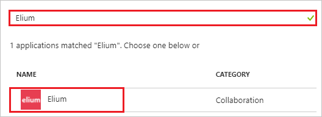
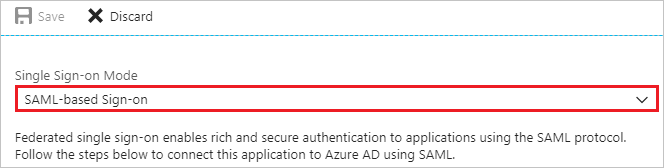
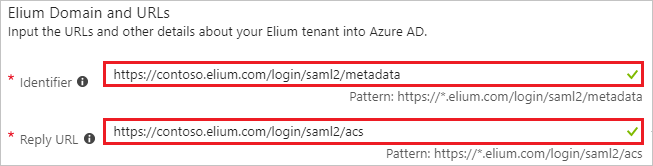
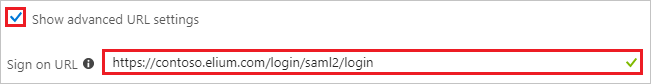
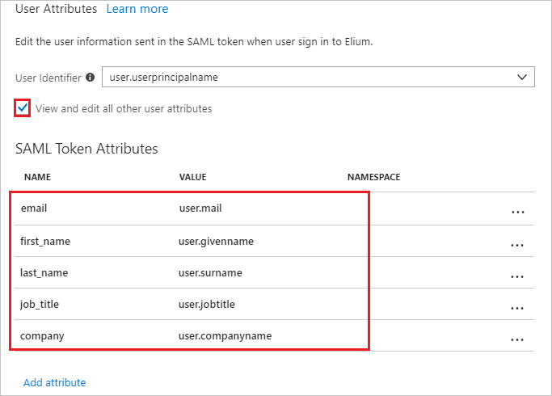

---
title: 'Tutorial: Azure Active Directory integration with Elium | Microsoft Docs'
description: Learn how to configure single sign-on between Azure Active Directory and Elium.
services: active-directory
documentationCenter: na
author: jeevansd
manager: femila
ms.reviewer: joflore

ms.assetid: fae344b3-5bd9-40e2-9a1d-448dcd58155f
ms.service: active-directory
ms.component: saas-app-tutorial
ms.workload: identity
ms.tgt_pltfrm: na
ms.devlang: na
ms.topic: article
ms.date: 04/05/2018
ms.author: jeedes

---
# Tutorial: Azure Active Directory integration with Elium

In this tutorial, you learn how to integrate Elium with Azure Active Directory (Azure AD).

Integrating Elium with Azure AD provides you with the following benefits:

- You can control in Azure AD who has access to Elium.
- You can enable your users to automatically get signed-on to Elium (Single Sign-On) with their Azure AD accounts.
- You can manage your accounts in one central location - the Azure portal.

If you want to know more details about SaaS app integration with Azure AD, see [what is application access and single sign-on with Azure Active Directory](../manage-apps/what-is-single-sign-on.md).

## Prerequisites

To configure Azure AD integration with Elium, you need the following items:

- An Azure AD subscription
- An Elium single sign-on enabled subscription

> [!NOTE]
> To test the steps in this tutorial, we do not recommend using a production environment.

To test the steps in this tutorial, you should follow these recommendations:

- Do not use your production environment, unless it is necessary.
- If you don't have an Azure AD trial environment, you can [get a one-month trial](https://azure.microsoft.com/pricing/free-trial/).

## Scenario description
In this tutorial, you test Azure AD single sign-on in a test environment. 
The scenario outlined in this tutorial consists of two main building blocks:

1. Adding Elium from the gallery
1. Configuring and testing Azure AD single sign-on

## Adding Elium from the gallery
To configure the integration of Elium into Azure AD, you need to add Elium from the gallery to your list of managed SaaS apps.

**To add Elium from the gallery, perform the following steps:**

1. In the **[Azure portal](https://portal.azure.com)**, on the left navigation panel, click **Azure Active Directory** icon. 

	![The Azure Active Directory button][1]

1. Navigate to **Enterprise applications**. Then go to **All applications**.

	![The Enterprise applications blade][2]
	
1. To add new application, click **New application** button on the top of dialog.

	![The New application button][3]

1. In the search box, type **Elium**, select **Elium** from result panel then click **Add** button to add the application.

	

## Configure and test Azure AD single sign-on

In this section, you configure and test Azure AD single sign-on with Elium based on a test user called "Britta Simon".

For single sign-on to work, Azure AD needs to know what the counterpart user in Elium is to a user in Azure AD. In other words, a link relationship between an Azure AD user and the related user in Elium needs to be established.

To configure and test Azure AD single sign-on with Elium, you need to complete the following building blocks:

1. **[Configure Azure AD Single Sign-On](#configure-azure-ad-single-sign-on)** - to enable your users to use this feature.
1. **[Create an Azure AD test user](#create-an-azure-ad-test-user)** - to test Azure AD single sign-on with Britta Simon.
1. **[Create an Elium test user](#create-an-elium-test-user)** - to have a counterpart of Britta Simon in Elium that is linked to the Azure AD representation of user.
1. **[Assign the Azure AD test user](#assign-the-azure-ad-test-user)** - to enable Britta Simon to use Azure AD single sign-on.
1. **[Test single sign-on](#test-single-sign-on)** - to verify whether the configuration works.

### Configure Azure AD single sign-on

In this section, you enable Azure AD single sign-on in the Azure portal and configure single sign-on in your Elium application.

**To configure Azure AD single sign-on with Elium, perform the following steps:**

1. In the Azure portal, on the **Elium** application integration page, click **Single sign-on**.

	![Configure single sign-on link][4]

1. On the **Single sign-on** dialog, select **Mode** as	**SAML-based Sign-on** to enable single sign-on.
 
	

1. On the **Elium Domain and URLs** section, perform the following steps if you wish to configure the application in **IDP** initiated mode:

	

    a. In the **Identifier** textbox, type a URL using the following pattern: `https://<platform-domain>.elium.com/login/saml2/metadata`

	b. In the **Reply URL** textbox, type a URL using the following pattern: `https://<platform-domain>.elium.com/login/saml2/acs`

1. Check **Show advanced URL settings** and perform the following step if you wish to configure the application in **SP** initiated mode:

	

    In the **Sign-on URL** textbox, type a URL using the following pattern: ` https://<platform-domain>.elium.com/login/saml2/login`
	 
	> [!NOTE] 
	> These values are not real. You will get these values from the **SP metadata file** downloadable at `https://<platform-domain>.elium.com/login/saml2/metadata`, which is explained later in this tutorial.

1. The Elium application expects the SAML assertions in a specific format, which requires you to add custom attribute mappings to your SAML token attributes configuration. Configure the following claims for this application. You can manage the values of these attributes from the "**User Attributes**" section on application integration page.

	

1. In the **User Attributes** section on the **Single sign-on** dialog, configure SAML token attribute as shown in the preceding image and perform the following steps:
      	   
	| Attribute Name | Attribute Value |   
    | ---------------| ----------------|
	| email   |user.mail |
	| first_name| user.givenname |
	| last_name| user.surname|
	| job_title| user.jobtitle|
	| company| user.companyname|
	
	> [!NOTE]
	> These are the default claims. **Only email claim is required**. For JIT provisioning also only email claim is mandatory. Other custom claims can vary from one customer platform to another customer platform.

	a. Click **Add attribute** to open the **Add Attribute** dialog.

	

	b. In the **Name** textbox, type the attribute name shown for that row.

	

	c. From the **Value** list, type the attribute value shown for that row.

	d. Leave namespace as blank.
	
	e. Click **Ok**. 

1. On the **SAML Signing Certificate** section, click **Metadata XML** and then save the metadata file on your computer.

	 

1. Click **Save** button.

	
	
1. In a different web browser window, log in to your Elium company site as an administrator.

1. Click on the **User profile** from right top corner and then select **Administration**.

	

1. Select **Security** tab.

	

1. Scroll down to the **Single sign-on (SSO)** section and perform the following steps:

	

	a. Copy the value of **Verify that SAML2 authentication works for your account** and paste it in the **Sign-on URL** textbox on the **Elium Domain and URLs** section in the Azure portal.

	> [!NOTE]
	> After configuring SSO, you can always access the default remote login page at the following URL: `https://<platform_domain>/login/regular/login` 

	b. Select **Enable SAML2 federation** checkbox.

	c. Select **JIT Provisioning** checkbox.

	d. Open the **SP Metadata** by clicking on the **Download** button.

	e. Search for the **entityID** in the **SP Metadata** file, copy the **entityID** value and paste it in the **Identifier** textbox on the **Elium Domain and URLs** section in the Azure portal. 

	

	f. Search for the **AssertionConsumerService** in the **SP Metadata** file, copy the **Location** value and paste it in the **Reply URL** textbox on the **Elium Domain and URLs** section in the Azure portal.

	

	g. Open the downloaded metadata file from Azure portal into notepad, copy the content and paste it into the **IdP Metadata** textbox.

	h. Click **Save**.

### Create an Azure AD test user

The objective of this section is to create a test user in the Azure portal called Britta Simon.

   ![Create an Azure AD test user][100]

**To create a test user in Azure AD, perform the following steps:**

1. In the Azure portal, in the left pane, click the **Azure Active Directory** button.

    

1. To display the list of users, go to **Users and groups**, and then click **All users**.

    

1. To open the **User** dialog box, click **Add** at the top of the **All Users** dialog box.

    

1. In the **User** dialog box, perform the following steps:

    

    a. In the **Name** box, type **BrittaSimon**.

    b. In the **User name** box, type the email address of user Britta Simon.

    c. Select the **Show Password** check box, and then write down the value that's displayed in the **Password** box.

    d. Click **Create**.
 
### Create an Elium test user

The objective of this section is to create a user called Britta Simon in Elium. Elium supports just-in-time provisioning, which is by default enabled. There is no action item for you in this section. A new user is created during an attempt to access Elium if it doesn't exist yet.
>[!Note]
>If you need to create a user manually, contact [Elium support team](mailto:support@elium.com).

### Assign the Azure AD test user

In this section, you enable Britta Simon to use Azure single sign-on by granting access to Elium.

![Assign the user role][200] 

**To assign Britta Simon to Elium, perform the following steps:**

1. In the Azure portal, open the applications view, and then navigate to the directory view and go to **Enterprise applications** then click **All applications**.

	![Assign User][201] 

1. In the applications list, select **Elium**.

	  

1. In the menu on the left, click **Users and groups**.

	![The "Users and groups" link][202]

1. Click **Add** button. Then select **Users and groups** on **Add Assignment** dialog.

	![The Add Assignment pane][203]

1. On **Users and groups** dialog, select **Britta Simon** in the Users list.

1. Click **Select** button on **Users and groups** dialog.

1. Click **Assign** button on **Add Assignment** dialog.
	
### Test single sign-on

In this section, you test your Azure AD single sign-on configuration using the Access Panel.

When you click the Elium tile in the Access Panel, you should get automatically signed-on to your Elium application.
For more information about the Access Panel, see [Introduction to the Access Panel](../user-help/active-directory-saas-access-panel-introduction.md). 

## Additional resources

* [List of Tutorials on How to Integrate SaaS Apps with Azure Active Directory](tutorial-list.md)
* [What is application access and single sign-on with Azure Active Directory?](../manage-apps/what-is-single-sign-on.md)

<!--Image references-->

[1]: ./media/elium-tutorial/tutorial_general_01.png
[2]: ./media/elium-tutorial/tutorial_general_02.png
[3]: ./media/elium-tutorial/tutorial_general_03.png
[4]: ./media/elium-tutorial/tutorial_general_04.png

[100]: ./media/elium-tutorial/tutorial_general_100.png

[200]: ./media/elium-tutorial/tutorial_general_200.png
[201]: ./media/elium-tutorial/tutorial_general_201.png
[202]: ./media/elium-tutorial/tutorial_general_202.png
[203]: ./media/elium-tutorial/tutorial_general_203.png

