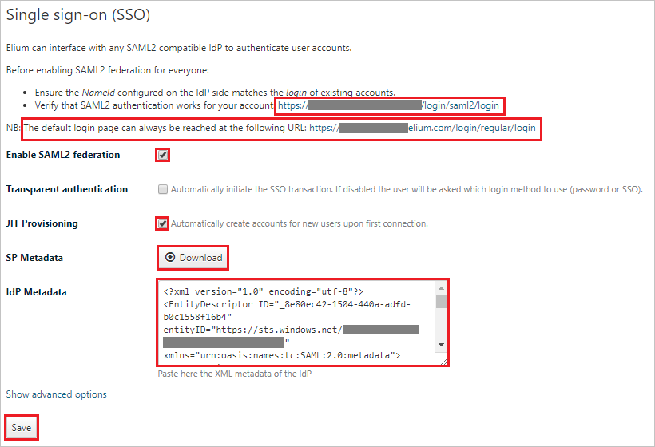

# Tutorial: Azure Active Directory integration with Elium

In this tutorial, you learn how to integrate Elium with Azure Active Directory (Azure AD).
Integrating Elium with Azure AD provides you with the following benefits:

* You can control in Azure AD who has access to Elium.
* You can enable your users to be automatically signed-in to Elium (Single Sign-On) with their Azure AD accounts.
* You can manage your accounts in one central location - the Azure portal.

If you want to know more details about SaaS app integration with Azure AD, see [What is application access and single sign-on with Azure Active Directory](https://docs.microsoft.com/azure/active-directory/active-directory-appssoaccess-whatis).
If you don't have an Azure subscription, [create a free account](https://azure.microsoft.com/free/) before you begin.

## Prerequisites

To configure Azure AD integration with Elium, you need the following items:

* An Azure AD subscription. If you don't have an Azure AD environment, you can get one-month trial [here](https://azure.microsoft.com/pricing/free-trial/)
* Elium single sign-on enabled subscription

## Scenario description

In this tutorial, you configure and test Azure AD single sign-on in a test environment.

* Elium supports **SP** and **IDP** initiated SSO

* Elium supports **Just In Time** user provisioning

## Adding Elium from the gallery

To configure the integration of Elium into Azure AD, you need to add Elium from the gallery to your list of managed SaaS apps.

**To add Elium from the gallery, perform the following steps:**

1. In the **[Azure portal](https://portal.azure.com)**, on the left navigation panel, click **Azure Active Directory** icon.

	

2. Navigate to **Enterprise Applications** and then select the **All Applications** option.

	

3. To add new application, click **New application** button on the top of dialog.

	

4. In the search box, type **Elium**, select **Elium** from result panel then click **Add** button to add the application.

	 

## Configure and test Azure AD single sign-on

In this section, you configure and test Azure AD single sign-on with Elium based on a test user called **Britta Simon**.
For single sign-on to work, a link relationship between an Azure AD user and the related user in Elium needs to be established.

To configure and test Azure AD single sign-on with Elium, you need to complete the following building blocks:

1. **[Configure Azure AD Single Sign-On](#configure-azure-ad-single-sign-on)** - to enable your users to use this feature.
2. **[Configure Elium Single Sign-On](#configure-elium-single-sign-on)** - to configure the Single Sign-On settings on application side.
3. **[Create an Azure AD test user](#create-an-azure-ad-test-user)** - to test Azure AD single sign-on with Britta Simon.
4. **[Assign the Azure AD test user](#assign-the-azure-ad-test-user)** - to enable Britta Simon to use Azure AD single sign-on.
5. **[Create Elium test user](#create-elium-test-user)** - to have a counterpart of Britta Simon in Elium that is linked to the Azure AD representation of user.
6. **[Test single sign-on](#test-single-sign-on)** - to verify whether the configuration works.

### Configure Azure AD single sign-on

In this section, you enable Azure AD single sign-on in the Azure portal.

To configure Azure AD single sign-on with Elium, perform the following steps:

1. In the [Azure portal](https://portal.azure.com/), on the **Elium** application integration page, select **Single sign-on**.

    

2. On the **Select a Single sign-on method** dialog, select **SAML/WS-Fed** mode to enable single sign-on.

    

3. On the **Set-up Single Sign-On with SAML** page, click **Edit** icon to open **Basic SAML Configuration** dialog.

	

4. On the **Basic SAML Configuration** section, If you wish to configure the application in **IDP** initiated mode, perform the following steps:

    

    a. In the **Identifier** text box, type a URL using the following pattern:
    `https://<platform-domain>.elium.com/login/saml2/metadata`

    b. In the **Reply URL** text box, type a URL using the following pattern:
    `https://<platform-domain>.elium.com/login/saml2/acs`

5. Click **Set additional URLs** and perform the following step if you wish to configure the application in **SP** initiated mode:

    

    In the **Sign-on URL** text box, type a URL using the following pattern:
    `https://<platform-domain>.elium.com/login/saml2/login`

	> [!NOTE] 
	> These values are not real. You will get these values from the **SP metadata file** downloadable at `https://<platform-domain>.elium.com/login/saml2/metadata`, which is explained later in this tutorial.

6. Elium application expects the SAML assertions in a specific format. Configure the following claims for this application. You can manage the values of these attributes from the **User Attributes** section on application integration page. On the **Set up Single Sign-On with SAML** page, click **Edit** button to open **User Attributes** dialog.

	

7. In the **User Claims** section on the **User Attributes** dialog, edit the claims by using **Edit icon** or add the claims by using **Add new claim** to configure SAML token attribute as shown in the image above and perform the following steps: 

	| Name | Source Attribute|
	| ---------------| ----------------|
	| email   |user.mail |
	| first_name| user.givenname |
	| last_name| user.surname|
	| job_title| user.jobtitle|
	| company| user.companyname|

	> [!NOTE]
	> These are the default claims. **Only email claim is required**. For JIT provisioning also only email claim is mandatory. Other custom claims can vary from one customer platform to another customer platform.

	a. Click **Add new claim** to open the **Manage user claims** dialog.

	

	

	b. In the **Name** textbox, type the attribute name shown for that row.

	c. Leave the **Namespace** blank.

	d. Select Source as **Attribute**.

	e. From the **Source attribute** list, type the attribute value shown for that row.

	f. Click **Ok**

	g. Click **Save**.

8. On the **Set-up Single Sign-On with SAML** page, in the **SAML Signing Certificate** section, click **Download** to download the **Federation Metadata XML** from the given options as per your requirement and save it on your computer.

	

9. On the **Set up Elium** section, copy the appropriate URL(s) as per your requirement.

	

	a. Login URL

	b. Azure Ad Identifier

	c. Logout URL

### Configure Elium Single Sign-On

1. In a different web browser window, sign in to your Elium company site as an administrator.

2. Click on the **User profile** from right top corner and then select **Administration**.

	

3. Select **Security** tab.

	

4. Scroll down to the **Single sign-on (SSO)** section and perform the following steps:

	

	a. Copy the value of **Verify that SAML2 authentication works for your account** and paste it in the **Sign-on URL** textbox on the **Basic SAML Configuration** section in the Azure portal.

	> [!NOTE]
	> After configuring SSO, you can always access the default remote login page at the following URL: `https://<platform_domain>/login/regular/login` 

	b. Select **Enable SAML2 federation** checkbox.

	c. Select **JIT Provisioning** checkbox.

	d. Open the **SP Metadata** by clicking on the **Download** button.

	e. Search for the **entityID** in the **SP Metadata** file, copy the **entityID** value and paste it in the **Identifier** textbox on the **Basic SAML Configuration** section in the Azure portal. 

	

	f. Search for the **AssertionConsumerService** in the **SP Metadata** file, copy the **Location** value and paste it in the **Reply URL** textbox on the **Basic SAML Configuration** section in the Azure portal.

	

	g. Open the downloaded metadata file from Azure portal into notepad, copy the content and paste it into the **IdP Metadata** textbox.

	h. Click **Save**.

### Create an Azure AD test user 

The objective of this section is to create a test user in the Azure portal called Britta Simon.

1. In the Azure portal, in the left pane, select **Azure Active Directory**, select **Users**, and then select **All users**.

    

2. Select **New user** at the top of the screen.

    

3. In the User properties, perform the following steps.

    

    a. In the **Name** field, enter **BrittaSimon**.
  
    b. In the **User name** field, type **brittasimon\@yourcompanydomain.extension**  
    For example, BrittaSimon@contoso.com

    c. Select **Show password** check box, and then write down the value that's displayed in the Password box.

    d. Click **Create**.

### Assign the Azure AD test user

In this section, you enable Britta Simon to use Azure single sign-on by granting access to Elium.

1. In the Azure portal, select **Enterprise Applications**, select **All applications**, then select **Elium**.

	

2. In the applications list, select **Elium**.

	

3. In the menu on the left, select **Users and groups**.

    

4. Click the **Add user** button, then select **Users and groups** in the **Add Assignment** dialog.

    

5. In the **Users and groups** dialog, select **Britta Simon** in the Users list, then click the **Select** button at the bottom of the screen.

6. If you are expecting any role value in the SAML assertion then in the **Select Role** dialog, select the appropriate role for the user from the list, then click the **Select** button at the bottom of the screen.

7. In the **Add Assignment** dialog, click the **Assign** button.

### Create Elium test user

In this section, a user called Britta Simon is created in Elium. Elium supports **just-in-time provisioning**, which is enabled by default. There is no action item for you in this section. If a user doesn't already exist in Elium, a new one is created when you attempt to access Elium.

>[!Note]
>If you need to create a user manually, contact [Elium support team](mailto:support@elium.com).

### Test single sign-on 

In this section, you test your Azure AD single sign-on configuration using the Access Panel.

When you click the Elium tile in the Access Panel, you should be automatically signed in to the Elium for which you set up SSO. For more information about the Access Panel, see [Introduction to the Access Panel](https://docs.microsoft.com/azure/active-directory/active-directory-saas-access-panel-introduction).

## Additional Resources

- [List of Tutorials on How to Integrate SaaS Apps with Azure Active Directory](https://docs.microsoft.com/azure/active-directory/active-directory-saas-tutorial-list)

- [What is application access and single sign-on with Azure Active Directory?](https://docs.microsoft.com/azure/active-directory/active-directory-appssoaccess-whatis)

- [What is Conditional Access in Azure Active Directory?](https://docs.microsoft.com/azure/active-directory/conditional-access/overview)

