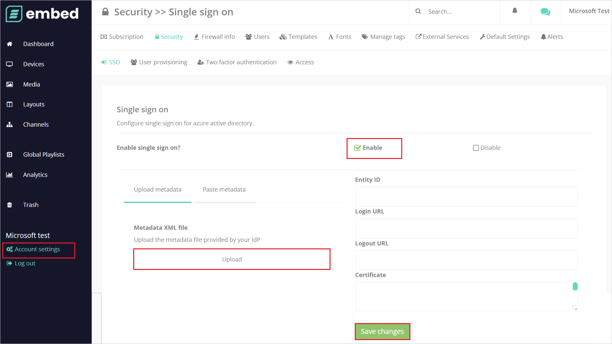
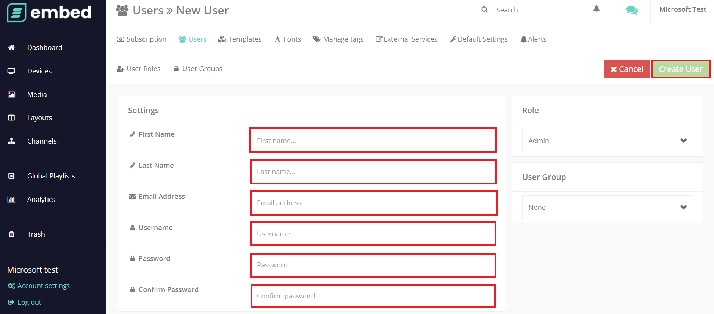

# Tutorial: Azure AD SSO integration with embed signage

In this tutorial, you'll learn how to integrate embed signage with Azure Active Directory (Azure AD). When you integrate embed signage with Azure AD, you can:

* Control in Azure AD who has access to embed signage.
* Enable your users to be automatically signed-in to embed signage with their Azure AD accounts.
* Manage your accounts in one central location - the Azure portal.

## Prerequisites

To get started, you need the following items:

* An Azure AD subscription. If you don't have a subscription, you can get a [free account](https://azure.microsoft.com/free/).
* embed signage single sign-on (SSO) enabled subscription.

## Scenario description

In this tutorial, you configure and test Azure AD SSO in a test environment.

* embed signage supports **IDP** initiated SSO.

## Add embed signage from the gallery

To configure the integration of embed signage into Azure AD, you need to add embed signage from the gallery to your list of managed SaaS apps.

1. Sign in to the Azure portal using either a work or school account, or a personal Microsoft account.
1. On the left navigation pane, select the **Azure Active Directory** service.
1. Navigate to **Enterprise Applications** and then select **All Applications**.
1. To add new application, select **New application**.
1. In the **Add from the gallery** section, type **embed signage** in the search box.
1. Select **embed signage** from results panel and then add the app. Wait a few seconds while the app is added to your tenant.

 Alternatively, you can also use the [Enterprise App Configuration Wizard](https://portal.office.com/AdminPortal/home?Q=Docs#/azureadappintegration). In this wizard, you can add an application to your tenant, add users/groups to the app, assign roles, as well as walk through the SSO configuration as well. [Learn more about Microsoft 365 wizards.](/microsoft-365/admin/misc/azure-ad-setup-guides)

## Configure and test Azure AD SSO for embed signage

Configure and test Azure AD SSO with embed signage using a test user called **B.Simon**. For SSO to work, you need to establish a link relationship between an Azure AD user and the related user in embed signage.

To configure and test Azure AD SSO with embed signage, perform the following steps:

1. **[Configure Azure AD SSO](#configure-azure-ad-sso)** - to enable your users to use this feature.
    1. **[Create an Azure AD test user](#create-an-azure-ad-test-user)** - to test Azure AD single sign-on with B.Simon.
    1. **[Assign the Azure AD test user](#assign-the-azure-ad-test-user)** - to enable B.Simon to use Azure AD single sign-on.
1. **[Configure embed signage SSO](#configure-embed-signage-sso)** - to configure the single sign-on settings on application side.
    1. **[Create embed signage test user](#create-embed-signage-test-user)** - to have a counterpart of B.Simon in embed signage that is linked to the Azure AD representation of user.
1. **[Test SSO](#test-sso)** - to verify whether the configuration works.

## Configure Azure AD SSO

Follow these steps to enable Azure AD SSO in the Azure portal.

1. In the Azure portal, on the **embed signage** application integration page, find the **Manage** section and select **single sign-on**.
1. On the **Select a single sign-on method** page, select **SAML**.
1. On the **Set up single sign-on with SAML** page, click the pencil icon for **Basic SAML Configuration** to edit the settings.

   

1. On the **Basic SAML Configuration** page, perform the following steps:

    a. In the **Identifier** text box, type a URL using the following pattern:
    `https://app.embedsignage.com/auth/saml/<ID>`

    b. In the **Reply URL** text box, type a URL using the following pattern:
    `https://app.embedsignage.com/auth/saml/login/<ID>`

	> [!NOTE]
	> These values are not real. Update these values with the actual Identifier and Reply URL. Contact [embed signage Client support team](mailto:support@embedsignage.com) to get these values. You can also refer to the patterns shown in the **Basic SAML Configuration** section in the Azure portal.

1. On the **Set up single sign-on with SAML** page, in the **SAML Signing Certificate** section,  find **Federation Metadata XML** and select **Download** to download the certificate and save it on your computer.

	

1. On the **Set up embed signage** section, copy the appropriate URL(s) based on your requirement.

	

### Create an Azure AD test user

In this section, you'll create a test user in the Azure portal called B.Simon.

1. From the left pane in the Azure portal, select **Azure Active Directory**, select **Users**, and then select **All users**.
1. Select **New user** at the top of the screen.
1. In the **User** properties, follow these steps:
   1. In the **Name** field, enter `B.Simon`.  
   1. In the **User name** field, enter the username@companydomain.extension. For example, `B.Simon@contoso.com`.
   1. Select the **Show password** check box, and then write down the value that's displayed in the **Password** box.
   1. Click **Create**.

### Assign the Azure AD test user

In this section, you'll enable B.Simon to use Azure single sign-on by granting access to embed signage.

1. In the Azure portal, select **Enterprise Applications**, and then select **All applications**.
1. In the applications list, select **embed signage**.
1. In the app's overview page, find the **Manage** section and select **Users and groups**.
1. Select **Add user**, then select **Users and groups** in the **Add Assignment** dialog.
1. In the **Users and groups** dialog, select **B.Simon** from the Users list, then click the **Select** button at the bottom of the screen.
1. If you are expecting a role to be assigned to the users, you can select it from the **Select a role** dropdown. If no role has been set up for this app, you see "Default Access" role selected.
1. In the **Add Assignment** dialog, click the **Assign** button.

## Configure embed signage SSO

1. In a different web browser window, sign in to your up Embed Signage company site as an administrator

1. Go to **Account settings** and click **Security** > **Single sign on**.

1. In the **Single sign on** section, perform the following steps:

    

    1. **Enable** single sign on checkbox.

    1. Open the downloaded **Federation Metadata XML** from the Azure portal and upload the file into **Metadata XML file**.

    1. Click **Save Changes**.

### Create embed signage test user

1. In a different web browser window, sign in to your embed signage company site as an administrator.

1. Go to **Account settings** and click **Users** > **New User**.

1. In the **Settings** section, fill the required fields  manually in the following page and click **Create User**.  

    

## Test SSO 

In this section, you test your Azure AD single sign-on configuration with following options.

* Click on Test this application in Azure portal and you should be automatically signed in to the embed signage for which you set up the SSO.

* You can use Microsoft My Apps. When you click the embed signage tile in the My Apps, you should be automatically signed in to the embed signage for which you set up the SSO. For more information about the My Apps, see [Introduction to the My Apps](../user-help/my-apps-portal-end-user-access.md).

## Next steps

Once you configure embed signage you can enforce session control, which protects exfiltration and infiltration of your organization’s sensitive data in real time. Session control extends from Conditional Access. [Learn how to enforce session control with Microsoft Defender for Cloud Apps](/cloud-app-security/proxy-deployment-aad).
