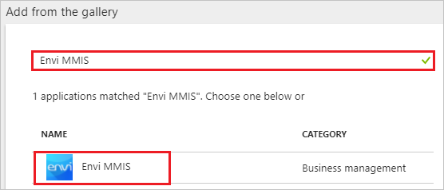
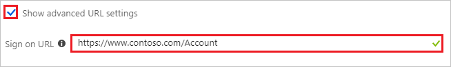
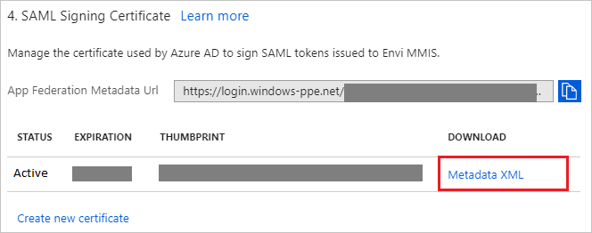

---
title: 'Tutorial: Azure Active Directory integration with Envi MMIS | Microsoft Docs'
description: Learn how to configure single sign-on between Azure Active Directory and Envi MMIS.
services: active-directory
documentationCenter: na
author: jeevansd
manager: femila
ms.reviewer: joflore

ms.assetid: ab89f8ee-2507-4625-94bc-b24ef3d5e006
ms.service: active-directory
ms.component: saas-app-tutorial
ms.workload: identity
ms.tgt_pltfrm: na
ms.devlang: na
ms.topic: article
ms.date: 05/03/2018
ms.author: jeedes

---
# Tutorial: Azure Active Directory integration with Envi MMIS

In this tutorial, you learn how to integrate Envi MMIS with Azure Active Directory (Azure AD).

Integrating Envi MMIS with Azure AD provides you with the following benefits:

- You can control in Azure AD who has access to Envi MMIS.
- You can enable your users to automatically get signed-on to Envi MMIS (Single Sign-On) with their Azure AD accounts.
- You can manage your accounts in one central location - the Azure portal.

If you want to know more details about SaaS app integration with Azure AD, see [what is application access and single sign-on with Azure Active Directory](../manage-apps/what-is-single-sign-on.md).

## Prerequisites

To configure Azure AD integration with Envi MMIS, you need the following items:

- An Azure AD subscription
- An Envi MMIS single sign-on enabled subscription

> [!NOTE]
> To test the steps in this tutorial, we do not recommend using a production environment.

To test the steps in this tutorial, you should follow these recommendations:

- Do not use your production environment, unless it is necessary.
- If you don't have an Azure AD trial environment, you can [get a one-month trial](https://azure.microsoft.com/pricing/free-trial/).

## Scenario description
In this tutorial, you test Azure AD single sign-on in a test environment. 
The scenario outlined in this tutorial consists of two main building blocks:

1. Adding Envi MMIS from the gallery
1. Configuring and testing Azure AD single sign-on

## Adding Envi MMIS from the gallery
To configure the integration of Envi MMIS into Azure AD, you need to add Envi MMIS from the gallery to your list of managed SaaS apps.

**To add Envi MMIS from the gallery, perform the following steps:**

1. In the **[Azure portal](https://portal.azure.com)**, on the left navigation panel, click **Azure Active Directory** icon. 

	![The Azure Active Directory button][1]

1. Navigate to **Enterprise applications**. Then go to **All applications**.

	![The Enterprise applications blade][2]
	
1. To add new application, click **New application** button on the top of dialog.

	![The New application button][3]

1. In the search box, type **Envi MMIS**, select **Envi MMIS** from result panel then click **Add** button to add the application.

	

## Configure and test Azure AD single sign-on

In this section, you configure and test Azure AD single sign-on with Envi MMIS based on a test user called "Britta Simon".

For single sign-on to work, Azure AD needs to know what the counterpart user in Envi MMIS is to a user in Azure AD. In other words, a link relationship between an Azure AD user and the related user in Envi MMIS needs to be established.

To configure and test Azure AD single sign-on with Envi MMIS, you need to complete the following building blocks:

1. **[Configure Azure AD Single Sign-On](#configure-azure-ad-single-sign-on)** - to enable your users to use this feature.
1. **[Create an Azure AD test user](#create-an-azure-ad-test-user)** - to test Azure AD single sign-on with Britta Simon.
1. **[Create an Envi MMIS test user](#create-an-envi-mmis-test-user)** - to have a counterpart of Britta Simon in Envi MMIS that is linked to the Azure AD representation of user.
1. **[Assign the Azure AD test user](#assign-the-azure-ad-test-user)** - to enable Britta Simon to use Azure AD single sign-on.
1. **[Test single sign-on](#test-single-sign-on)** - to verify whether the configuration works.

### Configure Azure AD single sign-on

In this section, you enable Azure AD single sign-on in the Azure portal and configure single sign-on in your Envi MMIS application.

**To configure Azure AD single sign-on with Envi MMIS, perform the following steps:**

1. In the Azure portal, on the **Envi MMIS** application integration page, click **Single sign-on**.

	![Configure single sign-on link][4]

1. On the **Single sign-on** dialog, select **Mode** as	**SAML-based Sign-on** to enable single sign-on.
 
	

1. On the **Envi MMIS Domain and URLs** section, perform the following steps if you wish to configure the application in **IDP** initiated mode:

	

    a. In the **Identifier** textbox, type a URL using the following pattern: `https://www.<CUSTOMER DOMAIN>.com/Account`

	b. In the **Reply URL** textbox, type a URL using the following pattern: `https://www.<CUSTOMER DOMAIN>.com/Account/Acs`

1. Check **Show advanced URL settings** and perform the following step if you wish to configure the application in **SP** initiated mode:

	

    In the **Sign-on URL** textbox, type a URL using the following pattern: `https://www.<CUSTOMER DOMAIN>.com/Account`
	 
	> [!NOTE]
	> These values are not real. Update these values with the actual Identifier, Reply URL, and Sign-On URL. Contact [Envi MMIS Client support team](mailto:support@ioscorp.com) to get these values.

1. On the **SAML Signing Certificate** section, click **Metadata XML** and then save the metadata file on your computer.

	 

1. Click **Save** button.

	

1. In a different web browser window, log into your Envi MMIS site as an administrator.

1. Click on **My Domain** tab.

	

1. Click **Edit**.

	

1. Select **Use remote authentication** checkbox and then select **HTTP Redirect** from the **Authentication Type** dropdown.

	

1. Select **Resources** tab and then click **Upload Metadata**.

	

1. In the **Upload Metadata** popup, perform the following steps:

	

	a. Select **File** option from the **Upload From** dropdown.

	b. Upload the downloaded metadata file from Azure portal by selecting the **choose file icon**.

	c. Click **Ok**.

1. After uploading the downloaded metadata file the fields will get populated automatically. Click **Update**

	

### Create an Azure AD test user

The objective of this section is to create a test user in the Azure portal called Britta Simon.

   ![Create an Azure AD test user][100]

**To create a test user in Azure AD, perform the following steps:**

1. In the Azure portal, in the left pane, click the **Azure Active Directory** button.

    

1. To display the list of users, go to **Users and groups**, and then click **All users**.

    

1. To open the **User** dialog box, click **Add** at the top of the **All Users** dialog box.

    

1. In the **User** dialog box, perform the following steps:

    

    a. In the **Name** box, type **BrittaSimon**.

    b. In the **User name** box, type the email address of user Britta Simon.

    c. Select the **Show Password** check box, and then write down the value that's displayed in the **Password** box.

    d. Click **Create**.
 
### Create an Envi MMIS test user

To enable Azure AD users to log in to Envi MMIS, they must be provisioned into Envi MMIS.  
In the case of Envi MMIS, provisioning is a manual task.

**To provision a user account, perform the following steps:**

1. Log in to your Envi MMIS company site as an administrator.

1. Click on **User List** tab.

	

1. Click **Add User** button.

	

1. In the **Add User** section, perform the following steps:

	

	a. In the **User Name** textbox, type the username of Britta Simon account like **brittasimon@contoso.com**.
	
	b. In the **First Name** textbox, type the first name of BrittaSimon like **Britta**.

	c. In the **Last Name** textbox, type the last name of BrittaSimon like **Simon**.

	d. Enter the Title of the user in the **Title** of the textbox.
	
	e. In the **Email Address** textbox, type the email address of Britta Simon account like **brittasimon@contoso.com**.

	f. In the **SSO User Name** textbox, type the username of Britta Simon account like **brittasimon@contoso.com**.

	g. Click **Save**.

### Assign the Azure AD test user

In this section, you enable Britta Simon to use Azure single sign-on by granting access to Envi MMIS.

![Assign the user role][200] 

**To assign Britta Simon to Envi MMIS, perform the following steps:**

1. In the Azure portal, open the applications view, and then navigate to the directory view and go to **Enterprise applications** then click **All applications**.

	![Assign User][201] 

1. In the applications list, select **Envi MMIS**.

	  

1. In the menu on the left, click **Users and groups**.

	![The "Users and groups" link][202]

1. Click **Add** button. Then select **Users and groups** on **Add Assignment** dialog.

	![The Add Assignment pane][203]

1. On **Users and groups** dialog, select **Britta Simon** in the Users list.

1. Click **Select** button on **Users and groups** dialog.

1. Click **Assign** button on **Add Assignment** dialog.
	
### Test single sign-on

In this section, you test your Azure AD single sign-on configuration using the Access Panel.

When you click the Envi MMIS tile in the Access Panel, you should get automatically signed-on to your Envi MMIS application.
For more information about the Access Panel, see [Introduction to the Access Panel](../user-help/active-directory-saas-access-panel-introduction.md). 

## Additional resources

* [List of Tutorials on How to Integrate SaaS Apps with Azure Active Directory](tutorial-list.md)
* [What is application access and single sign-on with Azure Active Directory?](../manage-apps/what-is-single-sign-on.md)

<!--Image references-->

[1]: ./media/envimmis-tutorial/tutorial_general_01.png
[2]: ./media/envimmis-tutorial/tutorial_general_02.png
[3]: ./media/envimmis-tutorial/tutorial_general_03.png
[4]: ./media/envimmis-tutorial/tutorial_general_04.png

[100]: ./media/envimmis-tutorial/tutorial_general_100.png

[200]: ./media/envimmis-tutorial/tutorial_general_200.png
[201]: ./media/envimmis-tutorial/tutorial_general_201.png
[202]: ./media/envimmis-tutorial/tutorial_general_202.png
[203]: ./media/envimmis-tutorial/tutorial_general_203.png

