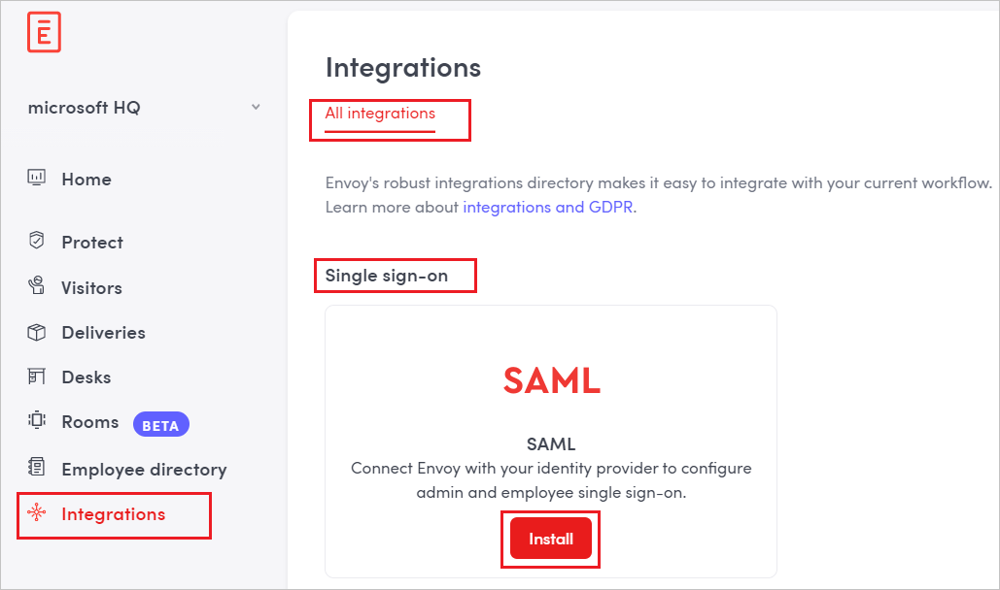
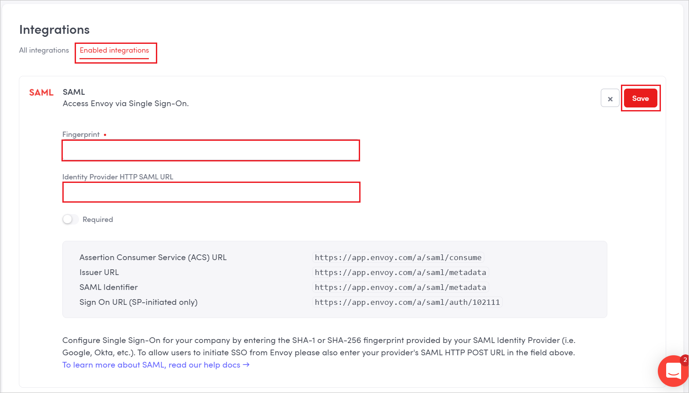

# Tutorial: Azure AD SSO integration with Envoy

In this tutorial, you'll learn how to integrate Envoy with Azure Active Directory (Azure AD). When you integrate Envoy with Azure AD, you can:

* Control in Azure AD who has access to Envoy.
* Enable your users to be automatically signed-in to Envoy with their Azure AD accounts.
* Manage your accounts in one central location - the Azure portal.

## Prerequisites

To get started, you need the following items:

* An Azure AD subscription. If you don't have a subscription, you can get a [free account](https://azure.microsoft.com/free/).
* Envoy single sign-on (SSO) enabled subscription.

> [!NOTE]
> This integration is also available to use from Azure AD US Government Cloud environment. You can find this application in the Azure AD US Government Cloud Application Gallery and configure it in the same way as you do from public cloud.

## Scenario description

In this tutorial, you configure and test Azure AD SSO in a test environment.

* Envoy supports **SP** initiated SSO.

* Envoy supports **Just In Time** user provisioning.

* Envoy supports [Automated user provisioning](envoy-provisioning-tutorial.md).

> [!NOTE]
> Identifier of this application is a fixed string value so only one instance can be configured in one tenant.

## Add Envoy from the gallery

To configure the integration of Envoy into Azure AD, you need to add Envoy from the gallery to your list of managed SaaS apps.

1. Sign in to the Azure portal using either a work or school account, or a personal Microsoft account.
1. On the left navigation pane, select the **Azure Active Directory** service.
1. Navigate to **Enterprise Applications** and then select **All Applications**.
1. To add new application, select **New application**.
1. In the **Add from the gallery** section, type **Envoy** in the search box.
1. Select **Envoy** from results panel and then add the app. Wait a few seconds while the app is added to your tenant.

 Alternatively, you can also use the [Enterprise App Configuration Wizard](https://portal.office.com/AdminPortal/home?Q=Docs#/azureadappintegration). In this wizard, you can add an application to your tenant, add users/groups to the app, assign roles, as well as walk through the SSO configuration as well. [Learn more about Microsoft 365 wizards.](/microsoft-365/admin/misc/azure-ad-setup-guides)

## Configure and test Azure AD SSO for Envoy

Configure and test Azure AD SSO with Envoy using a test user called **B.Simon**. For SSO to work, you need to establish a link relationship between an Azure AD user and the related user in Envoy.

To configure and test Azure AD SSO with Envoy, perform the following steps:

1. **[Configure Azure AD SSO](#configure-azure-ad-sso)** - to enable your users to use this feature.
    1. **[Create an Azure AD test user](#create-an-azure-ad-test-user)** - to test Azure AD single sign-on with B.Simon.
    1. **[Assign the Azure AD test user](#assign-the-azure-ad-test-user)** - to enable B.Simon to use Azure AD single sign-on.
1. **[Configure Envoy SSO](#configure-envoy-sso)** - to configure the single sign-on settings on application side.
    1. **[Create Envoy test user](#create-envoy-test-user)** - to have a counterpart of B.Simon in Envoy that is linked to the Azure AD representation of user.
1. **[Test SSO](#test-sso)** - to verify whether the configuration works.

## Configure Azure AD SSO

Follow these steps to enable Azure AD SSO in the Azure portal.

1. In the Azure portal, on the **Envoy** application integration page, find the **Manage** section and select **single sign-on**.
1. On the **Select a single sign-on method** page, select **SAML**.
1. On the **Set up single sign-on with SAML** page, click the pencil icon for **Basic SAML Configuration** to edit the settings.

   

1. On the **Basic SAML Configuration** section, perform the following step:

    In the **Sign-on URL** text box, type a URL using the following pattern:
    `https://app.envoy.com/a/saml/auth/<company-ID-from-Envoy>`

	> [!NOTE]
	> The value is not real. Update the value with the actual Sign-On URL. Contact [Envoy Client support team](https://envoy.com/contact/) to get the value. You can also refer to the patterns shown in the **Basic SAML Configuration** section in the Azure portal.

1. In the **SAML Signing Certificate** section, click **Edit** button to open **SAML Signing Certificate** dialog.

	

1. In the **SAML Signing Certificate** section, copy the **Thumbprint Value** and save it on your computer.

    

1. On the **Set up Envoy** section, copy the appropriate URL(s) based on your requirement.

	

### Create an Azure AD test user

In this section, you'll create a test user in the Azure portal called B.Simon.

1. From the left pane in the Azure portal, select **Azure Active Directory**, select **Users**, and then select **All users**.
1. Select **New user** at the top of the screen.
1. In the **User** properties, follow these steps:
   1. In the **Name** field, enter `B.Simon`.  
   1. In the **User name** field, enter the username@companydomain.extension. For example, `B.Simon@contoso.com`.
   1. Select the **Show password** check box, and then write down the value that's displayed in the **Password** box.
   1. Click **Create**.

### Assign the Azure AD test user

In this section, you'll enable B.Simon to use Azure single sign-on by granting access to Envoy.

1. In the Azure portal, select **Enterprise Applications**, and then select **All applications**.
1. In the applications list, select **Envoy**.
1. In the app's overview page, find the **Manage** section and select **Users and groups**.
1. Select **Add user**, then select **Users and groups** in the **Add Assignment** dialog.
1. In the **Users and groups** dialog, select **B.Simon** from the Users list, then click the **Select** button at the bottom of the screen.
1. If you are expecting a role to be assigned to the users, you can select it from the **Select a role** dropdown. If no role has been set up for this app, you see "Default Access" role selected.
1. In the **Add Assignment** dialog, click the **Assign** button.

## Configure Envoy SSO

1. To automate the configuration within Envoy, you need to install **My Apps Secure Sign-in browser extension** by clicking **Install the extension**.

	

2. After adding extension to the browser, click on **Setup Envoy** will direct you to the Envoy application. From there, provide the admin credentials to sign into Envoy. The browser extension will automatically configure the application for you and automate steps 3-5.

	

3. If you want to setup Envoy manually, open a new web browser window and sign into your Envoy company site as an administrator and perform the following steps.

4. Go to **Integrations** > **All integrations** and click to **Install** SAML under **Single sign-on**.

	

5. Navigate to **Enabled integrations** section, and  perform the following steps:

	
	
	>[!NOTE]
	>The value for the HQ location ID is auto generated by the application.
	
	a. In **Fingerprint** textbox, paste the **Thumbprint** value of certificate, which you have copied from Azure portal.
	
	b. Paste **Login URL** value, which you have copied form the Azure portal into the **IDENTITY PROVIDER HTTP SAML URL** textbox.
	
	c. Click **Save**.

### Create Envoy test user

In this section, a user called Britta Simon is created in Envoy. 

Envoy supports automatic user provisioning, which you can read about [here](./envoy-provisioning-tutorial.md) on how to configure automatic user provisioning.

## Test SSO 

In this section, you test your Azure AD single sign-on configuration with following options. 

* Click on **Test this application** in Azure portal. This will redirect to Envoy Sign-on URL where you can initiate the login flow. 

* Go to Envoy Sign-on URL directly and initiate the login flow from there.

* You can use Microsoft My Apps. When you click the Envoy tile in the My Apps, this will redirect to Envoy Sign-on URL. For more information about the My Apps, see [Introduction to the My Apps](https://support.microsoft.com/account-billing/sign-in-and-start-apps-from-the-my-apps-portal-2f3b1bae-0e5a-4a86-a33e-876fbd2a4510).

## Next steps

Once you configure Envoy you can enforce session control, which protects exfiltration and infiltration of your organization’s sensitive data in real time. Session control extends from Conditional Access. [Learn how to enforce session control with Microsoft Defender for Cloud Apps](/cloud-app-security/proxy-deployment-any-app).
