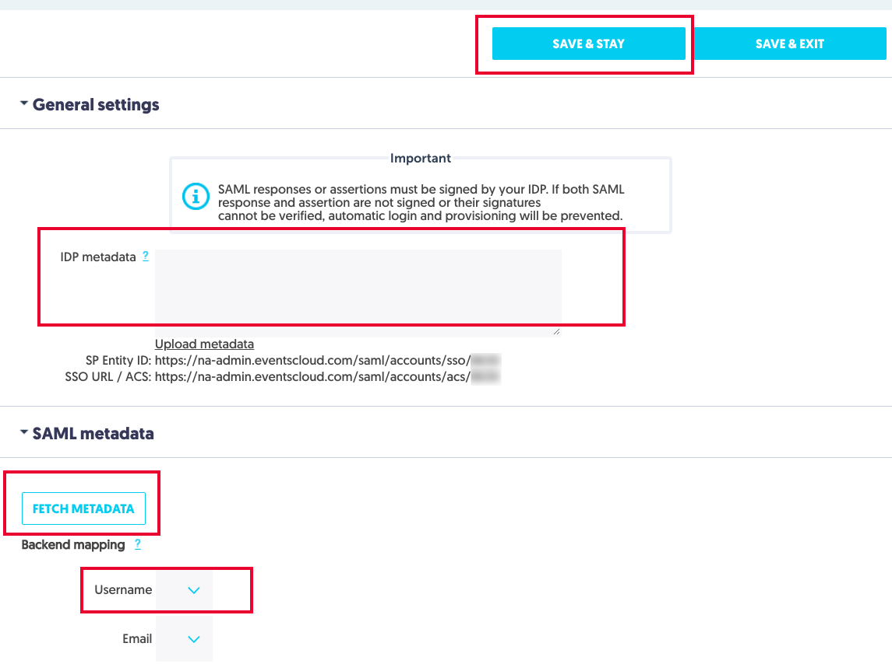

# Tutorial: Azure Active Directory single sign-on (SSO) integration with Aventri

In this tutorial, you'll learn how to integrate Aventri with Azure Active Directory (Azure AD). When you integrate Aventri with Azure AD, you can:

* Control in Azure AD who has access to Aventri.
* Enable your users to be automatically signed-in to Aventri with their Azure AD accounts.
* Manage your accounts in one central location - the Azure portal.

To learn more about SaaS app integration with Azure AD, see [What is application access and single sign-on with Azure Active Directory](https://docs.microsoft.com/azure/active-directory/manage-apps/what-is-single-sign-on).

## Prerequisites

To get started, you need the following items:

* An Azure AD subscription. If you don't have a subscription, you can get a [free account](https://azure.microsoft.com/free/).
* Aventri single sign-on (SSO) enabled subscription.

## Scenario description

In this tutorial, you configure and test Azure AD SSO in a test environment.

* Aventri supports **SP** initiated SSO
* Once you configure Aventri you can enforce Session Control, which protect exfiltration and infiltration of your organization’s sensitive data in real-time. Session Control extend from Conditional Access. [Learn how to enforce session control with Microsoft Cloud App Security](https://docs.microsoft.com/cloud-app-security/proxy-deployment-aad)

## Adding Aventri from the gallery

To configure the integration of Aventri into Azure AD, you need to add Aventri from the gallery to your list of managed SaaS apps.

1. Sign in to the [Azure portal](https://portal.azure.com) using either a work or school account, or a personal Microsoft account.
1. On the left navigation pane, select the **Azure Active Directory** service.
1. Navigate to **Enterprise Applications** and then select **All Applications**.
1. To add new application, select **New application**.
1. In the **Add from the gallery** section, type **Aventri** in the search box.
1. Select **Aventri** from results panel and then add the app. Wait a few seconds while the app is added to your tenant.

## Configure and test Azure AD single sign-on for Aventri

Configure and test Azure AD SSO with Aventri using a test user called **B.Simon**. For SSO to work, you need to establish a link relationship between an Azure AD user and the related user in Aventri.

To configure and test Azure AD SSO with Aventri, complete the following building blocks:

1. **[Configure Azure AD SSO](#configure-azure-ad-sso)** - to enable your users to use this feature.
    1. **[Create an Azure AD test user](#create-an-azure-ad-test-user)** - to test Azure AD single sign-on with B.Simon.
    1. **[Assign the Azure AD test user](#assign-the-azure-ad-test-user)** - to enable B.Simon to use Azure AD single sign-on.
1. **[Configure Aventri SSO](#configure-aventri-sso)** - to configure the single sign-on settings on application side.
    1. **[Create Aventri test user](#create-aventri-test-user)** - to have a counterpart of B.Simon in Aventri that is linked to the Azure AD representation of user.
1. **[Test SSO](#test-sso)** - to verify whether the configuration works.

## Configure Azure AD SSO

Follow these steps to enable Azure AD SSO in the Azure portal.

1. In the [Azure portal](https://portal.azure.com/), on the **Aventri** application integration page, find the **Manage** section and select **single sign-on**.
1. On the **Select a single sign-on method** page, select **SAML**.
1. On the **Set up single sign-on with SAML** page, click the edit/pen icon for **Basic SAML Configuration** to edit the settings.

   

1. On the **Basic SAML Configuration** section, enter the values for the following fields:

    a. In the **Sign on URL** text box, type a URL using the following pattern:
    `https://na-admin.eventscloud.com/saml/accounts/acs/<ACCOUNTID>`

    b. In the **Identifier (Entity ID)** text box, type a URL using the following pattern:
    `https://na-admin.eventscloud.com/saml/accounts/sso/<ACCOUNTID>`

    > [!NOTE] 
    > These values are not real. You update the value with the actual Sign on URL and Identifier, which is explained later in the tutorial.

1. Aventri application expects the SAML assertions in a specific format, which requires you to add custom attribute mappings to your SAML token attributes configuration. The following screenshot shows the list of default attributes.

    

1. In addition to above, Aventri application expects few more attributes to be passed back in SAML response which are shown below. These attributes are also pre populated but you can review them as per your requirement.

    | Name | Source Attribute|
    | ------------------- | -------------------- |
    | Email | user.mail | 

1. On the **Set up single sign-on with SAML** page, in the **SAML Signing Certificate** section,  find **Federation Metadata XML** and select **Download** to download the certificate and save it on your computer.

    

1. On the **Set up Aventri** section, copy the appropriate URL(s) based on your requirement.

    

### Create an Azure AD test user

In this section, you'll create a test user in the Azure portal called B.Simon.

1. From the left pane in the Azure portal, select **Azure Active Directory**, select **Users**, and then select **All users**.
1. Select **New user** at the top of the screen.
1. In the **User** properties, follow these steps:
   1. In the **Name** field, enter `B.Simon`.  
   1. In the **User name** field, enter the username@companydomain.extension. For example, `B.Simon@contoso.com`.
   1. Select the **Show password** check box, and then write down the value that's displayed in the **Password** box.
   1. Click **Create**.

### Assign the Azure AD test user

In this section, you'll enable B.Simon to use Azure single sign-on by granting access to Aventri.

1. In the Azure portal, select **Enterprise Applications**, and then select **All applications**.
1. In the applications list, select **Aventri**.
1. In the app's overview page, find the **Manage** section and select **Users and groups**.

   

1. Select **Add user**, then select **Users and groups** in the **Add Assignment** dialog.

    

1. In the **Users and groups** dialog, select **B.Simon** from the Users list, then click the **Select** button at the bottom of the screen.
1. If you're expecting any role value in the SAML assertion, in the **Select Role** dialog, select the appropriate role for the user from the list and then click the **Select** button at the bottom of the screen.
1. In the **Add Assignment** dialog, click the **Assign** button.

## Configure Aventri SSO

1. To get SSO configured for your application, perform the following steps in the Aventri application: 

     

    a. Sign in to **Aventri** application using the Admin rights.
   
    b. Go to the **SAML** Configuration.

    c. In the **General Settings** section, open your downloaded certificate from Azure portal in notepad, copy the content, and then paste it into the IDP metadata textbox. 

    d. Click on the **Save & Stay** button.
  
    e. Click on the **Update Metadata** button in the SAML Metadata section. 

    f. This opens the page and performs SSO. Once the SSO is working then you can set up the username.

    g. In the Username field, select the **emailaddress** as shown in the image below. 

    h. Copy the **SP entity ID** value and paste it into the **Identifier**  textbox, which is in **Basic SAML Configuration** section on Azure portal.

    i. Copy the **SSO URL / ACS** value and paste it into the **Sign-on URL** textbox, which is in **Basic SAML Configuration** section on Azure portal.

### Create Aventri test user

In this section, you create a user called B.Simon in Aventri. Work with [Aventri Client support team](mailto:support@aventri.com) to add the users in the Aventri platform.

## Test SSO 

In this section, you test your Azure AD single sign-on configuration using the Access Panel.

When you click the Aventri tile in the Access Panel, you should be automatically signed in to the Aventri for which you set up SSO. For more information about the Access Panel, see [Introduction to the Access Panel](https://docs.microsoft.com/azure/active-directory/active-directory-saas-access-panel-introduction).

## Additional resources

- [ List of Tutorials on How to Integrate SaaS Apps with Azure Active Directory ](https://docs.microsoft.com/azure/active-directory/active-directory-saas-tutorial-list)

- [What is application access and single sign-on with Azure Active Directory? ](https://docs.microsoft.com/azure/active-directory/manage-apps/what-is-single-sign-on)

- [What is conditional access in Azure Active Directory?](https://docs.microsoft.com/azure/active-directory/conditional-access/overview)

- [Try Aventri with Azure AD](https://aad.portal.azure.com/)

- [What is session control in Microsoft Cloud App Security?](https://docs.microsoft.com/cloud-app-security/proxy-intro-aad)