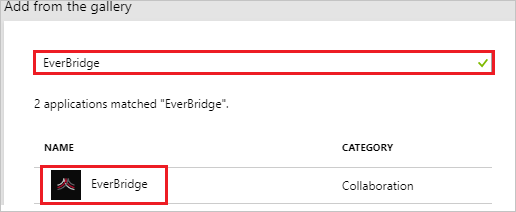
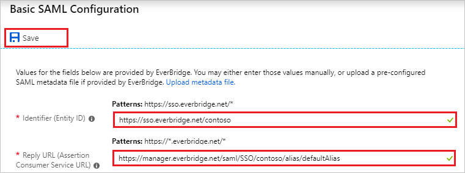
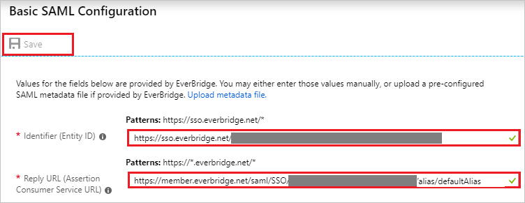
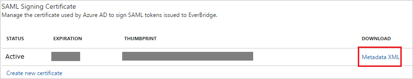

# Tutorial: Azure Active Directory integration with EverBridge

In this tutorial, you learn how to integrate EverBridge with Azure Active Directory (Azure AD).

Integrating EverBridge with Azure AD provides you with the following benefits:

- You can control in Azure AD who has access to EverBridge.
- You can enable your users to automatically get signed-on to EverBridge (Single Sign-On) with their Azure AD accounts.
- You can manage your accounts in one central location - the Azure portal.

If you want to know more details about SaaS app integration with Azure AD, see [what is application access and single sign-on with Azure Active Directory](../manage-apps/what-is-single-sign-on.md)

## Prerequisites

To configure Azure AD integration with EverBridge, you need the following items:

- An Azure AD subscription
- An EverBridge single sign-on enabled subscription

> [!NOTE]
> To test the steps in this tutorial, we do not recommend using a production environment.

To test the steps in this tutorial, you should follow these recommendations:

- Do not use your production environment, unless it is necessary.
- If you don't have an Azure AD trial environment, you can [get a one-month trial](https://azure.microsoft.com/pricing/free-trial/).

## Scenario description

In this tutorial, you test Azure AD single sign-on in a test environment. 
The scenario outlined in this tutorial consists of two main building blocks:

1. Adding EverBridge from the gallery
2. Configuring and testing Azure AD single sign-on

## Adding EverBridge from the gallery

To configure the integration of EverBridge into Azure AD, you need to add EverBridge from the gallery to your list of managed SaaS apps.

**To add EverBridge from the gallery, perform the following steps:**

1. In the **[Azure portal](https://portal.azure.com)**, on the left navigation panel, click **Azure Active Directory** icon. 

	![The Azure Active Directory button][1]

2. Navigate to **Enterprise applications**. Then go to **All applications**.

	![The Enterprise applications blade][2]
	
3. To add new application, click **New application** button on the top of dialog.

	![The New application button][3]

4. In the search box, type **EverBridge**, select **EverBridge** from result panel then click **Add** button to add the application.

	

## Configure and test Azure AD single sign-on

In this section, you configure and test Azure AD single sign-on with EverBridge based on a test user called "Britta Simon".

For single sign-on to work, Azure AD needs to know what the counterpart user in EverBridge is to a user in Azure AD. In other words, a link relationship between an Azure AD user and the related user in EverBridge needs to be established.

To configure and test Azure AD single sign-on with EverBridge, you need to complete the following building blocks:

1. **[Configuring Azure AD Single Sign-On](#configuring-azure-ad-single-sign-on)** - to enable your users to use this feature.
2. **[Creating an Azure AD test user](#creating-an-azure-ad-test-user)** - to test Azure AD single sign-on with Britta Simon.
3. **[Creating an EverBridge test user](#creating-an-everbridge-test-user)** - to have a counterpart of Britta Simon in EverBridge that is linked to the Azure AD representation of user.
4. **[Assigning the Azure AD test user](#assigning-the-azure-ad-test-user)** - to enable Britta Simon to use Azure AD single sign-on.
5. **[Testing single sign-on](#testing-single-sign-on)** - to verify whether the configuration works.

### Configuring Azure AD single sign-on

In this section, you enable Azure AD single sign-on in the Azure portal and configure single sign-on in your EverBridge application.

**To configure Azure AD single sign-on with EverBridge, perform the following steps:**

1. In the Azure portal, on the **EverBridge** application integration page, click **Single sign-on**.

	![Configure single sign-on link][4]

2. On the **Select a Single sign-on method** dialog, Click **Select** for **SAML** mode to enable single sign-on.

    

3. On the **Set up Single Sign-On with SAML** page, click **Edit** icon to open **Basic SAML Configuration** dialog.

	

	>[!NOTE]
	>You need to do the configurations of the application EITHER as the Manager Portal  OR as the Member Portal on both ends i.e. on Azure Portal and Everbridge Portal.

4. To configure the **EverBridge** application as **EverBridge Manager Portal**, on the **Basic SAML Configuration** section  perform the following steps:

	

    a. In the **Identifier** textbox, type a URL using the following pattern: `https://sso.everbridge.net/<API_Name>`

	b. In the **Reply URL** textbox, type a URL using the following pattern: `https://manager.everbridge.net/saml/SSO/<API_Name>/alias/defaultAlias`

	> [!NOTE]
	> These values are not real. Update these values with the actual Identifier and Reply URL. Contact [EverBridge support team](mailto:support@everbridge.com) to get these values.

5. To configure the **EverBridge** application as **EverBridge Member Portal**, on the **Basic SAML Configuration** section, perform the following steps:

	* If you wish to configure the application in **IDP** initiated mode:

		

		* In the **Identifier** textbox, type a URL using the following pattern: `https://sso.everbridge.net/<API_Name>/<Organization_ID>`

		* In the **Reply URL** textbox, type a URL using the following pattern: `https://member.everbridge.net/saml/SSO/<API_Name>/<Organization_ID>/alias/defaultAlias`

    * Click **Set additional URLs** and perform the following step if you wish to configure the application in **SP** initiated mode:

		

    	* In the **Sign-on URL** textbox, type a URL using the following pattern: `https://member.everbridge.net/saml/login/<API_Name>/<Organization_ID>/alias/defaultAlias?disco=true`

	> [!NOTE]
	> These values are not real. Update these values with the actual Identifier, Reply URL and Sign on URL. Contact [EverBridge support team](mailto:support@everbridge.com) to get these values.

6. On the **SAML Signing Certificate** page, in the **SAML Signing Certificate** section, click **Download** to download **Federation Metadata XML** and then save metadata file on your computer.

	 

7. On the **Set up EverBridge** section, copy the appropriate URL as per your requirement.

	a. Login URL

	b. Azure AD Identifier

	c. Logout URL

	

8. To get SSO configured for **EverBridge** as **EverBridge Manager Portal** application, perform the following steps: 
 
9. In a different web browser window, login to EverBridge as an Administrator.

9. In the menu on the top, click the **Settings** tab and select **Single Sign-On** under **Security**.
   
    
   
    a. In the **Name** textbox, type the name of Identifier Provider (for example: your company name).
   
    b. In the **API Name** textbox, type the name of API.
   
    c. Click **Choose File** button to upload the metadata file which you downloaded from Azure portal.
   
    d. In the SAML Identity Location, select **Identity is in the NameIdentifier element of the Subject statement**.
   
    e. In the **Identity Provider Login URL** textbox, paste the value of **Login URL** which you have copied from Azure portal.
   
    f. In the Service Provider Initiated Request Binding, select **HTTP Redirect**.

	g. Click **Save**

10. To configure single sign-on on **EverBridge** application as **EverBridge Member Portal**, you need to send the downloaded **Federation Metadata XML** to [Everbridge support team](mailto:support@everbridge.com). They set this setting to have the SAML SSO connection set properly on both sides.

### Creating an Azure AD test user

The objective of this section is to create a test user in the Azure portal called Britta Simon.

1. In the Azure portal, in the left pane, select **Azure Active Directory**, select **Users**, and then select **All users**.

	![Create Azure AD User][100]

2. Select **New user** at the top of the screen.

	 

3. In the User properties, perform the following steps.

	

    a. In the **Name** field, enter **BrittaSimon**.
  
    b. In the **User name** field, type **brittasimon@yourcompanydomain.extension**  
    For example, BrittaSimon@contoso.com

    c. Select **Properties**, select the **Show password** check box, and then write down the value that's displayed in the Password box.

    d. Select **Create**.
  
### Creating an EverBridge test user

In this section, you create a user called Britta Simon in Everbridge. Work with [EverBridge support team](mailto:support@everbridge.com) to add the users in the Everbridge platform.

### Assigning the Azure AD test user

In this section, you enable Britta Simon to use Azure single sign-on by granting access to EverBridge.

1. In the Azure portal, select **Enterprise Applications**, select **All applications**.

	![Assign User][201]

2. In the applications list, select **EverBridge**.

	 

3. In the menu on the left, click **Users and groups**.

	![Assign User][202]

4. Click **Add** button. Then select **Users and groups** on **Add Assignment** dialog.

	![Assign User][203]

5. In the **Users and groups** dialog select **Britta Simon** in the Users list, then click the **Select** button at the bottom of the screen.

6. In the **Add Assignment** dialog select the **Assign** button.

### Testing single sign-on

In this section, you test your Azure AD single sign-on configuration using the Access Panel.

When you click the EverBridge tile in the Access Panel, you should get automatically signed-on to your EverBridge application.
For more information about the Access Panel, see [Introduction to the Access Panel](../user-help/active-directory-saas-access-panel-introduction.md).

## Additional resources

* [List of Tutorials on How to Integrate SaaS Apps with Azure Active Directory](tutorial-list.md)
* [What is application access and single sign-on with Azure Active Directory?](../manage-apps/what-is-single-sign-on.md)

<!--Image references-->

[1]: common/tutorial_general_01.png
[2]: common/tutorial_general_02.png
[3]: common/tutorial_general_03.png
[4]: common/tutorial_general_04.png

[100]: common/tutorial_general_100.png

[201]: common/tutorial_general_201.png
[202]: common/tutorial_general_202.png
[203]: common/tutorial_general_203.png
