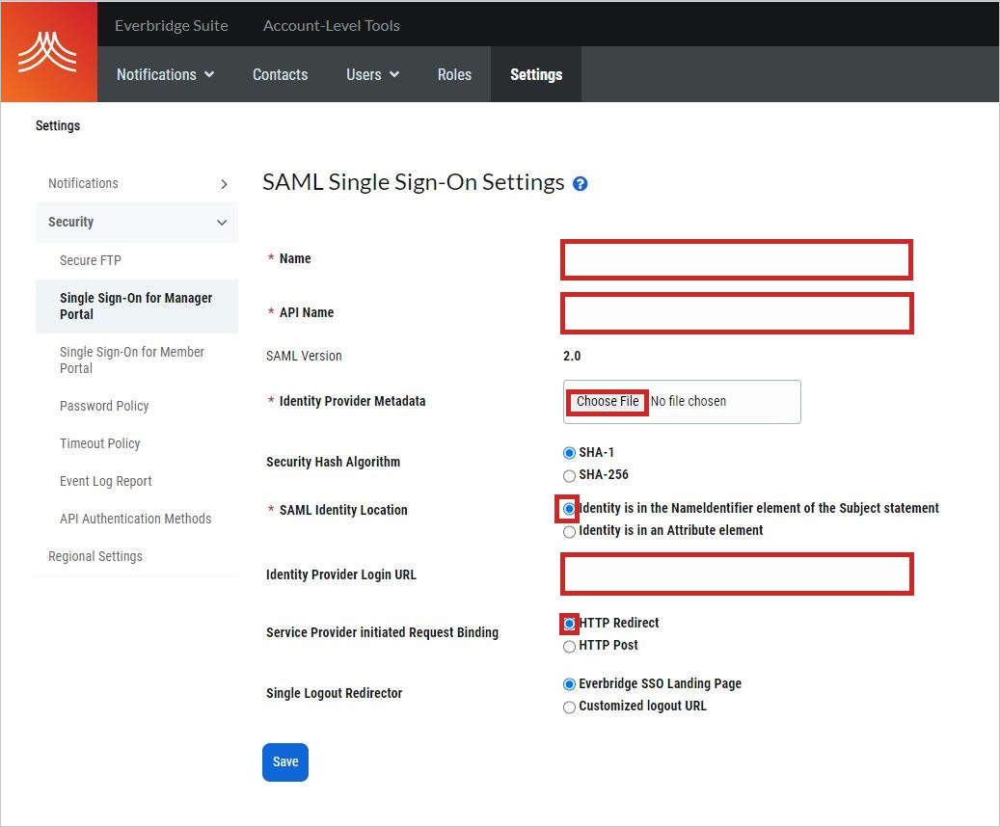

# Tutorial: Microsoft Entra integration with Everbridge

In this tutorial, you learn how to integrate Everbridge with Microsoft Entra ID.
When you integrate Everbridge with Microsoft Entra ID, you can:

* Control in Microsoft Entra ID who has access to Everbridge.
* Allow your users to be automatically signed in to Everbridge with their Microsoft Entra accounts. This access control is called single sign-on (SSO).
* Manage your accounts in one central location by using the Azure portal.

## Prerequisites

To configure Microsoft Entra integration with Everbridge, you need the following items:

* A Microsoft Entra subscription. If you don't have a Microsoft Entra environment, you can get a [free account](https://azure.microsoft.com/free/).
* An Everbridge subscription that uses single sign-on.

## Scenario description

In this tutorial, you configure and test Microsoft Entra single sign-on in a test environment.

* Everbridge supports IDP-initiated SSO.

## Add Everbridge from the Gallery

To configure the integration of Everbridge into Microsoft Entra ID, you need to add Everbridge from the gallery to your list of managed SaaS apps.

1. Sign in to the [Microsoft Entra admin center](https://entra.microsoft.com) as at least a [Cloud Application Administrator](../roles/permissions-reference.md#cloud-application-administrator).
1. Browse to **Identity** > **Applications** > **Enterprise applications** > **New application**.
1. In the **Add from the gallery** section, type **Everbridge** in the search box.
1. Select **Everbridge** from results panel and then add the app. Wait a few seconds while the app is added to your tenant.

 Alternatively, you can also use the [Enterprise App Configuration Wizard](https://portal.office.com/AdminPortal/home?Q=Docs#/azureadappintegration). In this wizard, you can add an application to your tenant, add users/groups to the app, assign roles, as well as walk through the SSO configuration as well. [Learn more about Microsoft 365 wizards.](/microsoft-365/admin/misc/azure-ad-setup-guides)

## Configure and test Microsoft Entra SSO for Everbridge

Configure and test Microsoft Entra SSO with Everbridge using a test user called **B.Simon**. For SSO to work, you need to establish a link relationship between a Microsoft Entra user and the related user in Everbridge.

To configure and test Microsoft Entra SSO with Everbridge, perform the following steps:

1. **[Configure Microsoft Entra SSO](#configure-azure-ad-sso)** - to enable your users to use this feature.
    1. **[Create a Microsoft Entra test user](#create-an-azure-ad-test-user)** - to test Microsoft Entra single sign-on with B.Simon.
    1. **[Assign the Microsoft Entra test user](#assign-the-azure-ad-test-user)** - to enable B.Simon to use Microsoft Entra single sign-on.
1. **[Configure Everbridge SSO](#configure-everbridge-sso)** - to configure the single sign-on settings on application side.
    1. **[Create Everbridge test user](#create-everbridge-test-user)** - to have a counterpart of B.Simon in Everbridge that is linked to the Microsoft Entra representation of user.
1. **[Test SSO](#test-sso)** - to verify whether the configuration works.

### Configure Microsoft Entra SSO

Follow these steps to enable Microsoft Entra SSO.

1. Sign in to the [Microsoft Entra admin center](https://entra.microsoft.com) as at least a [Cloud Application Administrator](../roles/permissions-reference.md#cloud-application-administrator).
1. Browse to **Identity** > **Applications** > **Enterprise applications** > **Everbridge** application integration page, find the **Manage** section and select **Single sign-on**.
1. On the **Select a Single sign-on method** page, select **SAML**.
1. On the **Set up Single Sign-On with SAML** page, click the pencil icon for **Basic SAML Configuration** to edit the settings.

   

    >[!NOTE]
	>Configure the application either as the manager portal *or* as the member portal on both the Azure portal and the Everbridge portal.

4. To configure the **Everbridge** application as the **Everbridge manager portal**, in the **Basic SAML Configuration** section, follow these steps:

    a. In the **Identifier** box, enter a URL that follows the pattern.
    `https://sso.everbridge.net/<API_Name>`

    b. In the **Reply URL** box, enter a URL that follows the pattern.
    `https://manager.everbridge.net/saml/SSO/<API_Name>/alias/defaultAlias`

	> [!NOTE]
	> These values aren't real. Update these values with the actual Identifier and Reply URL values. To get these values, contact the [Everbridge support team](mailto:support@everbridge.com). You also can refer to the patterns shown in the **Basic SAML Configuration** section.

5. To configure the **Everbridge** application as the **Everbridge member portal**, in the **Basic SAML Configuration** section, follow these steps:

  * If you want to configure the application in IDP-initiated mode, follow these steps:

    a. In the **Identifier** box, enter a URL that follows the pattern `https://sso.everbridge.net/<API_Name>/<Organization_ID>`

    b. In the **Reply URL** box, enter a URL that follows the pattern `https://member.everbridge.net/saml/SSO/<API_Name>/<Organization_ID>/alias/defaultAlias`

   * If you want to configure the application in SP-initiated mode, select **Set additional URLs** and follow this step:

     a. In the **Sign on URL** box, enter a URL that follows the pattern `https://member.everbridge.net/saml/login/<API_Name>/<Organization_ID>/alias/defaultAlias?disco=true`

     > [!NOTE]
     > These values aren't real. Update these values with the actual Identifier, Reply URL, and Sign on URL values. To get these values, contact the [Everbridge support team](mailto:support@everbridge.com). You also can refer to the patterns shown in the **Basic SAML Configuration** section.

6. On the **Set up Single Sign-On with SAML** page, in the **SAML Signing Certificate** section, select **Download** to download the **Federation Metadata XML**. Save it on your computer.

	

7. In the **Set up Everbridge** section, copy the URLs you need for your requirements:

	

### Create a Microsoft Entra test user 

In this section, you'll create a test user called B.Simon.

1. Sign in to the [Microsoft Entra admin center](https://entra.microsoft.com) as at least a [User Administrator](../roles/permissions-reference.md#user-administrator).
1. Browse to **Identity** > **Users** > **All users**.
1. Select **New user** > **Create new user**, at the top of the screen.
1. In the **User** properties, follow these steps:
   1. In the **Display name** field, enter `B.Simon`.  
   1. In the **User principal name** field, enter the username@companydomain.extension. For example, `B.Simon@contoso.com`.
   1. Select the **Show password** check box, and then write down the value that's displayed in the **Password** box.
   1. Select **Review + create**.
1. Select **Create**.

### Assign the Microsoft Entra test user

In this section, you'll enable B.Simon to use single sign-on by granting access to Everbridge.

1. Sign in to the [Microsoft Entra admin center](https://entra.microsoft.com) as at least a [Cloud Application Administrator](../roles/permissions-reference.md#cloud-application-administrator).
1. Browse to **Identity** > **Applications** > **Enterprise applications** > **Everbridge**.
1. In the app's overview page, select **Users and groups**.
1. Select **Add user/group**, then select **Users and groups** in the **Add Assignment** dialog.
   1. In the **Users and groups** dialog, select **B.Simon** from the Users list, then click the **Select** button at the bottom of the screen.
   1. If you are expecting a role to be assigned to the users, you can select it from the **Select a role** dropdown. If no role has been set up for this app, you see "Default Access" role selected.
   1. In the **Add Assignment** dialog, click the **Assign** button.

## Configure Everbridge SSO

To configure SSO on **Everbridge** as an **Everbridge manager portal** application, follow these steps.
 
1. In a different web browser window, sign in to Everbridge as an administrator.

1. In the menu on the top, select the **Settings** tab. Under **Security**, select **Single Sign-On for Manager Portal**.
   
     
   
     a. In the **Name** box, enter the name of the identifier provider. An example is your company name.
   
     b. In the **API Name** box, enter the name of the API.
   
     c. Select **Choose File** to upload the metadata file that you downloaded.
   
     d. For **SAML Identity Location**, select **Identity is in the NameIdentifier element of the Subject statement**.
   
     e. In the **Identity Provider Login URL** box, paste the **Login URL** value that you copied.
   
     f. For **Service Provider initiated Request Binding**, select **HTTP Redirect**.

     g. Select **Save**.

## Configure Everbridge as Everbridge member portal SSO

To configure single sign-on on **Everbridge** as an **Everbridge member portal**, send the downloaded **Federation Metadata XML** to the [Everbridge support team](mailto:support@everbridge.com). They set this setting to have the SAML SSO connection set properly on both sides.

### Create Everbridge test user

In this section, you create the test user Britta Simon in Everbridge. To add users in the Everbridge platform, work with the [Everbridge support team](mailto:support@everbridge.com). Users must be created and activated in Everbridge before you use single sign-on. 

## Test SSO

In this section, you test your Microsoft Entra single sign-on configuration with following options.

* Click on **Test this application**, and you should be automatically signed in to the Everbridge for which you set up the SSO.

* You can use Microsoft My Apps. When you click the Everbridge tile in the My Apps, you should be automatically signed in to the Everbridge for which you set up the SSO. For more information about the My Apps, see [Introduction to the My Apps](https://support.microsoft.com/account-billing/sign-in-and-start-apps-from-the-my-apps-portal-2f3b1bae-0e5a-4a86-a33e-876fbd2a4510).

## Next steps

Once you configure Everbridge you can enforce session control, which protects exfiltration and infiltration of your organization’s sensitive data in real time. Session control extends from Conditional Access. [Learn how to enforce session control with Microsoft Defender for Cloud Apps](/cloud-app-security/proxy-deployment-any-app).
