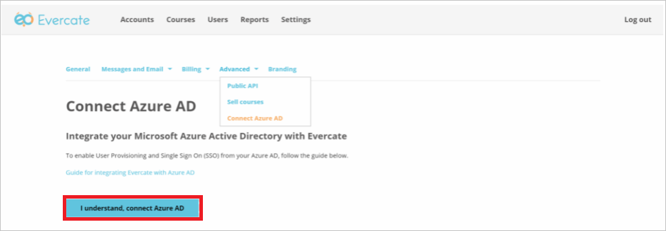
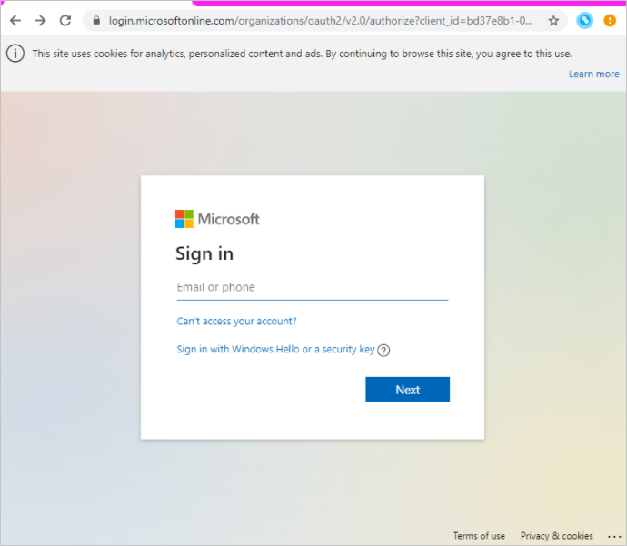
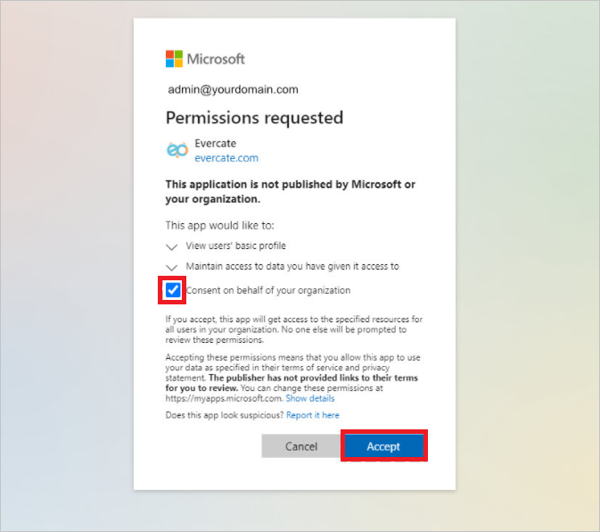

# Tutorial: Configure Evercate for automatic user provisioning

This tutorial describes the steps you need to do in both Evercate and Microsoft Entra ID to configure automatic user provisioning. When configured, Microsoft Entra ID automatically provisions and de-provisions users and groups to [Evercate](https://evercate.com) using the Microsoft Entra provisioning service. For important details on what this service does, how it works, and frequently asked questions, see [Automate user provisioning and deprovisioning to SaaS applications with Microsoft Entra ID](../app-provisioning/user-provisioning.md). 

## Capabilities Supported
> [!div class="checklist"]
> * Create users in Evercate.
> * Remove users in Evercate when they do not require access anymore.
> * Keep user attributes synchronized between Microsoft Entra ID and Evercate.
> * Provision groups and group memberships in Evercate.
> * [Single sign-on](../manage-apps/add-application-portal-setup-oidc-sso.md) to Evercate (recommended).

## Prerequisites

The scenario outlined in this tutorial assumes that you already have the following prerequisites:

* [A Microsoft Entra tenant](../develop/quickstart-create-new-tenant.md). 
* A user account in Microsoft Entra ID with [permission](../roles/permissions-reference.md) to configure provisioning (for example, Application Administrator, Cloud Application administrator, Application Owner, or Global Administrator). 
* A user account in Evercate with Admin permissions.

## Step 1: Plan your provisioning deployment
1. Learn about [how the provisioning service works](../app-provisioning/user-provisioning.md).
1. Determine who will be in [scope for provisioning](../app-provisioning/define-conditional-rules-for-provisioning-user-accounts.md).
1. Determine what data to [map between Microsoft Entra ID and Evercate](../app-provisioning/customize-application-attributes.md). 

## Step 2: Configure Evercate to support provisioning with Microsoft Entra ID

1. Log in to Evercate as an administrator and click on **Settings** in the top menu.
1. Under Settings, navigate to **Advanced -> Connect Microsoft Entra ID**.
1. Click the button "**I understand, connect Microsoft Entra ID**" to start the process.
	
1. Now you are taken to Microsoft’s Sign in page where you need to sign in as an administrator for your AD.

      The Microsoft user you sign in with must:

      * Be an administrator with permissions to “Enterprise Applications”.
      * Be an AD user and not a personal account.

	

1. Tick the "**Consent on behalf of your organization**" before clicking accept.
	
      > [!NOTE]
      > If you missed ticking the consent checkbox, every user will get a similar dialog upon their first sign in. See below under the section “Configuring the application in Azure” on how to give consent for your organization after the connection is made.

1. Once you have successfully set up the connection to Microsoft Entra ID you can configure which AD features you want to enable in Evercate.
1. Navigate to  **Settings -> Advanced -> Connect Microsoft Entra ID** you will see the token you need to enable provisioning (enabled from Microsoft Entra ID) and can tick the box for allowing single sign on for your Evercate account.
1. Copy and save the token. This value will be entered in the **Secret Token** * field in the Provisioning tab of your Evercate application.

## Step 3: Add Evercate from the Microsoft Entra application gallery

Add Evercate from the Microsoft Entra application gallery to start managing provisioning to Evercate. If you have previously setup Evercate for SSO, you can use the same application. Learn more about adding an application from the gallery [here](../manage-apps/add-application-portal.md). 

## Step 4: Define who will be in scope for provisioning 

The Microsoft Entra provisioning service allows you to scope who will be provisioned based on assignment to the application and or based on attributes of the user / group. If you choose to scope who will be provisioned to your app based on assignment, you can use the following [steps](../manage-apps/assign-user-or-group-access-portal.md) to assign users and groups to the application. If you choose to scope who will be provisioned based solely on attributes of the user or group, you can use a scoping filter as described [here](../app-provisioning/define-conditional-rules-for-provisioning-user-accounts.md).

* Start small. Test with a small set of users and groups before rolling out to everyone. When scope for provisioning is set to assigned users and groups, you can control this by assigning one or two users or groups to the app. When scope is set to all users and groups, you can specify an [attribute based scoping filter](../app-provisioning/define-conditional-rules-for-provisioning-user-accounts.md).

* If you need additional roles, you can [update the application manifest](../develop/howto-add-app-roles-in-azure-ad-apps.md) to add new roles.

## Step 5: Configure automatic user provisioning to Evercate 

This section guides you through the steps to configure the Microsoft Entra provisioning service to create, update, and disable users and groups in Evercate based on user and/or group assignments in Microsoft Entra ID.

### To configure automatic user provisioning for Evercate in Microsoft Entra ID:

1. Sign in to the [Microsoft Entra admin center](https://entra.microsoft.com) as at least a [Cloud Application Administrator](../roles/permissions-reference.md#cloud-application-administrator).
1. Browse to **Identity** > **Applications** > **Enterprise applications**

	

1. In the applications list, select **Evercate**.

	

1. Select the **Provisioning** tab.

	

1. Set the **Provisioning Mode** to **Automatic**.

	

1. Under the **Admin Credentials** section, input your Evercate Tenant URL as `https://adscimprovisioning.evercate.com/scim` and corresponding Secret Token. Click **Test Connection** to ensure Microsoft Entra ID can connect to Evercate. If the connection fails, ensure your Evercate account has Admin permissions and try again.

 	

1. In the **Notification Email** field, enter the email address of a person or group who should receive the provisioning error notifications and select the **Send an email notification when a failure occurs** check box.

	

1. Select **Save**.

1. In the **Mappings** section, select **Synchronize Microsoft Entra users to Evercate**.

1. Review the user attributes that are synchronized from Microsoft Entra ID to Evercate in the **Attribute-Mapping** section. The attributes selected as **Matching** properties are used to match the user accounts in Evercate for update operations. If you choose to change the [matching target attribute](../app-provisioning/customize-application-attributes.md), you'll need to ensure that the Evercate API supports filtering users based on that attribute. Select the **Save** button to commit any changes.

   |Attribute|Type|Supported for filtering|Required by Evercate|
   |---|---|---|---|
   |userName|String|&check;|&check;|
   |urn:ietf:params:scim:schemas:extension:enterprise:2.0:User:manager|String||   
   |active|Boolean|||
   |displayName|String||&check;|
   |emails[type eq "work"].value|String|||  
   |name.givenName|String|||
   |name.familyName|String|||
   |urn:ietf:params:scim:schemas:extension:enterprise:2.0:User:department|String|||

1. Under the **Mappings** section, select **Synchronize Microsoft Entra groups to Evercate**.

1. Review the group attributes that are synchronized from Microsoft Entra ID to Evercate in the **Attribute-Mapping** section. The attributes selected as **Matching** properties are used to match the groups in Evercate for update operations. Select the **Save** button to commit any changes.

      |Attribute|Type|Supported for filtering|Required by Evercate|
      |---|---|---|---|
      |displayName|String|&check;|&check;      
      |members|Reference|||
1. To configure scoping filters, refer to the following instructions provided in the [Scoping filter tutorial](../app-provisioning/define-conditional-rules-for-provisioning-user-accounts.md).

1. To enable the Microsoft Entra provisioning service for Evercate, change the **Provisioning Status** to **On** in the **Settings** section.

	

1. Define the users and groups that you would like to provision to Evercate by choosing the appropriate values in **Scope** in the **Settings** section.

	

1. When you're ready to provision, click **Save**.

	

This operation starts the initial synchronization cycle of all users and groups defined in **Scope** in the **Settings** section. The initial cycle takes longer to execute than next cycles, which occur approximately every 40 minutes as long as the Microsoft Entra provisioning service is running. 

## Step 6: Monitor your deployment
Once you've configured provisioning, use the following resources to monitor your deployment:

* Use the [provisioning logs](../reports-monitoring/concept-provisioning-logs.md) to determine which users have been provisioned successfully or unsuccessfully
* Check the [progress bar](../app-provisioning/application-provisioning-when-will-provisioning-finish-specific-user.md) to see the status of the provisioning cycle and how close it's to completion
* If the provisioning configuration seems to be in an unhealthy state, the application will go into quarantine. Learn more about quarantine states [here](../app-provisioning/application-provisioning-quarantine-status.md).  

## More resources

* [Managing user account provisioning for Enterprise Apps](../app-provisioning/configure-automatic-user-provisioning-portal.md)
* [What is application access and single sign-on with Microsoft Entra ID?](../manage-apps/what-is-single-sign-on.md)

## Next steps

* [Learn how to review logs and get reports on provisioning activity](../app-provisioning/check-status-user-account-provisioning.md)
