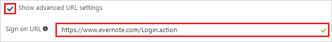
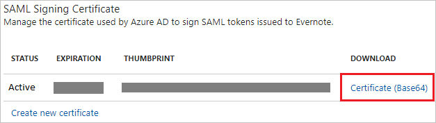

---
title: 'Tutorial: Azure Active Directory integration with Evernote | Microsoft Docs'
description: Learn how to configure single sign-on between Azure Active Directory and Evernote.
services: active-directory
documentationCenter: na
author: jeevansd
manager: mtillman
ms.reviewer: joflore

ms.assetid: 28acce3e-22a0-4a37-8b66-6e518d777350
ms.service: active-directory
ms.component: saas-app-tutorial
ms.workload: identity
ms.tgt_pltfrm: na
ms.devlang: na
ms.topic: article
ms.date: 07/20/2017
ms.author: jeedes

---
# Tutorial: Azure Active Directory integration with Evernote

In this tutorial, you learn how to integrate Evernote with Azure Active Directory (Azure AD).

Integrating Evernote with Azure AD provides you with the following benefits:

- You can control in Azure AD who has access to Evernote.
- You can enable your users to automatically get signed-on to Evernote (Single Sign-On) with their Azure AD accounts.
- You can manage your accounts in one central location - the Azure portal.

If you want to know more details about SaaS app integration with Azure AD, see [what is application access and single sign-on with Azure Active Directory](../manage-apps/what-is-single-sign-on.md).

## Prerequisites

To configure Azure AD integration with Evernote, you need the following items:

- An Azure AD subscription
- An Evernote single sign-on enabled subscription

> [!NOTE]
> To test the steps in this tutorial, we do not recommend using a production environment.

To test the steps in this tutorial, you should follow these recommendations:

- Do not use your production environment, unless it is necessary.
- If you don't have an Azure AD trial environment, you can [get a one-month trial](https://azure.microsoft.com/pricing/free-trial/).

## Scenario description
In this tutorial, you test Azure AD single sign-on in a test environment. 
The scenario outlined in this tutorial consists of two main building blocks:

1. Adding Evernote from the gallery
1. Configuring and testing Azure AD single sign-on

## Adding Evernote from the gallery
To configure the integration of Evernote into Azure AD, you need to add Evernote from the gallery to your list of managed SaaS apps.

**To add Evernote from the gallery, perform the following steps:**

1. In the **[Azure portal](https://portal.azure.com)**, on the left navigation panel, click **Azure Active Directory** icon. 

	![The Azure Active Directory button][1]

1. Navigate to **Enterprise applications**. Then go to **All applications**.

	![The Enterprise applications blade][2]
	
1. To add new application, click **New application** button on the top of dialog.

	![The New application button][3]

1. In the search box, type **Evernote**, select **Evernote** from result panel then click **Add** button to add the application.

	

## Configure and test Azure AD single sign-on

In this section, you configure and test Azure AD single sign-on with Evernote based on a test user called "Britta Simon".

For single sign-on to work, Azure AD needs to know what the counterpart user in Evernote is to a user in Azure AD. In other words, a link relationship between an Azure AD user and the related user in Evernote needs to be established.

In Evernote, assign the value of the **user name** in Azure AD as the value of the **Username** to establish the link relationship.

To configure and test Azure AD single sign-on with Evernote, you need to complete the following building blocks:

1. **[Configure Azure AD Single Sign-On](#configure-azure-ad-single-sign-on)** - to enable your users to use this feature.
1. **[Create an Azure AD test user](#create-an-azure-ad-test-user)** - to test Azure AD single sign-on with Britta Simon.
1. **[Create an Evernote test user](#create-an-evernote-test-user)** - to have a counterpart of Britta Simon in Evernote that is linked to the Azure AD representation of user.
1. **[Assign the Azure AD test user](#assign-the-azure-ad-test-user)** - to enable Britta Simon to use Azure AD single sign-on.
1. **[Test single sign-on](#test-single-sign-on)** - to verify whether the configuration works.

### Configure Azure AD single sign-on

In this section, you enable Azure AD single sign-on in the Azure portal and configure single sign-on in your Evernote application.

**To configure Azure AD single sign-on with Evernote, perform the following steps:**

1. In the Azure portal, on the **Evernote** application integration page, click **Single sign-on**.

	![Configure single sign-on link][4]

1. On the **Single sign-on** dialog, select **Mode** as	**SAML-based Sign-on** to enable single sign-on.
 
	

1. On the **Evernote Domain and URLs** section, perform the following steps if you wish to configure the application in IDP initiated mode:

	

    In the **Identifier** textbox, type the URL: `https://www.evernote.com/saml2`

1. Check **Show advanced URL settings** and perform the following step if you wish to configure the application in **SP** initiated mode:

	

    In the **Sign on URL** textbox, type the URL: `https://www.evernote.com/Login.action`	

1. On the **SAML Signing Certificate** section, click **Certificate(Base64)** and then save the certificate file on your computer.

	 

1. Click **Save** button.

	

1. On the **Evernote Configuration** section, click **Configure Evernote** to open **Configure sign-on** window. Copy the **SAML Single Sign-On Service URL** from the **Quick Reference section.**

	 

1. In a different web browser window, log into your Evernote company site as an administrator.

1. Go to **'Admin Console'**

	

1. From the **'Admin Console'**, go to **‘Security’** and select **‘Single Sign-On’**

	

1. Configure the following values:

	
	
	a.  **Enable SSO:** SSO is enabled by default (Click **Disable Single Sign-on** to remove the SSO requirement)

	b. Paste **SAML Single sign-on Service URL** value, which you have copied from the Azure portal into the **SAML HTTP Request URL** textbox.

	c. Open the downloaded certificate from Azure AD in a notepad and copy the content including "BEGIN CERTIFICATE" and "END CERTIFICATE" and paste it into the **X.509 Certificate** textbox. 

	d.Click **Save Changes**

> [!TIP]
> You can now read a concise version of these instructions inside the [Azure portal](https://portal.azure.com), while you are setting up the app!  After adding this app from the **Active Directory > Enterprise Applications** section, simply click the **Single Sign-On** tab and access the embedded documentation through the **Configuration** section at the bottom. You can read more about the embedded documentation feature here: [Azure AD embedded documentation]( https://go.microsoft.com/fwlink/?linkid=845985)
> 

### Create an Azure AD test user

The objective of this section is to create a test user in the Azure portal called Britta Simon.

   ![Create an Azure AD test user][100]

**To create a test user in Azure AD, perform the following steps:**

1. In the Azure portal, in the left pane, click the **Azure Active Directory** button.

    

1. To display the list of users, go to **Users and groups**, and then click **All users**.

    

1. To open the **User** dialog box, click **Add** at the top of the **All Users** dialog box.

    

1. In the **User** dialog box, perform the following steps:

    

    a. In the **Name** box, type **BrittaSimon**.

    b. In the **User name** box, type the email address of user Britta Simon.

    c. Select the **Show Password** check box, and then write down the value that's displayed in the **Password** box.

    d. Click **Create**.
 
### Create an Evernote test user

In order to enable Azure AD users to log into Evernote, they must be provisioned into Evernote.  
In the case of Evernote, provisioning is a manual task.

**To provision a user accounts, perform the following steps:**

1. Log in to your Evernote company site as an administrator.

1. Click the **'Admin Console'**.

	

1. From the **'Admin Console'**, go to **‘Add users’**.

	

1. **Add team members** in the **Email** textbox, type the email address of user account and click **Invite.**

	
	
1. After invitation is sent, the Azure Active Directory account holder will receive an email to accept the invitation.

### Assign the Azure AD test user

In this section, you enable Britta Simon to use Azure single sign-on by granting access to Evernote.

![Assign the user role][200] 

**To assign Britta Simon to Evernote, perform the following steps:**

1. In the Azure portal, open the applications view, and then navigate to the directory view and go to **Enterprise applications** then click **All applications**.

	![Assign User][201] 

1. In the applications list, select **Evernote**.

	  

1. In the menu on the left, click **Users and groups**.

	![The "Users and groups" link][202]

1. Click **Add** button. Then select **Users and groups** on **Add Assignment** dialog.

	![The Add Assignment pane][203]

1. On **Users and groups** dialog, select **Britta Simon** in the Users list.

1. Click **Select** button on **Users and groups** dialog.

1. Click **Assign** button on **Add Assignment** dialog.
	
### Test single sign-on

In this section, you test your Azure AD single sign-on configuration using the Access Panel.

When you click the Evernote tile in the Access Panel, you should get signed-on to your Evernote application. You'll be logging in as an Organization account but then need to log in with your personal account. 

## Additional resources

* [List of Tutorials on How to Integrate SaaS Apps with Azure Active Directory](tutorial-list.md)
* [What is application access and single sign-on with Azure Active Directory?](../manage-apps/what-is-single-sign-on.md)

<!--Image references-->

[1]: ./media/evernote-tutorial/tutorial_general_01.png
[2]: ./media/evernote-tutorial/tutorial_general_02.png
[3]: ./media/evernote-tutorial/tutorial_general_03.png
[4]: ./media/evernote-tutorial/tutorial_general_04.png

[100]: ./media/evernote-tutorial/tutorial_general_100.png

[200]: ./media/evernote-tutorial/tutorial_general_200.png
[201]: ./media/evernote-tutorial/tutorial_general_201.png
[202]: ./media/evernote-tutorial/tutorial_general_202.png
[203]: ./media/evernote-tutorial/tutorial_general_203.png

