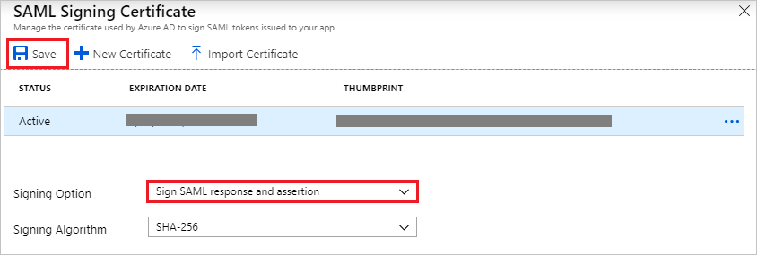
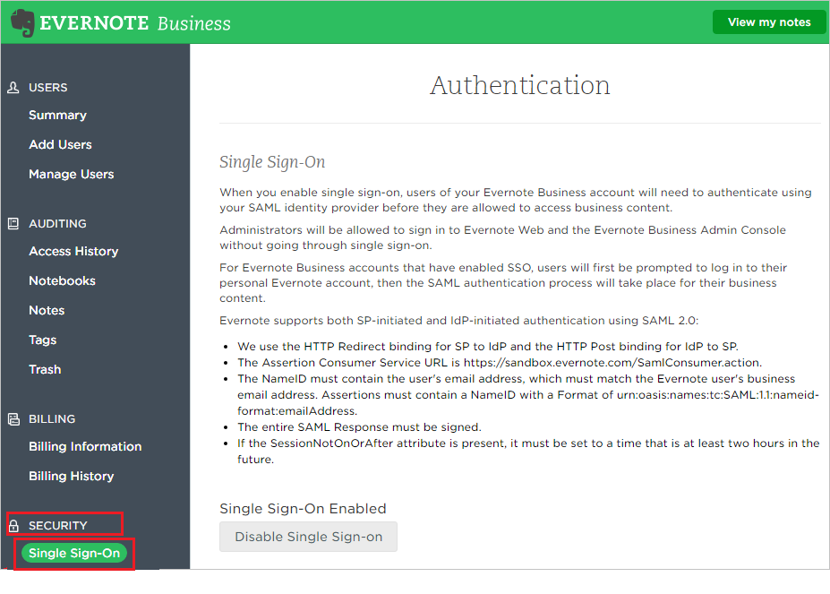
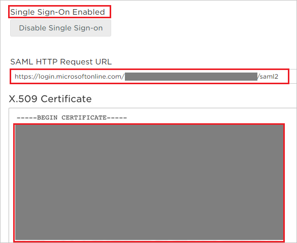

# Tutorial: Azure Active Directory integration with Evernote

In this tutorial, you learn how to integrate Evernote with Azure Active Directory (Azure AD).
Integrating Evernote with Azure AD provides you with the following benefits:

* You can control in Azure AD who has access to Evernote.
* You can enable your users to be automatically signed-in to Evernote (Single Sign-On) with their Azure AD accounts.
* You can manage your accounts in one central location - the Azure portal.

If you want to know more details about SaaS app integration with Azure AD, see [What is application access and single sign-on with Azure Active Directory](https://docs.microsoft.com/azure/active-directory/active-directory-appssoaccess-whatis).
If you don't have an Azure subscription, [create a free account](https://azure.microsoft.com/free/) before you begin.

## Prerequisites

To configure Azure AD integration with Evernote, you need the following items:

* An Azure AD subscription. If you don't have an Azure AD environment, you can get one-month trial [here](https://azure.microsoft.com/pricing/free-trial/)
* Evernote single sign-on enabled subscription

## Scenario description

In this tutorial, you configure and test Azure AD single sign-on in a test environment.

* Evernote supports **SP** and **IDP** initiated SSO

## Adding Evernote from the gallery

To configure the integration of Evernote into Azure AD, you need to add Evernote from the gallery to your list of managed SaaS apps.

**To add Evernote from the gallery, perform the following steps:**

1. In the **[Azure portal](https://portal.azure.com)**, on the left navigation panel, click the **Azure Active Directory** icon.

	

2. Navigate to **Enterprise Applications** and then select the **All Applications** option.

	

3. To add a new application, click the **New application** button at the top of the dialog.

	

4. In the search box, type **Evernote**, select **Evernote** from the result panel then click the **Add** button to add the application.

	 

## Configure and test Azure AD single sign-on

In this section, you configure and test Azure AD single sign-on with Evernote based on a test user called **Britta Simon**.
For single sign-on to work, a link relationship between an Azure AD user and the related user in Evernote needs to be established.

To configure and test Azure AD single sign-on with Evernote, you need to complete the following building blocks:

1. **[Configure Azure AD Single Sign-On](#configure-azure-ad-single-sign-on)** - to enable your users to use this feature.
2. **[Configure Evernote Single Sign-On](#configure-evernote-single-sign-on)** - to configure the Single Sign-On settings on application side.
3. **[Create an Azure AD test user](#create-an-azure-ad-test-user)** - to test Azure AD single sign-on with Britta Simon.
4. **[Assign the Azure AD test user](#assign-the-azure-ad-test-user)** - to enable Britta Simon to use Azure AD single sign-on.
5. **[Create Evernote test user](#create-evernote-test-user)** - to have a counterpart of Britta Simon in Evernote that is linked to the Azure AD representation of user.
6. **[Test single sign-on](#test-single-sign-on)** - to verify whether the configuration works.

### Configure Azure AD single sign-on

In this section, you enable Azure AD single sign-on in the Azure portal.

To configure Azure AD single sign-on with Evernote, perform the following steps:

1. In the [Azure portal](https://portal.azure.com/), on the **Evernote** application integration page, select **Single sign-on**.

    

2. On the **Select a Single sign-on method** dialog, select **SAML/WS-Fed** mode to enable single sign-on.

    

3. On the **Set up Single Sign-On with SAML** page, click the **Edit** icon to open the **Basic SAML Configuration** dialog.

	

4. On the **Basic SAML Configuration** section, if you wish to configure the application in **IDP** initiated mode, perform the following step:

    

    In the **Identifier** text box, type a URL:
    `https://www.evernote.com/saml2`

5. Click **Set additional URLs** and perform the following step if you wish to configure the application in **SP** initiated mode:

    

    In the **Sign-on URL** text box, type a URL:
    `https://www.evernote.com/Login.action`

6. On the **Set up Single Sign-On with SAML** page, in the **SAML Signing Certificate** section, click **Download** to download the **Certificate (Base64)** from the given options as per your requirement and save it on your computer.

	

7. To modify the **Signing** options, click the **Edit** button to open the **SAML Signing Certificate** dialog.

	 

	

	a. Select the **Sign SAML response and assertion** option for **Signing Option**.

	b. Click **Save**

8. On the **Set up Evernote** section, copy the appropriate URL(s) as per your requirement.

	

	a. Login URL

	b. Azure AD Identifier

	c. Logout URL

### Configure Evernote Single Sign-On

1. In a different web browser window, log into your Evernote company site as an administrator.

2. Go to **'Admin Console'**

	

3. From the **'Admin Console'**, go to **‘Security’** and select **‘Single Sign-On’**

	

4. Configure the following values:

	
	
	a.  **Enable SSO:** SSO is enabled by default (Click **Disable Single Sign-on** to remove the SSO requirement)

	b. Paste **Login URL** value, which you have copied from the Azure portal into the **SAML HTTP Request URL** textbox.

	c. Open the downloaded certificate from Azure AD in a notepad and copy the content including "BEGIN CERTIFICATE" and "END CERTIFICATE" and paste it into the **X.509 Certificate** textbox. 

	d.Click **Save Changes**

### Create an Azure AD test user 

The objective of this section is to create a test user in the Azure portal called Britta Simon.

1. In the Azure portal, in the left pane, select **Azure Active Directory**, select **Users**, and then select **All users**.

    

2. Select **New user** at the top of the screen.

    

3. In the User properties, perform the following steps.

    

    a. In the **Name** field enter **BrittaSimon**.
  
    b. In the **User name** field type `brittasimon@yourcompanydomain.extension`. For example, BrittaSimon@contoso.com

    c. Select **Show password** check box, and then write down the value that's displayed in the Password box.

    d. Click **Create**.

### Assign the Azure AD test user

In this section, you enable Britta Simon to use Azure single sign-on by granting access to Evernote.

1. In the Azure portal, select **Enterprise Applications**, select **All applications**, then select **Evernote**.

	

2. In the applications list, select **Evernote**.

	

3. In the menu on the left, select **Users and groups**.

    

4. Click the **Add user** button, then select **Users and groups** in the **Add Assignment** dialog.

    

5. In the **Users and groups** dialog select **Britta Simon** in the Users list, then click the **Select** button at the bottom of the screen.

6. If you are expecting any role value in the SAML assertion then in the **Select Role** dialog select the appropriate role for the user from the list, then click the **Select** button at the bottom of the screen.

7. In the **Add Assignment** dialog click the **Assign** button.

### Create Evernote test user

In order to enable Azure AD users to log into Evernote, they must be provisioned into Evernote.  
In the case of Evernote, provisioning is a manual task.

**To provision a user accounts, perform the following steps:**

1. Log in to your Evernote company site as an administrator.

2. Click the **'Admin Console'**.

	

3. From the **'Admin Console'**, go to **‘Add users’**.

	

4. **Add team members** in the **Email** textbox, type the email address of user account and click **Invite.**

	
	
5. After invitation is sent, the Azure Active Directory account holder will receive an email to accept the invitation.

### Test single sign-on 

In this section, you test your Azure AD single sign-on configuration using the Access Panel.

When you click the Evernote tile in the Access Panel, you should be automatically signed in to the Evernote for which you set up SSO. For more information about the Access Panel, see [Introduction to the Access Panel](https://docs.microsoft.com/azure/active-directory/active-directory-saas-access-panel-introduction).

## Additional resources

- [List of Tutorials on How to Integrate SaaS Apps with Azure Active Directory](https://docs.microsoft.com/azure/active-directory/active-directory-saas-tutorial-list)

- [What is application access and single sign-on with Azure Active Directory?](https://docs.microsoft.com/azure/active-directory/active-directory-appssoaccess-whatis)

- [What is Conditional Access in Azure Active Directory?](https://docs.microsoft.com/azure/active-directory/conditional-access/overview)

