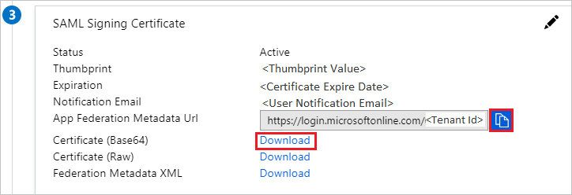

# Tutorial: Azure AD SSO integration with ExpenseIn

In this tutorial, you'll learn how to integrate ExpenseIn with Azure Active Directory (Azure AD). When you integrate ExpenseIn with Azure AD, you can:

* Control in Azure AD who has access to ExpenseIn.
* Enable your users to be automatically signed-in to ExpenseIn with their Azure AD accounts.
* Manage your accounts in one central location - the Azure portal.

## Prerequisites

To get started, you need the following items:

* An Azure AD subscription. If you don't have a subscription, you can get a [free account](https://azure.microsoft.com/free/).
* ExpenseIn single sign-on (SSO) enabled subscription.

## Scenario description

In this tutorial, you configure and test Azure AD SSO in a test environment. 

* ExpenseIn supports **SP and IDP** initiated SSO.

## Add ExpenseIn from the gallery

To configure the integration of ExpenseIn into Azure AD, you need to add ExpenseIn from the gallery to your list of managed SaaS apps.

1. Sign in to the Azure portal using either a work or school account, or a personal Microsoft account.
1. On the left navigation pane, select the **Azure Active Directory** service.
1. Navigate to **Enterprise Applications** and then select **All Applications**.
1. To add new application, select **New application**.
1. In the **Add from the gallery** section, type **ExpenseIn** in the search box.
1. Select **ExpenseIn** from results panel and then add the app. Wait a few seconds while the app is added to your tenant.

 Alternatively, you can also use the [Enterprise App Configuration Wizard](https://portal.office.com/AdminPortal/home?Q=Docs#/azureadappintegration). In this wizard, you can add an application to your tenant, add users/groups to the app, assign roles, as well as walk through the SSO configuration as well. [Learn more about Microsoft 365 wizards.](/microsoft-365/admin/misc/azure-ad-setup-guides)

## Configure and test Azure AD SSO for ExpenseIn

Configure and test Azure AD SSO with ExpenseIn using a test user called **B.Simon**. For SSO to work, you need to establish a link relationship between an Azure AD user and the related user in ExpenseIn.

To configure and test Azure AD SSO with ExpenseIn, perform the following steps:

1. **[Configure Azure AD SSO](#configure-azure-ad-sso)** to enable your users to use this feature.
    1. **[Create an Azure AD test user](#create-an-azure-ad-test-user)** to test Azure AD single sign-on with B.Simon.
    1. **[Assign the Azure AD test user](#assign-the-azure-ad-test-user)** to enable B.Simon to use Azure AD single sign-on.
1. **[Configure ExpenseIn SSO](#configure-expensein-sso)** to configure the SSO settings on application side.
    1. **[Create ExpenseIn test user](#create-expensein-test-user)** to have a counterpart of B.Simon in ExpenseIn that is linked to the Azure AD representation of user.
1. **[Test SSO](#test-sso)** to verify whether the configuration works.

## Configure Azure AD SSO

Follow these steps to enable Azure AD SSO in the Azure portal.

1. In the Azure portal, on the **ExpenseIn** application integration page, find the **Manage** section and select **Single sign-on**.
1. On the **Select a Single sign-on method** page, select **SAML**.
1. On the **Set up Single Sign-On with SAML** page, click the pencil icon for **Basic SAML Configuration** to edit the settings.

   

4. On the **Basic SAML Configuration** section, the user does not have to perform any steps as the app is already pre-integrated with Azure.

5. Click **Set additional URLs** and perform the following step if you wish to configure the application in **SP** initiated mode:

    In the **Sign-on URL** text box, type the URL:
    `https://app.expensein.com/saml`

1. On the **Set up Single Sign-On with SAML** page, in the **SAML Signing Certificate** section, click copy button to copy **App Federation Metadata Url** and click **Download** to download the **Certificate (Base64)** and save it on your computer.

   

1. On the **Set up ExpenseIn** section, copy the appropriate URL(s) based on your requirement.

   

### Create an Azure AD test user

In this section, you'll create a test user in the Azure portal called B.Simon.

1. From the left pane in the Azure portal, select **Azure Active Directory**, select **Users**, and then select **All users**.
1. Select **New user** at the top of the screen.
1. In the **User** properties, follow these steps:
   1. In the **Name** field, enter `B.Simon`.  
   1. In the **User name** field, enter the username@companydomain.extension. For example, `B.Simon@contoso.com`.
   1. Select the **Show password** check box, and then write down the value that's displayed in the **Password** box.
   1. Click **Create**.

### Assign the Azure AD test user

In this section, you'll enable B.Simon to use Azure single sign-on by granting access to ExpenseIn.

1. In the Azure portal, select **Enterprise Applications**, and then select **All applications**.
1. In the applications list, select **ExpenseIn**.
1. In the app's overview page, find the **Manage** section and select **Users and groups**.
1. Select **Add user**, then select **Users and groups** in the **Add Assignment** dialog.
1. In the **Users and groups** dialog, select **B.Simon** from the Users list, then click the **Select** button at the bottom of the screen.
1. If you're expecting any role value in the SAML assertion, in the **Select Role** dialog, select the appropriate role for the user from the list and then click the **Select** button at the bottom of the screen.
1. In the **Add Assignment** dialog, click the **Assign** button.

## Configure ExpenseIn SSO

1. In a different web browser window, sign in to your ExpenseIn company site as an administrator

1. Click on **Admin** on the top of the page then navigate to **Single Sign-On** and click **Add provider**.

	 

1. On the **New Identity Provider** pop-up, Perform the following steps:

    

	a. In the **Provider Name** text box, type the name; for example, Azure.

	b. Select **Yes** for **Allow Provider Initiated Sign-On**.

	c. In the **Target Url** text box, paste the value of **Login URL**, which you have copied from Azure portal.

    d. In the **Issuer** text box, paste the value of **Azure AD Identifier**, which you have copied from Azure portal.

    e. Open the Certificate (Base64) in Notepad, copy its content and paste it in the **Certificate** text box.

	f. Click **Create**.

### Create ExpenseIn test user

To enable Azure AD users to sign in to ExpenseIn, they must be provisioned into ExpenseIn. In ExpenseIn, provisioning is a manual task.

**To provision a user account, perform the following steps:**

1. Sign in to ExpenseIn as an Administrator.

2. Click on **Admin** on the top of the page then navigate to **Users** and click **New User**.

	 

3. On the **Details** pop-up, perform the following steps:

    

    a. In **First Name** text box, enter the first name of user like **B**.

    b. In **Last Name** text box, enter the last name of user like **Simon**.

    c. In **Email** text box, enter the email of user like `B.Simon@contoso.com`.

    d. Click **Create**.

## Test SSO

In this section, you test your Azure AD single sign-on configuration with following options. 

#### SP initiated:

* Click on **Test this application** in Azure portal. This will redirect to ExpenseIn Sign on URL where you can initiate the login flow.  

* Go to ExpenseIn Sign-on URL directly and initiate the login flow from there.

#### IDP initiated:

* Click on **Test this application** in Azure portal and you should be automatically signed in to the ExpenseIn for which you set up the SSO. 

You can also use Microsoft My Apps to test the application in any mode. When you click the ExpenseIn tile in the My Apps, if configured in SP mode you would be redirected to the application sign on page for initiating the login flow and if configured in IDP mode, you should be automatically signed in to the ExpenseIn for which you set up the SSO. For more information about the My Apps, see [Introduction to the My Apps](../user-help/my-apps-portal-end-user-access.md).

## Next steps

Once you configure ExpenseIn you can enforce session control, which protects exfiltration and infiltration of your organization’s sensitive data in real time. Session control extends from Conditional Access. [Learn how to enforce session control with Microsoft Defender for Cloud Apps](/cloud-app-security/proxy-deployment-aad).
