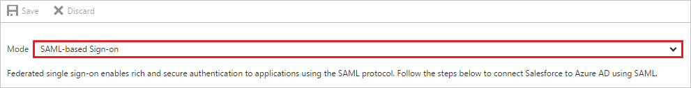
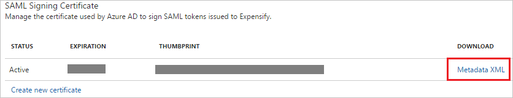
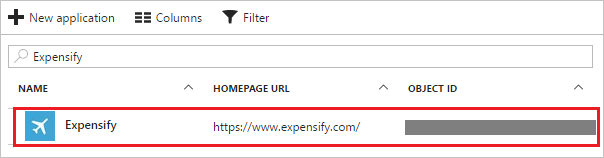

---
title: 'Tutorial: Azure Active Directory integration with Expensify | Microsoft Docs'
description: Learn how to configure single sign-on between Azure Active Directory and Expensify.
services: active-directory
documentationCenter: na
author: jeevansd
manager: mtillman
ms.reviewer: joflore

ms.assetid: 1e761484-7a2f-4321-91f4-6d5d0b69344e
ms.service: active-directory
ms.component: saas-app-tutorial
ms.workload: identity
ms.tgt_pltfrm: na
ms.devlang: na
ms.topic: article
ms.date: 10/2/2017
ms.author: jeedes

---
# Tutorial: Azure Active Directory integration with Expensify

In this tutorial, you learn how to integrate Expensify with Azure Active Directory (Azure AD).

Integrating Expensify with Azure AD provides you with the following benefits:

- You can control in Azure AD who has access to Expensify.
- You can enable your users to automatically get signed-on to Expensify (Single Sign-On) with their Azure AD accounts.
- You can manage your accounts in one central location - the Azure portal.

If you want to know more details about SaaS app integration with Azure AD, see [what is application access and single sign-on with Azure Active Directory](../manage-apps/what-is-single-sign-on.md).

## Prerequisites

To configure Azure AD integration with Expensify, you need the following items:

- An Azure AD subscription
- An Expensify single sign-on enabled subscription

> [!NOTE]
> To test the steps in this tutorial, we do not recommend using a production environment.

To test the steps in this tutorial, you should follow these recommendations:

- Do not use your production environment, unless it is necessary.
- If you don't have an Azure AD trial environment, you can [get a one-month trial](https://azure.microsoft.com/pricing/free-trial/).

## Scenario description
In this tutorial, you test Azure AD single sign-on in a test environment. 
The scenario outlined in this tutorial consists of two main building blocks:

1. Adding Expensify from the gallery
1. Configuring and testing Azure AD single sign-on

## Adding Expensify from the gallery
To configure the integration of Expensify into Azure AD, you need to add Expensify from the gallery to your list of managed SaaS apps.

**To add Expensify from the gallery, perform the following steps:**

1. In the **[Azure portal](https://portal.azure.com)**, on the left navigation panel, click **Azure Active Directory** icon. 

	![The Azure Active Directory button][1]

1. Navigate to **Enterprise applications**. Then go to **All applications**.

	![The Enterprise applications blade][2]
	
1. To add new application, click **New application** button on the top of dialog.

	![The New application button][3]

1. In the search box, type **Expensify**, select **Expensify** from result panel then click **Add** button to add the application.

	

## Configure and test Azure AD single sign-on

In this section, you configure and test Azure AD single sign-on with Expensify based on a test user called "Britta Simon".

For single sign-on to work, Azure AD needs to know what the counterpart user in Expensify is to a user in Azure AD. In other words, a link relationship between an Azure AD user and the related user in Expensify needs to be established.

In Expensify, assign the value of the **user name** in Azure AD as the value of the **Username** to establish the link relationship.

To configure and test Azure AD single sign-on with Expensify, you need to complete the following building blocks:

1. **[Configure Azure AD Single Sign-On](#configure-azure-ad-single-sign-on)** - to enable your users to use this feature.
1. **[Create an Azure AD test user](#create-an-azure-ad-test-user)** - to test Azure AD single sign-on with Britta Simon.
1. **[Create an Expensify test user](#create-an-expensify-test-user)** - to have a counterpart of Britta Simon in Expensify that is linked to the Azure AD representation of user.
1. **[Assign the Azure AD test user](#assign-the-azure-ad-test-user)** - to enable Britta Simon to use Azure AD single sign-on.
1. **[Test single sign-on](#test-single-sign-on)** - to verify whether the configuration works.

### Configure Azure AD single sign-on

In this section, you enable Azure AD single sign-on in the Azure portal and configure single sign-on in your Expensify application.

**To configure Azure AD single sign-on with Expensify, perform the following steps:**

1. In the Azure portal, on the **Expensify** application integration page, click **Single sign-on**.

	![Configure single sign-on link][4]

1. On the **Single sign-on** dialog, select **Mode** as	**SAML-based Sign-on** to enable single sign-on.
 
	

1. On the **Expensify Domain and URLs** section, perform the following steps:

	

    a. In the **Sign-on URL** textbox, type the URL as: `https://www.expensify.com/authentication/saml/login`

	b. In the **Identifier** textbox, type a URL using the following pattern: `https://www.<companyname>.expensify.com`

	> [!NOTE] 
	> Replace the `<companyname>` section of the Identifier URL with your company's domain. See the example of `https://contoso.expensify.com` above. Contact [Expensify Client support team](mailto:help@expensify.com) to get this value.

1. On the **SAML Signing Certificate** section, click **Metadata XML** and then save the metadata file on your computer.

	 

1. Click **Save** button.

	

1. To enable SSO in Expensify, you first need to enable **Domain Control** in the application. You can enable Domain Control in the application through the steps listed [here](http://help.expensify.com/domain-control). For additional support, work with [Expensify Client support team](mailto:help@expensify.com). Once you have Domain Control enabled, follow these steps:
   
    
	
	a. Sign on to your Expensify application.
	
	b. In the toolbar on the top, click **Admin**.
	
	c. In the left panel, click **Domain**.
	
	d. Click your verified domain name.
	
	e. In the left panel, click **SAML**, and then select **Enabled**.
	
	f. Open the downloaded Federation Metadata from Azure AD in notepad, copy the content, and then paste it into the **Identity Provider Metadata** textbox.

> [!TIP]
> You can now read a concise version of these instructions inside the [Azure portal](https://portal.azure.com), while you are setting up the app!  After adding this app from the **Active Directory > Enterprise Applications** section, simply click the **Single Sign-On** tab and access the embedded documentation through the **Configuration** section at the bottom. You can read more about the embedded documentation feature here: [Azure AD embedded documentation]( https://go.microsoft.com/fwlink/?linkid=845985)
> 

### Create an Azure AD test user

The objective of this section is to create a test user in the Azure portal called Britta Simon.

   ![Create an Azure AD test user][100]

**To create a test user in Azure AD, perform the following steps:**

1. In the Azure portal, in the left pane, click the **Azure Active Directory** button.

    

1. To display the list of users, go to **Users and groups**, and then click **All users**.

    

1. To open the **User** dialog box, click **Add** at the top of the **All Users** dialog box.

    

1. In the **User** dialog box, perform the following steps:

    

    a. In the **Name** box, type **BrittaSimon**.

    b. In the **User name** box, type the email address of user Britta Simon.

    c. Select the **Show Password** check box, and then write down the value that's displayed in the **Password** box.

    d. Click **Create**.
 
### Create an Expensify test user

In this section, you create a user called Britta Simon in Expensify. Work with [Expensify Client support team](mailto:help@expensify.com) to add the users in the Expensify platform.

### Assign the Azure AD test user

In this section, you enable Britta Simon to use Azure single sign-on by granting access to Expensify.

![Assign the user role][200] 

**To assign Britta Simon to Expensify, perform the following steps:**

1. In the Azure portal, open the applications view, and then navigate to the directory view and go to **Enterprise applications** then click **All applications**.

	![Assign User][201] 

1. In the applications list, select **Expensify**.

	  

1. In the menu on the left, click **Users and groups**.

	![The "Users and groups" link][202]

1. Click **Add** button. Then select **Users and groups** on **Add Assignment** dialog.

	![The Add Assignment pane][203]

1. On **Users and groups** dialog, select **Britta Simon** in the Users list.

1. Click **Select** button on **Users and groups** dialog.

1. Click **Assign** button on **Add Assignment** dialog.
	
### Test single sign-on

In this section, you test your Azure AD single sign-on configuration using the Access Panel.

When you click the Expensify tile in the Access Panel, you should get automatically signed-on to your Expensify application.
For more information about the Access Panel, see [Introduction to the Access Panel](../user-help/active-directory-saas-access-panel-introduction.md). 

## Additional resources

* [List of Tutorials on How to Integrate SaaS Apps with Azure Active Directory](tutorial-list.md)
* [What is application access and single sign-on with Azure Active Directory?](../manage-apps/what-is-single-sign-on.md)

<!--Image references-->

[1]: ./media/expensify-tutorial/tutorial_general_01.png
[2]: ./media/expensify-tutorial/tutorial_general_02.png
[3]: ./media/expensify-tutorial/tutorial_general_03.png
[4]: ./media/expensify-tutorial/tutorial_general_04.png

[100]: ./media/expensify-tutorial/tutorial_general_100.png

[200]: ./media/expensify-tutorial/tutorial_general_200.png
[201]: ./media/expensify-tutorial/tutorial_general_201.png
[202]: ./media/expensify-tutorial/tutorial_general_202.png
[203]: ./media/expensify-tutorial/tutorial_general_203.png

