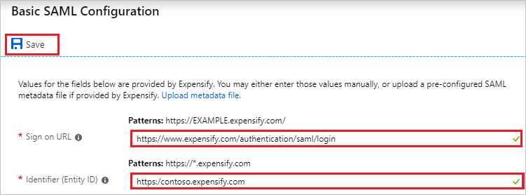
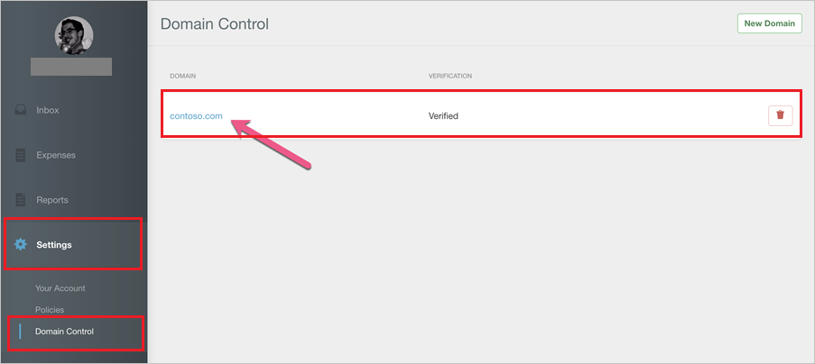
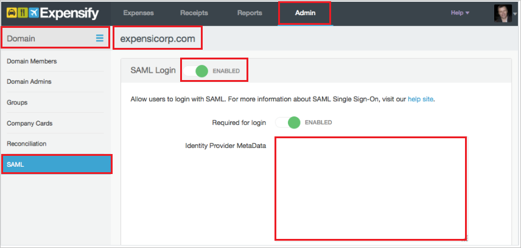

# Tutorial: Azure Active Directory integration with Expensify

In this tutorial, you learn how to integrate Expensify with Azure Active Directory (Azure AD).

Integrating Expensify with Azure AD provides you with the following benefits:

- You can control in Azure AD who has access to Expensify.
- You can enable your users to automatically get signed-on to Expensify (Single Sign-On) with their Azure AD accounts.
- You can manage your accounts in one central location - the Azure portal.

If you want to know more details about SaaS app integration with Azure AD, see [what is application access and single sign-on with Azure Active Directory](../manage-apps/what-is-single-sign-on.md).

## Prerequisites

To configure Azure AD integration with Expensify, you need the following items:

- An Azure AD subscription
- An Expensify single sign-on enabled subscription

> [!NOTE]
> To test the steps in this tutorial, we do not recommend using a production environment.

To test the steps in this tutorial, you should follow these recommendations:

- Do not use your production environment, unless it is necessary.
- If you don't have an Azure AD trial environment, you can [get a one-month trial](https://azure.microsoft.com/pricing/free-trial/).

## Scenario description
In this tutorial, you test Azure AD single sign-on in a test environment. 
The scenario outlined in this tutorial consists of two main building blocks:

1. Adding Expensify from the gallery
1. Configuring and testing Azure AD single sign-on

## Adding Expensify from the gallery

To configure the integration of Expensify into Azure AD, you need to add Expensify from the gallery to your list of managed SaaS apps.

**To add Expensify from the gallery, perform the following steps:**

1. In the **[Azure portal](https://portal.azure.com)**, on the left navigation panel, click **Azure Active Directory** icon. 

	

2. Navigate to **Enterprise applications**. Then go to **All applications**.

	
	
3. To add new application, click **New application** button on the top of dialog.

	

4. In the search box, type **Expensify**, select **Expensify** from result panel then click **Add** button to add the application.

	 

## Configure and test Azure AD single sign-on

In this section, you configure and test Azure AD single sign-on with Expensify based on a test user called "Britta Simon".

For single sign-on to work, Azure AD needs to know what the counterpart user in Expensify is to a user in Azure AD. In other words, a link relationship between an Azure AD user and the related user in Expensify needs to be established.

In Expensify, assign the value of the **user name** in Azure AD as the value of the **Username** to establish the link relationship.

To configure and test Azure AD single sign-on with Expensify, you need to complete the following building blocks:

1. **[Configure Azure AD Single Sign-On](#configure-azure-ad-single-sign-on)** - to enable your users to use this feature.
1. **[Create an Azure AD test user](#create-an-azure-ad-test-user)** - to test Azure AD single sign-on with Britta Simon.
1. **[Create an Expensify test user](#create-an-expensify-test-user)** - to have a counterpart of Britta Simon in Expensify that is linked to the Azure AD representation of user.
1. **[Assign the Azure AD test user](#assign-the-azure-ad-test-user)** - to enable Britta Simon to use Azure AD single sign-on.
1. **[Test single sign-on](#test-single-sign-on)** - to verify whether the configuration works.

### Configure Azure AD single sign-on

In this section, you enable Azure AD single sign-on in the Azure portal and configure single sign-on in your Expensify application.

**To configure Azure AD single sign-on with Expensify, perform the following steps:**

1. In the [Azure portal](https://portal.azure.com/), on the **Expensify** application integration page, select **Single sign-on**.

    

2. Click **Change Single sign-on mode** on top of the screen to select the **SAML** mode.

	  

3. On the **Select a Single sign-on method** dialog, Click **Select** for **SAML** mode to enable single sign-on.

    

4. On the **Set up Single Sign-On with SAML** page, click **Edit** button to open **Basic SAML Configuration** dialog.

	

5. On the **Basic SAML Configuration** section, perform the following steps:

	a. In the **Sign-on URL** text box, type a URL as:
    `https://www.expensify.com/authentication/saml/login`

    b. In the **Identifier** text box, type a URL using the following pattern:
    `https://www.<companyname>.expensify.com`

    

	> [!NOTE] 
	> Replace the <companyname> section of the Identifier URL with your company's domain. See the example of `https://contoso.expensify.com` above. In Expensify, this is the name of your domain as shown from **Settings > Domain Control**.

	

6. On the **Set up Single Sign-On with SAML** page, in the **SAML Signing Certificate** section, click **Download** to download the appropriate certificate as per your requirement and save it on your computer.

	

7. To enable SSO in Expensify, you first need to enable **Domain Control** in the application. You can enable Domain Control in the application through the steps listed [here](http://help.expensify.com/domain-control). For additional support, work with [Expensify Client support team](mailto:help@expensify.com). Once you have Domain Control enabled, follow these steps:
   
    
	
	a. Sign on to your Expensify application.
	
	b. In the left panel, click **Settings** and navigate to **SAML**.
	
	c. Toggle the **SAML Login** option as **Enabled**.
	
	d. Open the downloaded Federation Metadata from Azure AD in notepad, copy the content, and then paste it into the **Identity Provider Metadata** textbox.

### Create an Azure AD test user 

The objective of this section is to create a test user in the Azure portal called Britta Simon.

1. In the Azure portal, in the left pane, select **Azure Active Directory**, select **Users**, and then select **All users**.

    

2. Select **New user** at the top of the screen.

    

3. In the User properties, perform the following steps.

    

    a. In the **Name** field enter **BrittaSimon**.
  
    b. In the **User name** field type **brittasimon@yourcompanydomain.extension**  
    For example, BrittaSimon@contoso.com

    c. Select **Properties**, select the **Show password** check box, and then write down the value that's displayed in the Password box.

    d. Select **Create**.
 
### Create an Expensify test user

In this section, you create a user called Britta Simon in Expensify. Work with [Expensify Client support team](mailto:help@expensify.com) to add the users in the Expensify platform.

### Assign the Azure AD test user

In this section, you enable Britta Simon to use Azure single sign-on by granting access to Expensify.

1. In the Azure portal, select **Enterprise Applications**, select **All applications**.

	

2. In the applications list, select **Expensify**.

	

3. In the menu on the left, select **Users and groups**.

    

4. Select the **Add** button, then select **Users and groups** in the **Add Assignment** dialog.

    

4. In the **Users and groups** dialog select **Britta Simon** in the Users list, then click the **Select** button at the bottom of the screen.

5. In the **Add Assignment** dialog select the **Assign** button.
	
### Test single sign-on

In this section, you test your Azure AD single sign-on configuration using the Access Panel.

When you click the Expensify tile in the Access Panel, you should get automatically signed-on to your Expensify application.
For more information about the Access Panel, see [Introduction to the Access Panel](../user-help/active-directory-saas-access-panel-introduction.md). 

## Additional resources

* [List of Tutorials on How to Integrate SaaS Apps with Azure Active Directory](tutorial-list.md)
* [What is application access and single sign-on with Azure Active Directory?](../manage-apps/what-is-single-sign-on.md)

