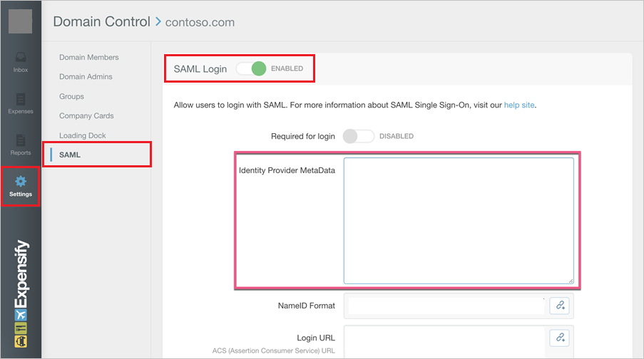

# Tutorial: Integrate Expensify with Microsoft Entra ID

In this tutorial, you'll learn how to integrate Expensify with Microsoft Entra ID. When you integrate Expensify with Microsoft Entra ID, you can:

* Control in Microsoft Entra ID who has access to Expensify.
* Enable your users to be automatically signed-in to Expensify with their Microsoft Entra accounts.
* Manage your accounts in one central location.

## Prerequisites

To get started, you need the following items:

* A Microsoft Entra subscription. If you don't have a subscription, you can get a [free account](https://azure.microsoft.com/free/).
* Expensify single sign-on (SSO) enabled subscription.

## Scenario description

In this tutorial, you configure and test Microsoft Entra SSO in a test environment.

* Expensify supports **SP** initiated SSO.

> [!NOTE]
> Identifier of this application is a fixed string value so only one instance can be configured in one tenant.

## Add Expensify from the gallery

To configure the integration of Expensify into Microsoft Entra ID, you need to add Expensify from the gallery to your list of managed SaaS apps.

1. Sign in to the [Microsoft Entra admin center](https://entra.microsoft.com) as at least a [Cloud Application Administrator](../roles/permissions-reference.md#cloud-application-administrator).
1. Browse to **Identity** > **Applications** > **Enterprise applications** > **New application**.
1. In the **Add from the gallery** section, type **Expensify** in the search box.
1. Select **Expensify** from results panel and then add the app. Wait a few seconds while the app is added to your tenant.

 Alternatively, you can also use the [Enterprise App Configuration Wizard](https://portal.office.com/AdminPortal/home?Q=Docs#/azureadappintegration). In this wizard, you can add an application to your tenant, add users/groups to the app, assign roles, as well as walk through the SSO configuration as well. [Learn more about Microsoft 365 wizards.](/microsoft-365/admin/misc/azure-ad-setup-guides)

## Configure and test Microsoft Entra SSO for Expensify

Configure and test Microsoft Entra SSO with Expensify using a test user called **B.Simon**. For SSO to work, you need to establish a link relationship between a Microsoft Entra user and the related user in Expensify.

To configure and test Microsoft Entra SSO with Expensify, perform the following steps:

1. **[Configure Microsoft Entra SSO](#configure-azure-ad-sso)** - to enable your users to use this feature.
    1. **[Create a Microsoft Entra test user](#create-an-azure-ad-test-user)** - to test Microsoft Entra single sign-on with B.Simon.
    1. **[Assign the Microsoft Entra test user](#assign-the-azure-ad-test-user)** - to enable B.Simon to use Microsoft Entra single sign-on.
2. **[Configure Expensify SSO](#configure-expensify-sso)** - to configure the Single Sign-On settings on application side.
    1. **[Create Expensify test user](#create-expensify-test-user)** - to have a counterpart of B.Simon in Expensify that is linked to the Microsoft Entra representation of user.
6. **[Test SSO](#test-sso)** - to verify whether the configuration works.

## Configure Microsoft Entra SSO

Follow these steps to enable Microsoft Entra SSO.

1. Sign in to the [Microsoft Entra admin center](https://entra.microsoft.com) as at least a [Cloud Application Administrator](../roles/permissions-reference.md#cloud-application-administrator).
1. Browse to **Identity** > **Applications** > **Enterprise applications** > **Expensify** application integration page, find the **Manage** section and select **Single sign-on**.
1. On the **Select a Single sign-on method** page, select **SAML**.
1. On the **Set up Single Sign-On with SAML** page, click the pencil icon for **Basic SAML Configuration** to edit the settings.

   

1. On the **Basic SAML Configuration** section, enter the values for the following fields:

	a. In the **Identifier (Entity ID)** text box, type the URL:
    `https://www.expensify.com`

    b. In the **Reply URL** text box, type a URL using the following pattern:
    `https://www.expensify.com/authentication/saml/loginCallback?domain=<yourdomain>`
    
    c. In the **Sign on URL** text box, type the URL:
    `https://www.expensify.com/authentication/saml/login`

	> [!NOTE]
	> The Reply URL value is not real. Update this value with the actual Reply URL. Contact [Expensify Client support team](mailto:help@expensify.com) to get this value. You can also refer to the patterns shown in the **Basic SAML Configuration** section.

1. On the **Set up Single Sign-On with SAML** page, in the **SAML Signing Certificate** section,  find **Metadata XML** and select **Download** to download the certificate and save it on your computer.

	

1. On the **Set up Expensify** section, copy the appropriate URL(s) based on your requirement.

	

### Create a Microsoft Entra test user

In this section, you'll create a test user called B.Simon.

1. Sign in to the [Microsoft Entra admin center](https://entra.microsoft.com) as at least a [User Administrator](../roles/permissions-reference.md#user-administrator).
1. Browse to **Identity** > **Users** > **All users**.
1. Select **New user** > **Create new user**, at the top of the screen.
1. In the **User** properties, follow these steps:
   1. In the **Display name** field, enter `B.Simon`.  
   1. In the **User principal name** field, enter the username@companydomain.extension. For example, `B.Simon@contoso.com`.
   1. Select the **Show password** check box, and then write down the value that's displayed in the **Password** box.
   1. Select **Review + create**.
1. Select **Create**.

### Assign the Microsoft Entra test user

In this section, you'll enable B.Simon to use single sign-on by granting access to Expensify.

1. Sign in to the [Microsoft Entra admin center](https://entra.microsoft.com) as at least a [Cloud Application Administrator](../roles/permissions-reference.md#cloud-application-administrator).
1. Browse to **Identity** > **Applications** > **Enterprise applications** > **Expensify**.
1. In the app's overview page, select **Users and groups**.
1. Select **Add user/group**, then select **Users and groups** in the **Add Assignment** dialog.
   1. In the **Users and groups** dialog, select **B.Simon** from the Users list, then click the **Select** button at the bottom of the screen.
   1. If you are expecting a role to be assigned to the users, you can select it from the **Select a role** dropdown. If no role has been set up for this app, you see "Default Access" role selected.
   1. In the **Add Assignment** dialog, click the **Assign** button.

## Configure Expensify SSO

To enable SSO in Expensify, you first need to enable **Domain Control** in the application. For additional support, work with [Expensify Client support team](mailto:help@expensify.com). Once you have Domain Control enabled, follow these steps:

1. Sign on to your Expensify application.

2. In the left panel, hover over Settings, then click Domains and navigate to **SAML**.

3. Toggle the **SAML Login** option as **Enabled**.

4. Open the downloaded Federation Metadata from Microsoft Entra ID in notepad, copy the content, and then paste it into the **Identity Provider Metadata** textbox.

### Create Expensify test user

In this section, you create the same user called B.Simon (For example, B.Simon@contoso.com) in Expensify. Check their guide [here](https://community.expensify.com/discussion/4869/how-to-manage-domain-members) for inviting members, or work with the [Expensify Client support team](mailto:help@expensify.com) to add the users in the Expensify platform.

## Test SSO

In this section, you test your Microsoft Entra single sign-on configuration with following options. 

* Click on **Test this application**, this will redirect to Expensify Sign-on URL where you can initiate the login flow. 

* Go to Expensify Sign-on URL directly and initiate the login flow from there.

* You can use Microsoft My Apps. When you click the Expensify tile in the My Apps, this will redirect to Expensify Sign-on URL. For more information about the My Apps, see [Introduction to the My Apps](https://support.microsoft.com/account-billing/sign-in-and-start-apps-from-the-my-apps-portal-2f3b1bae-0e5a-4a86-a33e-876fbd2a4510).

## Next steps

Once you configure Expensify you can enforce session control, which protects exfiltration and infiltration of your organization’s sensitive data in real time. Session control extends from Conditional Access. [Learn how to enforce session control with Microsoft Defender for Cloud Apps](/cloud-app-security/proxy-deployment-any-app).
