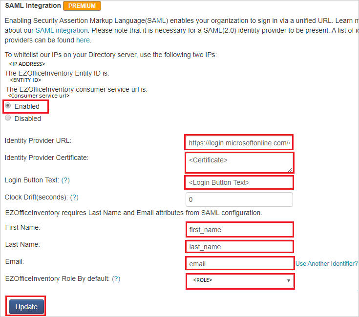

# Tutorial: Azure Active Directory single sign-on (SSO) integration with EZOfficeInventory

In this tutorial, you'll learn how to integrate EZOfficeInventory with Azure Active Directory (Azure AD). When you integrate EZOfficeInventory with Azure AD, you can:

* Control in Azure AD who has access to EZOfficeInventory.
* Enable your users to be automatically signed-in to EZOfficeInventory with their Azure AD accounts.
* Manage your accounts in one central location - the Azure portal.

## Prerequisites

To get started, you need the following items:

* An Azure AD subscription. If you don't have a subscription, you can get a [free account](https://azure.microsoft.com/free/).
* EZOfficeInventory single sign-on (SSO) enabled subscription.

## Scenario description

In this tutorial, you configure and test Azure AD SSO in a test environment.

* EZOfficeInventory supports **SP** initiated SSO.
* EZOfficeInventory supports **Just In Time** user provisioning.

> [!NOTE]
> Identifier of this application is a fixed string value so only one instance can be configured in one tenant.

## Add EZOfficeInventory from the gallery

To configure the integration of EZOfficeInventory into Azure AD, you need to add EZOfficeInventory from the gallery to your list of managed SaaS apps.

1. Sign in to the Azure portal using either a work or school account, or a personal Microsoft account.
1. On the left navigation pane, select the **Azure Active Directory** service.
1. Navigate to **Enterprise Applications** and then select **All Applications**.
1. To add new application, select **New application**.
1. In the **Add from the gallery** section, type **EZOfficeInventory** in the search box.
1. Select **EZOfficeInventory** from results panel and then add the app. Wait a few seconds while the app is added to your tenant.

## Configure and test Azure AD SSO for EZOfficeInventory

Configure and test Azure AD SSO with EZOfficeInventory using a test user called **B.Simon**. For SSO to work, you need to establish a link relationship between an Azure AD user and the related user in EZOfficeInventory.

To configure and test Azure AD SSO with EZOfficeInventory, perform the following steps:

1. **[Configure Azure AD SSO](#configure-azure-ad-sso)** - to enable your users to use this feature.
    1. **[Create an Azure AD test user](#create-an-azure-ad-test-user)** - to test Azure AD single sign-on with B.Simon.
    1. **[Assign the Azure AD test user](#assign-the-azure-ad-test-user)** - to enable B.Simon to use Azure AD single sign-on.
1. **[Configure EZOfficeInventory SSO](#configure-ezofficeinventory-sso)** - to configure the single sign-on settings on application side.
    1. **[Create EZOfficeInventory test user](#create-ezofficeinventory-test-user)** - to have a counterpart of B.Simon in EZOfficeInventory that is linked to the Azure AD representation of user.
1. **[Test SSO](#test-sso)** - to verify whether the configuration works.

## Configure Azure AD SSO

Follow these steps to enable Azure AD SSO in the Azure portal.

1. In the Azure portal, on the **EZOfficeInventory** application integration page, find the **Manage** section and select **single sign-on**.
1. On the **Select a single sign-on method** page, select **SAML**.
1. On the **Set up single sign-on with SAML** page, click the pencil icon for **Basic SAML Configuration** to edit the settings.

   

1. On the **Basic SAML Configuration** section, enter the values for the following fields:

    In the **Sign-on URL** text box, type a URL using the following pattern:
    `https://<SUBDOMAIN>.ezofficeinventory.com/users/sign_in`

	> [!NOTE]
	> The value is not real. Update the value with the actual Sign-On URL. Contact [EZOfficeInventory Client support team](mailto:support@ezofficeinventory.com) to get the value. You can also refer to the patterns shown in the **Basic SAML Configuration** section in the Azure portal.

1. EZOfficeInventory application expects the SAML assertions in a specific format, which requires you to add custom attribute mappings to your SAML token attributes configuration. The following screenshot shows the list of default attributes.

	

1. In addition to above, EZOfficeInventory application expects few more attributes to be passed back in SAML response which are shown below. These attributes are also pre populated but you can review them as per your requirement.

	| Name | Source Attribute|
	| ---------------| --------------- |
	| first_name | user.givenname |
	| last_name | user.surname |
	| email | user.mail |

1. On the **Set up single sign-on with SAML** page, in the **SAML Signing Certificate** section,  find **Certificate (Base64)** and select **Download** to download the certificate and save it on your computer.

	

1. On the **Set up EZOfficeInventory** section, copy the appropriate URL(s) based on your requirement.

	

### Create an Azure AD test user

In this section, you'll create a test user in the Azure portal called B.Simon.

1. From the left pane in the Azure portal, select **Azure Active Directory**, select **Users**, and then select **All users**.
1. Select **New user** at the top of the screen.
1. In the **User** properties, follow these steps:
   1. In the **Name** field, enter `B.Simon`.  
   1. In the **User name** field, enter the username@companydomain.extension. For example, `B.Simon@contoso.com`.
   1. Select the **Show password** check box, and then write down the value that's displayed in the **Password** box.
   1. Click **Create**.

### Assign the Azure AD test user

In this section, you'll enable B.Simon to use Azure single sign-on by granting access to EZOfficeInventory.

1. In the Azure portal, select **Enterprise Applications**, and then select **All applications**.
1. In the applications list, select **EZOfficeInventory**.
1. In the app's overview page, find the **Manage** section and select **Users and groups**.
1. Select **Add user**, then select **Users and groups** in the **Add Assignment** dialog.
1. In the **Users and groups** dialog, select **B.Simon** from the Users list, then click the **Select** button at the bottom of the screen.
1. If you are expecting a role to be assigned to the users, you can select it from the **Select a role** dropdown. If no role has been set up for this app, you see "Default Access" role selected.
1. In the **Add Assignment** dialog, click the **Assign** button.

## Configure EZOfficeInventory SSO

1. To automate the configuration within EZOfficeInventory, you need to install **My Apps Secure Sign-in browser extension** by clicking **Install the extension**.

	

1. After adding extension to the browser, click on **Set up EZOfficeInventory** will direct you to the EZOfficeInventory application. From there, provide the admin credentials to sign into EZOfficeInventory. The browser extension will automatically configure the application for you and automate steps 3-5.

	

1. If you want to setup EZOfficeInventory manually, open a new web browser window and sign into your EZOfficeInventory company site as an administrator and perform the following steps:

1. On the top-right corner of the page, click on **Profile** and then navigate to **Settings** > **Add Ons**.

    

1. Scroll down up to the **SAML Integration** section, perform the following steps:

	

	a. Check the **Enabled** option.

	b. In the **Identity Provider URL** text box, Paste the **Login URL** value, which you have copied from the Azure portal.

	c. Open the Base64 encoded certificate in notepad, copy its content and paste it into the **Identity Provider Certificate** text box.

	d. In **Login Button Text** text box, enter the text of login button.

	e. In **First Name** text box, enter **first_name**.

	f. In **Last Name** text box, enter **last_name**.

	g. In **Email** text box, enter **email**.

	h. Select your role as per your requirement from the **EZOfficeInventory Role By default** option.

	i. Click **Update**.

### Create EZOfficeInventory test user

In this section, a user called Britta Simon is created in EZOfficeInventory. EZOfficeInventory supports just-in-time user provisioning, which is enabled by default. There is no action item for you in this section. If a user doesn't already exist in EZOfficeInventory, a new one is created after authentication.

## Test SSO

In this section, you test your Azure AD single sign-on configuration with following options. 

* Click on **Test this application** in Azure portal. This will redirect to EZOfficeInventory Sign-on URL where you can initiate the login flow. 

* Go to EZOfficeInventory Sign-on URL directly and initiate the login flow from there.

* You can use Microsoft My Apps. When you click the EZOfficeInventory tile in the My Apps, this will redirect to EZOfficeInventory Sign-on URL. For more information about the My Apps, see [Introduction to the My Apps](../user-help/my-apps-portal-end-user-access.md).

## Next steps

Once you configure EZOfficeInventory you can enforce session control, which protects exfiltration and infiltration of your organization’s sensitive data in real time. Session control extends from Conditional Access. [Learn how to enforce session control with Microsoft Cloud App Security](/cloud-app-security/proxy-deployment-aad).
