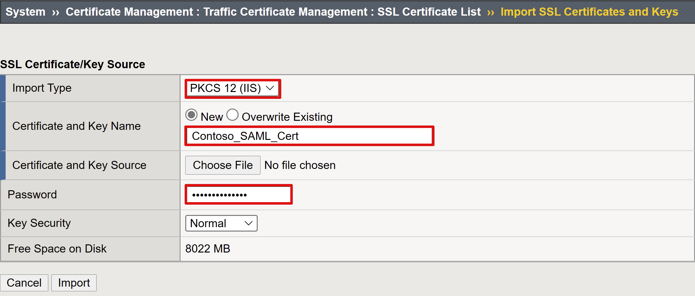
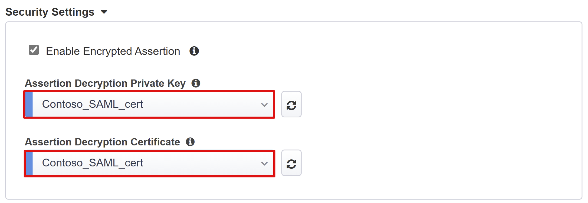
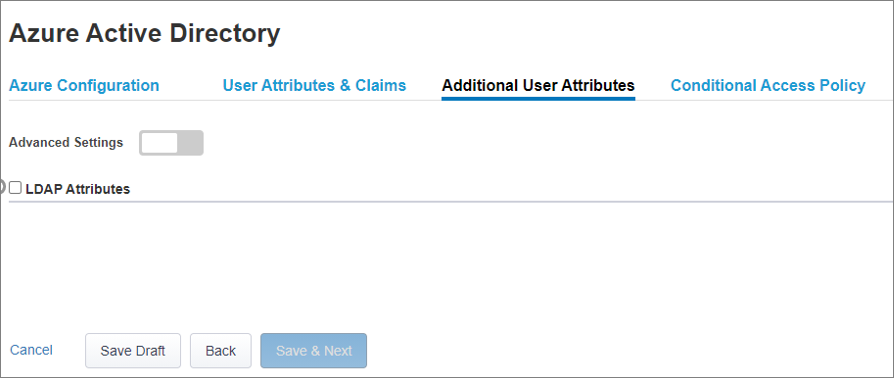
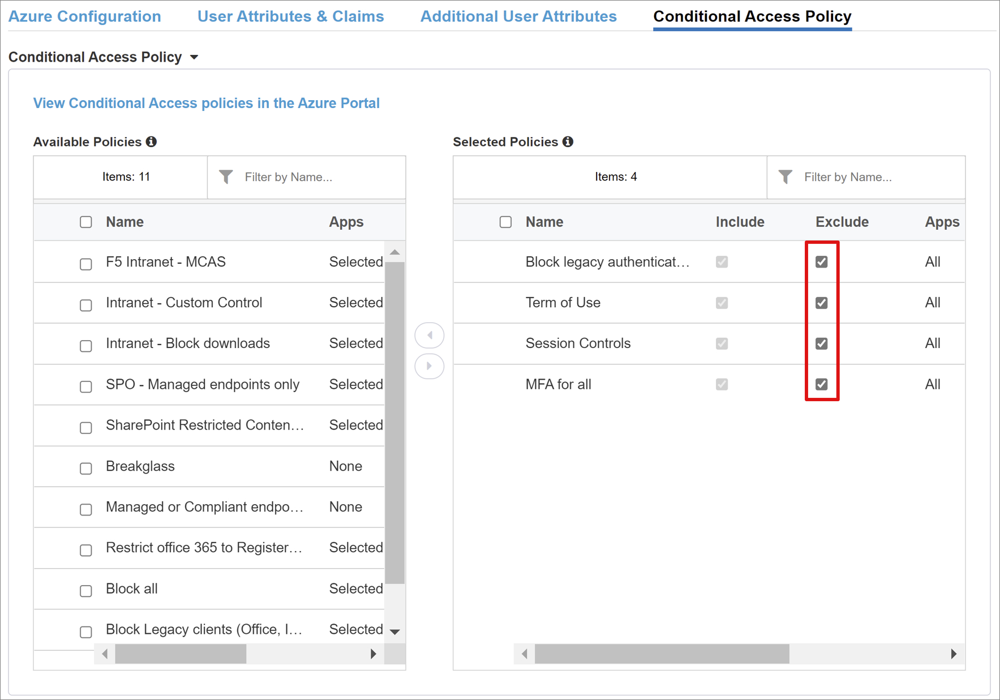
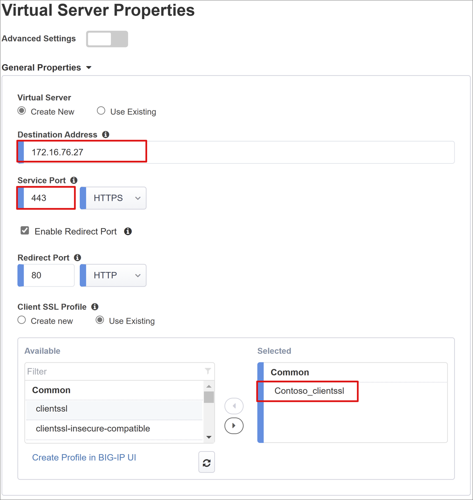
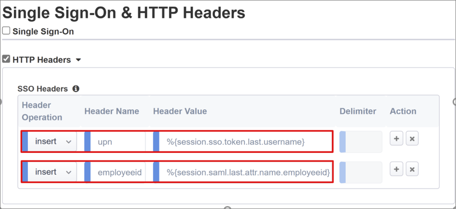
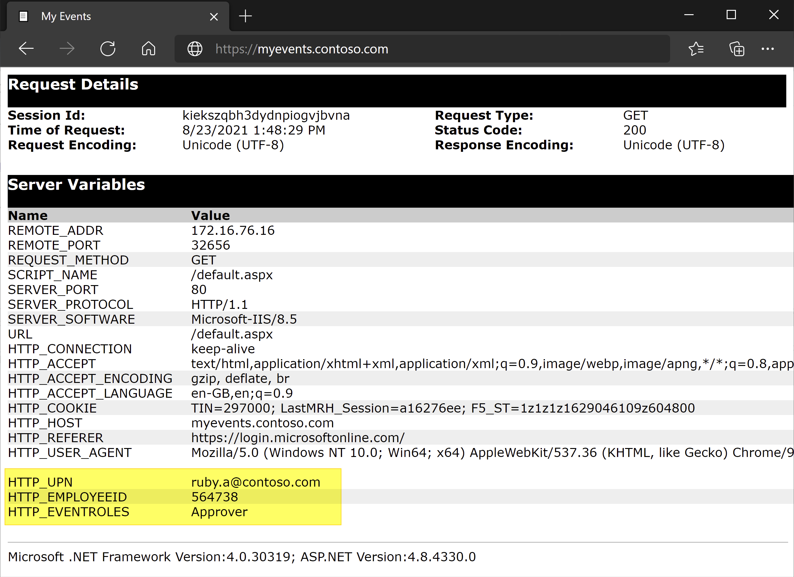

# Tutorial: Configure SSO between Azure AD and F5’s BIG-IP Easy Button for header-based SSO

In this tutorial, you'll learn how to integrate F5 with Azure Active Directory (Azure AD). When you integrate F5 with Azure AD, you can:

* Control in Azure AD who has access to F5.
* Enable your users to be automatically signed-in to F5 with their Azure AD accounts.
* Manage your accounts in one central location - the Azure portal.

> [!NOTE]
> F5 BIG-IP APM [Purchase Now](https://azuremarketplace.microsoft.com/en-us/marketplace/apps/f5-networks.f5-big-ip-best?tab=Overview).

## Scenario description

This scenario looks at the classic legacy application using **HTTP authorization headers** to manage access to protected content.

Being legacy, the application lacks modern protocols to support a direct integration with Azure AD. The application can be modernized, but it is costly, requires careful planning, and introduces risk of potential downtime. Instead, an F5 BIG-IP Application Delivery Controller (ADC) is used to bridge the gap between the legacy application and the modern ID control plane, through protocol transitioning. 

Having a BIG-IP in front of the application enables us to overlay the service with Azure AD pre-authentication and headers-based SSO, significantly improving the overall security posture of the application.

> [!NOTE] 
> Organizations can also gain remote access to this type of application with [Azure AD Application Proxy](../app-proxy/application-proxy.md).

## Scenario architecture

The SHA solution for this scenario is made up of:

**Application:** BIG-IP published service to be protected by Azure AD SHA. 

**Azure AD:** Security Assertion Markup Language (SAML) Identity Provider (IdP) responsible for verification of user credentials, Conditional Access, and SAML based SSO to the BIG-IP. Through SSO, Azure AD provides the BIG-IP with any required session attributes.

**BIG-IP:** Reverse proxy and SAML service provider (SP) to the application, delegating authentication to the SAML IdP before performing header-based SSO to the backend application.

SHA for this scenario supports both SP and IdP initiated flows. The following image illustrates the SP initiated flow.

   

| Steps| Description |
| - |----|
| 1| User connects to application endpoint (BIG-IP) |
| 2| BIG-IP APM access policy redirects user to Azure AD (SAML IdP) |
| 3| Azure AD pre-authenticates user and applies any enforced Conditional Access policies |
| 4| User is redirected to BIG-IP (SAML SP) and SSO is performed using issued SAML token |
| 5| BIG-IP injects Azure AD attributes as headers in request to the application |
| 6| Application authorizes request and returns payload |

## Prerequisites

Prior BIG-IP experience isn’t necessary, but you’ll need:

* An Azure AD free subscription or above.

* An existing BIG-IP or [deploy a BIG-IP Virtual Edition (VE) in Azure.](../manage-apps/f5-bigip-deployment-guide.md).

* Any of the following F5 BIG-IP license SKUs.

  * F5 BIG-IP® Best bundle.

  * F5 BIG-IP Access Policy Manager™ (APM) standalone license.

  * F5 BIG-IP Access Policy Manager™ (APM) add-on license on an existing BIG-IP F5 BIG-IP® Local Traffic Manager™ (LTM).

  * 90-day BIG-IP full feature [trial license](https://www.f5.com/trial/big-ip-trial.php).

* User identities [synchronized](../hybrid/how-to-connect-sync-whatis.md) from an on-premises directory to Azure AD.

* An account with Azure AD application admin [permissions](/azure/active-directory/users-groups-roles/directory-assign-admin-roles#application-administrator).

* An [SSL Web certificate](../manage-apps/f5-bigip-deployment-guide.md#ssl-profile) for publishing services over HTTPS, or use default BIG-IP certs while testing.

* An existing header-based application or [setup a simple IIS header app](/previous-versions/iis/6.0-sdk/ms525396(v=vs.90)) for testing.

## BIG-IP configuration methods

There are many methods to configure BIG-IP for this scenario, including two template-based options and an advanced configuration. This tutorial covers the latest Guided Configuration 16.1 offering an Easy button template. With the Easy Button, admins no longer go back and forth between Azure AD and a BIG-IP to enable services for SHA. The deployment and policy management is handled directly between the APM’s Guided Configuration wizard and Microsoft Graph. This rich integration between BIG-IP APM and Azure AD ensures that applications can quickly, easily support identity federation, SSO, and Azure AD Conditional Access, reducing administrative overhead.

> [!NOTE] 
> All example strings or values referenced throughout this guide should be replaced with those for your actual environment.

## Register Easy Button

Before a client or service can access Microsoft Graph, it must be trusted by the [Microsoft identity platform.](../develop/quickstart-register-app.md)

This first step creates a tenant app registration that will be used to authorize the **Easy Button** access to Graph. Through these permissions, the BIG-IP will be allowed to push the configurations required to establish a trust between a SAML SP instance for published application, and Azure AD as the SAML IdP.

1. Sign in to the [Azure portal](https://portal.azure.com/) using an account with Application Administrative rights.
2. From the left navigation pane, select the **Azure Active Directory** service.
3. Under Manage, select **App registrations > New registration**.
4. Enter a display name for your application. For example, `F5 BIG-IP Easy Button`.
5. Specify who can use the application > **Accounts in this organizational directory only**.
6. Select **Register** to complete the initial app registration.
7. Navigate to **API permissions** and authorize the following Microsoft Graph **Application permissions**:

   * Application.Read.All
   * Application.ReadWrite.All
   * Application.ReadWrite.OwnedBy
   * Directory.Read.All
   * Group.Read.All
   * IdentityRiskyUser.Read.All
   * Policy.Read.All
   * Policy.ReadWrite.ApplicationConfiguration
   * Policy.ReadWrite.ConditionalAccess
   * User.Read.All

8. Grant admin consent for your organization.
9. In the **Certificates & Secrets** blade, generate a new **client secret** and note it down.
10. From the **Overview** blade, note the **Client ID** and **Tenant ID**.

## Configure Easy Button

Initiate the APM's **Guided Configuration** to launch the **Easy Button** Template.

1. Navigate to **Access > Guided Configuration > Microsoft Integration** and select **Azure AD Application**.

   

2. Review the list of configuration steps and select **Next**.

   

3. Follow the sequence of steps required to publish your application.

   

### Configuration Properties

The **Configuration Properties** tab creates a BIG-IP application config and SSO object. Consider the **Azure Service Account Details** section to represent the client you registered in your Azure AD tenant earlier, as an application. These settings allow a BIG-IP's OAuth client to individually register a SAML SP directly in your tenant, along with the SSO properties you would normally configure manually. Easy Button does this for every BIG-IP service being published and enabled for SHA.

Some of these are global settings so can be reused for publishing more applications, further reducing deployment time and effort.

1. Enter a unique **Configuration Name** so admins can easily distinguish between Easy Button configurations.

2. Enable **Single Sign-On (SSO) & HTTP Headers**.

3. Enter the **Tenant Id**, **Client ID**, and **Client Secret** you noted when registering the Easy Button client in your tenant.

4. Confirm the BIG-IP can successfully connect to your tenant, and then select **Next**.

   

### Service Provider

The Service Provider settings define the properties for the SAML SP instance of the application protected through SHA.

1. Enter **Host**. This is the public FQDN of the application being secured.

2. Enter **Entity ID**. This is the identifier Azure AD will use to identify the SAML SP requesting a token.

   

   The optional **Security Settings** specify whether Azure AD should encrypt issued SAML assertions. Encrypting assertions between Azure AD and the BIG-IP APM provides additional assurance that the content tokens can’t be intercepted, and personal or corporate data be compromised.

3.	From the **Assertion Decryption Private Key** list, select **Create New**.
 
      

4.	Select **OK**. This opens the **Import SSL Certificate and Keys** dialog in a new tab. 

6.	Select **PKCS 12 (IIS)** to import your certificate and private key. Once provisioned close the browser tab to return to the main tab.

      

6.	Check **Enable Encrypted Assertion**.
7.	If you have enabled encryption, select your certificate from the **Assertion Decryption Private Key** list. This is the private key for the certificate that BIG-IP APM will use to decrypt Azure AD assertions.
8.	If you have enabled encryption, select your certificate from the **Assertion Decryption Certificate** list. This is the certificate that BIG-IP will upload to Azure AD for encrypting the issued SAML assertions.
   
   

### Azure Active Directory

This section defines all properties that you would normally use to manually configure a new BIG-IP SAML application within your Azure AD tenant. Easy Button provides a set of pre-defined application templates for Oracle PeopleSoft, Oracle E-business Suite, Oracle JD Edwards, SAP ERP as well as generic SHA template for any other apps. For this scenario select **F5 BIG-IP APM Azure AD Integration > Add**.

   

#### Azure Configuration

1. Enter **Display Name** of app that the BIG-IP creates in your Azure AD tenant, and the icon that the users will see on [MyApps portal](https://myapplications.microsoft.com/).

2. Do not enter anything in the **Sign On URL (optional)** to enable IdP initiated sign-on.
   
   

3. Select the refresh icon next to the **Signing Key** and **Signing Certificate** to locate the certificate you imported earlier.
 
5. Enter the certificate’s password in **Signing Key Passphrase**.

6. Enable **Signing Option** (optional). This ensures that BIG-IP only accepts tokens and claims that are signed by Azure AD.
   
   

7. **User and User Groups** are dynamically queried from your Azure AD tenant and used to authorize access to the application. Add a user or group that you can use later for testing, otherwise all access will be denied.
   
   

#### User Attributes & Claims

When a user successfully authenticates, Azure AD issues a SAML token with a default set of claims and attributes uniquely identifying the user. The **User Attributes & Claims tab** shows the default claims to issue for the new application. It also lets you configure more claims.

For this example, you can include one more attribute:

1. Enter **Header Name** as employeeid.

2. Enter **Source Attribute** as user.employeeid.

   

#### Additional User Attributes

In the **Additional User Attributes tab**, you can enable session augmentation required by a variety of distributed systems such as Oracle, SAP, and other JAVA based implementations requiring attributes stored in other directories. Attributes fetched from an LDAP source can then be injected as additional SSO headers to further control access based on roles, Partner IDs, etc. 

   

>[!NOTE] 
>This feature has no correlation to Azure AD but is another source of attributes. 

#### Conditional Access Policy

Conditional Access policies are enforced post Azure AD pre-authentication, to control access based on device, application, location, and risk signals.

The **Available Policies** view, by default, will list all Conditional Access policies that do not include user based actions.

The **Selected Policies** view, by default, displays all policies targeting All cloud apps. These policies cannot be deselected or moved to the Available Policies list as they are enforced at a tenant level.

To select a policy to be applied to the application being published:

1.	Select the desired policy in the **Available Policies** list.
2.	Select the right arrow and move it to the **Selected Policies** list.

Selected policies should either have an **Include** or **Exclude** option checked. If both options are checked, the selected policy is not enforced.

   

> [!NOTE]
> The policy list is enumerated only once when first switching to this tab. A refresh button is available to manually force the wizard to query your tenant, but this button is displayed only when the application has been deployed.

### Virtual Server Properties

A virtual server is a BIG-IP data plane object represented by a virtual IP address listening for clients requests to the application. Any received traffic is processed and evaluated against the APM profile associated with the virtual server, before being directed according to the policy results and settings.

1. Enter **Destination Address**. This is any available IPv4/IPv6 address that the BIG-IP can use to receive client traffic. A corresponding record should also exist in DNS, enabling clients to resolve the external URL of your BIG-IP published application to this IP, instead of the application itself. Using a test PC's localhost DNS is fine for testing.

2. Enter **Service Port** as *443* for HTTPS.

3. Check **Enable Redirect Port** and then enter **Redirect Port**. It redirects incoming HTTP client traffic to HTTPS.

4. The Client SSL Profile enables the virtual server for HTTPS, so that client connections are encrypted over TLS. Select the **Client SSL Profile** you created as part of the prerequisites or leave the default whilst testing.

   

### Pool Properties

The **Application Pool tab** details the services behind a BIG-IP that are represented as a pool, containing one or more application servers.

1. Choose from **Select a Pool**. Create a new pool or select an existing one.

2. Choose the **Load Balancing Method** as `Round Robin`.

3. For **Pool Servers** select an existing node or specify an IP and port for the server hosting the header-based application.

   

Our backend application sits on HTTP port 80 but obviously switch to 443 if yours is HTTPS.

#### Single Sign-On & HTTP Headers

Enabling SSO allows users to access BIG-IP published services without having to enter credentials. The **Easy Button wizard** supports Kerberos, OAuth Bearer, and HTTP authorization headers for SSO, the latter of which we’ll enable to configure the following.

* **Header Operation:** `Insert`
* **Header Name:** `upn`
* **Header Value:** `%{session.saml.last.identity}`

* **Header Operation:** `Insert`
* **Header Name:** `employeeid`
* **Header Value:** `%{session.saml.last.attr.name.employeeid}`

   

>[!NOTE]
>APM session variables defined within curly brackets are CASE sensitive. For example, if you enter OrclGUID when the Azure AD attribute name is being defined as orclguid, it will cause an attribute mapping failure.

### Session Management

The BIG-IPs session management settings are used to define the conditions under which user sessions are terminated or allowed to continue, limits for users and IP addresses, and corresponding user info. Refer to [F5's docs](https://support.f5.com/csp/article/K18390492) for details on these settings.

What isn’t covered here however is Single Log-Out (SLO) functionality, which ensures all sessions between the IdP, the BIG-IP, and the user agent are terminated as users sign off. When the Easy Button instantiates a SAML application in your Azure AD tenant, it also populates the Logout Url with the APM’s SLO endpoint. That way IdP initiated sign-outs from the Azure AD MyApps portal also terminate the session between the BIG-IP and a client.

Along with this the SAML federation metadata for the published application is also imported from your tenant, providing the APM with the SAML logout endpoint for Azure AD. This ensures SP initiated sign outs terminate the session between a client and Azure AD. But for this to be truly effective, the APM needs to know exactly when a user signs-out of the application.

If the BIG-IP webtop portal is used to access published applications then a sign-out from there would be processed by the APM to also call the Azure AD sign-out endpoint. But consider a scenario where the BIG-IP webtop portal isn’t used, then the user has no way of instructing the APM to sign out. Even if the user signs-out of the application itself, the BIG-IP is technically oblivious to this. So for this reason, SP initiated sign-out needs careful consideration to ensure sessions are securely terminated when no longer required. One way of achieving this would be to add an SLO function to your applications sign out button, so that it can redirect your client to either the Azure AD SAML or BIG-IP sign-out endpoint. The URL for SAML sign-out endpoint for your tenant can be found in **App Registrations > Endpoints**.

If making a change to the app is a no go, then consider having the BIG-IP listen for the application's sign-out call, and upon detecting the request have it trigger SLO. Refer to our [Oracle PeopleSoft SLO guidance](../manage-apps/f5-big-ip-oracle-peoplesoft-easy-button.md#peoplesoft-single-logout) for using BIG-IP irules to achieve this. More details on using BIG-IP iRules to achieve this is available in the F5 knowledge article [Configuring automatic session termination (logout) based on a URI-referenced file name](https://support.f5.com/csp/article/K42052145) and [Overview of the Logout URI Include option](https://support.f5.com/csp/article/K12056).

## Summary

This last step provides a breakdown of your configurations. Select **Deploy** to commit all settings and verify that the application now exists in your tenants list of ‘Enterprise applications.

Your application should now be published and accessible via SHA, either directly via its URL or through Microsoft’s application portals. 

## Next steps

From a browser, **connect** to the application’s external URL or select the **application’s icon** in the [Microsoft MyApps portal](https://myapplications.microsoft.com/). After authenticating against Azure AD, you’ll be redirected to the BIG-IP virtual server for the application and automatically signed in through SSO.

This shows the output of the injected headers displayed by our headers-based application.

   

For increased security, organizations using this pattern could also consider blocking all direct access to the application, thereby forcing a strict path through the BIG-IP.

## Advanced deployment

There may be cases where the Guided Configuration templates lack the flexibility to achieve more specific requirements. For those scenarios, see [Advanced Configuration for headers-based SSO](../manage-apps/f5-big-ip-header-advanced.md).

Alternatively, the BIG-IP gives you the option to disable **Guided Configuration’s strict management mode**. This allows you to manually tweak your configurations, even though bulk of your configurations are automated through the wizard-based templates.

You can navigate to **Access > Guided Configuration** and select the **small padlock icon** on the far right of the row for your applications’ configs. 

   

At that point, changes via the wizard UI are no longer possible, but all BIG-IP objects associated with the published instance of the application will be unlocked for direct management.

> [!NOTE] 
> Re-enabling strict mode and deploying a configuration will overwrite any settings performed outside of the Guided Configuration UI, therefore we recommend the advanced configuration method for production services.

## Troubleshooting

Failure to access an SHA protected application can be due to any number of factors. BIG-IP logging can help quickly isolate all sorts of issues with connectivity, SSO, policy violations, or misconfigured variable mappings. Start troubleshooting by increasing the log verbosity level.

1. Navigate to **Access Policy > Overview > Event Logs > Settings**.

2. Select the row for your published application then **Edit > Access System Logs**.

3. Select **Debug** from the SSO list then **OK**.

Reproduce your issue, then inspect the logs, but remember to switch this back when finished as verbose mode generates lots of data. 

If you see a BIG-IP branded error immediately after successful Azure AD pre-authentication, it’s possible the issue relates to SSO from Azure AD to the BIG-IP.

1. Navigate to **Access > Overview > Access reports**.

2. Run the report for the last hour to see if the logs provide any clues. The **View session** variables link for your session will also help understand if the APM is receiving the expected claims from Azure AD.

If you don’t see a BIG-IP error page, then the issue is probably more related to the backend request or SSO from the BIG-IP to the application.

1. In which case head to **Access Policy > Overview > Active Sessions** and select the link for your active session.

2. The **View Variables** link in this location may also help root cause SSO issues, particularly if the BIG-IP APM fails to obtain the right attributes from Azure AD or another source.

For more information, visit this F5 knowledge article [Configuring LDAP remote authentication for Active Directory](https://support.f5.com/csp/article/K11072). There’s also a great BIG-IP reference table to help diagnose LDAP-related issues in this F5 knowledge article on [LDAP Query](https://techdocs.f5.com/kb/en-us/products/big-ip_apm/manuals/product/apm-authentication-single-sign-on-11-5-0/5.html).
