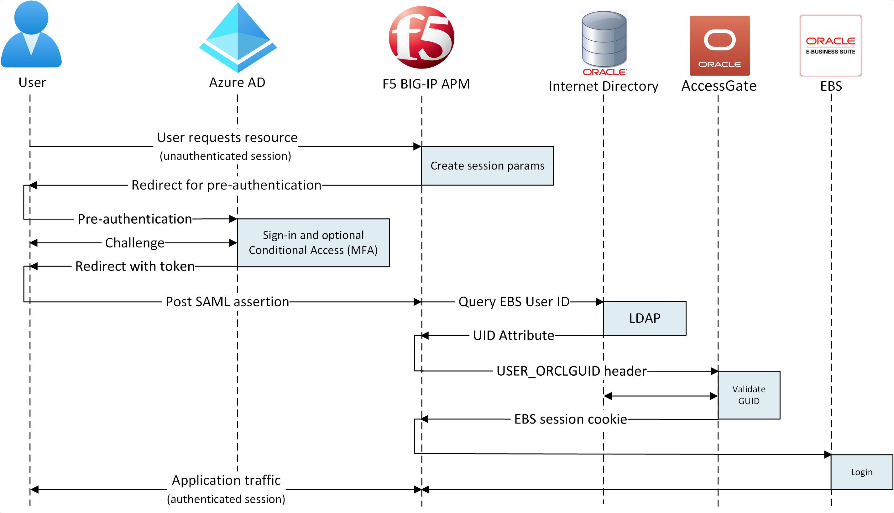
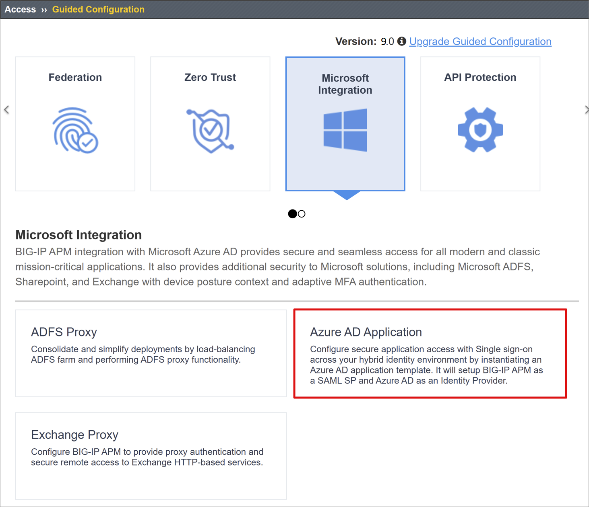
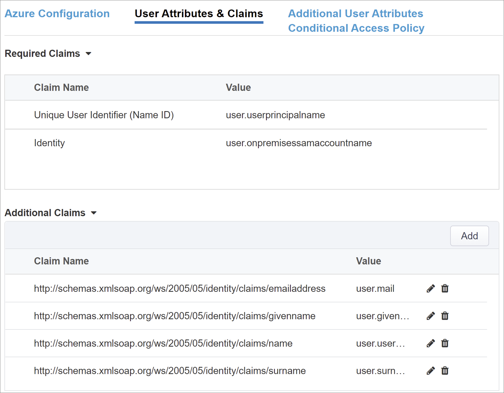
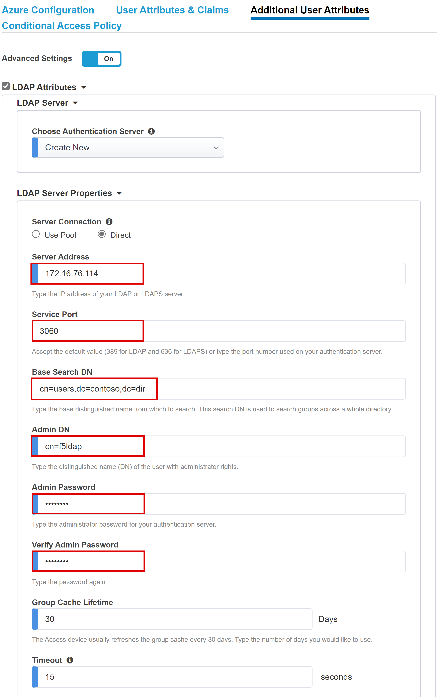
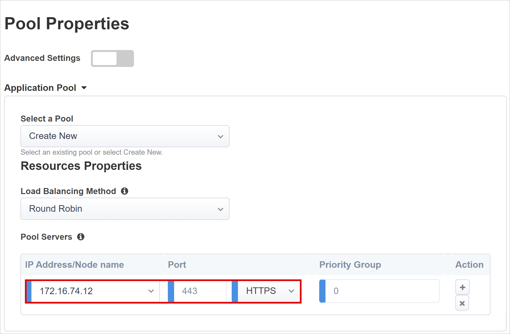

# Tutorial: Configure F5’s BIG-IP Easy Button for SSO to SAP ERP using Microsoft Entra ID

In this article, learn to secure SAP ERP using Microsoft Entra ID, through F5’s BIG-IP Easy Button guided configuration.

Integrating a BIG-IP with Microsoft Entra ID provides many benefits, including:

* [Improved Zero Trust governance](https://www.microsoft.com/security/blog/2020/04/02/announcing-microsoft-zero-trust-assessment-tool/) through Microsoft Entra pre-authentication   and [Conditional Access](../conditional-access/overview.md)

* Full SSO between Microsoft Entra ID and BIG-IP published services

* Manage identities and access from a single control plane, the [Azure portal](https://portal.azure.com/)

To learn about all the benefits, see the article on [F5 BIG-IP and Microsoft Entra integration](../manage-apps/f5-integration.md) and [what is application access and single sign-on with Microsoft Entra ID](/azure/active-directory/active-directory-appssoaccess-whatis).

## Scenario description

This scenario looks at the classic **SAP ERP application using Kerberos authentication** to manage access to protected content.

Being legacy, the application lacks modern protocols to support a direct integration with Microsoft Entra ID. The application can be modernized, but it is costly, requires careful planning, and introduces risk of potential downtime. Instead, an F5 BIG-IP Application Delivery Controller (ADC) is used to bridge the gap between the legacy application and the modern ID control plane, through protocol transitioning. 

Having a BIG-IP in front of the application enables us to overlay the service with Microsoft Entra pre-authentication and headers-based SSO, significantly improving the overall security posture of the application.

## Scenario architecture

The SHA solution for this scenario is made up of the following:

**SAP ERP application:** BIG-IP published service to be protected by and Microsoft Entra SHA.

**Microsoft Entra ID:** Security Assertion Markup Language (SAML) Identity Provider (IdP) responsible for verification of user credentials, Conditional Access, and SAML based SSO to the BIG-IP.

**BIG-IP:** Reverse proxy and SAML service provider (SP) to the application, delegating authentication to the SAML IdP before performing header-based SSO to the SAP service.

SHA for this scenario supports both SP and IdP initiated flows. The following image illustrates the SP initiated flow.

| Steps| Description|
| -------- |-------|
| 1| User connects to application endpoint (BIG-IP) |
| 2| BIG-IP APM access policy redirects user to Microsoft Entra ID (SAML IdP) |
| 3| Microsoft Entra ID pre-authenticates user and applies any enforced Conditional Access policies |
| 4| User is redirected to BIG-IP (SAML SP) and SSO is performed using issued SAML token |
| 5| BIG-IP requests Kerberos ticket from KDC |
| 6| BIG-IP sends request to backend application, along with Kerberos ticket for SSO |
| 7| Application authorizes request and returns payload |

## Prerequisites
Prior BIG-IP experience isn’t necessary, but you will need:

* A Microsoft Entra ID Free subscription or above

* An existing BIG-IP or [deploy a BIG-IP Virtual Edition (VE) in Azure](../manage-apps/f5-bigip-deployment-guide.md)

* Any of the following F5 BIG-IP license offers

    * F5 BIG-IP® Best bundle

    * F5 BIG-IP APM standalone license

    * F5 BIG-IP APM add-on license on an existing BIG-IP F5 BIG-IP® Local Traffic Manager™ (LTM)

    * 90-day BIG-IP full feature [trial license](https://www.f5.com/trial/big-ip-trial.php).

* User identities [synchronized](../hybrid/how-to-connect-sync-whatis.md) from an on-premises directory to Microsoft Entra ID, or created directly within Microsoft Entra ID and flowed back to your on-premises directory

* An account with Microsoft Entra Application admin [permissions](/azure/active-directory/users-groups-roles/directory-assign-admin-roles#application-administrator)

* An [SSL Web certificate](../manage-apps/f5-bigip-deployment-guide.md#ssl-profile) for publishing services over HTTPS, or use default BIG-IP certs while testing

* An existing SAP ERP environment configured for Kerberos authentication

## BIG-IP configuration methods

There are many methods to configure BIG-IP for this scenario, including two template-based options and an advanced configuration. This tutorial covers the latest Guided Configuration 16.1 offering an Easy button template. 

With the Easy Button, admins no longer go back and forth between Microsoft Entra ID and a BIG-IP to enable services for SHA. The deployment and policy management is handled directly between the APM’s Guided Configuration wizard and Microsoft Graph. This rich integration between BIG-IP APM and Microsoft Entra ensures that applications can quickly, easily support identity federation, SSO, and Microsoft Entra Conditional Access, reducing administrative overhead.

>[!NOTE] 
> All example strings or values referenced throughout this guide should be replaced with those for your actual environment.

## Register Easy Button

Before a client or service can access Microsoft Graph, it must be trusted by the [Microsoft identity platform.](../develop/quickstart-register-app.md)

The Easy Button client must also be registered in Microsoft Entra ID, before it is allowed to establish a trust between each SAML SP instance of a BIG-IP published application, and Microsoft Entra ID as the SAML IdP.

1. Sign in to the [Azure portal](https://portal.azure.com/) using an account with Application Administrative rights.

2. From the left navigation pane, select the **Microsoft Entra ID** service.

3. Under Manage, select **App registrations** > **New registration**.

4. Enter a display name for your application, such as `F5 BIG-IP Easy Button`.

5. Specify who can use the application > **Accounts in this organizational directory only**.

6. Select **Register** to complete the initial app registration.

7. Navigate to **API permissions** and authorize the following Microsoft Graph **Application permissions**:

   * Application.Read.All
   * Application.ReadWrite.All
   * Application.ReadWrite.OwnedBy
   * Directory.Read.All
   * Group.Read.All
   * IdentityRiskyUser.Read.All
   * Policy.Read.All
   * Policy.ReadWrite.ApplicationConfiguration
   * Policy.ReadWrite.ConditionalAccess
   * User.Read.All

8. Grant admin consent for your organization

9. In the **Certificates & Secrets** blade, generate a new **client secret** and note it down

10. From the **Overview** blade, note the **Client ID** and **Tenant ID**

## Configure Easy Button

Initiate the APM's **Guided Configuration** to launch the **Easy Button** Template.

1. From a browser, sign-in to the **F5 BIG-IP management console** 

2. Navigate to **Access > Guided Configuration > Microsoft Integration** and select **Microsoft Entra Application**.

   

3. Review the list of configuration steps and select **Next**

   

4. Follow the sequence of steps required to publish your application.

   
   
### Configuration Properties

These are general and service account properties. The **Configuration Properties** tab creates a BIG-IP application config and SSO object. Consider the **Azure Service Account Details** section to represent the client you registered in your Microsoft Entra tenant earlier, as an application. These settings allow a BIG-IP's OAuth client to individually register a SAML SP directly in your tenant, along with the SSO properties you would normally configure manually. Easy Button does this for every BIG-IP service being published and enabled for SHA.

Some of these are global settings so can be re-used for publishing more applications, further reducing deployment time and effort.

1. Provide a unique **Configuration Name** so admins can easily distinguish between Easy Button configurations

2. Enable **Single Sign-On (SSO) & HTTP Headers**

3. Enter the **Tenant Id, Client ID,** and **Client Secret** you noted when registering the Easy Button client in your tenant

4. Confirm the BIG-IP can successfully connect to your tenant and select **Next**

   
   
### Service Provider

The Service Provider settings define the properties for the SAML SP instance of the application protected through SHA.

1. Enter **Host**. This is the public FQDN of the application being secured

2. Enter **Entity ID.** This is the identifier Microsoft Entra ID will use to identify the SAML SP requesting a token

    

   The optional **Security Settings** specify whether Microsoft Entra ID should encrypt issued SAML assertions. Encrypting assertions between Microsoft Entra ID and the BIG-IP APM provides      additional assurance that the content tokens can’t be intercepted, and personal or corporate data be compromised.

3.	From the **Assertion Decryption Private Key** list, select **Create New**
 
    

4.	Select **OK**. This opens the **Import SSL Certificate and Keys** dialog in a new tab  

5.	Select **PKCS 12 (IIS)** to import your certificate and private key. Once provisioned close the browser tab to return to the main tab

    

6.	Check **Enable Encrypted Assertion**

7.	If you have enabled encryption, select your certificate from the **Assertion Decryption Private Key** list. This is the private key for the certificate that BIG-IP APM will use to decrypt Microsoft Entra assertions

8.	If you have enabled encryption, select your certificate from the **Assertion Decryption Certificate** list. This is the certificate that BIG-IP will upload to Microsoft Entra ID for encrypting the issued SAML assertions

    

### Microsoft Entra ID

This section defines all properties that you would normally use to manually configure a new BIG-IP SAML application within your Microsoft Entra tenant. 

Easy Button provides a set of pre-defined application templates for Oracle PeopleSoft, Oracle E-business Suite, Oracle JD Edwards, SAP ERP as well as generic SHA template for any other apps. For this scenario, select **SAP ERP Central Component > Add** to start the Azure configurations.

   

#### Azure Configuration

1. Enter **Display Name** of app that the BIG-IP creates in your Microsoft Entra tenant, and the icon that the users will see in [MyApps portal](https://myapplications.microsoft.com/)

2. Leave the **Sign On URL (optional)** blank to enable IdP initiated sign-on

   

3. Select the refresh icon next to the **Signing Key** and **Signing Certificate** to locate the certificate you imported earlier
 
5. Enter the certificate’s password in **Signing Key Passphrase**

6. Enable **Signing Option** (optional). This ensures that BIG-IP only accepts tokens and claims that are signed by Microsoft Entra ID

   

7. **User and User Groups** are dynamically queried from your Microsoft Entra tenant and used to authorize access to the application. Add a user or group that you can use later for testing, otherwise all access will be denied

   

#### User Attributes & Claims

When a user successfully authenticates to Microsoft Entra ID, it issues a SAML token with a default set of claims and attributes uniquely identifying the user. The **User Attributes & Claims tab** shows the default claims to issue for the new application. It also lets you configure more claims.

As our example AD infrastructure is based on a .com domain suffix used both, internally and externally, we don’t require any additional attributes to achieve a functional KCD SSO implementation. See the [advanced tutorial](../manage-apps/f5-big-ip-kerberos-advanced.md) for cases where you have multiple domains or user’s log-in using an alternate suffix. 

   
   
You can include additional Microsoft Entra attributes, if necessary, but for this scenario SAP ERP only requires the default attributes.

#### Additional User Attributes

The **Additional User Attributes** tab can support a variety of distributed systems requiring attributes stored in other directories, for session augmentation. Attributes fetched from an LDAP source can then be injected as additional SSO headers to further control access based on roles, Partner IDs, etc.

   

>[!NOTE] 
>This feature has no correlation to Microsoft Entra ID but is another source of attributes.

#### Conditional Access Policy

Conditional Access policies are enforced post Microsoft Entra pre-authentication, to control access based on device, application, location, and risk signals.

The **Available Policies** view, by default, will list all Conditional Access policies that do not include user based actions.

The **Selected Policies** view, by default, displays all policies targeting All cloud apps. These policies cannot be deselected or moved to the Available Policies list as they are enforced at a tenant level.

To select a policy to be applied to the application being published:

1.	Select the desired policy in the **Available Policies** list
2.	Select the right arrow and move it to the **Selected Policies** list

Selected policies should either have an **Include** or **Exclude** option checked. If both options are checked, the selected policy is not enforced.

>[!NOTE]
>The policy list is enumerated only once when first switching to this tab. A refresh button is available to manually force the wizard to query your tenant, but this button is displayed only when the application has been deployed. 

### Virtual Server Properties

A virtual server is a BIG-IP data plane object represented by a virtual IP address listening for client requests to the application. Any received traffic is processed and evaluated against the APM profile associated with the virtual server, before being directed according to the policy results and settings.

1. Enter **Destination Address**. This is any available IPv4/IPv6 address that the BIG-IP can use to receive client traffic. A corresponding record should also exist in DNS, enabling clients to resolve the external URL of your BIG-IP published application to this IP, instead of the application itself. Using a test PC's localhost DNS is fine for testing

2. Enter **Service Port** as *443* for HTTPS

3. Check **Enable Redirect Port** and then enter **Redirect Port**. It redirects incoming HTTP client traffic to HTTPS

4. The Client SSL Profile enables the virtual server for HTTPS, so that client connections are encrypted over TLS. Select the **Client SSL Profile** you created as part of the prerequisites or leave the default whilst testing

  

### Pool Properties

The **Application Pool tab** details the services behind a BIG-IP, represented as a pool containing one or more application servers.

1. Choose from **Select a Pool.** Create a new pool or select an existing one

2. Choose the **Load Balancing Method** as *Round Robin*

3. For **Pool Servers** select an existing server node or specify an IP and port for the backend node hosting the header-based application

   

#### Single Sign-On & HTTP Headers

Enabling SSO allows users to access BIG-IP published services without having to enter credentials. The **Easy Button wizard** supports Kerberos, OAuth Bearer, and HTTP authorization headers for SSO. You will need the Kerberos delegation account created earlier to complete this step. 

Enable **Kerberos** and **Show Advanced Setting** to enter the following:

* **Username Source:** Specifies the preferred username to cache for SSO. You can provide any session variable as the source of the user ID, but *session.saml.last.identity* tends to work best as it holds the Microsoft Entra claim containing the logged in user ID

* **User Realm Source:** Required if the user domain is different to the BIG-IP’s kerberos realm. In that case, the APM session variable would contain the logged in user domain. For example,*session.saml.last.attr.name.domain*

   

* **KDC:** IP of a Domain Controller (Or FQDN if DNS is configured & efficient)

* **UPN Support:** Enable for the APM to use the UPN for kerberos ticketing 

* **SPN Pattern:** Use HTTP/%h to inform the APM to use the host header of the client request and build the SPN that it is requesting a kerberos token for.

* **Send Authorization:** Disable for applications that prefer negotiating authentication instead of receiving the kerberos token in the first request. For example, *Tomcat.*

   
   
### Session Management

The BIG-IPs session management settings are used to define the conditions under which user sessions are terminated or allowed to continue, limits for users and IP addresses, and corresponding user info. Consult [F5 documentation](https://support.f5.com/csp/article/K18390492) for details on these settings.

What isn’t covered however is Single Log-Out (SLO) functionality, which ensures all sessions between the IdP, the BIG-IP, and the user agent are terminated as users log off.
 When the Easy Button deploys a SAML application to your Microsoft Entra tenant, it also populates the Logout Url with the APM’s SLO endpoint. That way IdP initiated sign-outs from the Microsoft [MyApps portal](https://support.microsoft.com/account-billing/sign-in-and-start-apps-from-the-my-apps-portal-2f3b1bae-0e5a-4a86-a33e-876fbd2a4510) also terminate the session between the BIG-IP and a client.

During deployment, the SAML federation metadata for the published application is imported from your tenant, providing the APM the SAML logout endpoint for Microsoft Entra ID. This helps SP initiated sign-outs terminate the session between a client and Microsoft Entra ID.

## Summary

This last step provides a breakdown of your configurations. Select **Deploy** to commit all settings and verify that the application now exists in your tenants list of Enterprise applications.

## Next steps

From a browser, **connect** to the application’s external URL or select the **application’s icon** in the [Microsoft MyApps portal](https://myapps.microsoft.com/). After authenticating to Microsoft Entra ID, you’ll be redirected to the BIG-IP virtual server for the application and automatically signed in through SSO.

For increased security, organizations using this pattern could also consider blocking all direct access to the application, thereby forcing a strict path through the BIG-IP.

## Advanced deployment

There may be cases where the Guided Configuration templates lack the flexibility to achieve more specific requirements. For those scenarios, see [Advanced Configuration for kerberos-based SSO](../manage-apps/f5-big-ip-kerberos-advanced.md).

Alternatively, the BIG-IP gives you the option to disable **Guided Configuration’s strict management mode**. This allows you to manually tweak your configurations, even though bulk of your configurations are automated through the wizard-based templates.

You can navigate to **Access > Guided Configuration** and select the **small padlock icon** on the far right of the row for your applications’ configs. 
 
   

At that point, changes via the wizard UI are no longer possible, but all BIG-IP objects associated with the published instance of the application will be unlocked for direct management.

>[!NOTE]
>Re-enabling strict mode and deploying a configuration will overwrite any settings performed outside of the Guided Configuration UI, therefore we recommend the advanced configuration method for production services.

## Troubleshooting

You can fail to access the SHA protected application due to any number of factors, including a misconfiguration.

* Kerberos is time sensitive, so requires that servers and clients be set to the correct time and where possible synchronized to a reliable time source

* Ensure the hostname for the domain controller and web application are resolvable in DNS

* Ensure there are no duplicate SPNs in your AD environment by executing the following query at the command line on a domain PC: setspn -q HTTP/my_target_SPN

You can refer to our [App Proxy guidance](../app-proxy/application-proxy-back-end-kerberos-constrained-delegation-how-to.md) to validate an IIS application is configured appropriately for KCD. F5’s article on [how the APM handles Kerberos SSO](https://techdocs.f5.com/en-us/bigip-15-1-0/big-ip-access-policy-manager-single-sign-on-concepts-configuration/kerberos-single-sign-on-method.html) is also a valuable resource.

### Log analysis

BIG-IP logging can help quickly isolate all sorts of issues with connectivity, SSO, policy violations, or misconfigured variable mappings. Start troubleshooting by increasing the log verbosity level.

1. Navigate to **Access Policy > Overview > Event Logs > Settings**

2. Select the row for your published application, then **Edit > Access System Logs**

3. Select **Debug** from the SSO list, and then select **OK**

Reproduce your issue, then inspect the logs, but remember to switch this back when finished as verbose mode generates lots of data. 

If you see a BIG-IP branded error immediately after successful Microsoft Entra pre-authentication, it’s possible the issue relates to SSO from Microsoft Entra ID to the BIG-IP.

1. Navigate to **Access > Overview > Access reports**

2. Run the report for the last hour to see logs provide any clues. The **View session variables** link for your session will also help understand if the APM is receiving the expected claims from Microsoft Entra ID.

If you don’t see a BIG-IP error page, then the issue is probably more related to the backend request or SSO from the BIG-IP to the application. 

1. Navigate to **Access Policy > Overview > Active Sessions**

2. Select the link for your active session. The **View Variables** link in this location may also help determine root cause KCD issues, particularly if the BIG-IP APM fails to obtain the right user and domain identifiers from session variables

See [BIG-IP APM variable assign examples](https://devcentral.f5.com/s/articles/apm-variable-assign-examples-1107) and [F5 BIG-IP session variables reference](https://techdocs.f5.com/en-us/bigip-15-0-0/big-ip-access-policy-manager-visual-policy-editor/session-variables.html) for more info.
