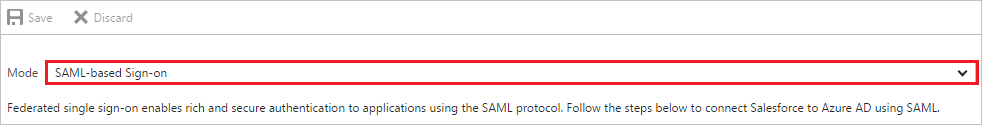
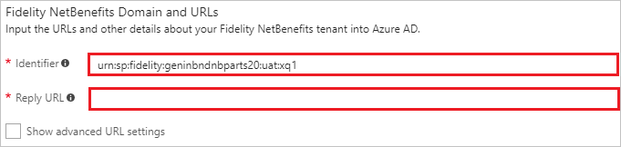
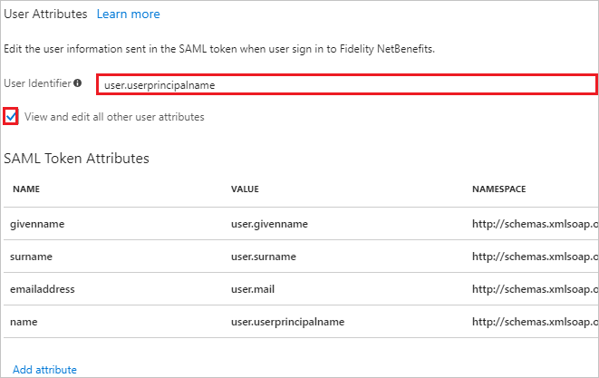
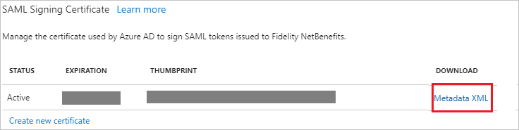
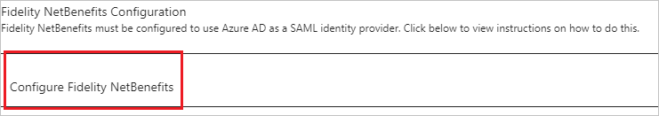

# Tutorial: Azure Active Directory integration with Fidelity NetBenefits

In this tutorial, you learn how to integrate Fidelity NetBenefits with Azure Active Directory (Azure AD).

Integrating Fidelity NetBenefits with Azure AD provides you with the following benefits:

- You can control in Azure AD who has access to Fidelity NetBenefits.
- You can enable your users to automatically get signed-on to Fidelity NetBenefits (Single Sign-On) with their Azure AD accounts.
- You can manage your accounts in one central location - the Azure portal.

If you want to know more details about SaaS app integration with Azure AD, see [what is application access and single sign-on with Azure Active Directory](../manage-apps/what-is-single-sign-on.md).

## Prerequisites

To configure Azure AD integration with Fidelity NetBenefits, you need the following items:

- An Azure AD subscription
- A Fidelity NetBenefits single sign-on enabled subscription

> [!NOTE]
> To test the steps in this tutorial, we do not recommend using a production environment.

To test the steps in this tutorial, you should follow these recommendations:

- Do not use your production environment, unless it is necessary.
- If you don't have an Azure AD trial environment, you can [get a one-month trial](https://azure.microsoft.com/pricing/free-trial/).

## Scenario description

In this tutorial, you test Azure AD single sign-on in a test environment.
The scenario outlined in this tutorial consists of two main building blocks:

1. Adding Fidelity NetBenefits from the gallery
2. Configuring and testing Azure AD single sign-on

## Adding Fidelity NetBenefits from the gallery

To configure the integration of Fidelity NetBenefits into Azure AD, you need to add Fidelity NetBenefits from the gallery to your list of managed SaaS apps.

**To add Fidelity NetBenefits from the gallery, perform the following steps:**

1. In the **[Azure portal](https://portal.azure.com)**, on the left navigation panel, click **Azure Active Directory** icon.

	![The Azure Active Directory button][1]

2. Navigate to **Enterprise applications**. Then go to **All applications**.

	![The Enterprise applications blade][2]

3. To add new application, click **New application** button on the top of dialog.

	![The New application button][3]

4. In the search box, type **Fidelity NetBenefits**, select **Fidelity NetBenefits** from result panel then click **Add** button to add the application.

	

## Configure and test Azure AD single sign-on

In this section, you configure and test Azure AD single sign-on with Fidelity NetBenefits based on a test user called "Britta Simon".

For single sign-on to work, Azure AD needs to know what the counterpart user in Fidelity NetBenefits is to a user in Azure AD. In other words, a link relationship between an Azure AD user and the related user in Fidelity NetBenefits needs to be established.

In Fidelity NetBenefits, **user** mapping should be done with **Azure AD user** to establish the link relationship.

To configure and test Azure AD single sign-on with Fidelity NetBenefits, you need to complete the following building blocks:

1. **[Configure Azure AD Single Sign-On](#configure-azure-ad-single-sign-on)** - to enable your users to use this feature.
2. **[Create an Azure AD test user](#create-an-azure-ad-test-user)** - to test Azure AD single sign-on with Britta Simon.
3. **[Create a Fidelity NetBenefits test user](#create-a-fidelity-netbenefits-test-user)** - to have a counterpart of Britta Simon in Fidelity NetBenefits that is linked to the Azure AD representation of user.
4. **[Assign the Azure AD test user](#assign-the-azure-ad-test-user)** - to enable Britta Simon to use Azure AD single sign-on.
5. **[Test single sign-on](#test-single-sign-on)** - to verify whether the configuration works.

### Configure Azure AD single sign-on

In this section, you enable Azure AD single sign-on in the Azure portal and configure single sign-on in your Fidelity NetBenefits application.

**To configure Azure AD single sign-on with Fidelity NetBenefits, perform the following steps:**

1. In the Azure portal, on the **Fidelity NetBenefits** application integration page, click **Single sign-on**.

	![Configure single sign-on link][4]

2. On the **Single sign-on** dialog, select **Mode** as	**SAML-based Sign-on** to enable single sign-on.

	

3. On the **Fidelity NetBenefits Domain and URLs** section, perform the following steps:

	

    a. In the **Identifier** textbox, type a URL:

	For Testing Environment:
	`urn:sp:fidelity:geninbndnbparts20:uat:xq1`

	For Production Environment:
	`urn:sp:fidelity:geninbndnbparts20`

	b. In the **Reply URL** textbox, enter a URL that to be provided by Fidelity at time of implementation or contact your assigned Fidelity Client Service Manager.

4. Fidelity NetBenefits application expects the SAML assertions in a specific format. We have mapped the **User Identifier** with the **user.userprincipalname**. You can map this with **employeeid** or any other claim which is applicable to your Organization as **User Identifier**. The following screenshot shows just an example for this.

	

	>[!Note]
	>Fidelity NetBenefits support Static and Dynamic Federation. Static means it will not use SAML based just in time user provisioning and Dynamic means it supports just in time user provisioning. For using JIT based provisioning customers have to add some more claims in Azure AD like user's birthdate etc. These details are provided by the your assigned **Fidelity Client Service Manager** and they have to enable this dynamic federation for your instance.

5. On the **SAML Signing Certificate** section, click **Metadata XML** and then save the metadata file on your computer.

	

6. Click **Save** button.

	

7. On the **Fidelity NetBenefits Configuration** section, click **Configure Fidelity NetBenefits** to open **Configure sign-on** window. Copy the **SAML Entity ID and SAML Single Sign-On Service URL** from the **Quick Reference section.**

	

8. To configure single sign-on on **Fidelity NetBenefits** side, you need to send the downloaded **Metadata XML**, **SAML Single Sign-On Service URL** and **SAML Entity ID** to **your assigned Fidelity Client Service Manager**. They set this setting to have the SAML SSO connection set properly on both sides.

### Create an Azure AD test user

The objective of this section is to create a test user in the Azure portal called Britta Simon.

   ![Create an Azure AD test user][100]

**To create a test user in Azure AD, perform the following steps:**

1. In the Azure portal, in the left pane, click the **Azure Active Directory** button.

    

2. To display the list of users, go to **Users and groups**, and then click **All users**.

    

3. To open the **User** dialog box, click **Add** at the top of the **All Users** dialog box.

    

4. In the **User** dialog box, perform the following steps:

    

    a. In the **Name** box, type **BrittaSimon**.

    b. In the **User name** box, type the email address of user Britta Simon.

    c. Select the **Show Password** check box, and then write down the value that's displayed in the **Password** box.

    d. Click **Create**.
  
### Create a Fidelity NetBenefits test user

In this section, you create a user called Britta Simon in Fidelity NetBenefits. If you are creating Static federation, please work with your assigned **Fidelity Client Service Manager** to create users in Fidelity NetBenefits platform. These users must be created and activated before you use single sign-on.

For Dynamic Federation, users are created using Just In Time user provisioning. For using JIT based provisioning customers have to add some more claims in Azure AD like user's birthdate etc. These details are provided by the your assigned **Fidelity Client Service Manager** and they have to enable this dynamic federation for your instance.

### Assign the Azure AD test user

In this section, you enable Britta Simon to use Azure single sign-on by granting access to Fidelity NetBenefits.

![Assign the user role][200]

**To assign Britta Simon to Fidelity NetBenefits, perform the following steps:**

1. In the Azure portal, open the applications view, and then navigate to the directory view and go to **Enterprise applications** then click **All applications**.

	![Assign User][201]

2. In the applications list, select **Fidelity NetBenefits**.

	  

3. In the menu on the left, click **Users and groups**.

	![The "Users and groups" link][202]

4. Click **Add** button. Then select **Users and groups** on **Add Assignment** dialog.

	![The Add Assignment pane][203]

5. On **Users and groups** dialog, select **Britta Simon** in the Users list.

6. Click **Select** button on **Users and groups** dialog.

7. Click **Assign** button on **Add Assignment** dialog.

### Test single sign-on

In this section, you test your Azure AD single sign-on configuration using the Access Panel.

When you click the Fidelity NetBenefits tile in the Access Panel, you should get automatically signed-on to your Fidelity NetBenefits application.
For more information about the Access Panel, see [Introduction to the Access Panel](../user-help/active-directory-saas-access-panel-introduction.md).

## Additional resources

* [List of Tutorials on How to Integrate SaaS Apps with Azure Active Directory](tutorial-list.md)
* [What is application access and single sign-on with Azure Active Directory?](../manage-apps/what-is-single-sign-on.md)

<!--Image references-->

[1]: ./media/fidelitynetbenefits-tutorial/tutorial_general_01.png
[2]: ./media/fidelitynetbenefits-tutorial/tutorial_general_02.png
[3]: ./media/fidelitynetbenefits-tutorial/tutorial_general_03.png
[4]: ./media/fidelitynetbenefits-tutorial/tutorial_general_04.png

[100]: ./media/fidelitynetbenefits-tutorial/tutorial_general_100.png

[200]: ./media/fidelitynetbenefits-tutorial/tutorial_general_200.png
[201]: ./media/fidelitynetbenefits-tutorial/tutorial_general_201.png
[202]: ./media/fidelitynetbenefits-tutorial/tutorial_general_202.png
[203]: ./media/fidelitynetbenefits-tutorial/tutorial_general_203.png