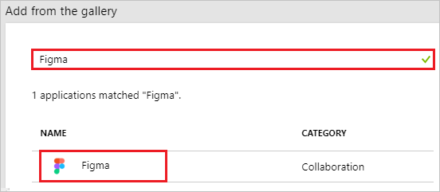
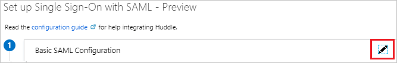
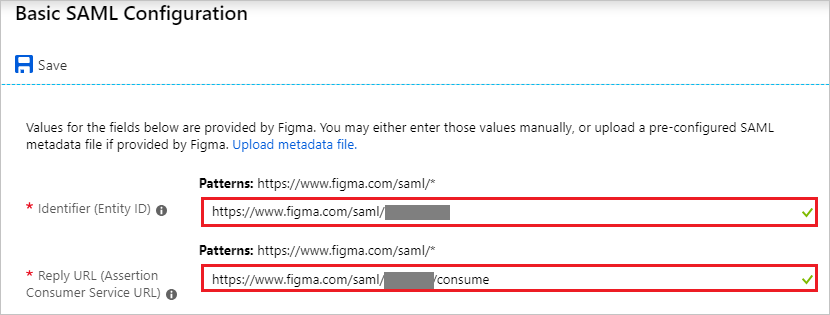
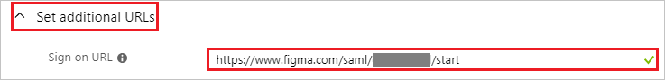
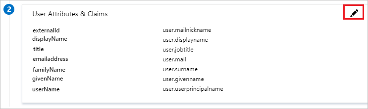
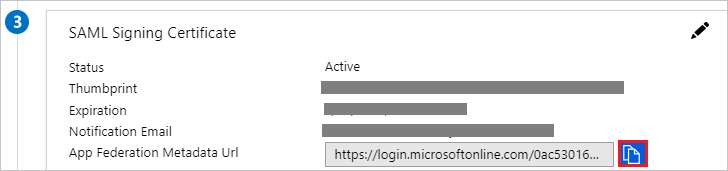
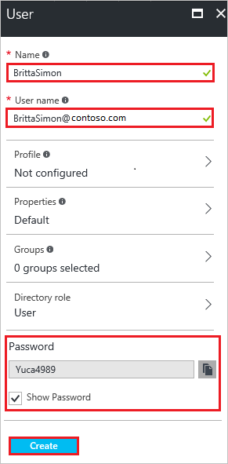
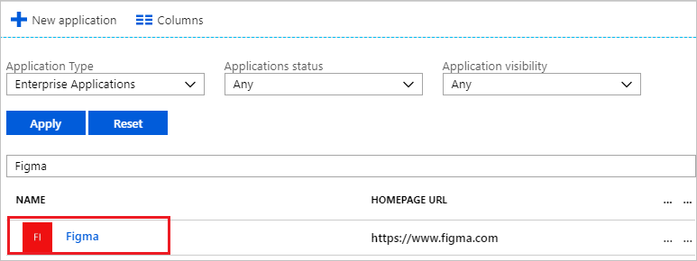

# Tutorial: Azure Active Directory integration with Figma

In this tutorial, you learn how to integrate Figma with Azure Active Directory (Azure AD).

Integrating Figma with Azure AD provides you with the following benefits:

- You can control in Azure AD who has access to Figma.
- You can enable your users to automatically get signed-on to Figma (Single Sign-On) with their Azure AD accounts.
- You can manage your accounts in one central location - the Azure portal.

If you want to know more details about SaaS app integration with Azure AD, see [what is application access and single sign-on with Azure Active Directory](../manage-apps/what-is-single-sign-on.md)

## Prerequisites

To configure Azure AD integration with Figma, you need the following items:

- An Azure AD subscription
- A Figma [single sign-on enabled subscription](https://www.figma.com/pricing/)

> [!NOTE]
> To test the steps in this tutorial, we do not recommend using a production environment. New customers and active subscribers of Figma Professional Team
may contact Figma to [upgrade their subscription](https://www.figma.com/pricing/) to the Figma Organization Tier.

To test the steps in this tutorial, you should follow these recommendations:

- Do not use your production environment, unless it is necessary.
- If you don't have an Azure AD trial environment, you can [get a one-month trial](https://azure.microsoft.com/pricing/free-trial/).

## Scenario description

In this tutorial, you test Azure AD single sign-on in a test environment. 
The scenario outlined in this tutorial consists of two main building blocks:

1. Adding Figma from the gallery
2. Configuring and testing Azure AD single sign-on

## Adding Figma from the gallery

To configure the integration of Figma into Azure AD, you need to add Figma from the gallery to your list of managed SaaS apps.

**To add Figma from the gallery, perform the following steps:**

1. In the **[Azure portal](https://portal.azure.com)**, on the left navigation panel, click **Azure Active Directory** icon.

	![Active Directory][1]

2. Navigate to **Enterprise applications**. Then go to **All applications**.

	![Applications][2]

3. To add new application, click **New application** button on the top of dialog.

	![Applications][3]

4. In the search box, type **Figma**. Select **Figma** from the results panel, and then click the **Add** button to add the application.

	

## Configure and test Azure AD single sign-on

In this section, you configure and test Azure AD single sign-on with Figma based on a test user called "Britta Simon".

For single sign-on to work, Azure AD needs to be linked to Figma.  To configure and test Azure AD single sign-on with Figma, complete the following steps:

1. [**Contact Figma support team**](mailto:support@figma.com?subject=SAML+Config) to initiate a SAML configuration for your organization and get an ORG_SAML_CONFIG_ID.
2. **[Configuring Azure AD Single Sign-On](#configuring-azure-ad-single-sign-on)** - to enable your users to use this feature.
3. **[Creating an Azure AD test user](#creating-an-azure-ad-test-user)** - to test Azure AD single sign-on with Britta Simon.
4. **[Create a Figma test user](#creating-a-figma-test-user)** - to have a counterpart of Britta Simon in Figma that is linked to the Azure AD representation of user.
5. **[Assigning the Azure AD test user](#assigning-the-azure-ad-test-user)** - to enable Britta Simon to use Azure AD single sign-on.
6. **[Testing single sign-on](#testing-single-sign-on)** - to verify whether the configuration works.

### Configuring Azure AD single sign-on

In this section, you enable Azure AD single sign-on in the Azure portal and configure single sign-on in your Figma application.

**To configure Azure AD single sign-on with Figma, perform the following steps:**

1. In the Azure portal, on the **Figma** application integration page, click **Single sign-on**.

	![Configure Single Sign-On][4]

2. On the **Select a Single sign-on method** dialog, Click **Select** for **SAML** mode to enable single sign-on.

    

3. If you need to change to **SAML** mode from any another mode, click **Change single sign-on mode** on top of the screen.

	

4. On the **Set up Single Sign-On with SAML** page, click **Edit** icon to open **Basic SAML Configuration** dialog.

	

5. On the **Basic SAML Configuration** section, perform the following steps, if you wish to configure the application in **IDP** initiated mode:

	

    a. In the **Identifier** textbox, type a URL using the following pattern: `https://www.figma.com/saml/<ORG_SAML_CONFIG_ID>`

	b. In the **Reply URL** textbox, type a URL using the following pattern: `https://www.figma.com/saml/<ORG_SAML_CONFIG_ID>/consume`

6. Click **Set additional URLs** and perform the following step if you wish to configure the application in **SP** initiated mode:

	

    In the **Sign-on URL** textbox, type a URL using the following pattern: `https://www.figma.com/saml/<ORG_SAML_CONFIG_ID>/start`

	> [!NOTE]
	> These values are not real. Update these values with the actual Identifier, Reply URL, and Sign-On URL. Contact [Figma support team](mailto:support@figma.com?subject=SAML+Config) to get these values.

7. Figma application expects the SAML assertions in a specific format. Configure the following claims for this application. You can manage the values of these attributes from the **User Attributes** section on application integration page. On the **Set up Single Sign-On with SAML** page, click **Edit** button to open **User Attributes** dialog.

	

8. In the **User Claims** section on the **User Attributes** dialog, configure SAML token attribute as shown in the image above and perform the following steps:

	| Name | Source Attribute|
	| ---------------| --------- |
	| `externalId` | `user.mailnickname` |
	| `displayName` | `user.displayname` |
	| `title` | `user.jobtitle` |
	| `emailaddress` | `user.mail` |
	| `familyName` | `user.surname` |
	| `givenName` | `givenName` |
	| `userName` | `user.userprincipalname` |

	a. Click **Add new claim** to open the **Manage user claims** dialog.

	

	

	b. In the **Name** textbox, type the attribute name shown for that row.

	c. Leave the **Namespace** blank.

	d. Select Source as **Attribute**.

	e. From the **Source attribute** list, type the attribute value shown for that row.

	f. Click **Ok**

	g. Click **Save**.

9. On the **Set up Single Sign-On with SAML** page, In the **SAML Signing Certificate** section, click copy button to copy **App Federation Metadata Url** and save it on your computer.

	

10. To configure single sign-on on Figma side, please fill out this form: [https://goo.gl/forms/XkRB1z5ed4eVUzXn2](https://goo.gl/forms/XkRB1z5ed4eVUzXn2). It will accept your **App Federation Metadata Url** from Step #9.

### Creating an Azure AD test user

The objective of this section is to create a test user in the Azure portal called Britta Simon.

1. In the Azure portal, in the left pane, select **Azure Active Directory**, select **Users**, and then select **All users**.

	![Create Azure AD User][100]

2. Select **New user** at the top of the screen.

	 

3. In the User properties, perform the following steps.

	

    a. In the **Name** field, enter **BrittaSimon**.
  
    b. In the **User name** field, type **brittasimon@yourcompanydomain.extension**  
    For example, BrittaSimon@contoso.com

    c. Select **Properties**, select the **Show password** check box, and then write down the value that's displayed in the Password box.

    d. Select **Create**.

### Creating a Figma test user

The objective of this section is to create a user called Britta Simon in Figma. Figma supports just-in-time provisioning, which is by default enabled. There is no action item for you in this section. A new user is created during an attempt to access Figma if it doesn't exist yet.

### Assigning the Azure AD test user

In this section, you enable Britta Simon to use Azure single sign-on by granting access to HubSpot SAML.

1. In the Azure portal, select **Enterprise Applications**, select **All applications**.

	![Assign User][201]

2. In the applications list, select **HubSpot SAML**.

	 

3. In the menu on the left, click **Users and groups**.

	![Assign User][202]

4. Click **Add** button. Then select **Users and groups** on **Add Assignment** dialog.

	![Assign User][203]

5. In the **Users and groups** dialog select **Britta Simon** in the Users list, then click the **Select** button at the bottom of the screen.

6. In the **Add Assignment** dialog select the **Assign** button.

### Testing single sign-on

In this section, you test your Azure AD single sign-on configuration using the Access Panel.

When you click the Figma tile in the Access Panel, you should get automatically signed-on to your Figma application.
For more information about the Access Panel, see [Introduction to the Access Panel](../user-help/active-directory-saas-access-panel-introduction.md).

## Additional resources

* [List of Tutorials on How to Integrate SaaS Apps with Azure Active Directory](tutorial-list.md)
* [What is application access and single sign-on with Azure Active Directory?](../manage-apps/what-is-single-sign-on.md)

<!--Image references-->

[1]: ./media/figma-tutorial/tutorial_general_01.png
[2]: ./media/figma-tutorial/tutorial_general_02.png
[3]: ./media/figma-tutorial/tutorial_general_03.png
[4]: ./media/figma-tutorial/tutorial_general_04.png

[100]: ./media/figma-tutorial/tutorial_general_100.png

[200]: ./media/figma-tutorial/tutorial_general_200.png
[201]: ./media/figma-tutorial/tutorial_general_201.png
[202]: ./media/figma-tutorial/tutorial_general_202.png
[203]: ./media/figma-tutorial/tutorial_general_203.png