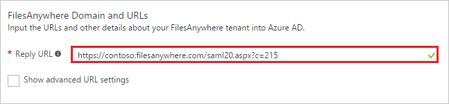
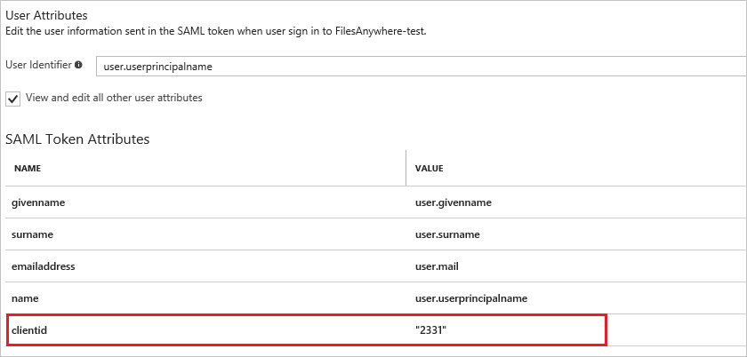

# Tutorial: Azure Active Directory integration with FilesAnywhere

In this tutorial, you learn how to integrate FilesAnywhere with Azure Active Directory (Azure AD).

Integrating FilesAnywhere with Azure AD provides you with the following benefits:

- You can control in Azure AD who has access to FilesAnywhere
- You can enable your users to automatically get signed-on to FilesAnywhere (Single Sign-On) with their Azure AD accounts
- You can manage your accounts in one central location - the Azure Management portal

If you want to know more details about SaaS app integration with Azure AD, see [What is application access and single sign-on with Azure Active Directory](../manage-apps/what-is-single-sign-on.md).

## Prerequisites

To configure Azure AD integration with FilesAnywhere, you need the following items:

- An Azure AD subscription
- A FilesAnywhere single-sign on enabled subscription

> [!NOTE]
> To test the steps in this tutorial, we do not recommend using a production environment.

To test the steps in this tutorial, you should follow these recommendations:

- You should not use your production environment, unless this is necessary.
- If you don't have an Azure AD trial environment, you can get a one-month trial [here](https://azure.microsoft.com/pricing/free-trial/).

## Scenario description
In this tutorial, you test Azure AD single sign-on in a test environment. 
The scenario outlined in this tutorial consists of two main building blocks:

1. Adding FilesAnywhere from the gallery
1. Configuring and testing Azure AD single sign-on

## Adding FilesAnywhere from the gallery
To configure the integration of FilesAnywhere into Azure AD, you need to add FilesAnywhere from the gallery to your list of managed SaaS apps.

**To add FilesAnywhere from the gallery, perform the following steps:**

1. In the **[Azure Management Portal](https://portal.azure.com)**, on the left navigation panel, click **Azure Active Directory** icon. 

	![Active Directory][1]

1. Navigate to **Enterprise applications**. Then go to **All applications**.

	![Applications][2]
	
1. Click **Add** button on the top of the dialog.

	![Applications][3]

1. In the search box, type **FilesAnywhere**.

	

1. In the results panel, select **FilesAnywhere**, and then click **Add** button to add the application.

	

##  Configuring and testing Azure AD single sign-on
In this section, you configure and test Azure AD single sign-on with FilesAnywhere based on a test user called "Britta Simon".

For single sign-on to work, Azure AD needs to know what the counterpart user in FilesAnywhere is to a user in Azure AD. In other words, a link relationship between an Azure AD user and the related user in FilesAnywhere needs to be established.

This link relationship is established by assigning the value of the **user name** in Azure AD as the value of the **Username** in FilesAnywhere.

To configure and test Azure AD single sign-on with FilesAnywhere, you need to complete the following building blocks:

1. **[Configuring Azure AD Single Sign-On](#configuring-azure-ad-single-sign-on)** - to enable your users to use this feature.
1. **[Creating an Azure AD test user](#creating-an-azure-ad-test-user)** - to test Azure AD single sign-on with Britta Simon.
1. **[Creating a FilesAnywhere test user](#creating-a-filesanywhere-test-user)** - to have a counterpart of Britta Simon in FilesAnywhere that is linked to the Azure AD representation of her.
1. **[Assigning the Azure AD test user](#assigning-the-azure-ad-test-user)** - to enable Britta Simon to use Azure AD single sign-on.
1. **[Testing Single Sign-On](#testing-single-sign-on)** - to verify whether the configuration works.

### Configuring Azure AD single sign-on

In this section, you enable Azure AD single sign-on in the Azure Management portal and configure single sign-on in your FilesAnywhere application.

**To configure Azure AD single sign-on with FilesAnywhere, perform the following steps:**

1. In the Azure Management portal, on the **FilesAnywhere** application integration page, click **Single sign-on**.

	![Configure Single Sign-On][4]

1. On the **Single sign-on** dialog, as **Mode** select **SAML-based Sign-on** to enable single sign on.
 
	

1. On the **FilesAnywhere Domain and URLs** section, If you wish to configure the application in **IDP initiated mode**:

	
	
	a. In the **Reply URL** textbox, type a URL using the following pattern:
`https://<company name>.filesanywhere.com/saml20.aspx?c=215`
> [!NOTE]
> Please note that the value **215** is a **clientid** and is just an example. You need to replace it with the actual clientid value.

1. On the **FilesAnywhere Domain and URLs** section, If you wish to configure the application in **SP initiated mode**, perform the following steps:
	
	

	a. Click on the **Show advanced URL settings** option

	b. In the **Sign On URL** textbox, type a URL using the following pattern: `https://.filesanywhere.com/`

	> [!NOTE] 
	> Please note that these are not the real values. You have to update these values with the actual Sign On URL and Reply URL. Contact [FilesAnywhere support team](mailto:support@FilesAnywhere.com) to get these values. 

1. FilesAnywhere Software application expects the SAML assertions in a specific format. Please configure the following claims for this application. You can manage the values of these attributes from the "**User Attributes**" section on application integration page. The following screenshot shows an example for this.
	
	
	
	When the users signs up with FilesAnywhere they get the value of **clientid** attribute from [FilesAnywhere team](mailto:support@FilesAnywhere.com). You have to add the "Client Id" attribute with the unique value provided by FilesAnywhere. All these attributes shown above are required.
	> [!NOTE] 
	> Please note that the value **2331** of **clientid** is just an example. You need to provide the actual value.

1. In the **User Attributes** section on the **Single sign-on** dialog, configure SAML token attribute as shown in the image above and perform the following steps:
    
	| Attribute Name | Attribute Value |
	| ---------------| --------------- |    
	| clientid | *"uniquevalue"* |

	a. Click **Add attribute** to open the **Add Attribute** dialog.

	

	
	
	b. In the **Name** textbox, type the attribute name shown for that row.
	
	c. From the **Value** list, type the attribute value shown for that row.
	
	d. Click **Ok**

1. Click **Save** button.

	

1. On the **SAML Signing Certificate** section, click **Certificate (Base64)** and then save the certificate file on your computer.

	 

1. On the **FilesAnywhere Configuration** section, click **Configure FilesAnywhere** to open **Configure sign-on** window.

	 

	

1.	To get SSO configuration complete for your application at FilesAnywhere end, contact [FilesAnywhere support team](mailto:support@FilesAnywhere.com) and provide them the downloaded SAML token signing Certificate and Single Sign On (SSO) URL.

### Creating an Azure AD test user
The objective of this section is to create a test user in the Azure Management portal called Britta Simon.

![Create Azure AD User][100]

**To create a test user in Azure AD, perform the following steps:**

1. In the **Azure Management portal**, on the left navigation pane, click **Azure Active Directory** icon.

	 

1. Go to **Users and groups** and click **All users** to display the list of users.
	
	 

1. At the top of the dialog click **Add** to open the **User** dialog.
 
	 

1. On the **User** dialog page, perform the following steps:
 
	 

    a. In the **Name** textbox, type **BrittaSimon**.

    b. In the **User name** textbox, type the **email address** of BrittaSimon.

	c. Select **Show Password** and write down the value of the **Password**.

    d. Click **Create**. 

### Creating a FilesAnywhere test user

Application supports Just in time user provisioning and after authentication users will be created in the application automatically. 

### Assigning the Azure AD test user

In this section, you enable Britta Simon to use Azure single sign-on by granting her access to FilesAnywhere.

![Assign User][200] 

**To assign Britta Simon to FilesAnywhere, perform the following steps:**

1. In the Azure Management portal, open the applications view, and then navigate to the directory view and go to **Enterprise applications** then click **All applications**.

	![Assign User][201] 

1. In the applications list, select **FilesAnywhere**.

	 

1. In the menu on the left, click **Users and groups**.

	![Assign User][202] 

1. Click **Add** button. Then select **Users and groups** on **Add Assignment** dialog.

	![Assign User][203]

1. On **Users and groups** dialog, select **Britta Simon** in the Users list.

1. Click **Select** button on **Users and groups** dialog.

1. Click **Assign** button on **Add Assignment** dialog.
	

### Testing single sign-on

In this section, you test your Azure AD single sign-on configuration using the Access Panel.

When you click the FilesAnywhere tile in the Access Panel, you should get automatically signed-on to your FilesAnywhere application.

## Additional resources

* [List of Tutorials on How to Integrate SaaS Apps with Azure Active Directory](tutorial-list.md)
* [What is application access and single sign-on with Azure Active Directory?](../manage-apps/what-is-single-sign-on.md)

<!--Image references-->

[1]: ./media/FilesAnywhere-tutorial/tutorial_general_01.png
[2]: ./media/FilesAnywhere-tutorial/tutorial_general_02.png
[3]: ./media/FilesAnywhere-tutorial/tutorial_general_03.png
[4]: ./media/FilesAnywhere-tutorial/tutorial_general_04.png

[100]: ./media/FilesAnywhere-tutorial/tutorial_general_100.png

[200]: ./media/FilesAnywhere-tutorial/tutorial_general_200.png
[201]: ./media/FilesAnywhere-tutorial/tutorial_general_201.png
[202]: ./media/FilesAnywhere-tutorial/tutorial_general_202.png
[203]: ./media/FilesAnywhere-tutorial/tutorial_general_203.png
