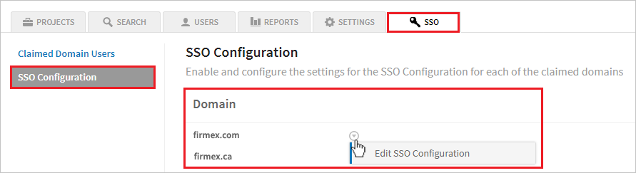

# Tutorial: Azure Active Directory single sign-on (SSO) integration with Firmex VDR

In this tutorial, you'll learn how to integrate Firmex VDR with Azure Active Directory (Azure AD). When you integrate Firmex VDR with Azure AD, you can:

* Control in Azure AD who has access to Firmex VDR.
* Enable your users to be automatically signed-in to Firmex VDR with their Azure AD accounts.
* Manage your accounts in one central location - the Azure portal.

To learn more about SaaS app integration with Azure AD, see [What is application access and single sign-on with Azure Active Directory](https://docs.microsoft.com/azure/active-directory/active-directory-appssoaccess-whatis).

## Prerequisites

To get started, you need the following items:

* An Azure AD subscription. If you don't have a subscription, you can get a [free account](https://azure.microsoft.com/free/).
* Firmex VDR single sign-on (SSO) enabled subscription.

## Scenario description

In this tutorial, you configure and test Azure AD SSO in a test environment.

* Firmex VDR supports **SP and IDP** initiated SSO

* Once you configure the Firmex you can enforce session controls, which protect exfiltration and infiltration of your organization’s sensitive data in real time. Session controls extend from Conditional Access. [Learn how to enforce session control with Microsoft Cloud App Security](https://docs.microsoft.com/cloud-app-security/proxy-deployment-any-app).

## Adding Firmex VDR from the gallery

To configure the integration of Firmex VDR into Azure AD, you need to add Firmex VDR from the gallery to your list of managed SaaS apps.

1. Sign in to the [Azure portal](https://portal.azure.com) using either a work or school account, or a personal Microsoft account.
1. On the left navigation pane, select the **Azure Active Directory** service.
1. Navigate to **Enterprise Applications** and then select **All Applications**.
1. To add new application, select **New application**.
1. In the **Add from the gallery** section, type **Firmex VDR** in the search box.
1. Select **Firmex VDR** from results panel and then add the app. Wait a few seconds while the app is added to your tenant.

## Configure and test Azure AD single sign-on for Firmex VDR

Configure and test Azure AD SSO with Firmex VDR using a test user called **B.Simon**. For SSO to work, you need to establish a link relationship between an Azure AD user and the related user in Firmex VDR.

To configure and test Azure AD SSO with Firmex VDR, complete the following building blocks:

1. **[Configure Azure AD SSO](#configure-azure-ad-sso)** - to enable your users to use this feature.
    * **[Create an Azure AD test user](#create-an-azure-ad-test-user)** - to test Azure AD single sign-on with B.Simon.
    * **[Assign the Azure AD test user](#assign-the-azure-ad-test-user)** - to enable B.Simon to use Azure AD single sign-on.
1. **[Configure Firmex VDR SSO](#configure-firmex-vdr-sso)** - to configure the single sign-on settings on application side.
    * **[Create Firmex VDR test user](#create-firmex-vdr-test-user)** - to have a counterpart of B.Simon in Firmex VDR that is linked to the Azure AD representation of user.
1. **[Test SSO](#test-sso)** - to verify whether the configuration works.

## Configure Azure AD SSO

Follow these steps to enable Azure AD SSO in the Azure portal.

1. In the [Azure portal](https://portal.azure.com/), on the **Firmex VDR** application integration page, find the **Manage** section and select **single sign-on**.
1. On the **Select a single sign-on method** page, select **SAML**.
1. On the **Set-up single sign-on with SAML** page, click the edit/pen icon for **Basic SAML Configuration** to edit the settings.

   

1. On the **Basic SAML Configuration** section, the user does not have to perform any step as the app is already pre-integrated with Azure.

1. Click **Set additional URLs** and perform the following step if you wish to configure the application in **SP** initiated mode:

    In the **Sign-on URL** text box, type the URL:
    `https://login.firmex.com`

1. Click **Save**.

1. Firmex VDR application expects the SAML assertions in a specific format, which requires you to add custom attribute mappings to your SAML token attributes configuration. The following screenshot shows the list of default attributes.

	

1. In addition to above, Firmex VDR application expects few more attributes to be passed back in SAML response which are shown below. These attributes are also pre populated but you can review them as per your requirements.

	| Name | Source Attribute|
	| ------------ | --------- |
	| email | user.mail |

1. On the **Set-up single sign-on with SAML** page, in the **SAML Signing Certificate** section,  find **Federation Metadata XML** and select **Download** to download the certificate and save it on your computer.

	

1. On the **Set-up Firmex VDR** section, copy the appropriate URL(s) based on your requirement.

	

### Create an Azure AD test user

In this section, you'll create a test user in the Azure portal called B.Simon.

1. From the left pane in the Azure portal, select **Azure Active Directory**, select **Users**, and then select **All users**.
1. Select **New user** at the top of the screen.
1. In the **User** properties, follow these steps:
   1. In the **Name** field, enter `B.Simon`.  
   1. In the **User name** field, enter the username@companydomain.extension. For example, `B.Simon@contoso.com`.
   1. Select the **Show password** check box, and then write down the value that's displayed in the **Password** box.
   1. Click **Create**.

### Assign the Azure AD test user

In this section, you'll enable B.Simon to use Azure single sign-on by granting access to Firmex VDR.

1. In the Azure portal, select **Enterprise Applications**, and then select **All applications**.
1. In the applications list, select **Firmex VDR**.
1. In the app's overview page, find the **Manage** section and select **Users and groups**.

   

1. Select **Add user**, then select **Users and groups** in the **Add Assignment** dialog.

	

1. In the **Users and groups** dialog, select **B.Simon** from the Users list, then click the **Select** button at the bottom of the screen.
1. If you're expecting any role value in the SAML assertion, in the **Select Role** dialog, select the appropriate role for the user from the list and then click the **Select** button at the bottom of the screen.
1. In the **Add Assignment** dialog, click the **Assign** button.

## Configure Firmex VDR SSO

### Before you get started

#### What you’ll need

-   An active Firmex subscription
-   Azure AD as your SSO service
-   Your IT administrator to configure SSO
-   Once SSO is enabled, all of your company’s users must log in to Firmex using SSO, and not using a login/password.

#### How long will this take?

Implementing SSO takes a few minutes. There is virtually no downtime between Firmex Support enabling SSO for your site, and your company’s users authenticating using SSO. Just follow the steps below.

### Step 1 - Identify your company’s domains

Identify the domains with which your company’s users are logging in.

For example:

- @firmex.com
- @firmex.ca

### Step 2 - Contact Firmex Support with your domains

Email [Firmex Support Team](mailto:support@firmex.com) or call 1888 688 4042 x.11 to speak to Firmex Support. Pass along your domain information. Firmex Support will add the domains to your VDR as **claimed domains**. Your admin must now configure SSO.

Warning: Until your site admin configures the claimed domains, your company’s users will not be able to log in to the VDR. Non-company users (that is, guest users) can still log in using their email/password. Configuration should take a few minutes.

### Step 3 - Configure the claimed domains

1. Log in to Firmex as a Site Administrator.
1. From the top-left corner, click your company logo.
1. Select the  **SSO**  tab. Then select  **SSO Configuration**. Click the domain you want to configure.

      

1. Have your IT Administrator fill in the following fields. The fields should be taken from your identity provider:  

    

    a. In the **Entity ID** textbox, paste the **Azure AD Identifier** value, which you have copied from the Azure portal.

    b. In the **Identity Provider URL** textbox, paste the **Login URL** value, which you have copied from the Azure portal.

    c. **Public Key Certificate**  - For authentication purposes, a SAML message may be digitally signed by the issuer. To verify the signature on the message, the message receiver uses a public key known to belong to the issuer. Similarly, to encrypt a message, a public encryption key belonging to the ultimate receiver must be known to the issuer. In both situations—signing and encryption—trusted public keys must be shared in advance.  This is the **X509Certificate** from **Federation Metadata XML**

    d. Click **Save** to complete the SSO configuration. Changes take effect immediately.

1. At this time, SSO is enabled for your site.

### Create Firmex VDR test user

In this section, you create a user called B.Simon in Firmex. Work with [Firmex Support Team](mailto:support@firmex.com) to add the users in the Firmex platform. Users must be created and activated before you use single sign-on.

## Test SSO

In this section, you test your Azure AD single sign-on configuration using the Access Panel.

When you click the Firmex VDR tile in the Access Panel, you should be automatically signed in to the Firmex VDR for which you set-up SSO. For more information about the Access Panel, see [Introduction to the Access Panel](https://docs.microsoft.com/azure/active-directory/active-directory-saas-access-panel-introduction).

## Additional resources

- [ List of Tutorials on How to Integrate SaaS Apps with Azure Active Directory ](https://docs.microsoft.com/azure/active-directory/active-directory-saas-tutorial-list)

- [What is application access and single sign-on with Azure Active Directory? ](https://docs.microsoft.com/azure/active-directory/active-directory-appssoaccess-whatis)

- [What is conditional access in Azure Active Directory?](https://docs.microsoft.com/azure/active-directory/conditional-access/overview)

- [Try Firmex VDR with Azure AD](https://aad.portal.azure.com/)

- [What is session control in Microsoft Cloud App Security?](https://docs.microsoft.com/cloud-app-security/proxy-intro-aad)

- [How to protect Firmex with advanced visibility and controls](https://docs.microsoft.com/cloud-app-security/proxy-intro-aad)
