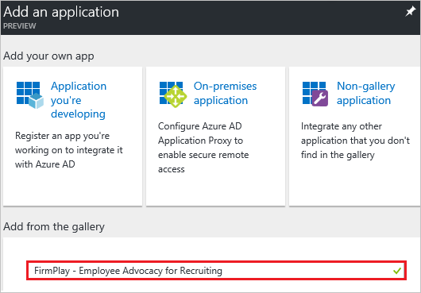
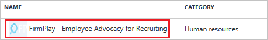
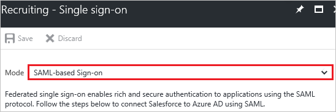
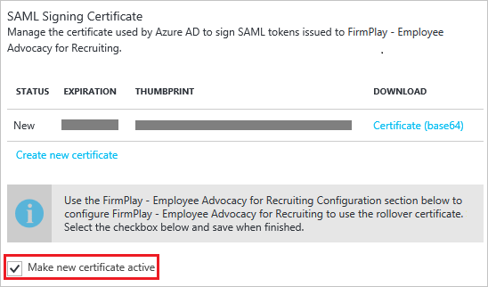
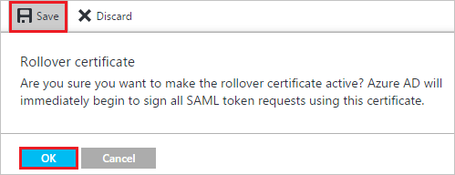
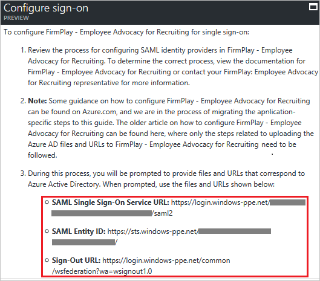

---
title: 'Tutorial: Azure Active Directory integration with FirmPlay - Employee Advocacy for Recruiting | Microsoft Docs'
description: Learn how to configure single sign-on between Azure Active Directory and FirmPlay - Employee Advocacy for Recruiting.
services: active-directory
documentationCenter: na
author: jeevansd
manager: mtillman

ms.assetid: a6799629-7546-43f8-a966-956db32864b1
ms.service: active-directory
ms.component: saas-app-tutorial
ms.workload: identity
ms.tgt_pltfrm: na
ms.devlang: na
ms.topic: article
ms.date: 02/15/2017
ms.author: jeedes

---
# Tutorial: Azure Active Directory integration with FirmPlay - Employee Advocacy for Recruiting

In this tutorial, you learn how to integrate FirmPlay - Employee Advocacy for Recruiting with Azure Active Directory (Azure AD).

Integrating FirmPlay - Employee Advocacy for Recruiting with Azure AD provides you with the following benefits:

- You can control in Azure AD who has access to FirmPlay - Employee Advocacy for Recruiting
- You can enable your users to automatically get signed-on to FirmPlay - Employee Advocacy for Recruiting (Single Sign-On) with their Azure AD accounts
- You can manage your accounts in one central location - the Azure Management portal

If you want to know more details about SaaS app integration with Azure AD, see [What is application access and single sign-on with Azure Active Directory](../manage-apps/what-is-single-sign-on.md).

## Prerequisites

To configure Azure AD integration with FirmPlay - Employee Advocacy for Recruiting, you need the following items:

- An Azure AD subscription
- A FirmPlay - Employee Advocacy for Recruiting single-sign on enabled subscription

> [!NOTE]
> To test the steps in this tutorial, we do not recommend using a production environment.

To test the steps in this tutorial, you should follow these recommendations:

- You should not use your production environment, unless this is necessary.
- If you don't have an Azure AD trial environment, you can get a one-month trial [here](https://azure.microsoft.com/pricing/free-trial/).

## Scenario description
In this tutorial, you test Azure AD single sign-on in a test environment. 
The scenario outlined in this tutorial consists of two main building blocks:

1. Adding FirmPlay - Employee Advocacy for Recruiting from the gallery
1. Configuring and testing Azure AD single sign-on

## Adding FirmPlay - Employee Advocacy for Recruiting from the gallery
To configure the integration of FirmPlay - Employee Advocacy for Recruiting into Azure AD, you need to add FirmPlay - Employee Advocacy for Recruiting from the gallery to your list of managed SaaS apps.

**To add FirmPlay - Employee Advocacy for Recruiting from the gallery, perform the following steps:**

1. In the **[Azure Management Portal](https://portal.azure.com)**, on the left navigation panel, click **Azure Active Directory** icon. 

	![Active Directory][1]

1. Navigate to **Enterprise applications**. Then go to **All applications**.

	![Applications][2]
	
1. Click **Add** button on the top of the dialog.

	![Applications][3]

1. In the search box, type **FirmPlay - Employee Advocacy for Recruiting**.

	

1. In the results panel, select **FirmPlay - Employee Advocacy for Recruiting**, and then click **Add** button to add the application.

	

##  Configuring and testing Azure AD single sign-on
In this section, you configure and test Azure AD single sign-on with FirmPlay - Employee Advocacy for Recruiting based on a test user called "Britta Simon".

For single sign-on to work, Azure AD needs to know what the counterpart user in FirmPlay - Employee Advocacy for Recruiting is to a user in Azure AD. In other words, a link relationship between an Azure AD user and the related user in FirmPlay - Employee Advocacy for Recruiting needs to be established.

This link relationship is established by assigning the value of the **user name** in Azure AD as the value of the **Username** in FirmPlay - Employee Advocacy for Recruiting.

To configure and test Azure AD single sign-on with FirmPlay - Employee Advocacy for Recruiting, you need to complete the following building blocks:

1. **[Configuring Azure AD Single Sign-On](#configuring-azure-ad-single-sign-on)** - to enable your users to use this feature.
1. **[Creating an Azure AD test user](#creating-an-azure-ad-test-user)** - to test Azure AD single sign-on with Britta Simon.
1. **[Creating a FirmPlay - Employee Advocacy for Recruiting test user](#creating-a-firmplay---employee-advocacy-for-recruiting-test-user)** - to have a counterpart of Britta Simon in FirmPlay: Employee Advocacy for Recruiting that is linked to the Azure AD representation of her.
1. **[Assigning the Azure AD test user](#assigning-the-azure-ad-test-user)** - to enable Britta Simon to use Azure AD single sign-on.
1. **[Testing Single Sign-On](#testing-single-sign-on)** - to verify whether the configuration works.

### Configuring Azure AD single sign-on

In this section, you enable Azure AD single sign-on in the Azure Management portal and configure single sign-on in your FirmPlay - Employee Advocacy for Recruiting application.

**To configure Azure AD single sign-on with FirmPlay - Employee Advocacy for Recruiting, perform the following steps:**

1. In the Azure Management portal, on the **FirmPlay - Employee Advocacy for Recruiting** application integration page, click **Single sign-on**.

	![Configure Single Sign-On][4]

1. On the **Single sign-on** dialog, as **Mode** select **SAML-based Sign-on** to enable single sign on.
 
	

1. On the **FirmPlay - Employee Advocacy for Recruiting Domain and URLs** section, in the **Sign On URL** textbox, type a URL using the following pattern: `https://<your-subdomain>.firmplay.com/`

	

	> [!NOTE] 
	> Please note that this is not the real value. You have to update this value with the actual Sign On URL. Contact [FirmPlay - Employee Advocacy for Recruiting support team](mailto:engineering@firmplay.com) to get this value. 

1. On the **SAML Signing Certificate** section, click **Create new certificate**.

	 	

1. On the **Create New Certificate** dialog, click the calendar icon and select an **expiry date**. Then click **Save** button.

	

1. On the **SAML Signing Certificate** section, select **Make new certificate active** and click **Save** button.

	

1. On the pop-up **Rollover certificate** window, click **OK**.

	

1. On the **SAML Signing Certificate** section, click **Certificate (base64)** and then save the certificate file on your computer. 

	 

1. On the **FirmPlay - Employee Advocacy for Recruiting Configuration** section, click **Configure FirmPlay - Employee Advocacy for Recruiting** to open **Configure sign-on** dialog.

	 

	

1. To get SSO configured for your application, contact [FirmPlay - Employee Advocacy for Recruiting support team](mailto:engineering@firmplay.com) and provide them with the following: 

	•  The downloaded **Certificate file**

	•  The **SAML Single Sign-On Service URL**

	•  The **SAML Entity ID**

	•  The **Sign-Out URL**
  

### Creating an Azure AD test user
The objective of this section is to create a test user in the Azure Management portal called Britta Simon.

![Create Azure AD User][100]

**To create a test user in Azure AD, perform the following steps:**

1. In the **Azure Management portal**, on the left navigation pane, click **Azure Active Directory** icon.

	 

1. Go to **Users and groups** and click **All users** to display the list of users.
	
	 

1. At the top of the dialog click **Add** to open the **User** dialog.
 
	 

1. On the **User** dialog page, perform the following steps:
 
	 

    a. In the **Name** textbox, type **BrittaSimon**.

    b. In the **User name** textbox, type the **email address** of BrittaSimon.

	c. Select **Show Password** and write down the value of the **Password**.

    d. Click **Create**. 

### Creating a FirmPlay - Employee Advocacy for Recruiting test user

In this section, you create a user called Britta Simon in FirmPlay - Employee Advocacy for Recruiting. Please work with [FirmPlay - Employee Advocacy for Recruiting support team](mailto:engineering@firmplay.com) to add the users in the FirmPlay - Employee Advocacy for Recruiting platform.

### Assigning the Azure AD test user

In this section, you enable Britta Simon to use Azure single sign-on by granting her access to FirmPlay - Employee Advocacy for Recruiting.

![Assign User][200] 

**To assign Britta Simon to FirmPlay - Employee Advocacy for Recruiting, perform the following steps:**

1. In the Azure Management portal, open the applications view, and then navigate to the directory view and go to **Enterprise applications** then click **All applications**.

	![Assign User][201] 

1. In the applications list, select **FirmPlay - Employee Advocacy for Recruiting**.

	 

1. In the menu on the left, click **Users and groups**.

	![Assign User][202] 

1. Click **Add** button. Then select **Users and groups** on **Add Assignment** dialog.

	![Assign User][203]

1. On **Users and groups** dialog, select **Britta Simon** in the Users list.

1. Click **Select** button on **Users and groups** dialog.

1. Click **Assign** button on **Add Assignment** dialog.
	

### Testing single sign-on

In this section, you test your Azure AD single sign-on configuration using the Access Panel.

When you click the FirmPlay - Employee Advocacy for Recruiting tile in the Access Panel, you should get automatically signed-on to your FirmPlay - Employee Advocacy for Recruiting application.

## Additional resources

* [List of Tutorials on How to Integrate SaaS Apps with Azure Active Directory](tutorial-list.md)
* [What is application access and single sign-on with Azure Active Directory?](../manage-apps/what-is-single-sign-on.md)

<!--Image references-->

[1]: ./media/firmplay-tutorial/tutorial_general_01.png
[2]: ./media/firmplay-tutorial/tutorial_general_02.png
[3]: ./media/firmplay-tutorial/tutorial_general_03.png
[4]: ./media/firmplay-tutorial/tutorial_general_04.png

[100]: ./media/firmplay-tutorial/tutorial_general_100.png

[200]: ./media/firmplay-tutorial/tutorial_general_200.png
[201]: ./media/firmplay-tutorial/tutorial_general_201.png
[202]: ./media/firmplay-tutorial/tutorial_general_202.png
[203]: ./media/firmplay-tutorial/tutorial_general_203.png