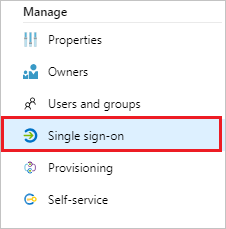
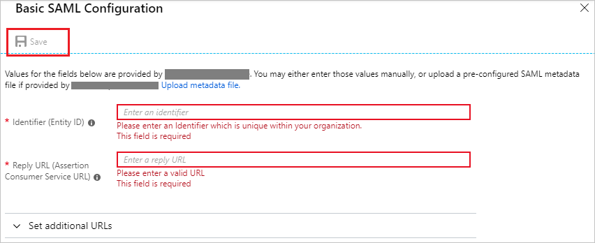
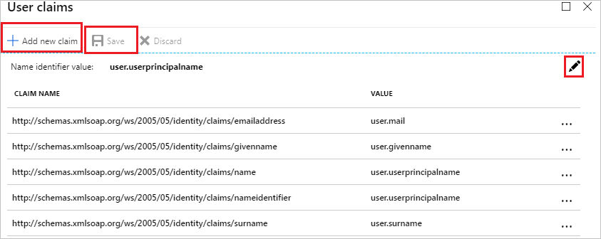

# Tutorial: Azure Active Directory integration with Firstbird

In this tutorial, you learn how to integrate Firstbird with Azure Active Directory (Azure AD).
Integrating Firstbird with Azure AD provides you with the following benefits:

* You can control in Azure AD who has access to Firstbird.
* You can enable your users to be automatically signed-in to Firstbird (Single Sign-On) with their Azure AD accounts.
* You can manage your accounts in one central location - the Azure portal.

If you want to know more details about SaaS app integration with Azure AD, see [What is application access and single sign-on with Azure Active Directory](https://docs.microsoft.com/azure/active-directory/active-directory-appssoaccess-whatis).
If you don't have an Azure subscription, [create a free account](https://azure.microsoft.com/free/) before you begin.

## Prerequisites

To configure Azure AD integration with Firstbird, you need the following items:

* An Azure AD subscription. If you don't have an Azure AD environment, you can get one-month trial [here](https://azure.microsoft.com/pricing/free-trial/)
* Firstbird single sign-on enabled subscription

## Scenario description

In this tutorial, you configure and test Azure AD single sign-on in a test environment.

* Firstbird supports **SP and IDP** initiated SSO
* Firstbird supports **Just In Time** user provisioning

## Adding Firstbird from the gallery

To configure the integration of Firstbird into Azure AD, you need to add Firstbird from the gallery to your list of managed SaaS apps.

**To add Firstbird from the gallery, perform the following steps:**

1. In the **[Azure portal](https://portal.azure.com)**, on the left navigation panel, click **Azure Active Directory** icon.

	

2. Navigate to **Enterprise Applications** and then select the **All Applications** option.

	

3. To add new application, click **New application** button on the top of dialog.

	

4. In the search box, type **Firstbird**, select **Firstbird** from result panel then click **Add** button to add the application.

	 

## Configure and test Azure AD single sign-on

In this section, you configure and test Azure AD single sign-on with [Application name] based on a test user called **Britta Simon**.
For single sign-on to work, a link relationship between an Azure AD user and the related user in [Application name] needs to be established.

To configure and test Azure AD single sign-on with [Application name], you need to complete the following building blocks:

1. **[Configure Azure AD Single Sign-On](#configure-azure-ad-single-sign-on)** - to enable your users to use this feature.
2. **[Configure Firstbird Single Sign-On](#configure-firstbird-single-sign-on)** - to configure the Single Sign-On settings on application side.
3. **[Create an Azure AD test user](#create-an-azure-ad-test-user)** - to test Azure AD single sign-on with Britta Simon.
4. **[Assign the Azure AD test user](#assign-the-azure-ad-test-user)** - to enable Britta Simon to use Azure AD single sign-on.
5. **[Create Firstbird test user](#create-firstbird-test-user)** - to have a counterpart of Britta Simon in Firstbird that is linked to the Azure AD representation of user.
6. **[Test single sign-on](#test-single-sign-on)** - to verify whether the configuration works.

### Configure Azure AD single sign-on

In this section, you enable Azure AD single sign-on in the Azure portal.

To configure Azure AD single sign-on with [Application name], perform the following steps:

1. In the [Azure portal](https://portal.azure.com/), on the **Firstbird** application integration page, select **Single sign-on**.

    

2. On the **Select a Single sign-on method** dialog, select **SAML/WS-Fed** mode to enable single sign-on.

    

3. On the **Set up Single Sign-On with SAML** page, click **Edit** icon to open **Basic SAML Configuration** dialog.

	

4. On the **Basic SAML Configuration** section, perform the following steps:

    

    a. In the **Identifier** text box, type a URL using the following pattern:
    `https://<company-domain>.auth.1brd.com/saml/sp`

    b. In the **Reply URL** text box, type a URL using the following pattern:
    `https://<company-domain>.auth.1brd.com/saml/callback`

5. Click **Set additional URLs** and perform the following step if you wish to configure the application in **SP** initiated mode:

    

    In the **Sign-on URL** text box, type a URL using the following pattern:
    `https://<company-domain>.1brd.com/login`

	> [!NOTE]
	> These values are not real. Update these values with the actual Identifier, Reply URL and Sign-on URL. Contact [Firstbird Client support team](mailto:support@firstbird.com) to get these values. You can also refer to the patterns shown in the **Basic SAML Configuration** section in the Azure portal.

6. Firstbird application expects the SAML assertions in a specific format. Configure the following claims for this application. You can manage the values of these attributes from the **User Attributes** section on application integration page. On the **Set up Single Sign-On with SAML** page, click **Edit** button to open **User Attributes** dialog.

	

7. In the **User Claims** section on the **User Attributes** dialog, configure SAML token attribute as shown in the image above and perform the following steps:

	| Name | Source Attribute|
	| ---------------| --------- |
	| first_name | `user.givenname` |
	| last_name | `user.surname` |
    | email | `user.mail` |

	a. Click **Add new claim** to open the **Manage user claims** dialog.

	

	

	b. In the **Name** textbox, type the attribute name shown for that row.

	c. Leave the **Namespace** blank.

	d. Select Source as **Attribute**.

	e. From the **Source attribute** list, type the attribute value shown for that row.

	f. Click **Ok**

	g. Click **Save**.

8. On the **Set up Single Sign-On with SAML** page, In the **SAML Signing Certificate** section, click **Download** to download **Federation Metadata XML** and save it on your computer.

	

### Configure Firstbird Single Sign-On

Once you have completed these steps, please send Firstbird the Federation Metadata XML in a support request via e-email to [support@firstbird.com](mailto:support@firstbird.com) with the subject: "SSO configuration".

Firstbird will then store the configuration in the system accordingly and activate SSO for your account. After that, a member of the support staff will contact you to verify the configuration.

> [!NOTE]
> You need to have the SSO option included in your contract.

### Create an Azure AD test user

The objective of this section is to create a test user in the Azure portal called Britta Simon.

1. In the Azure portal, in the left pane, select **Azure Active Directory**, select **Users**, and then select **All users**.

    

2. Select **New user** at the top of the screen.

    

3. In the User properties, perform the following steps.

    

    a. In the **Name** field, enter **BrittaSimon**.

    b. In the **User name** field, type **brittasimon\@yourcompanydomain.extension**  
    For example, BrittaSimon@contoso.com

    c. Select **Show password** check box, and then write down the value that's displayed in the Password box.

    d. Click **Create**.

### Assign the Azure AD test user

In this section, you enable Britta Simon to use Azure single sign-on by granting access to Firstbird.

1. In the Azure portal, select **Enterprise Applications**, select **All applications**, then select **Firstbird**.

	

2. In the applications list, type and select **Firstbird**.

	

3. In the menu on the left, select **Users and groups**.

    

4. Click the **Add user** button, then select **Users and groups** in the **Add Assignment** dialog.

    

5. In the **Users and groups** dialog select **Britta Simon** in the Users list, then click the **Select** button at the bottom of the screen.

6. If you are expecting any role value in the SAML assertion then in the **Select Role** dialog select the appropriate role for the user from the list, then click the **Select** button at the bottom of the screen.

7. In the **Add Assignment** dialog, click the **Assign** button.

### Create Firstbird test user

In this section, a user called Britta Simon is created in Firstbird. Firstbird supports just-in-time provisioning, which is enabled by default. There is no action item for you in this section. If a user doesn't already exist in Firstbird, a new one is created when you attempt to access Firstbird.

### Test single sign-on

In this section, you test your Azure AD single sign-on configuration using the Access Panel.

When you click the Firstbird tile in the Access Panel, you should be automatically signed in to the Firstbird for which you set up SSO. For more information about the Access Panel, see [Introduction to the Access Panel](https://docs.microsoft.com/azure/active-directory/active-directory-saas-access-panel-introduction).

## Additional Resources

- [List of Tutorials on How to Integrate SaaS Apps with Azure Active Directory](https://docs.microsoft.com/azure/active-directory/active-directory-saas-tutorial-list)

- [What is application access and single sign-on with Azure Active Directory?](https://docs.microsoft.com/azure/active-directory/active-directory-appssoaccess-whatis)

- [What is Conditional Access in Azure Active Directory?](https://docs.microsoft.com/azure/active-directory/conditional-access/overview)
