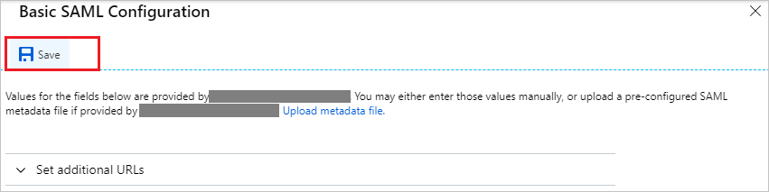
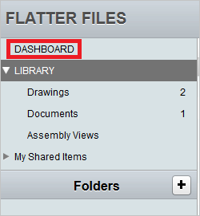
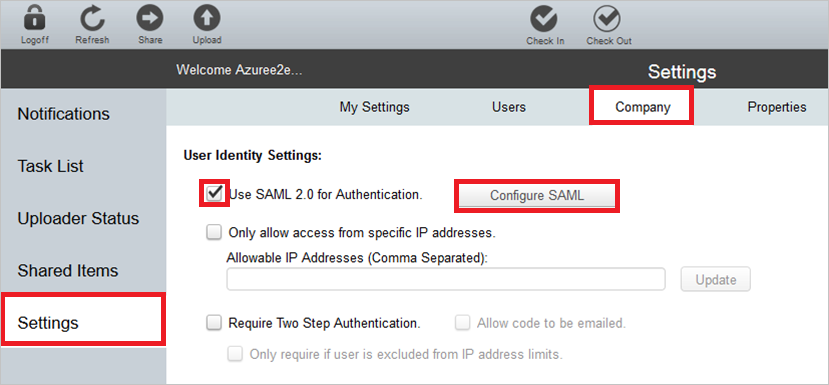
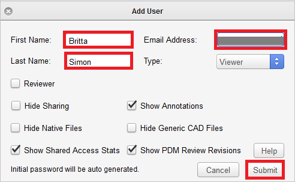

# Tutorial: Microsoft Entra integration with Flatter Files

In this tutorial, you learn how to integrate Flatter Files with Microsoft Entra ID.
Integrating Flatter Files with Microsoft Entra ID provides you with the following benefits:

* You can control in Microsoft Entra ID who has access to Flatter Files.
* You can enable your users to be automatically signed-in to Flatter Files (Single Sign-On) with their Microsoft Entra accounts.
* You can manage your accounts in one central location.

If you want to know more details about SaaS app integration with Microsoft Entra ID, see [What is application access and single sign-on with Microsoft Entra ID](../manage-apps/what-is-single-sign-on.md).
If you don't have an Azure subscription, [create a free account](https://azure.microsoft.com/free/) before you begin.

## Prerequisites

To configure Microsoft Entra integration with Flatter Files, you need the following items:

* A Microsoft Entra subscription. If you don't have a Microsoft Entra environment, you can get one-month trial [here](https://azure.microsoft.com/pricing/free-trial/)
* Flatter Files single sign-on enabled subscription

## Scenario description

In this tutorial, you configure and test Microsoft Entra single sign-on in a test environment.

* Flatter Files supports **IDP** initiated SSO

## Adding Flatter Files from the gallery

To configure the integration of Flatter Files into Microsoft Entra ID, you need to add Flatter Files from the gallery to your list of managed SaaS apps.

**To add Flatter Files from the gallery, perform the following steps:**

1. Sign in to the [Microsoft Entra admin center](https://entra.microsoft.com) as at least a [Cloud Application Administrator](../roles/permissions-reference.md#cloud-application-administrator).
1. Browse to **Identity** > **Applications** > **Enterprise applications** > **New application**.
1. In the search box, type **Flatter Files**, select **Flatter Files** from result panel then click **Add** button to add the application.

	 

## Configure and test Microsoft Entra single sign-on

In this section, you configure and test Microsoft Entra single sign-on with Flatter Files based on a test user called **Britta Simon**.
For single sign-on to work, a link relationship between a Microsoft Entra user and the related user in Flatter Files needs to be established.

To configure and test Microsoft Entra single sign-on with Flatter Files, you need to complete the following building blocks:

1. **[Configure Microsoft Entra Single Sign-On](#configure-azure-ad-single-sign-on)** - to enable your users to use this feature.
2. **[Configure Flatter Files Single Sign-On](#configure-flatter-files-single-sign-on)** - to configure the Single Sign-On settings on application side.
3. **[Create a Microsoft Entra test user](#create-an-azure-ad-test-user)** - to test Microsoft Entra single sign-on with Britta Simon.
4. **[Assign the Microsoft Entra test user](#assign-the-azure-ad-test-user)** - to enable Britta Simon to use Microsoft Entra single sign-on.
5. **[Create Flatter Files test user](#create-flatter-files-test-user)** - to have a counterpart of Britta Simon in Flatter Files that is linked to the Microsoft Entra representation of user.
6. **[Test single sign-on](#test-single-sign-on)** - to verify whether the configuration works.

### Configure Microsoft Entra single sign-on

In this section, you enable Microsoft Entra single sign-on.

To configure Microsoft Entra single sign-on with Flatter Files, perform the following steps:

1. Sign in to the [Microsoft Entra admin center](https://entra.microsoft.com) as at least a [Cloud Application Administrator](../roles/permissions-reference.md#cloud-application-administrator).
1. Browse to **Identity** > **Applications** > **Enterprise applications** > **Flatter Files** application integration page, select **Single sign-on**.

    

1. On the **Select a Single sign-on method** dialog, select **SAML/WS-Fed** mode to enable single sign-on.

    

1. On the **Set up Single Sign-On with SAML** page, click **Edit** icon to open **Basic SAML Configuration** dialog.

	

1. On the **Basic SAML Configuration** section, the user does not have to perform any step as the app is already pre-integrated with Azure.

    

1. On the **Set up Single Sign-On with SAML** page, in the **SAML Signing Certificate** section, click **Download** to download the **Certificate (Base64)** from the given options as per your requirement and save it on your computer.

	

1. On the **Set up Flatter Files** section, copy the appropriate URL(s) as per your requirement.

	

	a. Login URL

	b. Microsoft Entra Identifier

	c. Logout URL

### Configure Flatter Files Single Sign-On

1. Sign-on to your Flatter Files application as an administrator.

2. Click **DASHBOARD**. 
   
      

3. Click **Settings**, and then perform the following steps on the **Company** tab: 

      

    1. Select **Use SAML 2.0 for Authentication**.
    
    1. Click **Configure SAML**.

4. On the **SAML Configuration** dialog, perform the following steps: 
   
      
   
    a. In the **Domain** textbox, type your registered domain.
   
   > [!NOTE]
   > If you don't have a registered domain yet, contact your Flatter Files support team via [support@flatterfiles.com](mailto:support@flatterfiles.com). 
    
    b. In **Identity Provider URL** textbox, paste the value of **Login URL** which you have copied form Azure portal.
   
    c.  Open your base-64 encoded certificate in notepad, copy the content of it into your clipboard, and then paste it to the **Identity Provider Certificate** textbox.

    d. Click **Update**.

### Create a Microsoft Entra test user 

The objective of this section is to create a test user called Britta Simon.

1. Sign in to the [Microsoft Entra admin center](https://entra.microsoft.com) as at least a [User Administrator](../roles/permissions-reference.md#user-administrator).
1. Browse to **Identity** > **Users** > **All users**.
1. Select **New user** > **Create new user**, at the top of the screen.
1. In the **User** properties, follow these steps:
   1. In the **Display name** field, enter `B.Simon`.  
   1. In the **User principal name** field, enter the username@companydomain.extension. For example, `B.Simon@contoso.com`.
   1. Select the **Show password** check box, and then write down the value that's displayed in the **Password** box.
   1. Select **Review + create**.
1. Select **Create**.

### Assign the Microsoft Entra test user

In this section, you enable Britta Simon to use Azure single sign-on by granting access to Flatter Files.

1. Sign in to the [Microsoft Entra admin center](https://entra.microsoft.com) as at least a [Cloud Application Administrator](../roles/permissions-reference.md#cloud-application-administrator).
1. Browse to **Identity** > **Applications** > **Enterprise applications** > **Flatter Files**.

	

1. In the applications list, select **Flatter Files**.

	

1. In the app's overview page, select **Users and groups**.
1. Select **Add user/group**, then select **Users and groups** in the **Add Assignment** dialog.
   1. In the **Users and groups** dialog, select **B.Simon** from the Users list, then click the **Select** button at the bottom of the screen.
   1. If you are expecting a role to be assigned to the users, you can select it from the **Select a role** dropdown. If no role has been set up for this app, you see "Default Access" role selected.
   1. In the **Add Assignment** dialog, click the **Assign** button.

### Create Flatter Files test user

The objective of this section is to create a user called Britta Simon in Flatter Files.

**To create a user called Britta Simon in Flatter Files, perform the following steps:**

1. Sign on to your **Flatter Files** company site as administrator.

2. In the navigation pane on the left, click **Settings**, and then click the **Users** tab.
   
    

3. Click **Add User**. 

4. On the **Add User** dialog, perform the following steps:
   
    

    a. In the **First Name** textbox, type **Britta**.
   
    b. In the **Last Name** textbox, type **Simon**. 
   
    c. In the **Email Address** textbox, type Britta's email address.
   
    d. Click **Submit**.   

### Test single sign-on 

In this section, you test your Microsoft Entra single sign-on configuration using the Access Panel.

When you click the Flatter Files tile in the Access Panel, you should be automatically signed in to the Flatter Files for which you set up SSO. For more information about the Access Panel, see [Introduction to the Access Panel](https://support.microsoft.com/account-billing/sign-in-and-start-apps-from-the-my-apps-portal-2f3b1bae-0e5a-4a86-a33e-876fbd2a4510).

## Additional Resources

- [List of Tutorials on How to Integrate SaaS Apps with Microsoft Entra ID](./tutorial-list.md)

- [What is application access and single sign-on with Microsoft Entra ID?](../manage-apps/what-is-single-sign-on.md)

- [What is Conditional Access in Microsoft Entra ID?](../conditional-access/overview.md)
