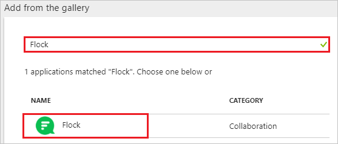
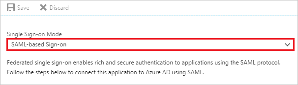
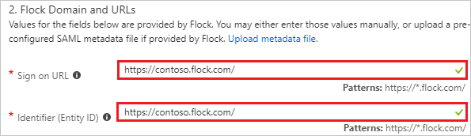
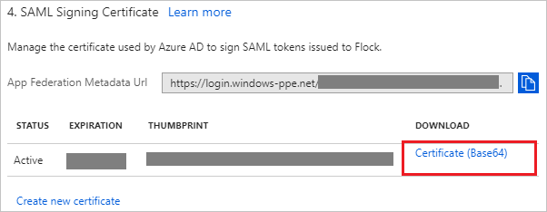
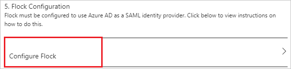
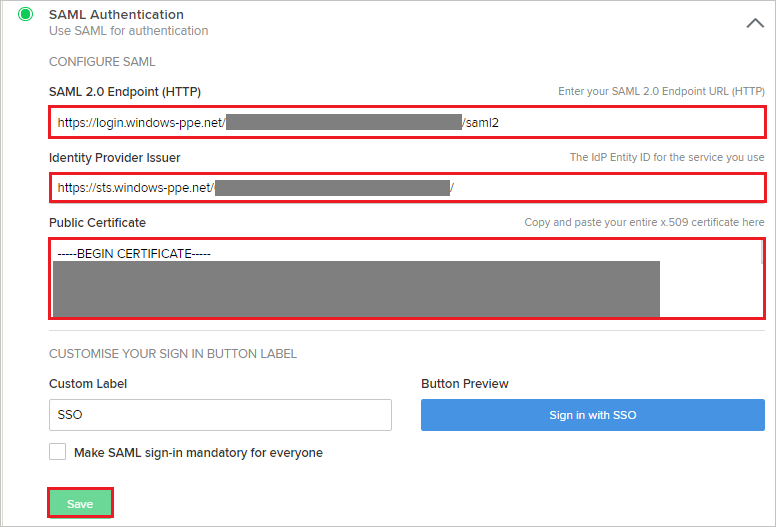
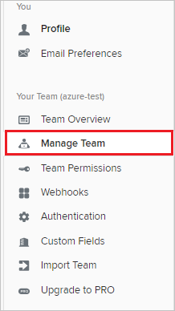
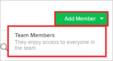
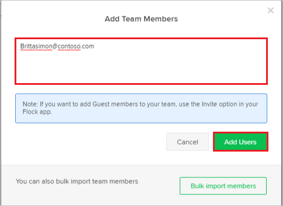
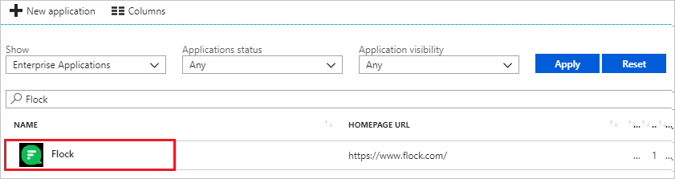

---
title: 'Tutorial: Azure Active Directory integration with Flock | Microsoft Docs'
description: Learn how to configure single sign-on between Azure Active Directory and Flock.
services: active-directory
documentationCenter: na
author: jeevansd
manager: femila
ms.reviewer: joflore

ms.assetid: 7b2c3ac5-17f1-49a0-8961-c541b258d4b1
ms.service: active-directory
ms.component: saas-app-tutorial
ms.workload: identity
ms.tgt_pltfrm: na
ms.devlang: na
ms.topic: article
ms.date: 05/15/2018
ms.author: jeedes

---
# Tutorial: Azure Active Directory integration with Flock

In this tutorial, you learn how to integrate Flock with Azure Active Directory (Azure AD).

Integrating Flock with Azure AD provides you with the following benefits:

- You can control in Azure AD who has access to Flock.
- You can enable your users to automatically get signed-on to Flock (Single Sign-On) with their Azure AD accounts.
- You can manage your accounts in one central location - the Azure portal.

If you want to know more details about SaaS app integration with Azure AD, see [what is application access and single sign-on with Azure Active Directory](../manage-apps/what-is-single-sign-on.md).

## Prerequisites

To configure Azure AD integration with Flock, you need the following items:

- An Azure AD subscription
- A Flock single sign-on enabled subscription

> [!NOTE]
> To test the steps in this tutorial, we do not recommend using a production environment.

To test the steps in this tutorial, you should follow these recommendations:

- Do not use your production environment, unless it is necessary.
- If you don't have an Azure AD trial environment, you can [get a one-month trial](https://azure.microsoft.com/pricing/free-trial/).

## Scenario description
In this tutorial, you test Azure AD single sign-on in a test environment. 
The scenario outlined in this tutorial consists of two main building blocks:

1. Adding Flock from the gallery
1. Configuring and testing Azure AD single sign-on

## Adding Flock from the gallery
To configure the integration of Flock into Azure AD, you need to add Flock from the gallery to your list of managed SaaS apps.

**To add Flock from the gallery, perform the following steps:**

1. In the **[Azure portal](https://portal.azure.com)**, on the left navigation panel, click **Azure Active Directory** icon. 

	![The Azure Active Directory button][1]

1. Navigate to **Enterprise applications**. Then go to **All applications**.

	![The Enterprise applications blade][2]
	
1. To add new application, click **New application** button on the top of dialog.

	![The New application button][3]

1. In the search box, type **Flock**, select **Flock** from result panel then click **Add** button to add the application.

	

## Configure and test Azure AD single sign-on

In this section, you configure and test Azure AD single sign-on with Flock based on a test user called "Britta Simon".

For single sign-on to work, Azure AD needs to know what the counterpart user in Flock is to a user in Azure AD. In other words, a link relationship between an Azure AD user and the related user in Flock needs to be established.

To configure and test Azure AD single sign-on with Flock, you need to complete the following building blocks:

1. **[Configure Azure AD Single Sign-On](#configure-azure-ad-single-sign-on)** - to enable your users to use this feature.
1. **[Create an Azure AD test user](#create-an-azure-ad-test-user)** - to test Azure AD single sign-on with Britta Simon.
1. **[Create a Flock test user](#create-a-flock-test-user)** - to have a counterpart of Britta Simon in Flock that is linked to the Azure AD representation of user.
1. **[Assign the Azure AD test user](#assign-the-azure-ad-test-user)** - to enable Britta Simon to use Azure AD single sign-on.
1. **[Test single sign-on](#test-single-sign-on)** - to verify whether the configuration works.

### Configure Azure AD single sign-on

In this section, you enable Azure AD single sign-on in the Azure portal and configure single sign-on in your Flock application.

**To configure Azure AD single sign-on with Flock, perform the following steps:**

1. In the Azure portal, on the **Flock** application integration page, click **Single sign-on**.

	![Configure single sign-on link][4]

1. On the **Single sign-on** dialog, select **Mode** as **SAML-based Sign-on** to enable single sign-on.

	

1. On the **Flock Domain and URLs** section, perform the following steps:

	

    a. In the **Sign-on URL** textbox, type a URL using the following pattern: `https://<subdomain>.flock.com/`

	b. In the **Identifier** textbox, type a URL using the following pattern: `https://<subdomain>.flock.com/`

	> [!NOTE]
	> These values are not real. Update these values with the actual Sign-On URL and Identifier. Contact [Flock Client support team](mailto:support@flock.com) to get these values.

1. On the **SAML Signing Certificate** section, click **Certificate(Base64)** and then save the certificate file on your computer.

	

1. Click **Save** button.

	

1. On the **Flock Configuration** section, click **Configure Flock** to open **Configure sign-on** window. Copy the **SAML Entity ID and SAML Single Sign-On Service URL** from the **Quick Reference section.**

	 

1. In a different web browser window, log in to your Flock company site as an administrator.

1. Select **Authentication** tab from the left navigation panel and then select **SAML Authentication**.

	

1. In the **SAML Authentication** section, perform the following steps:

	

	a. In the **SAML 2.0 Endpoint(HTTP)** textbox, paste **SAML Single Sign-On Service URL** value which you have copied from the Azure portal.

	b. In the **Identity Provider Issuer** textbox, paste **SAML Entity ID** value which you have copied from the Azure portal.

	c. Open the downloaded **Certificate(Base64)** from Azure portal in notepad, paste the content into the **Public Certificate** textbox.

	d. Click **Save**.

### Create an Azure AD test user

The objective of this section is to create a test user in the Azure portal called Britta Simon.

   ![Create an Azure AD test user][100]

**To create a test user in Azure AD, perform the following steps:**

1. In the Azure portal, in the left pane, click the **Azure Active Directory** button.

    

1. To display the list of users, go to **Users and groups**, and then click **All users**.

    

1. To open the **User** dialog box, click **Add** at the top of the **All Users** dialog box.

    

1. In the **User** dialog box, perform the following steps:

    

    a. In the **Name** box, type **BrittaSimon**.

    b. In the **User name** box, type the email address of user Britta Simon.

    c. Select the **Show Password** check box, and then write down the value that's displayed in the **Password** box.

    d. Click **Create**.

### Create a Flock test user

To enable Azure AD users to log in to Flock, they must be provisioned into Flock. In the case of Flock, provisioning is a manual task.

**To provision a user account, perform the following steps:**

1. Log in to your Flock company site as an administrator.

1. Click **Manage Team** from the left navigation panel.

    

1. Click **Add Member** tab and then select **Team Members**.

	

1. Enter the email address of the user like **Brittasimon@contoso.com** and then select **Add Users**.

	

### Assign the Azure AD test user

In this section, you enable Britta Simon to use Azure single sign-on by granting access to Flock.

![Assign the user role][200]

**To assign Britta Simon to Flock, perform the following steps:**

1. In the Azure portal, open the applications view, and then navigate to the directory view and go to **Enterprise applications** then click **All applications**.

	![Assign User][201]

1. In the applications list, select **Flock**.

	

1. In the menu on the left, click **Users and groups**.

	![The "Users and groups" link][202]

1. Click **Add** button. Then select **Users and groups** on **Add Assignment** dialog.

	![The Add Assignment pane][203]

1. On **Users and groups** dialog, select **Britta Simon** in the Users list.

1. Click **Select** button on **Users and groups** dialog.

1. Click **Assign** button on **Add Assignment** dialog.

### Test single sign-on

In this section, you test your Azure AD single sign-on configuration using the Access Panel.

When you click the Flock tile in the Access Panel, you should get automatically signed-on to your Flock application.
For more information about the Access Panel, see [Introduction to the Access Panel](../user-help/active-directory-saas-access-panel-introduction.md).

## Additional resources

* [List of Tutorials on How to Integrate SaaS Apps with Azure Active Directory](tutorial-list.md)
* [What is application access and single sign-on with Azure Active Directory?](../manage-apps/what-is-single-sign-on.md)

<!--Image references-->

[1]: ./media/flock-tutorial/tutorial_general_01.png
[2]: ./media/flock-tutorial/tutorial_general_02.png
[3]: ./media/flock-tutorial/tutorial_general_03.png
[4]: ./media/flock-tutorial/tutorial_general_04.png

[100]: ./media/flock-tutorial/tutorial_general_100.png

[200]: ./media/flock-tutorial/tutorial_general_200.png
[201]: ./media/flock-tutorial/tutorial_general_201.png
[202]: ./media/flock-tutorial/tutorial_general_202.png
[203]: ./media/flock-tutorial/tutorial_general_203.png
