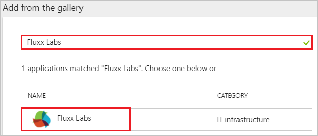
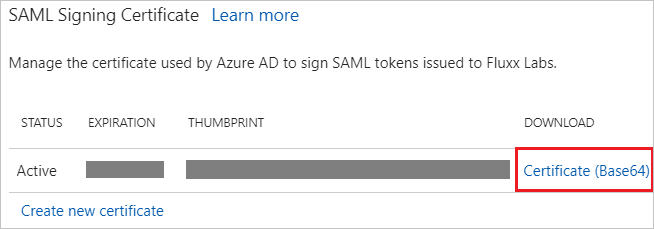
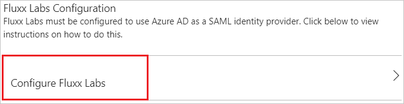
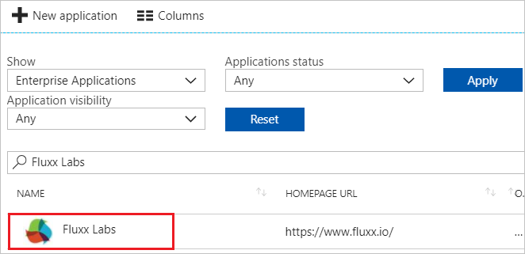

---
title: 'Tutorial: Azure Active Directory integration with Fluxx Labs | Microsoft Docs'
description: Learn how to configure single sign-on between Azure Active Directory and Fluxx Labs.
services: active-directory
documentationCenter: na
author: jeevansd
manager: femila
ms.reviewer: joflore

ms.assetid: d8fac770-bb57-4e1f-b50b-9ffeae239d07
ms.service: active-directory
ms.workload: identity
ms.tgt_pltfrm: na
ms.devlang: na
ms.topic: article
ms.date: 06/20/2018
ms.author: jeedes

---
# Tutorial: Azure Active Directory integration with Fluxx Labs

In this tutorial, you learn how to integrate Fluxx Labs with Azure Active Directory (Azure AD).

Integrating Fluxx Labs with Azure AD provides you with the following benefits:

- You can control in Azure AD who has access to Fluxx Labs.
- You can enable your users to automatically get signed-on to Fluxx Labs (Single Sign-On) with their Azure AD accounts.
- You can manage your accounts in one central location - the Azure portal.

If you want to know more details about SaaS app integration with Azure AD, see [what is application access and single sign-on with Azure Active Directory](../manage-apps/what-is-single-sign-on.md).

## Prerequisites

To configure Azure AD integration with Fluxx Labs, you need the following items:

- An Azure AD subscription
- A Fluxx Labs single sign-on enabled subscription

> [!NOTE]
> To test the steps in this tutorial, we do not recommend using a production environment.

To test the steps in this tutorial, you should follow these recommendations:

- Do not use your production environment, unless it is necessary.
- If you don't have an Azure AD trial environment, you can [get a one-month trial](https://azure.microsoft.com/pricing/free-trial/).

## Scenario description
In this tutorial, you test Azure AD single sign-on in a test environment. 
The scenario outlined in this tutorial consists of two main building blocks:

1. Adding Fluxx Labs from the gallery
1. Configuring and testing Azure AD single sign-on

## Adding Fluxx Labs from the gallery
To configure the integration of Fluxx Labs into Azure AD, you need to add Fluxx Labs from the gallery to your list of managed SaaS apps.

**To add Fluxx Labs from the gallery, perform the following steps:**

1. In the **[Azure portal](https://portal.azure.com)**, on the left navigation panel, click **Azure Active Directory** icon. 

	![The Azure Active Directory button][1]

1. Navigate to **Enterprise applications**. Then go to **All applications**.

	![The Enterprise applications blade][2]

1. To add new application, click **New application** button on the top of dialog.

	![The New application button][3]

1. In the search box, type **Fluxx Labs**, select **Fluxx Labs** from result panel then click **Add** button to add the application.

	

## Configure and test Azure AD single sign-on

In this section, you configure and test Azure AD single sign-on with Fluxx Labs based on a test user called "Britta Simon".

For single sign-on to work, Azure AD needs to know what the counterpart user in Fluxx Labs is to a user in Azure AD. In other words, a link relationship between an Azure AD user and the related user in Fluxx Labs needs to be established.

In Fluxx Labs, assign the value of the **user name** in Azure AD as the value of the **Username** to establish the link relationship.

To configure and test Azure AD single sign-on with Fluxx Labs, you need to complete the following building blocks:

1. **[Configure Azure AD Single Sign-On](#configure-azure-ad-single-sign-on)** - to enable your users to use this feature.
1. **[Create an Azure AD test user](#create-an-azure-ad-test-user)** - to test Azure AD single sign-on with Britta Simon.
1. **[Create a Fluxx Labs test user](#create-a-fluxx-labs-test-user)** - to have a counterpart of Britta Simon in Fluxx Labs that is linked to the Azure AD representation of user.
1. **[Assign the Azure AD test user](#assign-the-azure-ad-test-user)** - to enable Britta Simon to use Azure AD single sign-on.
1. **[Test single sign-on](#test-single-sign-on)** - to verify whether the configuration works.

### Configure Azure AD single sign-on

In this section, you enable Azure AD single sign-on in the Azure portal and configure single sign-on in your Fluxx Labs application.

**To configure Azure AD single sign-on with Fluxx Labs, perform the following steps:**

1. In the Azure portal, on the **Fluxx Labs** application integration page, click **Single sign-on**.

	![Configure single sign-on link][4]

1. On the **Single sign-on** dialog, select **Mode** as	**SAML-based Sign-on** to enable single sign-on.

	

1. On the **Fluxx Labs Domain and URLs** section, perform the following steps:

	

    a. In the **Identifier** textbox, type a URL using the following pattern:

	| Environment | URL Pattern|
	|-------------|------------|
	| Production | `https://<subdomain>.fluxx.io` |
	| Pre production | `https://<subdomain>.preprod.fluxxlabs.com`|
		
	b. In the **Reply URL** textbox, type a URL using the following pattern:

	| Environment | URL Pattern|
	|-------------|------------|
	| Production | `https://<subdomain>.fluxx.io/auth/saml/callback` |
	| Pre production | `https://<subdomain>.preprod.fluxxlabs.com/auth/saml/callback`|

	> [!NOTE]
	> These values are not real. Update these values with the actual Identifier and Reply URL. Contact [Fluxx Labs support team](mailto:travis@fluxxlabs.com) to get these values.

1. On the **SAML Signing Certificate** section, click **Certificate (Base64)** and then save the certificate file on your computer.

	 

1. Click **Save** button.

	

1. On the **Fluxx Labs Configuration** section, click **Configure Fluxx Labs** to open **Configure sign-on** window. Copy the **SAML Single Sign-On Service URL** from the **Quick Reference section.**

	

1. In a different web browser window, sign on to your Fluxx Labs company site as administrator.

1. Select **Admin** below the **Settings** section.

	

1. In the Admin Panel, Select **Plug-ins** > **Integrations** and then select **SAML SSO-(Disabled)**

	

1. In the attribute section, perform the following steps:

	

	a. Select the **SAML SSO** checkbox.

	b. In the **Request Path** textbox, type **/auth/saml**.

	c. In the **Callback Path** textbox, type **/auth/saml/callback**.

	d. In the **Assertion Consumer Service Url(Single Sign-On URL)** textbox, enter the **Reply URL** value, which you have entered in the Azure portal.

	e. In the **Audience(SP Entity ID)** textbox, enter the **Identifier** value, which you have entered in the Azure portal.

	f. In the **Identity Provider SSO Target URL** textbox, paste the **SAML Single Sign-On Service URL** value, which you have copied from the Azure portal.

	g. Open your base-64 encoded certificate in notepad, copy the content of it into your clipboard, and then paste it to the **Identity Provider Certificate** textbox.

	h. In **Name identifier Format** textbox, enter the value `urn:oasis:names:tc:SAML:1.1:nameid-format:emailAddress`.

	i. Click **Save**.

	> [!NOTE]
	> Once the content saved, the field will appear blank for security, but the value has been saved in the configuration.

### Create an Azure AD test user

The objective of this section is to create a test user in the Azure portal called Britta Simon.

   ![Create an Azure AD test user][100]

**To create a test user in Azure AD, perform the following steps:**

1. In the Azure portal, in the left pane, click the **Azure Active Directory** button.

    

1. To display the list of users, go to **Users and groups**, and then click **All users**.

    

1. To open the **User** dialog box, click **Add** at the top of the **All Users** dialog box.

    

1. In the **User** dialog box, perform the following steps:

    

    a. In the **Name** box, type **BrittaSimon**.

    b. In the **User name** box, type the email address of user Britta Simon.

    c. Select the **Show Password** check box, and then write down the value that's displayed in the **Password** box.

    d. Click **Create**.
  
### Create a Fluxx Labs test user

To enable Azure AD users to log in to Fluxx Labs, they must be provisioned into Fluxx Labs. In the case of Fluxx Labs, provisioning is a manual task.

**To provision a user account, perform the following steps:**

1. Log in to your Fluxx Labs company site as an administrator.

1. Click on the  below displayed **icon**.

	

1. On the dashboard, click on the below displayed icon to open the **New PEOPLE** card.

    

1. On the **NEW PEOPLE** section, perform the following steps:

	

	a. Fluxx Labs use email as the unique identifier for SSO logins. Populate the **SSO UID** field with the user’s email address, that matches the email address, which they are using as login with SSO.

	b. Click **Save**.

### Assign the Azure AD test user

In this section, you enable Britta Simon to use Azure single sign-on by granting access to Fluxx Labs.

![Assign the user role][200]

**To assign Britta Simon to Fluxx Labs, perform the following steps:**

1. In the Azure portal, open the applications view, and then navigate to the directory view and go to **Enterprise applications** then click **All applications**.

	![Assign User][201] 

1. In the applications list, select **Fluxx Labs**.

	  

1. In the menu on the left, click **Users and groups**.

	![The "Users and groups" link][202]

1. Click **Add** button. Then select **Users and groups** on **Add Assignment** dialog.

	![The Add Assignment pane][203]

1. On **Users and groups** dialog, select **Britta Simon** in the Users list.

1. Click **Select** button on **Users and groups** dialog.

1. Click **Assign** button on **Add Assignment** dialog.

### Test single sign-on

In this section, you test your Azure AD single sign-on configuration using the Access Panel.

When you click the Fluxx Labs tile in the Access Panel, you should get automatically signed-on to your Fluxx Labs application.
For more information about the Access Panel, see [Introduction to the Access Panel](../user-help/active-directory-saas-access-panel-introduction.md). 

## Additional resources

* [List of Tutorials on How to Integrate SaaS Apps with Azure Active Directory](tutorial-list.md)
* [What is application access and single sign-on with Azure Active Directory?](../manage-apps/what-is-single-sign-on.md)

<!--Image references-->

[1]: ./media/fluxxlabs-tutorial/tutorial_general_01.png
[2]: ./media/fluxxlabs-tutorial/tutorial_general_02.png
[3]: ./media/fluxxlabs-tutorial/tutorial_general_03.png
[4]: ./media/fluxxlabs-tutorial/tutorial_general_04.png

[100]: ./media/fluxxlabs-tutorial/tutorial_general_100.png

[200]: ./media/fluxxlabs-tutorial/tutorial_general_200.png
[201]: ./media/fluxxlabs-tutorial/tutorial_general_201.png
[202]: ./media/fluxxlabs-tutorial/tutorial_general_202.png
[203]: ./media/fluxxlabs-tutorial/tutorial_general_203.png
