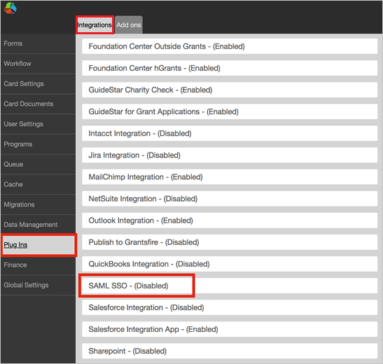
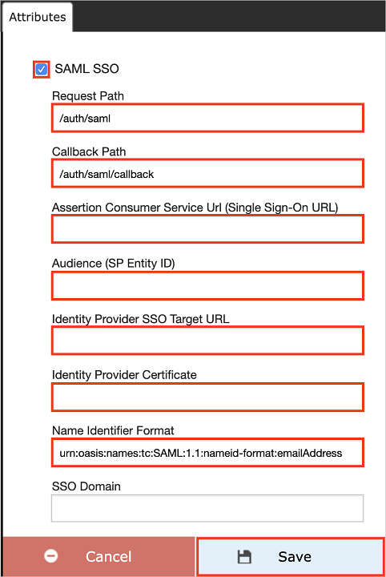

# Tutorial: Microsoft Entra single sign-on (SSO) integration with Fluxx Labs

In this tutorial, you'll learn how to integrate Fluxx Labs with Microsoft Entra ID. When you integrate Fluxx Labs with Microsoft Entra ID, you can:

* Control in Microsoft Entra ID who has access to Fluxx Labs.
* Enable your users to be automatically signed-in to Fluxx Labs with their Microsoft Entra accounts.
* Manage your accounts in one central location.

## Prerequisites

To get started, you need the following items:

* A Microsoft Entra subscription. If you don't have a subscription, you can get a [free account](https://azure.microsoft.com/free/).
* Fluxx Labs single sign-on (SSO) enabled subscription.

## Scenario description

In this tutorial, you configure and test Microsoft Entra SSO in a test environment.

* Fluxx Labs supports **IDP** initiated SSO.

## Add Fluxx Labs from the gallery

To configure the integration of Fluxx Labs into Microsoft Entra ID, you need to add Fluxx Labs from the gallery to your list of managed SaaS apps.

1. Sign in to the [Microsoft Entra admin center](https://entra.microsoft.com) as at least a [Cloud Application Administrator](../roles/permissions-reference.md#cloud-application-administrator).
1. Browse to **Identity** > **Applications** > **Enterprise applications** > **New application**.
1. In the **Add from the gallery** section, type **Fluxx Labs** in the search box.
1. Select **Fluxx Labs** from results panel and then add the app. Wait a few seconds while the app is added to your tenant.

 Alternatively, you can also use the [Enterprise App Configuration Wizard](https://portal.office.com/AdminPortal/home?Q=Docs#/azureadappintegration). In this wizard, you can add an application to your tenant, add users/groups to the app, assign roles, as well as walk through the SSO configuration as well. [Learn more about Microsoft 365 wizards.](/microsoft-365/admin/misc/azure-ad-setup-guides)

## Configure and test Microsoft Entra SSO for Fluxx Labs

Configure and test Microsoft Entra SSO with Fluxx Labs using a test user called **B.Simon**. For SSO to work, you need to establish a link relationship between a Microsoft Entra user and the related user in Fluxx Labs.

To configure and test Microsoft Entra SSO with Fluxx Labs, perform the following steps:

1. **[Configure Microsoft Entra SSO](#configure-azure-ad-sso)** - to enable your users to use this feature.
    1. **[Create a Microsoft Entra test user](#create-an-azure-ad-test-user)** - to test Microsoft Entra single sign-on with B.Simon.
    1. **[Assign the Microsoft Entra test user](#assign-the-azure-ad-test-user)** - to enable B.Simon to use Microsoft Entra single sign-on.
1. **[Configure Fluxx Labs SSO](#configure-fluxx-labs-sso)** - to configure the single sign-on settings on application side.
    1. **[Create Fluxx Labs test user](#create-fluxx-labs-test-user)** - to have a counterpart of B.Simon in Fluxx Labs that is linked to the Microsoft Entra representation of user.
1. **[Test SSO](#test-sso)** - to verify whether the configuration works.

## Configure Microsoft Entra SSO

Follow these steps to enable Microsoft Entra SSO.

1. Sign in to the [Microsoft Entra admin center](https://entra.microsoft.com) as at least a [Cloud Application Administrator](../roles/permissions-reference.md#cloud-application-administrator).
1. Browse to **Identity** > **Applications** > **Enterprise applications** > **Fluxx Labs** > **Single sign-on**.
1. On the **Select a single sign-on method** page, select **SAML**.
1. On the **Set up single sign-on with SAML** page, click the pencil icon for **Basic SAML Configuration** to edit the settings.

   

1. On the **Set up Single Sign-On with SAML** page, perform the following steps:

    a. In the **Identifier** text box, type a URL using one of the following patterns:

    | Environment | URL Pattern|
	|-------------|------------|
	| Production | `https://<subdomain>.fluxx.io` |
	| Pre production | `https://<subdomain>.preprod.fluxxlabs.com`|

    b. In the **Reply URL** text box, type a URL using one of the following patterns:

    | Environment | URL Pattern|
	|-------------|------------|
	| Production | `https://<subdomain>.fluxx.io/auth/saml/callback` |
	| Pre production | `https://<subdomain>.preprod.fluxxlabs.com/auth/saml/callback`|

	> [!NOTE]
	> These values are not real. Update these values with the actual Identifier and Reply URL. Contact [Fluxx Labs Client support team](https://fluxx.zendesk.com) to get these values. You can also refer to the patterns shown in the **Basic SAML Configuration** section.

1. On the **Set up single sign-on with SAML** page, in the **SAML Signing Certificate** section,  find **Certificate (Base64)** and select **Download** to download the certificate and save it on your computer.

	

1. On the **Set up Fluxx Labs** section, copy the appropriate URL(s) based on your requirement.

	

### Create a Microsoft Entra test user

In this section, you'll create a test user called B.Simon.

1. Sign in to the [Microsoft Entra admin center](https://entra.microsoft.com) as at least a [User Administrator](../roles/permissions-reference.md#user-administrator).
1. Browse to **Identity** > **Users** > **All users**.
1. Select **New user** > **Create new user**, at the top of the screen.
1. In the **User** properties, follow these steps:
   1. In the **Display name** field, enter `B.Simon`.  
   1. In the **User principal name** field, enter the username@companydomain.extension. For example, `B.Simon@contoso.com`.
   1. Select the **Show password** check box, and then write down the value that's displayed in the **Password** box.
   1. Select **Review + create**.
1. Select **Create**.

### Assign the Microsoft Entra test user

In this section, you'll enable B.Simon to use single sign-on by granting access to Fluxx Labs.

1. Sign in to the [Microsoft Entra admin center](https://entra.microsoft.com) as at least a [Cloud Application Administrator](../roles/permissions-reference.md#cloud-application-administrator).
1. Browse to **Identity** > **Applications** > **Enterprise applications** > **Fluxx Labs**.
1. In the app's overview page, select **Users and groups**.
1. Select **Add user/group**, then select **Users and groups** in the **Add Assignment** dialog.
   1. In the **Users and groups** dialog, select **B.Simon** from the Users list, then click the **Select** button at the bottom of the screen.
   1. If you are expecting a role to be assigned to the users, you can select it from the **Select a role** dropdown. If no role has been set up for this app, you see "Default Access" role selected.
   1. In the **Add Assignment** dialog, click the **Assign** button.

## Configure Fluxx Labs SSO

1. In a different web browser window, sign in to your Fluxx Labs company site as administrator.

2. Select **Admin** below the **Settings** section.

	

3. In the Admin Panel, Select **Plug-ins** > **Integrations** and then select **SAML SSO-(Disabled)**

	

4. In the attribute section, perform the following steps:

	

	a. Select the **SAML SSO** checkbox.

	b. In the **Request Path** textbox, type **/auth/saml**.

	c. In the **Callback Path** textbox, type **/auth/saml/callback**.

	d. In the **Assertion Consumer Service Url(Single Sign-On URL)** textbox, enter the **Reply URL** value, which you have entered.

	e. In the **Audience(SP Entity ID)** textbox, enter the **Identifier** value, which you have entered.

	f. In the **Identity Provider SSO Target URL** textbox, paste the **Login URL** value, which you copied previously.

	g. Open your base-64 encoded certificate in notepad, copy the content of it into your clipboard, and then paste it to the **Identity Provider Certificate** textbox.

	h. In **Name identifier Format** textbox, enter the value `urn:oasis:names:tc:SAML:1.1:nameid-format:emailAddress`.

	i. Click **Save**.

	> [!NOTE]
	> Once the content saved, the field will appear blank for security, but the value has been saved in the configuration.

### Create Fluxx Labs test user

To enable Microsoft Entra users to sign in to Fluxx Labs, they must be provisioned into Fluxx Labs. In the case of Fluxx Labs, provisioning is a manual task.

**To provision a user account, perform the following steps:**

1. Sign in to your Fluxx Labs company site as an administrator.

2. Click on the  below displayed **icon**.

	

3. On the dashboard, click on the below displayed icon to open the **New PEOPLE** card.

    

4. On the **NEW PEOPLE** section, perform the following steps:

	

	a. Fluxx Labs use email as the unique identifier for SSO logins. Populate the **SSO UID** field with the user’s email address, that matches the email address, which they are using as login with SSO.

	b. Click **Save**.

## Test SSO

In this section, you test your Microsoft Entra single sign-on configuration with following options.

* Click on **Test this application**, and you should be automatically signed in to the Fluxx Labs for which you set up the SSO.

* You can use Microsoft My Apps. When you click the Fluxx Labs tile in the My Apps, you should be automatically signed in to the Fluxx Labs for which you set up the SSO. For more information about the My Apps, see [Introduction to the My Apps](https://support.microsoft.com/account-billing/sign-in-and-start-apps-from-the-my-apps-portal-2f3b1bae-0e5a-4a86-a33e-876fbd2a4510).

## Next steps

Once you configure Fluxx Labs you can enforce session control, which protects exfiltration and infiltration of your organization’s sensitive data in real time. Session control extends from Conditional Access. [Learn how to enforce session control with Microsoft Defender for Cloud Apps](/cloud-app-security/proxy-deployment-any-app).
