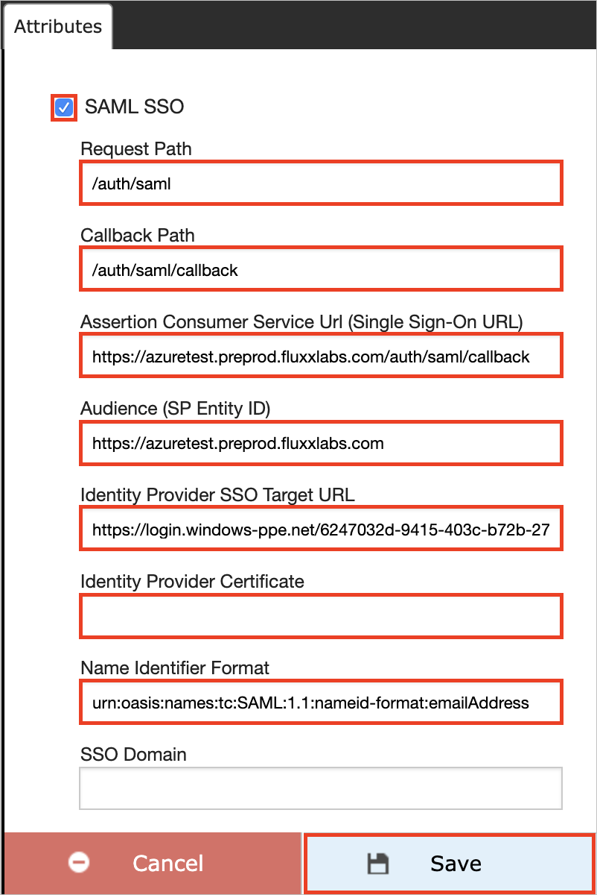
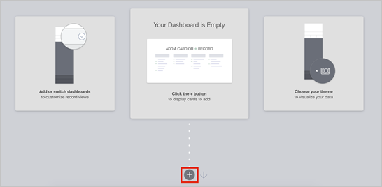
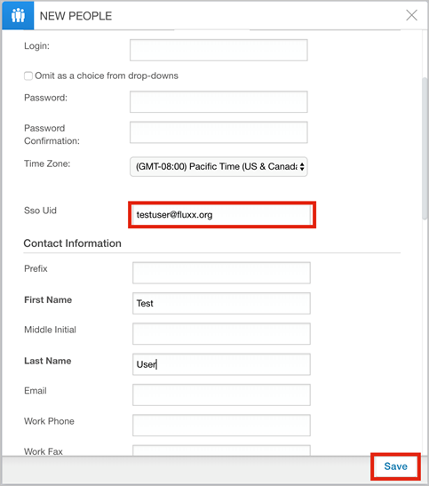

# Tutorial: Azure Active Directory integration with Fluxx Labs

In this tutorial, you learn how to integrate Fluxx Labs with Azure Active Directory (Azure AD).
Integrating Fluxx Labs with Azure AD provides you with the following benefits:

* You can control in Azure AD who has access to Fluxx Labs.
* You can enable your users to be automatically signed-in to Fluxx Labs (Single Sign-On) with their Azure AD accounts.
* You can manage your accounts in one central location - the Azure portal.

If you want to know more details about SaaS app integration with Azure AD, see [What is application access and single sign-on with Azure Active Directory](https://docs.microsoft.com/azure/active-directory/active-directory-appssoaccess-whatis).
If you don't have an Azure subscription, [create a free account](https://azure.microsoft.com/free/) before you begin.

## Prerequisites

To configure Azure AD integration with Fluxx Labs, you need the following items:

* An Azure AD subscription. If you don't have an Azure AD environment, you can get a [free account](https://azure.microsoft.com/free/)
* Fluxx Labs single sign-on enabled subscription

## Scenario description

In this tutorial, you configure and test Azure AD single sign-on in a test environment.

* Fluxx Labs supports **IDP** initiated SSO

## Adding Fluxx Labs from the gallery

To configure the integration of Fluxx Labs into Azure AD, you need to add Fluxx Labs from the gallery to your list of managed SaaS apps.

**To add Fluxx Labs from the gallery, perform the following steps:**

1. In the **[Azure portal](https://portal.azure.com)**, on the left navigation panel, click **Azure Active Directory** icon.

	

2. Navigate to **Enterprise Applications** and then select the **All Applications** option.

	

3. To add new application, click **New application** button on the top of dialog.

	

4. In the search box, type **Fluxx Labs**, select **Fluxx Labs** from result panel then click **Add** button to add the application.

	 

## Configure and test Azure AD single sign-on

In this section, you configure and test Azure AD single sign-on with Fluxx Labs based on a test user called **Britta Simon**.
For single sign-on to work, a link relationship between an Azure AD user and the related user in Fluxx Labs needs to be established.

To configure and test Azure AD single sign-on with Fluxx Labs, you need to complete the following building blocks:

1. **[Configure Azure AD Single Sign-On](#configure-azure-ad-single-sign-on)** - to enable your users to use this feature.
2. **[Configure Fluxx Labs Single Sign-On](#configure-fluxx-labs-single-sign-on)** - to configure the Single Sign-On settings on application side.
3. **[Create an Azure AD test user](#create-an-azure-ad-test-user)** - to test Azure AD single sign-on with Britta Simon.
4. **[Assign the Azure AD test user](#assign-the-azure-ad-test-user)** - to enable Britta Simon to use Azure AD single sign-on.
5. **[Create Fluxx Labs test user](#create-fluxx-labs-test-user)** - to have a counterpart of Britta Simon in Fluxx Labs that is linked to the Azure AD representation of user.
6. **[Test single sign-on](#test-single-sign-on)** - to verify whether the configuration works.

### Configure Azure AD single sign-on

In this section, you enable Azure AD single sign-on in the Azure portal.

To configure Azure AD single sign-on with Fluxx Labs, perform the following steps:

1. In the [Azure portal](https://portal.azure.com/), on the **Fluxx Labs** application integration page, select **Single sign-on**.

    

2. On the **Select a Single sign-on method** dialog, select **SAML/WS-Fed** mode to enable single sign-on.

    

3. On the **Set up Single Sign-On with SAML** page, click **Edit** icon to open **Basic SAML Configuration** dialog.

	

4. On the **Set up Single Sign-On with SAML** page, perform the following steps:

    

    a. In the **Identifier** text box, type a URL using the following pattern:

    | Environment | URL Pattern|
	|-------------|------------|
	| Production | `https://<subdomain>.fluxx.io` |
	| Pre production | `https://<subdomain>.preprod.fluxxlabs.com`|

    b. In the **Reply URL** text box, type a URL using the following pattern:

    | Environment | URL Pattern|
	|-------------|------------|
	| Production | `https://<subdomain>.fluxx.io/auth/saml/callback` |
	| Pre production | `https://<subdomain>.preprod.fluxxlabs.com/auth/saml/callback`|

	> [!NOTE]
	> These values are not real. Update these values with the actual Identifier and Reply URL. Contact [Fluxx Labs Client support team](mailto:travis@fluxxlabs.com) to get these values. You can also refer to the patterns shown in the **Basic SAML Configuration** section in the Azure portal.

5. On the **Set up Single Sign-On with SAML** page, in the **SAML Signing Certificate** section, click **Download** to download the **Certificate (Base64)** from the given options as per your requirement and save it on your computer.

	

6. On the **Set up Fluxx Labs** section, copy the appropriate URL(s) as per your requirement.

	

	a. Login URL

	b. Azure AD Identifier

	c. Logout URL

### Configure Fluxx Labs Single Sign-On

1. In a different web browser window, sign in to your Fluxx Labs company site as administrator.

2. Select **Admin** below the **Settings** section.

	

3. In the Admin Panel, Select **Plug-ins** > **Integrations** and then select **SAML SSO-(Disabled)**

	

4. In the attribute section, perform the following steps:

	

	a. Select the **SAML SSO** checkbox.

	b. In the **Request Path** textbox, type **/auth/saml**.

	c. In the **Callback Path** textbox, type **/auth/saml/callback**.

	d. In the **Assertion Consumer Service Url(Single Sign-On URL)** textbox, enter the **Reply URL** value, which you have entered in the Azure portal.

	e. In the **Audience(SP Entity ID)** textbox, enter the **Identifier** value, which you have entered in the Azure portal.

	f. In the **Identity Provider SSO Target URL** textbox, paste the **Login URL** value, which you have copied from the Azure portal.

	g. Open your base-64 encoded certificate in notepad, copy the content of it into your clipboard, and then paste it to the **Identity Provider Certificate** textbox.

	h. In **Name identifier Format** textbox, enter the value `urn:oasis:names:tc:SAML:1.1:nameid-format:emailAddress`.

	i. Click **Save**.

	> [!NOTE]
	> Once the content saved, the field will appear blank for security, but the value has been saved in the configuration.

### Create an Azure AD test user 

The objective of this section is to create a test user in the Azure portal called Britta Simon.

1. In the Azure portal, in the left pane, select **Azure Active Directory**, select **Users**, and then select **All users**.

    

2. Select **New user** at the top of the screen.

    

3. In the User properties, perform the following steps.

    

    a. In the **Name** field enter **BrittaSimon**.
  
    b. In the **User name** field type brittasimon@yourcompanydomain.extension. For example, BrittaSimon@contoso.com

    c. Select **Show password** check box, and then write down the value that's displayed in the Password box.

    d. Click **Create**.

### Assign the Azure AD test user

In this section, you enable Britta Simon to use Azure single sign-on by granting access to Fluxx Labs.

1. In the Azure portal, select **Enterprise Applications**, select **All applications**, then select **Fluxx Labs**.

	

2. In the applications list, select **Fluxx Labs**.

	

3. In the menu on the left, select **Users and groups**.

    

4. Click the **Add user** button, then select **Users and groups** in the **Add Assignment** dialog.

    

5. In the **Users and groups** dialog select **Britta Simon** in the Users list, then click the **Select** button at the bottom of the screen.

6. If you are expecting any role value in the SAML assertion then in the **Select Role** dialog select the appropriate role for the user from the list, then click the **Select** button at the bottom of the screen.

7. In the **Add Assignment** dialog click the **Assign** button.

### Create Fluxx Labs test user

To enable Azure AD users to sign in to Fluxx Labs, they must be provisioned into Fluxx Labs. In the case of Fluxx Labs, provisioning is a manual task.

**To provision a user account, perform the following steps:**

1. Sign in to your Fluxx Labs company site as an administrator.

2. Click on the  below displayed **icon**.

	

3. On the dashboard, click on the below displayed icon to open the **New PEOPLE** card.

    

4. On the **NEW PEOPLE** section, perform the following steps:

	

	a. Fluxx Labs use email as the unique identifier for SSO logins. Populate the **SSO UID** field with the user’s email address, that matches the email address, which they are using as login with SSO.

	b. Click **Save**.

### Test single sign-on 

In this section, you test your Azure AD single sign-on configuration using the Access Panel.

When you click the Fluxx Labs tile in the Access Panel, you should be automatically signed in to the Fluxx Labs for which you set up SSO. For more information about the Access Panel, see [Introduction to the Access Panel](https://docs.microsoft.com/azure/active-directory/active-directory-saas-access-panel-introduction).

## Additional Resources

- [List of Tutorials on How to Integrate SaaS Apps with Azure Active Directory](https://docs.microsoft.com/azure/active-directory/active-directory-saas-tutorial-list)

- [What is application access and single sign-on with Azure Active Directory?](https://docs.microsoft.com/azure/active-directory/active-directory-appssoaccess-whatis)

- [What is Conditional Access in Azure Active Directory?](https://docs.microsoft.com/azure/active-directory/conditional-access/overview)

