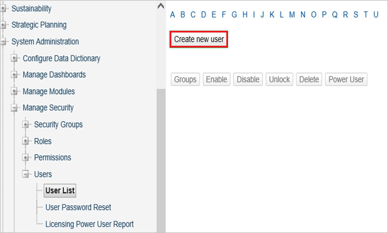
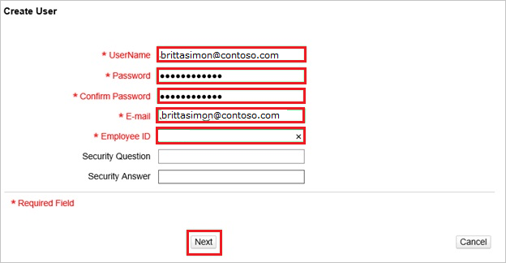

# Tutorial: Azure AD SSO integration with FM:Systems

In this tutorial, you'll learn how to integrate FM:Systems with Azure Active Directory (Azure AD). When you integrate FM:Systems with Azure AD, you can:

* Control in Azure AD who has access to FM:Systems.
* Enable your users to be automatically signed-in to FM:Systems with their Azure AD accounts.
* Manage your accounts in one central location - the Azure portal.

## Prerequisites

To configure Azure AD integration with FM:Systems, you need the following items:

* An Azure AD subscription. If you don't have an Azure AD environment, you can get a [free account](https://azure.microsoft.com/free/).
* FM:Systems single sign-on enabled subscription.

## Scenario description

In this tutorial, you configure and test Azure AD single sign-on in a test environment.

* FM:Systems supports **IDP** initiated SSO.

> [!NOTE]
> Identifier of this application is a fixed string value so only one instance can be configured in one tenant.

## Add FM:Systems from the gallery

To configure the integration of FM:Systems into Azure AD, you need to add FM:Systems from the gallery to your list of managed SaaS apps.

1. Sign in to the Azure portal using either a work or school account, or a personal Microsoft account.
1. On the left navigation pane, select the **Azure Active Directory** service.
1. Navigate to **Enterprise Applications** and then select **All Applications**.
1. To add new application, select **New application**.
1. In the **Add from the gallery** section, type **FM:Systems** in the search box.
1. Select **FM:Systems** from results panel and then add the app. Wait a few seconds while the app is added to your tenant.

 Alternatively, you can also use the [Enterprise App Configuration Wizard](https://portal.office.com/AdminPortal/home?Q=Docs#/azureadappintegration). In this wizard, you can add an application to your tenant, add users/groups to the app, assign roles, as well as walk through the SSO configuration as well. [Learn more about Microsoft 365 wizards.](/microsoft-365/admin/misc/azure-ad-setup-guides)

## Configure and test Azure AD SSO for FM:Systems

Configure and test Azure AD SSO with FM:Systems using a test user called **B.Simon**. For SSO to work, you need to establish a link relationship between an Azure AD user and the related user in FM:Systems.

To configure and test Azure AD SSO with FM:Systems, perform the following steps:

1. **[Configure Azure AD SSO](#configure-azure-ad-sso)** - to enable your users to use this feature.
    1. **[Create an Azure AD test user](#create-an-azure-ad-test-user)** - to test Azure AD single sign-on with B.Simon.
    1. **[Assign the Azure AD test user](#assign-the-azure-ad-test-user)** - to enable B.Simon to use Azure AD single sign-on.
1. **[Configure FM:Systems SSO](#configure-fmsystems-sso)** - to configure the single sign-on settings on application side.
    1. **[Create FM:Systems test user](#create-fmsystems-test-user)** - to have a counterpart of B.Simon in FM:Systems that is linked to the Azure AD representation of user.
1. **[Test SSO](#test-sso)** - to verify whether the configuration works.

## Configure Azure AD SSO

Follow these steps to enable Azure AD SSO in the Azure portal.

1. In the Azure portal, on the **FM:Systems** application integration page, find the **Manage** section and select **single sign-on**.
1. On the **Select a single sign-on method** page, select **SAML**.
1. On the **Set up single sign-on with SAML** page, click the pencil icon for **Basic SAML Configuration** to edit the settings.

   

4. On the **Basic SAML Configuration** section, perform the following step:

    In the **Reply URL** text box, type a URL using the following pattern:
    `https://<companyname>.fmshosted.com/fminteract/ConsumerService2.aspx`
    
    > [!NOTE]
    > This value is not real. Update this value with the actual Reply URL. Contact [FM:Systems Client support team](https://fmsystems.com/support-services/) to get the value. You can also refer to the patterns shown in the **Basic SAML Configuration** section in the Azure portal.

5. On the **Set up Single Sign-On with SAML** page, in the **SAML Signing Certificate** section, click **Download** to download the **Federation Metadata XML** from the given options as per your requirement and save it on your computer.

    

6. On the **Set up FM:Systems** section, copy the appropriate URL(s) as per your requirement.

    

### Create an Azure AD test user 

In this section, you'll create a test user in the Azure portal called B.Simon.

1. From the left pane in the Azure portal, select **Azure Active Directory**, select **Users**, and then select **All users**.
1. Select **New user** at the top of the screen.
1. In the **User** properties, follow these steps:
   1. In the **Name** field, enter `B.Simon`.  
   1. In the **User name** field, enter the username@companydomain.extension. For example, `B.Simon@contoso.com`.
   1. Select the **Show password** check box, and then write down the value that's displayed in the **Password** box.
   1. Click **Create**.

### Assign the Azure AD test user

In this section, you'll enable B.Simon to use Azure single sign-on by granting access to FM:Systems.

1. In the Azure portal, select **Enterprise Applications**, and then select **All applications**.
1. In the applications list, select **FM:Systems**.
1. In the app's overview page, find the **Manage** section and select **Users and groups**.
1. Select **Add user**, then select **Users and groups** in the **Add Assignment** dialog.
1. In the **Users and groups** dialog, select **B.Simon** from the Users list, then click the **Select** button at the bottom of the screen.
1. If you are expecting a role to be assigned to the users, you can select it from the **Select a role** dropdown. If no role has been set up for this app, you see "Default Access" role selected.
1. In the **Add Assignment** dialog, click the **Assign** button.

## Configure FM:Systems SSO

To configure single sign-on on **FM:Systems** side, you need to send the downloaded **Federation Metadata XML** and appropriate copied URLs from Azure portal to [FM:Systems support team](https://fmsystems.com/support-services/). They set this setting to have the SAML SSO connection set properly on both sides.

### Create FM:Systems test user

1. In a web browser window, sign into your FM:Systems company site as an administrator.

2. Go to **System Administration \> Manage Security \> Users \> User list**.
   
    

3. Click **Create new user**.
   
    

4. In the **Create User** section, perform the following steps:
   
    
   
    a. Type the **UserName**, the **Password**, **Confirm Password**, **E-mail** and the **Employee ID** of a valid Azure Active Directory account you want to provision into the related textboxes.
   
    b. Click **Next**.

## Test SSO

In this section, you test your Azure AD single sign-on configuration with following options.

* Click on Test this application in Azure portal and you should be automatically signed in to the FM:Systems for which you set up the SSO.

* You can use Microsoft My Apps. When you click the FM:Systems tile in the My Apps, you should be automatically signed in to the FM:Systems for which you set up the SSO. For more information about the My Apps, see [Introduction to the My Apps](../user-help/my-apps-portal-end-user-access.md).

## Next steps

Once you configure FM:Systems you can enforce session control, which protects exfiltration and infiltration of your organization’s sensitive data in real time. Session control extends from Conditional Access. [Learn how to enforce session control with Microsoft Defender for Cloud Apps](/cloud-app-security/proxy-deployment-aad).
