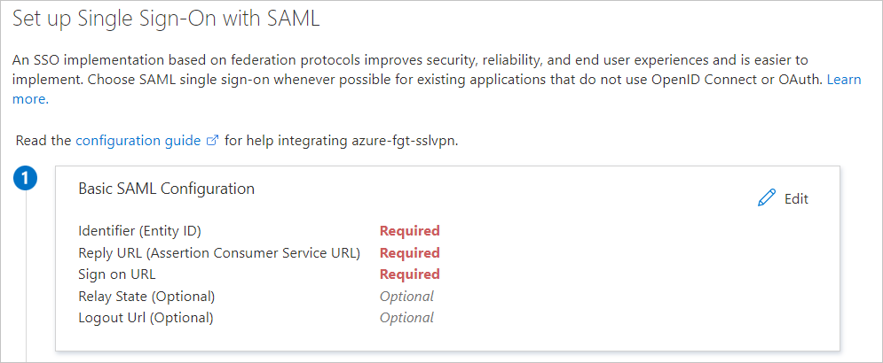
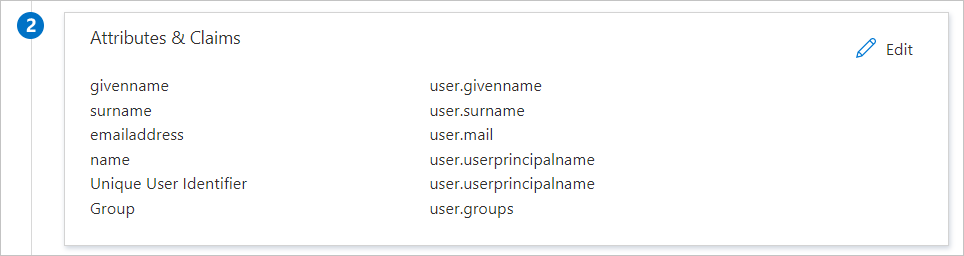

# Tutorial: Microsoft Entra SSO integration with FortiGate SSL VPN

In this tutorial, you'll learn how to integrate FortiGate SSL VPN with Microsoft Entra ID. When you integrate FortiGate SSL VPN with Microsoft Entra ID, you can:

* Use Microsoft Entra ID to control who can access FortiGate SSL VPN.
* Enable your users to be automatically signed in to FortiGate SSL VPN with their Microsoft Entra accounts.
* Manage your accounts in one central location: the Azure portal.

## Prerequisites

To get started, you need the following items:

* A Microsoft Entra subscription. If you don't have a subscription, you can get a [free account](https://azure.microsoft.com/free/).
* A FortiGate SSL VPN with single sign-on (SSO) enabled.

## Tutorial description

In this tutorial, you'll configure and test Microsoft Entra SSO in a test environment.

FortiGate SSL VPN supports SP-initiated SSO.


## Add FortiGate SSL VPN from the gallery

To configure the integration of FortiGate SSL VPN into Microsoft Entra ID, you need to add FortiGate SSL VPN from the gallery to your list of managed SaaS apps:

1. Sign in to the [Microsoft Entra admin center](https://entra.microsoft.com) as at least a [Cloud Application Administrator](../roles/permissions-reference.md#cloud-application-administrator).
1. Browse to **Identity** > **Applications** > **Enterprise applications** > **New application**.
1. In the **Add from the gallery** section, enter **FortiGate SSL VPN** in the search box.
1. Select **FortiGate SSL VPN** in the results panel and then add the app. Wait a few seconds while the app is added to your tenant.

 Alternatively, you can also use the [Enterprise App Configuration Wizard](https://portal.office.com/AdminPortal/home?Q=Docs#/azureadappintegration). In this wizard, you can add an application to your tenant, add users/groups to the app, assign roles, as well as walk through the SSO configuration as well. [Learn more about Microsoft 365 wizards.](/microsoft-365/admin/misc/azure-ad-setup-guides)

<a name='configure-and-test-azure-ad-sso-for-fortigate-ssl-vpn'></a>

## Configure and test Microsoft Entra SSO for FortiGate SSL VPN

You'll configure and test Microsoft Entra SSO with FortiGate SSL VPN by using a test user named B.Simon. For SSO to work, you need to establish a link relationship between a Microsoft Entra user and the corresponding SAML SSO user group in FortiGate SSL VPN.

To configure and test Microsoft Entra SSO with FortiGate SSL VPN, you'll complete these high-level steps:

1. **[Configure Microsoft Entra SSO](#configure-azure-ad-sso)** to enable the feature for your users.
    1. **[Create a Microsoft Entra test user](#create-an-azure-ad-test-user)** to test Microsoft Entra single sign-on.
    1. **[Grant access to the test user](#grant-access-to-the-test-user)** to enable Microsoft Entra single sign-on for that user.
1. **[Configure FortiGate SSL VPN SSO](#configure-fortigate-ssl-vpn-sso)** on the application side.
    1. **Create a FortiGate SAML SSO user group** as a counterpart to the Microsoft Entra representation of the user.
1. **[Test SSO](#test-sso)** to verify that the configuration works.

<a name='configure-azure-ad-sso'></a>

### Configure Microsoft Entra SSO

Follow these steps to enable Microsoft Entra SSO in the Azure portal:

1. Sign in to the [Microsoft Entra admin center](https://entra.microsoft.com) as at least a [Cloud Application Administrator](../roles/permissions-reference.md#cloud-application-administrator).
1. Browse to **Identity** > **Applications** > **Enterprise applications** > **FortiGate SSL VPN** application integration page, in the **Manage** section, select **single sign-on**.
1. On the **Select a single sign-on method** page, select **SAML**.
1. On the **Set up Single Sign-On with SAML** page, select the **Edit** button for **Basic SAML Configuration** to edit the settings:

   

1. On the **Set up Single Sign-On with SAML** page, enter the following values:

    a. In the **Identifier** box, enter a URL in the pattern
    `https://<FortiGate IP or FQDN address>:<Custom SSL VPN port>/remote/saml/metadata`.

    b. In the **Reply URL** box, enter a URL in the pattern
    `https://<FortiGate IP or FQDN address>:<Custom SSL VPN port>/remote/saml/login`.

    c. In the **Sign on URL** box, enter a URL in the pattern
    `https://<FortiGate IP or FQDN address>:<Custom SSL VPN port>/remote/saml/login`.

    d. In the **Logout URL** box, enter a URL in the pattern
    `https://<FortiGate IP or FQDN address>:<Custom SSL VPN port><FQDN>/remote/saml/logout`.

    > [!NOTE]
    > These values are just patterns. You need to use the actual **Sign on URL**, **Identifier**, **Reply URL**, and **Logout URL** that is configured on the FortiGate.

1. The FortiGate SSL VPN application expects SAML assertions in a specific format, which requires you to add custom attribute mappings to the configuration. The following screenshot shows the list of default attributes.

   

1. The claims required by FortiGate SSL VPN are shown in the following table. The names of these claims must match the names used in the **Perform FortiGate command-line configuration** section of this tutorial. Names are case-sensitive.

   | Name |  Source attribute|
   | ------------ | --------- |
   | username | user.userprincipalname |
   | group | user.groups |
   
   To create these additional claims:

   a. Next to **User Attributes & Claims**, select **Edit**.

   b. Select **Add new claim**.

   c. For **Name**, enter **username**.

   d. For **Source attribute**, select **user.userprincipalname**.

   e. Select **Save**.

   > [!NOTE]
   > **User Attributes & Claims** allow only one group claim. To add a group claim, delete the existing group claim **user.groups [SecurityGroup]** already present in the       claims to add the new claim or edit the existing one to **All groups**.

   f. Select **Add a group claim**.

   g. Select **All groups**.

   h. Under **Advanced options**, select the **Customize the name of the group claim** check box.

   i. For **Name**, enter **group**.
   
   j. Select **Save**.   

1. On the **Set up Single Sign-On with SAML** page, in the **SAML Signing Certificate** section,  select the **Download** link next to **Certificate (Base64)** to download the certificate and save it on your computer:

   

1. In the **Set up FortiGate SSL VPN** section, copy the appropriate URL or URLs, based on your requirements:

   

<a name='create-an-azure-ad-test-user'></a>

#### Create a Microsoft Entra test user

In this section, you'll create a test user named B.Simon.

1. Sign in to the [Microsoft Entra admin center](https://entra.microsoft.com) as at least a [User Administrator](../roles/permissions-reference.md#user-administrator).
1. Browse to **Identity** > **Users** > **All users**.
1. Select **New user** > **Create new user**, at the top of the screen.
1. In the **User** properties, follow these steps:
   1. In the **Display name** field, enter `B.Simon`.  
   1. In the **User principal name** field, enter the username@companydomain.extension. For example, `B.Simon@contoso.com`.
   1. Select the **Show password** check box, and then write down the value that's displayed in the **Password** box.
   1. Select **Review + create**.
1. Select **Create**.

#### Grant access to the test user

In this section, you'll enable B.Simon to use single sign-on by granting that user access to FortiGate SSL VPN.

1. Browse to **Identity** > **Applications** > **Enterprise applications**.
1. In the applications list, select **FortiGate SSL VPN**.
1. On the app's overview page, in the **Manage** section, select **Users and groups**.
1. Select **Add user**, then select **Users and groups** in the **Add Assignment** dialog.
1. In the **Users and groups** dialog box, select **B.Simon** in the **Users** list, and then click the **Select** button at the bottom of the screen.
1. If you're expecting any role value in the SAML assertion, in the **Select Role** dialog box, select the appropriate role for the user from the list. Click the **Select** button at the bottom of the screen.
1. In the **Add Assignment** dialog box, select **Assign**.

#### Create a security group for the test user

In this section, you'll create a security group in Microsoft Entra ID for the test user. FortiGate will use this security group to grant the user network access via the VPN.

1. In the Microsoft Entra admin center, navigate to **Identity** > **Groups** > **New group**.
1. In the **New Group** properties, complete these steps:
   1. In the **Group type** list, select **Security**.
   1. In the **Group name** box, enter **FortiGateAccess**.
   1. In the **Group description** box, enter **Group for granting FortiGate VPN access**.
   1. For the **Microsoft Entra roles can be assigned to the group (Preview)** settings, select **No**.
   1. In the **Membership type** box, select **Assigned**.
   1. Under **Members**, select **No members selected**.
   1. In the **Users and groups** dialog box, select **B.Simon** from the **Users** list, and then click the **Select** button at the bottom of the screen.
   1. Select **Create**.
1. After you're back in the **Groups** section in Microsoft Entra ID, find the **FortiGate Access** group and note the **Object Id**. You'll need it later.

### Configure FortiGate SSL VPN SSO

#### Upload the Base64 SAML Certificate to the FortiGate appliance

After you completed the SAML configuration of the FortiGate app in your tenant, you downloaded the Base64-encoded SAML certificate. You need to upload this certificate to the FortiGate appliance:

1. Sign in to the management portal of your FortiGate appliance.
1. In the left pane, select **System**.
1. Under **System**, select **Certificates**.
1. Select **Import** > **Remote Certificate**.
1. Browse to the certificate downloaded from the FortiGate app deployment in the Azure tenant, select it, and then select **OK**.

After the certificate is uploaded, take note of its name under **System** > **Certificates** > **Remote Certificate**. By default, it will be named REMOTE_Cert_*N*, where *N* is an integer value.

#### Complete FortiGate command-line configuration

Although you can configure SSO from the GUI since FortiOS 7.0, the CLI configurations apply to all versions and are therefore shown here.

To complete these steps, you'll need the values you recorded earlier:

| FortiGate SAML CLI setting | Equivalent Azure configuration |
   | ------------ | --------- |
   | SP entity ID (`entity-id`) | Identifier (Entity ID) |
| SP Single Sign-On URL (`single-sign-on-url`) | Reply URL (Assertion Consumer Service URL) |
| SP Single Logout URL (`single-logout-url`) | Logout URL |
| IdP Entity ID (`idp-entity-id`) | Microsoft Entra Identifier |
| IdP Single Sign-On URL (`idp-single-sign-on-url`) | Azure Login URL |
| IdP Single Logout URL (`idp-single-logout-url`) | Azure Logout URL |
| IdP certificate (`idp-cert`) | Base64 SAML certificate name (REMOTE_Cert_N) |
| Username attribute (`user-name`) | username |
| Group name attribute (`group-name`) | group |

> [!NOTE]
   > The Sign on URL under Basic SAML Configuration is not used in the FortiGate configurations. It is used to trigger SP-initiated single sign on to redirect the user to the SSL VPN portal page.

1. Establish an SSH session to your FortiGate appliance, and sign in with a FortiGate Administrator account.
1. Run these commands and substitute the `<values>` with the information that you collected previously:

    ```console
    config user saml
      edit azure
        set cert <FortiGate VPN Server Certificate Name>
        set entity-id < Identifier (Entity ID)Entity ID>
        set single-sign-on-url < Reply URL Reply URL>
        set single-logout-url <Logout URL>
        set idp-entity-id <Azure AD Identifier>
        set idp-single-sign-on-url <Azure Login URL>
        set idp-single-logout-url <Azure Logout URL>
        set idp-cert <Base64 SAML Certificate Name>
        set user-name username
        set group-name group
      next
    end
    ```

#### Configure FortiGate for group matching

In this section, you'll configure FortiGate to recognize the Object ID of the security group that includes the test user. This configuration will allow FortiGate to make access decisions based on the group membership.

To complete these steps, you'll need the Object ID of the FortiGateAccess security group that you created earlier in this tutorial.

1. Establish an SSH session to your FortiGate appliance, and sign in with a FortiGate Administrator account.

1. Run these commands:

    ```console
    config user group
      edit FortiGateAccess
        set member azure
        config match
          edit 1
            set server-name azure
            set group-name <Object Id>
          next
        end
      next
    end
    ```

#### Create a FortiGate VPN Portals and Firewall Policy

In this section, you'll configure a FortiGate VPN Portals and Firewall Policy that grants access to the FortiGateAccess security group you created earlier in this tutorial.

Refer to [Configuring SAML SSO login for SSL VPN with Microsoft Entra ID acting as SAML IdP for instructions](https://docs.fortinet.com/document/fortigate-public-cloud/7.0.0/azure-administration-guide/584456/configuring-saml-sso-login-for-ssl-vpn-web-mode-with-azure-ad-acting-as-saml-idp).

## Test SSO 

In this section, you test your Microsoft Entra single sign-on configuration with following options. 

* In Step 5) of the Azure SSO configuration, **Test single sign-on with your App*, click the **Test** button. This will redirect to FortiGate VPN Sign-on URL where you can initiate the login flow. 

* Go to FortiGate VPN Sign-on URL directly and initiate the login flow from there.

* You can use Microsoft My Apps. When you click the FortiGate VPN tile in the My Apps, this will redirect to FortiGate VPN Sign-on URL. For more information about the My Apps, see [Introduction to the My Apps](https://support.microsoft.com/account-billing/sign-in-and-start-apps-from-the-my-apps-portal-2f3b1bae-0e5a-4a86-a33e-876fbd2a4510).

## Next steps

Once you configure FortiGate VPN you can enforce Session control, which protects exfiltration and infiltration of your organization’s sensitive data in real time. Session control extends from Conditional Access. [Learn how to enforce session control with Microsoft Defender for Cloud Apps](/cloud-app-security/proxy-deployment-aad).
