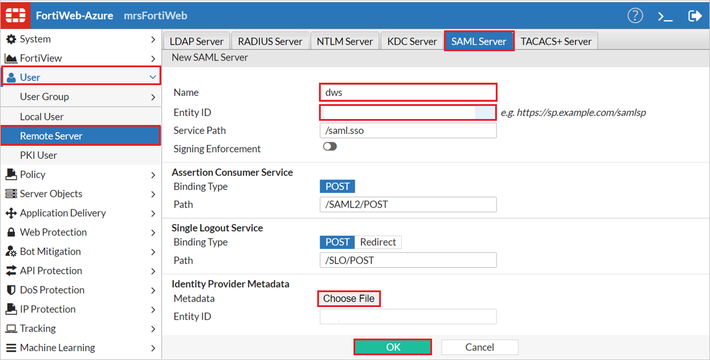
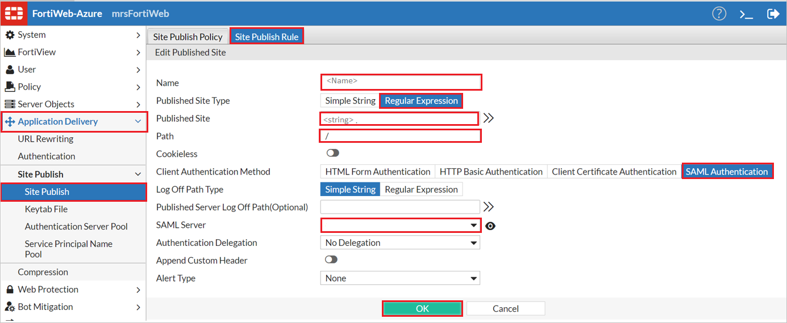
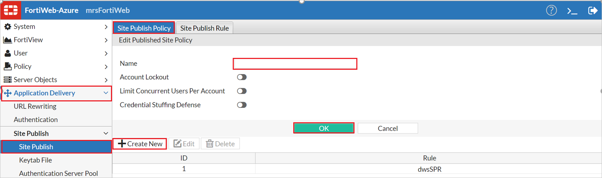
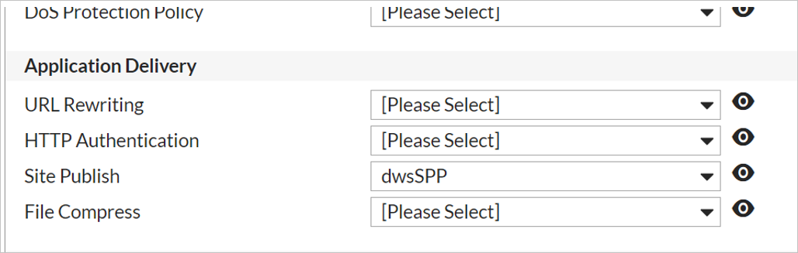

# Tutorial: Azure AD SSO integration with FortiWeb Web Application Firewall

In this tutorial, you'll learn how to integrate FortiWeb Web Application Firewall with Azure Active Directory (Azure AD). When you integrate FortiWeb Web Application Firewall with Azure AD, you can:

* Control in Azure AD who has access to FortiWeb Web Application Firewall.
* Enable your users to be automatically signed-in to FortiWeb Web Application Firewall with their Azure AD accounts.
* Manage your accounts in one central location - the Azure portal.

## Prerequisites

To get started, you need the following items:

* An Azure AD subscription. If you don't have a subscription, you can get a [free account](https://azure.microsoft.com/free/).
* FortiWeb Web Application Firewall single sign-on (SSO) enabled subscription.

> [!NOTE]
> This integration is also available to use from Azure AD US Government Cloud environment. You can find this application in the Azure AD US Government Cloud Application Gallery and configure it in the same way as you do from public cloud.

## Scenario description

In this tutorial, you configure and test Azure AD SSO in a test environment.

* FortiWeb Web Application Firewall supports **SP** initiated SSO.

## Adding FortiWeb Web Application Firewall from the gallery

To configure the integration of FortiWeb Web Application Firewall into Azure AD, you need to add FortiWeb Web Application Firewall from the gallery to your list of managed SaaS apps.

1. Sign in to the Azure portal using either a work or school account, or a personal Microsoft account.
1. On the left navigation pane, select the **Azure Active Directory** service.
1. Navigate to **Enterprise Applications** and then select **All Applications**.
1. To add new application, select **New application**.
1. In the **Add from the gallery** section, type **FortiWeb Web Application Firewall** in the search box.
1. Select **FortiWeb Web Application Firewall** from results panel and then add the app. Wait a few seconds while the app is added to your tenant.

 Alternatively, you can also use the [Enterprise App Configuration Wizard](https://portal.office.com/AdminPortal/home?Q=Docs#/azureadappintegration). In this wizard, you can add an application to your tenant, add users/groups to the app, assign roles, as well as walk through the SSO configuration as well. [Learn more about Microsoft 365 wizards.](/microsoft-365/admin/misc/azure-ad-setup-guides)

## Configure and test Azure AD SSO for FortiWeb Web Application Firewall

Configure and test Azure AD SSO with FortiWeb Web Application Firewall using a test user called **B.Simon**. For SSO to work, you need to establish a link relationship between an Azure AD user and the related user in FortiWeb Web Application Firewall.

To configure and test Azure AD SSO with FortiWeb Web Application Firewall, perform the following steps:

1. **[Configure Azure AD SSO](#configure-azure-ad-sso)** - to enable your users to use this feature.
    1. **[Create an Azure AD test user](#create-an-azure-ad-test-user)** - to test Azure AD single sign-on with B.Simon.
    1. **[Assign the Azure AD test user](#assign-the-azure-ad-test-user)** - to enable B.Simon to use Azure AD single sign-on.
1. **[Configure FortiWeb Web Application Firewall SSO](#configure-fortiweb-web-application-firewall-sso)** - to configure the single sign-on settings on application side.
    1. **[Create FortiWeb Web Application Firewall test user](#create-fortiweb-web-application-firewall-test-user)** - to have a counterpart of B.Simon in FortiWeb Web Application Firewall that is linked to the Azure AD representation of user.
1. **[Test SSO](#test-sso)** - to verify whether the configuration works.

## Configure Azure AD SSO

Follow these steps to enable Azure AD SSO in the Azure portal.

1. In the Azure portal, on the **FortiWeb Web Application Firewall** application integration page, find the **Manage** section and select **single sign-on**.
1. On the **Select a single sign-on method** page, select **SAML**.
1. On the **Set up single sign-on with SAML** page, click the pen icon for **Basic SAML Configuration** to edit the settings.

   

1. On the **Basic SAML Configuration** section, enter the values for the following fields:

    1. In the **Identifier (Entity ID)** text box, type a URL using the following pattern: `https://www.<CUSTOMER_DOMAIN>.com`

    1. In the **Reply URL** text box, type a URL using the following pattern:
    `https://www.<CUSTOMER_DOMAIN>.com/<FORTIWEB_NAME>/saml.sso/SAML2/POST`

    1. In the **Sign on URL** text box, type a URL using the following pattern:
    `https://www.<CUSTOMER_DOMAIN>.com`

    1. In the **Logout URL** text box, type a URL using the following pattern:
    `https://www.<CUSTOMER_DOMAIN>.info/<FORTIWEB_NAME>/saml.sso/SLO/POST`
 
    > [!NOTE]
    > `<FORTIWEB_NAME>` is a name identifier that will be used later when supplying configuration to FortiWeb.
    > Contact [FortiWeb Web Application Firewall support team](mailto:support@fortinet.com) to get the real URL values. You can also refer to the patterns shown in the **Basic SAML Configuration** section in the Azure portal.

1. On the **Set up single sign-on with SAML** page, in the **SAML Signing Certificate** section,  find **Federation Metadata XML** and select **Download** to download the certificate and save it on your computer.

    

### Create an Azure AD test user

In this section, you'll create a test user in the Azure portal called B.Simon.

1. From the left pane in the Azure portal, select **Azure Active Directory**, select **Users**, and then select **All users**.
1. Select **New user** at the top of the screen.
1. In the **User** properties, follow these steps:
   1. In the **Name** field, enter `B.Simon`.  
   1. In the **User name** field, enter the username@companydomain.extension. For example, `B.Simon@contoso.com`.
   1. Select the **Show password** check box, and then write down the value that's displayed in the **Password** box.
   1. Click **Create**.

### Assign the Azure AD test user

In this section, you'll enable B.Simon to use Azure single sign-on by granting access to FortiWeb Web Application Firewall.

1. In the Azure portal, select **Enterprise Applications**, and then select **All applications**.
1. In the applications list, select **FortiWeb Web Application Firewall**.
1. In the app's overview page, find the **Manage** section and select **Users and groups**.
1. Select **Add user**, then select **Users and groups** in the **Add Assignment** dialog.
1. In the **Users and groups** dialog, select **B.Simon** from the Users list, then click the **Select** button at the bottom of the screen.
1. If you are expecting a role to be assigned to the users, you can select it from the **Select a role** dropdown. If no role has been set up for this app, you see "Default Access" role selected.
1. In the **Add Assignment** dialog, click the **Assign** button.

## Configure FortiWeb Web Application Firewall SSO

1.	Navigate to `https://<address>:8443` where `<address>` is the FQDN or the public IP address assigned to the FortiWeb VM.

2.	Sign-in using the administrator credentials provided during the FortiWeb VM deployment.

1. Perform the following steps in the following page.

    

    a.	In the left-hand menu, click **User**.

    b.	Under User, click **Remote Server**.

    c.	Click **SAML Server**.

    d.	Click **Create New**.

    e.	In the **Name** field, provide the value for `<fwName>` used in the Configure Azure AD section.

    f.	In the **Entity ID** textbox, Enter the **Identifier (Entity ID)** value, like `https://www.<CUSTOMER_DOMAIN>.com/samlsp`

    g. Next to **Metadata**, click **Choose File** and select the **Federation Metadata XML** file which you have downloaded from the Azure portal.

    h.	Click **OK**.

### Create a Site Publishing Rule

1.	Navigate to `https://<address>:8443` where `<address>` is the FQDN or the public IP address assigned to the FortiWeb VM.

1.	Sign-in using the administrator credentials provided during the FortiWeb VM deployment.
1. Perform the following steps in the following page.

    

    a.	In the left-hand menu, click **Application Delivery**.
    
    b.	Under **Application Delivery**, click **Site Publish**.
    
    c.	Under **Site Publish**, click **Site Publish**.
    
    d.	Click **Site Publish Rule**.
    
    e.	Click **Create New**.
    
    f.	Provide a name for the site publishing rule.
    
    g.	Next to **Published Site Type**, click **Regular Expression**.
    
    i.	Next to **Published Site**, provide a string that will match the host header of the web site you are publishing.
    
    j.	Next to **Path**, provide a /.
    
    k.	Next to **Client Authentication Method**, select **SAML Authentication**.
    
    l.	In the **SAML Server** drop-down, select the SAML Server you created earlier.
    
    m.	Click **OK**.

### Create a Site Publishing Policy

1.	Navigate to `https://<address>:8443` where `<address>` is the FQDN or the public IP address assigned to the FortiWeb VM.

2.	Sign-in using the administrator credentials provided during the FortiWeb VM deployment.

1. Perform the following steps in the following page.

    

    a.	In the left-hand menu, click **Application Delivery**.

    b.	Under **Application Delivery**, click **Site Publish**.

    c.	Under **Site Publish**, click **Site Publish**.

    d.	Click **Site Publish Policy**.

    e.	Click **Create New**.

    f.	Provide a name for the Site Publishing Policy.

    g.	Click **OK**.

    h.	Click **Create New**.

    i.	In the **Rule** drop-down, select the site publishing rule you created earlier.

    j.	Click **OK**.

### Create and assign a Web Protection Profile

1.	Navigate to `https://<address>:8443` where `<address>` is the FQDN or the public IP address assigned to the FortiWeb VM.

2.	Sign-in using the administrator credentials provided during the FortiWeb VM deployment.
3.	In the left-hand menu, click **Policy**.
4.	Under **Policy**, click **Web Protection Profile**.
5.	Click **Inline Standard Protection** and click **Clone**.
6.	Provide a name for the new web protection profile and click **OK**.
7.	Select the new web protection profile and click **Edit**.
8.	Next to **Site Publish**, select the site publishing policy you created earlier.
9.	Click **OK**.
 
    

10.	In the left-hand menu, click **Policy**.
11.	Under **Policy**, click **Server Policy**.
12.	Select the server policy used to publish the web site for which you wish to use Azure Active Directory for authentication.
13.	Click **Edit**.
14.	In the **Web Protection Profile** drop-down, select the web protection profile that you just created.
15.	Click **OK**.
16.	Attempt to access the external URL to which FortiWeb publishes the web site. You should be redirected to Azure Active Directory for authentication.

### Create FortiWeb Web Application Firewall test user

In this section, you create a user called Britta Simon in FortiWeb Web Application Firewall. Work with [FortiWeb Web Application Firewall support team](mailto:support@fortinet.com) to add the users in the FortiWeb Web Application Firewall platform. Users must be created and activated before you use single sign-on.

## Test SSO 

In this section, you test your Azure AD single sign-on configuration with following options. 

* Click on **Test this application** in Azure portal. This will redirect to FortiWeb Web Application Sign-on URL where you can initiate the login flow. 

* Go to FortiWeb Web Application Sign-on URL directly and initiate the login flow from there.

* You can use Microsoft My Apps. When you click the FortiWeb Web Application tile in the My Apps, this will redirect to FortiWeb Web Application Sign-on URL. For more information about the My Apps, see [Introduction to the My Apps](https://support.microsoft.com/account-billing/sign-in-and-start-apps-from-the-my-apps-portal-2f3b1bae-0e5a-4a86-a33e-876fbd2a4510).

## Next steps

Once you configure FortiWeb Web Application Firewall you can enforce session control, which protects exfiltration and infiltration of your organization’s sensitive data in real time. Session control extends from Conditional Access. [Learn how to enforce session control with Microsoft Defender for Cloud Apps](/cloud-app-security/proxy-deployment-any-app).
