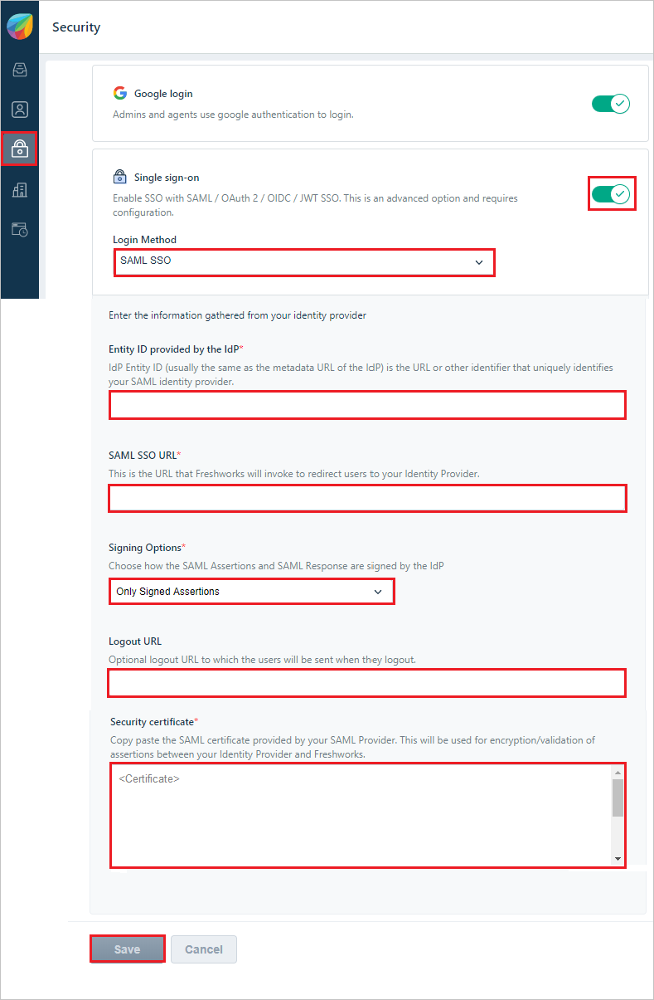
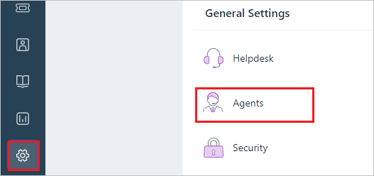
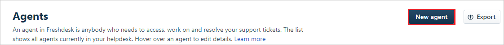
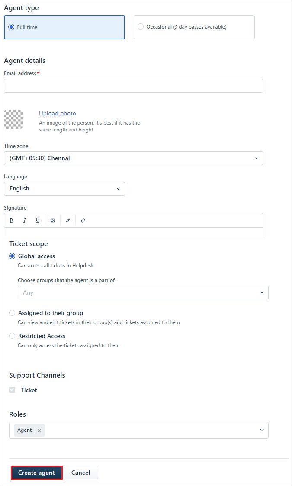

# Tutorial: Azure Active Directory integration with FreshDesk

In this tutorial, you learn how to integrate FreshDesk with Azure Active Directory (Azure AD).
Integrating FreshDesk with Azure AD provides you with the following benefits:

* You can control in Azure AD who has access to FreshDesk.
* You can enable your users to be automatically signed-in to FreshDesk (Single Sign-On) with their Azure AD accounts.
* You can manage your accounts in one central location - the Azure portal.

If you want to know more details about SaaS app integration with Azure AD, see [What is application access and single sign-on with Azure Active Directory](https://docs.microsoft.com/azure/active-directory/active-directory-appssoaccess-whatis).
If you don't have an Azure subscription, [create a free account](https://azure.microsoft.com/free/) before you begin.

## Prerequisites

To configure Azure AD integration with FreshDesk, you need the following items:

* An Azure AD subscription. If you don't have an Azure AD environment, you can get one-month trial [here](https://azure.microsoft.com/pricing/free-trial/)
* FreshDesk single sign-on enabled subscription

## Scenario description

In this tutorial, you configure and test Azure AD single sign-on in a test environment.

* FreshDesk supports **SP** initiated SSO
* Once you configure FreshDesk you can enforce session control, which protects exfiltration and infiltration of your organization’s sensitive data in real time. Session control extends from Conditional Access. [Learn how to enforce session control with Microsoft Cloud App Security](https://docs.microsoft.com/cloud-app-security/proxy-deployment-any-app).

## Adding FreshDesk from the gallery

To configure the integration of FreshDesk into Azure AD, you need to add FreshDesk from the gallery to your list of managed SaaS apps.

1. Sign in to the [Azure portal](https://portal.azure.com) using either a work or school account, or a personal Microsoft account.
1. On the left navigation pane, select the **Azure Active Directory** service.
1. Navigate to **Enterprise Applications** and then select **All Applications**.
1. To add new application, select **New application**.
1. In the **Add from the gallery** section, type **FreshDesk** in the search box.
1. Select **FreshDesk** from results panel and then add the app. Wait a few seconds while the app is added to your tenant.

## Configure and test Azure AD single sign-on for FreshDesk

Configure and test Azure AD SSO with FreshDesk using a test user called **B.Simon**. For SSO to work, you need to establish a link relationship between an Azure AD user and the related user in FreshDesk.

To configure and test Azure AD SSO with FreshDesk, complete the following building blocks:

1. **[Configure Azure AD Single Sign-On](#configure-azure-ad-single-sign-on)** - to enable your users to use this feature.
	1. **[Create an Azure AD test user](#create-an-azure-ad-test-user)** - to test Azure AD single sign-on with Britta Simon.
	1. **[Assign the Azure AD test user](#assign-the-azure-ad-test-user)** - to enable Britta Simon to use Azure AD single sign-on.
1. **[Configure FreshDesk Single Sign-On](#configure-freshdesk-single-sign-on)** - to configure the Single Sign-On settings on application side.
	1. **[Create FreshDesk test user](#create-freshdesk-test-user)** - to have a counterpart of Britta Simon in FreshDesk that is linked to the Azure AD representation of user.
1. **[Test single sign-on](#test-single-sign-on)** - to verify whether the configuration works.

## Configure Azure AD single sign-on

1. In the [Azure portal](https://portal.azure.com/), on the **FreshDesk** application integration page, find the **Manage** section and select **single sign-on**.
1. On the **Select a single sign-on method** page, select **SAML**.
1. On the **Set-up single sign-on with SAML** page, click the edit/pen icon for **Basic SAML Configuration** to edit the settings.

   

1. On the **Basic SAML Configuration** section, enter the values for the following fields:

	a. In the **Sign-on URL** text box, type a URL using the following pattern:
    `https://<tenant-name>.freshdesk.com` or any other value Freshdesk has suggested.

    b. In the **Identifier (Entity ID)** text box, type a URL using the following pattern:
    `https://<tenant-name>.freshdesk.com` or any other value Freshdesk has suggested.

	> [!NOTE]
	> These values are not real. Update these values with the actual Sign on URL and Identifier. Contact [FreshDesk Client support team](https://freshdesk.com/helpdesk-software?utm_source=Google-AdWords&utm_medium=Search-IND-Brand&utm_campaign=Search-IND-Brand&utm_term=freshdesk&device=c&gclid=COSH2_LH7NICFVUDvAodBPgBZg) to get these values. You can also refer to the patterns shown in the **Basic SAML Configuration** section in the Azure portal.

1. FreshDesk application expects the SAML assertions in a specific format, which requires you to add custom attribute mappings to your SAML token attributes configuration. The following screenshot shows the list of default attributes, whereas **Unique User Identifier** is mapped with **user.userprincipalname** but FreshDesk expects this claim to be mapped with **user.mail**, so you need to edit the attribute mapping by clicking on Edit icon and change the attribute mapping.

	

1. On the **Set-up Single Sign-On with SAML** page, in the **SAML Signing Certificate** section, click **Download** to download the **Certificate (Base64)** from the given options as per your requirement and save it on your computer.

	

1. On the **Set-up FreshDesk** section, copy the appropriate URL(s) as per your requirement.

	

	a. Login URL

	b. Azure Ad Identifier

	c. Logout URL

### Create an Azure AD test user 

The objective of this section is to create a test user in the Azure portal called Britta Simon.

1. In the Azure portal, in the left pane, select **Azure Active Directory**, select **Users**, and then select **All users**.

    

2. Select **New user** at the top of the screen.

    

3. In the User properties, perform the following steps.

    

    a. In the **Name** field, enter **BrittaSimon**.
  
    b. In the **User name** field type **brittasimon\@yourcompanydomain.extension**  
    For example, BrittaSimon@contoso.com

    c. Select **Show password** check box, and then write down the value that's displayed in the Password box.

    d. Click **Create**.

### Assign the Azure AD test user

In this section, you enable Britta Simon to use Azure single sign-on by granting access to FreshDesk.

1. In the Azure portal, select **Enterprise Applications**, select **All applications**, then select **FreshDesk**.

	

2. In the applications list, type and select **FreshDesk**.

	

3. In the menu on the left, select **Users and groups**.

    

4. Click the **Add user** button, then select **Users and groups** in the **Add Assignment** dialog.

    

5. In the **Users and groups** dialog select **Britta Simon** in the Users list, then click the **Select** button at the bottom of the screen.

6. If you are expecting any role value in the SAML assertion then in the **Select Role** dialog select the appropriate role for the user from the list, then click the **Select** button at the bottom of the screen.

7. In the **Add Assignment** dialog, click the **Assign** button.

## Configure FreshDesk Single Sign-On

1. In a different web browser window, log into your Freshdesk company site as an administrator.

2. Select the **Security icon** and in the **Security** section, perform the following steps:

	
  
	a. For **Single Sign On**, select **On**.

	b. In the **Login Method**, select **SAML SSO**.

    c. In the **Entity ID provided by the IdP** textbox, paste **Entity ID** value, which you have copied from the Azure portal.

	d. In the **SAML SSO URL** textbox, paste **Login URL** value, which you have copied from the Azure portal.

	e. In the **Signing Options**, select **Only Signed Assertions** from the dropdown.

    f. In the **Logout URL** textbox, paste **Logout URL** value, which you have copied from the Azure portal.

    g. In the **Security Certificate** textbox, paste **Certificate (Base64)** value, which you have obtained earlier.
  
	h. Click **Save**.

## Create FreshDesk test user

In order to enable Azure AD users to log into FreshDesk, they must be provisioned into FreshDesk.  
In the case of FreshDesk, provisioning is a manual task.

**To provision a user account, perform the following steps:**

1. Log in to your **Freshdesk** tenant.

1. In the menu on the left, click **Admin** and in the **General Settings** tab, click **Agents**.
  
	

1. Click **New Agent**.

    

1. On the Agent Information dialog, enter the required fields and click on **Create agent**.

	

	>[!NOTE]
	>The Azure AD account holder will get an email that includes a link to confirm the account before it is activated.
	>
	>[!NOTE]
	>You can use any other Freshdesk user account creation tools or APIs provided by Freshdesk to provision Azure AD user accounts to FreshDesk.

### Test single sign-on 

In this section, you test your Azure AD single sign-on configuration using the Access Panel.

When you click the FreshDesk tile in the Access Panel, you should be automatically signed in to the FreshDesk for which you set-up SSO. For more information about the Access Panel, see [Introduction to the Access Panel](https://docs.microsoft.com/azure/active-directory/active-directory-saas-access-panel-introduction).

## Additional resources

- [List of Tutorials on How to Integrate SaaS Apps with Azure Active Directory](https://docs.microsoft.com/azure/active-directory/active-directory-saas-tutorial-list)

- [What is application access and single sign-on with Azure Active Directory?](https://docs.microsoft.com/azure/active-directory/active-directory-appssoaccess-whatis)

- [What is Conditional Access in Azure Active Directory?](https://docs.microsoft.com/azure/active-directory/conditional-access/overview)

