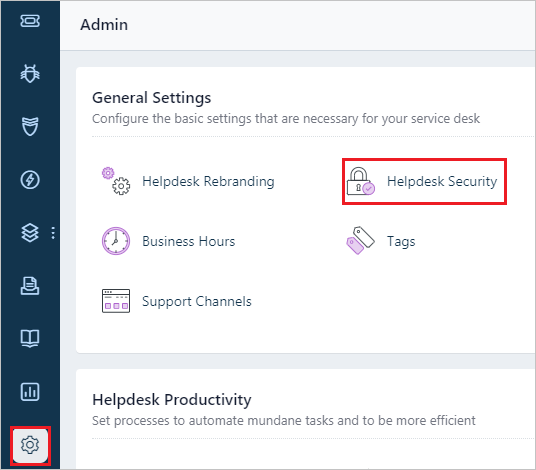
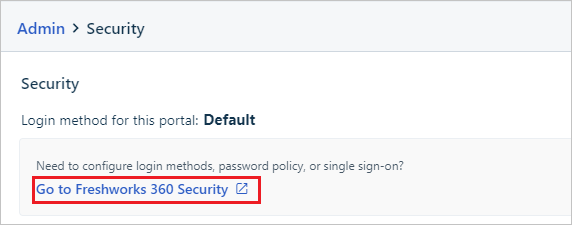
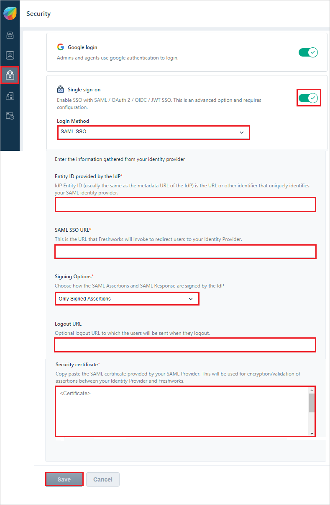
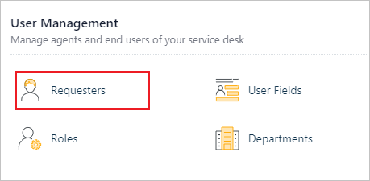
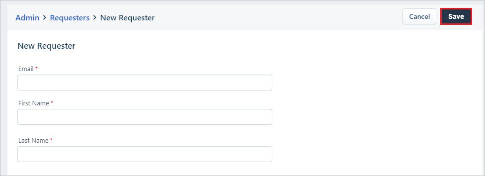

# Tutorial: Microsoft Entra single sign-on (SSO) integration with Freshservice

In this tutorial, you'll learn how to integrate Freshservice with Microsoft Entra ID. When you integrate Freshservice with Microsoft Entra ID, you can:

* Control in Microsoft Entra ID who has access to Freshservice.
* Enable your users to be automatically signed-in to Freshservice with their Microsoft Entra accounts.
* Manage your accounts in one central location.

## Prerequisites

To get started, you need the following items:

* A Microsoft Entra subscription. If you don't have a subscription, you can get a [free account](https://azure.microsoft.com/free/).
* Freshservice single sign-on (SSO) enabled subscription.

> [!NOTE]
> This integration is also available to use from Microsoft Entra US Government Cloud environment. You can find this application in the Microsoft Entra US Government Cloud Application Gallery and configure it in the same way as you do from public cloud.

## Scenario description

In this tutorial, you configure and test Microsoft Entra SSO in a test environment.

* Freshservice supports **SP** initiated SSO.
* Freshservice supports [Automated user provisioning](freshservice-provisioning-tutorial.md).

## Add Freshservice from the gallery

To configure the integration of Freshservice into Microsoft Entra ID, you need to add Freshservice from the gallery to your list of managed SaaS apps.

1. Sign in to the [Microsoft Entra admin center](https://entra.microsoft.com) as at least a [Cloud Application Administrator](../roles/permissions-reference.md#cloud-application-administrator).
1. Browse to **Identity** > **Applications** > **Enterprise applications** > **New application**.
1. In the **Add from the gallery** section, type **Freshservice** in the search box.
1. Select **Freshservice** from results panel and then add the app. Wait a few seconds while the app is added to your tenant.

 Alternatively, you can also use the [Enterprise App Configuration Wizard](https://portal.office.com/AdminPortal/home?Q=Docs#/azureadappintegration). In this wizard, you can add an application to your tenant, add users/groups to the app, assign roles, as well as walk through the SSO configuration as well. [Learn more about Microsoft 365 wizards.](/microsoft-365/admin/misc/azure-ad-setup-guides)

## Configure and test Microsoft Entra SSO for Freshservice

Configure and test Microsoft Entra SSO with Freshservice using a test user called **B.Simon**. For SSO to work, you need to establish a link relationship between a Microsoft Entra user and the related user in Freshservice.

To configure and test Microsoft Entra SSO with Freshservice, complete the following building blocks:

1. **[Configure Microsoft Entra SSO](#configure-azure-ad-sso)** - to enable your users to use this feature.
    1. **[Create a Microsoft Entra test user](#create-an-azure-ad-test-user)** - to test Microsoft Entra single sign-on with B.Simon.
    1. **[Assign the Microsoft Entra test user](#assign-the-azure-ad-test-user)** - to enable B.Simon to use Microsoft Entra single sign-on.
1. **[Configure Freshservice SSO](#configure-freshservice-sso)** - to configure the single sign-on settings on application side.
    1. **[Create Freshservice test user](#create-freshservice-test-user)** - to have a counterpart of B.Simon in Freshservice that is linked to the Microsoft Entra representation of user.
1. **[Test SSO](#test-sso)** - to verify whether the configuration works.

## Configure Microsoft Entra SSO

Follow these steps to enable Microsoft Entra SSO.

1. Sign in to the [Microsoft Entra admin center](https://entra.microsoft.com) as at least a [Cloud Application Administrator](../roles/permissions-reference.md#cloud-application-administrator).
1. Browse to **Identity** > **Applications** > **Enterprise applications** > **Freshservice** > **Single sign-on**.
1. On the **Select a single sign-on method** page, select **SAML**.
1. On the **Set up single sign-on with SAML** page, click the pencil icon for **Basic SAML Configuration** to edit the settings.

   

1. On the **Basic SAML Configuration** section, enter the values for the following fields:

	a. In the **Sign-on URL** text box, type a URL using the following pattern:
    `https://<company-name>.freshservice.com`

    b. In the **Identifier (Entity ID)** text box, type a URL using the following pattern:
    `https://<company-name>.freshservice.com`

    c. In the **Reply URL** text box, type a URL using the following pattern:
    `https://<company-name>.freshservice.com/login/saml`
	
	> [!NOTE]
	> These values are not real. Update these values with the actual Sign on URL, Identifier and Reply URL. Contact [Freshservice Client support team](https://support.freshservice.com/) to get these values. You can also refer to the patterns shown in the **Basic SAML Configuration** section.

1. On the **Set up Single Sign-On with SAML** page, in the **SAML Signing Certificate** section, find **Certificate (Base64)** and select **Download** to download the certificate and save it on your computer.

	

1. On the **Set up Freshservice** section on the **Azure portal**, copy the appropriate URL(s) based on your requirement.

	

### Create a Microsoft Entra test user

In this section, you'll create a test user called B.Simon.

1. Sign in to the [Microsoft Entra admin center](https://entra.microsoft.com) as at least a [User Administrator](../roles/permissions-reference.md#user-administrator).
1. Browse to **Identity** > **Users** > **All users**.
1. Select **New user** > **Create new user**, at the top of the screen.
1. In the **User** properties, follow these steps:
   1. In the **Display name** field, enter `B.Simon`.  
   1. In the **User principal name** field, enter the username@companydomain.extension. For example, `B.Simon@contoso.com`.
   1. Select the **Show password** check box, and then write down the value that's displayed in the **Password** box.
   1. Select **Review + create**.
1. Select **Create**.

### Assign the Microsoft Entra test user

In this section, you'll enable B.Simon to use single sign-on by granting access to Freshservice.

1. Sign in to the [Microsoft Entra admin center](https://entra.microsoft.com) as at least a [Cloud Application Administrator](../roles/permissions-reference.md#cloud-application-administrator).
1. Browse to **Identity** > **Applications** > **Enterprise applications** > **Freshservice**.
1. In the app's overview page, select **Users and groups**.
1. Select **Add user/group**, then select **Users and groups** in the **Add Assignment** dialog.
   1. In the **Users and groups** dialog, select **B.Simon** from the Users list, then click the **Select** button at the bottom of the screen.
   1. If you are expecting a role to be assigned to the users, you can select it from the **Select a role** dropdown. If no role has been set up for this app, you see "Default Access" role selected.
   1. In the **Add Assignment** dialog, click the **Assign** button.

## Configure Freshservice SSO

1. In a different web browser window, sign in to your Freshservice company site as an administrator

1. In the menu on the left, click **Admin** and select **Helpdesk Security** in the **General Settings**.

    

1. In the **Security**, click on **Go to  Freshservice 360 Security**.

    

1. In the **Security** section, perform the following steps:

	
  
	a. For **Single Sign On**, select **On**.

	b. In the **Login Method**, select **SAML SSO**.

    c. In the **Entity ID provided by the IdP** textbox, paste **Entity ID** value, which you copied previously.

	d. In the **SAML SSO URL** textbox, paste **Login URL** value, which you copied previously.

	e. In the **Signing Options**, select **Only Signed Assertions** from the dropdown.

    f. In the **Logout URL** textbox, paste **Logout URL** value, which you copied previously.

    g. In the **Security Certificate** textbox, paste **Certificate (Base64)** value, which you have obtained earlier.
  
	h. Click **Save**.

## Create Freshservice test user

To enable Microsoft Entra users to sign in to FreshService, they must be provisioned into FreshService. In the case of FreshService, provisioning is a manual task.

**To provision a user account, perform the following steps:**

1. Sign in to your **FreshService** company site as an administrator.

2. In the menu on the left, click **Admin**.

3. In the **User Management** section, click **Requesters**.

    

4. Click **New Requester**.

    

5. In the **New Requester** section, enter the required fields and click on **Save**.
      

    > [!NOTE]
    > The Microsoft Entra account holder gets an email including a link to confirm the account before it becomes active
    >  

    > [!NOTE]
    > You can use any other FreshService user account creation tools or APIs provided by FreshService to provision Microsoft Entra user accounts.
   
> [!NOTE]
>Freshservice also supports automatic user provisioning, you can find more details [here](./freshservice-provisioning-tutorial.md) on how to configure automatic user provisioning.

## Test SSO

In this section, you test your Microsoft Entra single sign-on configuration with following options. 

* Click on **Test this application**, this will redirect to  Freshservice Sign-on URL where you can initiate the login flow. 

* Go to  Freshservice Sign-on URL directly and initiate the login flow from there.

* You can use Microsoft My Apps. When you click the  Freshservice tile in the My Apps, you should be automatically signed in to the  Freshservice for which you set up the SSO. For more information about the My Apps, see [Introduction to the My Apps](https://support.microsoft.com/account-billing/sign-in-and-start-apps-from-the-my-apps-portal-2f3b1bae-0e5a-4a86-a33e-876fbd2a4510).

## Next steps

 Once you configure Freshservice you can enforce session control, which protects exfiltration and infiltration of your organization’s sensitive data in real time. Session control extends from Conditional Access. [Learn how to enforce session control with Microsoft Defender for Cloud Apps](/cloud-app-security/proxy-deployment-any-app).
