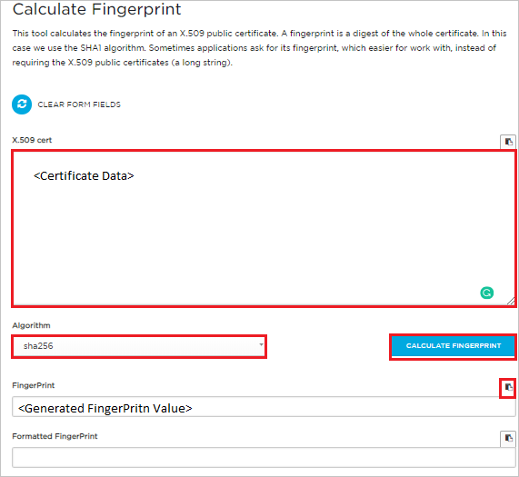
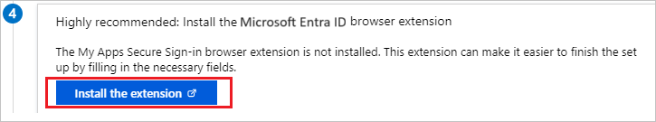
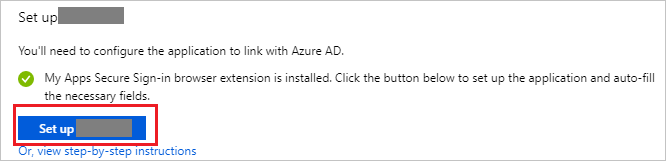
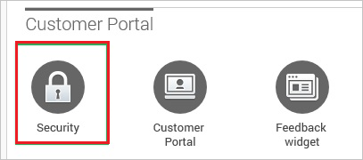
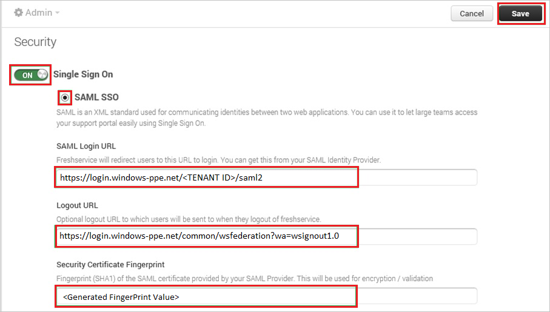
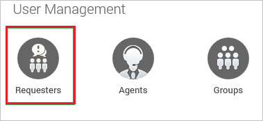

# Tutorial: Azure Active Directory single sign-on (SSO) integration with Freshservice

In this tutorial, you'll learn how to integrate Freshservice with Azure Active Directory (Azure AD). When you integrate Freshservice with Azure AD, you can:

* Control in Azure AD who has access to Freshservice.
* Enable your users to be automatically signed-in to Freshservice with their Azure AD accounts.
* Manage your accounts in one central location - the Azure portal.

To learn more about SaaS app integration with Azure AD, see [What is application access and single sign-on with Azure Active Directory](https://docs.microsoft.com/azure/active-directory/active-directory-appssoaccess-whatis).

## Prerequisites

To get started, you need the following items:

* An Azure AD subscription. If you don't have a subscription, you can get a [free account](https://azure.microsoft.com/free/).
* Freshservice single sign-on (SSO) enabled subscription.

## Scenario description

In this tutorial, you configure and test Azure AD SSO in a test environment.

* Freshservice supports **SP** initiated SSO

## Adding Freshservice from the gallery

To configure the integration of Freshservice into Azure AD, you need to add Freshservice from the gallery to your list of managed SaaS apps.

1. Sign in to the [Azure portal](https://portal.azure.com) using either a work or school account, or a personal Microsoft account.
1. On the left navigation pane, select the **Azure Active Directory** service.
1. Navigate to **Enterprise Applications** and then select **All Applications**.
1. To add new application, select **New application**.
1. In the **Add from the gallery** section, type **Freshservice** in the search box.
1. Select **Freshservice** from results panel and then add the app. Wait a few seconds while the app is added to your tenant.

## Configure and test Azure AD single sign-on for Freshservice

Configure and test Azure AD SSO with Freshservice using a test user called **B.Simon**. For SSO to work, you need to establish a link relationship between an Azure AD user and the related user in Freshservice.

To configure and test Azure AD SSO with Freshservice, complete the following building blocks:

1. **[Configure Azure AD SSO](#configure-azure-ad-sso)** - to enable your users to use this feature.
    1. **[Create an Azure AD test user](#create-an-azure-ad-test-user)** - to test Azure AD single sign-on with B.Simon.
    1. **[Assign the Azure AD test user](#assign-the-azure-ad-test-user)** - to enable B.Simon to use Azure AD single sign-on.
1. **[Configure Freshservice SSO](#configure-freshservice-sso)** - to configure the single sign-on settings on application side.
    1. **[Create Freshservice test user](#create-freshservice-test-user)** - to have a counterpart of B.Simon in Freshservice that is linked to the Azure AD representation of user.
1. **[Test SSO](#test-sso)** - to verify whether the configuration works.

## Configure Azure AD SSO

Follow these steps to enable Azure AD SSO in the Azure portal.

1. In the [Azure portal](https://portal.azure.com/), on the **Freshservice** application integration page, find the **Manage** section and select **single sign-on**.
1. On the **Select a single sign-on method** page, select **SAML**.
1. On the **Set up single sign-on with SAML** page, click the edit/pen icon for **Basic SAML Configuration** to edit the settings.

   

1. On the **Basic SAML Configuration** section, enter the values for the following fields:

	a. In the **Sign on URL** text box, type a URL using the following pattern:
    `https://<democompany>.freshservice.com`

    b. In the **Identifier (Entity ID)** text box, type a URL using the following pattern:
    `https://<democompany>.freshservice.com`

	> [!NOTE]
	> These values are not real. Update these values with the actual Sign on URL and Identifier. Contact [Freshservice Client support team](https://support.freshservice.com/) to get these values. You can also refer to the patterns shown in the **Basic SAML Configuration** section in the Azure portal.

1. On the **Set up Single Sign-On with SAML** page, in the **SAML Signing Certificate** section, find **Certificate (Base64)** and select **Download** to download the certificate and save it on your computer.

	

1. Freshservice requires SHA-256 fingerprint to get SSO working. To get SHA-256 fingerprint, perform the following steps :

    

    1. Open the [link](https://www.samltool.com/fingerprint.php) in different web browser.

    1. Open downloaded certificate (Base64) file in the Notepad and paste content in the **X.509 cert** textbox.

    1. For the Algorithm, select **sha256** from the dropdown.

    1. Click **CALCULATE FINGERPRINT**.

    1. Click on the copy icon to copy the generated **FingerPrint** and save it on your computer.

1. On the **Set up Freshservice** section on the **Azure portal**, copy the appropriate URL(s) based on your requirement.

	

### Create an Azure AD test user

In this section, you'll create a test user in the Azure portal called B.Simon.

1. From the left pane in the Azure portal, select **Azure Active Directory**, select **Users**, and then select **All users**.
1. Select **New user** at the top of the screen.
1. In the **User** properties, follow these steps:
   1. In the **Name** field, enter `B.Simon`.  
   1. In the **User name** field, enter the username@companydomain.extension. For example, `B.Simon@contoso.com`.
   1. Select the **Show password** check box, and then write down the value that's displayed in the **Password** box.
   1. Click **Create**.

### Assign the Azure AD test user

In this section, you'll enable B.Simon to use Azure single sign-on by granting access to Freshservice.

1. In the Azure portal, select **Enterprise Applications**, and then select **All applications**.
1. In the applications list, select **Freshservice**.
1. In the app's overview page, find the **Manage** section and select **Users and groups**.

   

1. Select **Add user**, then select **Users and groups** in the **Add Assignment** dialog.

	

1. In the **Users and groups** dialog, select **B.Simon** from the Users list, then click the **Select** button at the bottom of the screen.
1. If you're expecting any role value in the SAML assertion, in the **Select Role** dialog, select the appropriate role for the user from the list and then click the **Select** button at the bottom of the screen.
1. In the **Add Assignment** dialog, click the **Assign** button.

## Configure Freshservice SSO

1. To automate the configuration within Freshservice, you need to install **My Apps Secure Sign-in browser extension** by clicking **Install the extension**.

	

2. After adding extension to the browser, click on **Setup Freshservice** will direct you to the Freshservice application. From there, provide the admin credentials to sign into Freshservice. The browser extension will automatically configure the application for you and automate steps 3-6.

	

3. If you want to setup Freshservice manually, open a new web browser window and sign into your Freshservice company site as an administrator and perform the following steps:

4. In the menu on the top, click **Admin**.

    

5. In the **Customer Portal**, click **Security**.

    

6. In the **Security** section, perform the following steps:

    

    a. Switch **Single Sign On**.

    b. Select **SAML SSO**.

    c. In the **SAML Login URL** textbox, paste the value of **Login URL**, which you have copied from Azure portal.

    d. In the **Logout URL** textbox, paste the value of **Logout URL**, which you have copied from Azure portal.

    e. In **Security Certificate Fingerprint** textbox, paste the **FingerPrint** value, which you have generated earlier.

	f. Click **Save**

### Create Freshservice test user

To enable Azure AD users to sign in to FreshService, they must be provisioned into FreshService. In the case of FreshService, provisioning is a manual task.

**To provision a user account, perform the following steps:**

1. Sign in to your **FreshService** company site as an administrator.

2. In the menu on the top, click **Admin**.

    

3. In the **User Management** section, click **Requesters**.

    

4. Click **New Requester**.

    

5. In the **New Requester** section, perform the following steps:

      

    a. Enter the **First Name** and **Email** attributes of a valid Azure Active Directory account you want to provision into the related textboxes.

    b. Click **Save**.

    > [!NOTE]
    > The Azure Active Directory account holder gets an email including a link to confirm the account before it becomes active
    >  

> [!NOTE]
> You can use any other FreshService user account creation tools or APIs provided by FreshService to provision Azure AD user accounts.

## Test SSO

In this section, you test your Azure AD single sign-on configuration using the Access Panel.

When you click the Freshservice tile in the Access Panel, you should be automatically signed in to the Freshservice for which you set up SSO. For more information about the Access Panel, see [Introduction to the Access Panel](https://docs.microsoft.com/azure/active-directory/active-directory-saas-access-panel-introduction).

## Additional resources

- [ List of Tutorials on How to Integrate SaaS Apps with Azure Active Directory ](https://docs.microsoft.com/azure/active-directory/active-directory-saas-tutorial-list)

- [What is application access and single sign-on with Azure Active Directory? ](https://docs.microsoft.com/azure/active-directory/active-directory-appssoaccess-whatis)

- [What is conditional access in Azure Active Directory?](https://docs.microsoft.com/azure/active-directory/conditional-access/overview)

- [Try Freshservice with Azure AD](https://aad.portal.azure.com/)